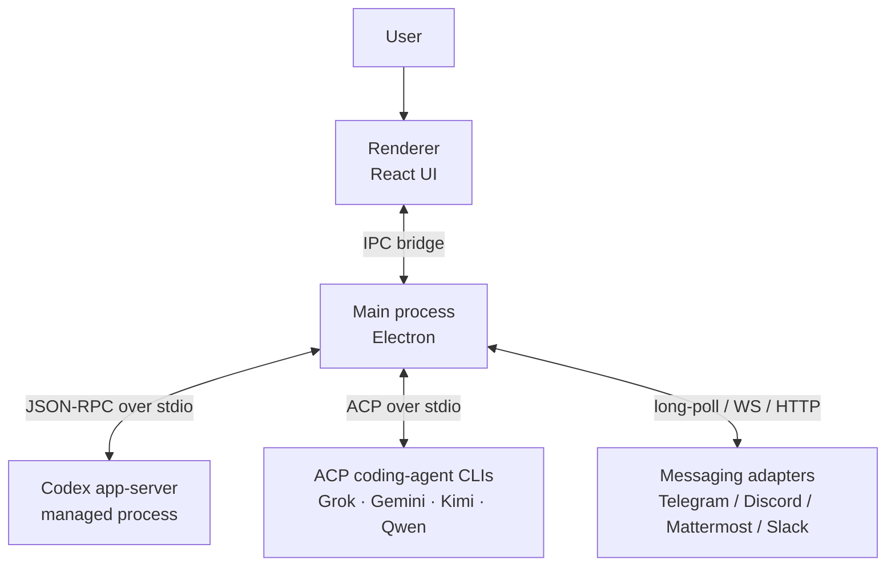
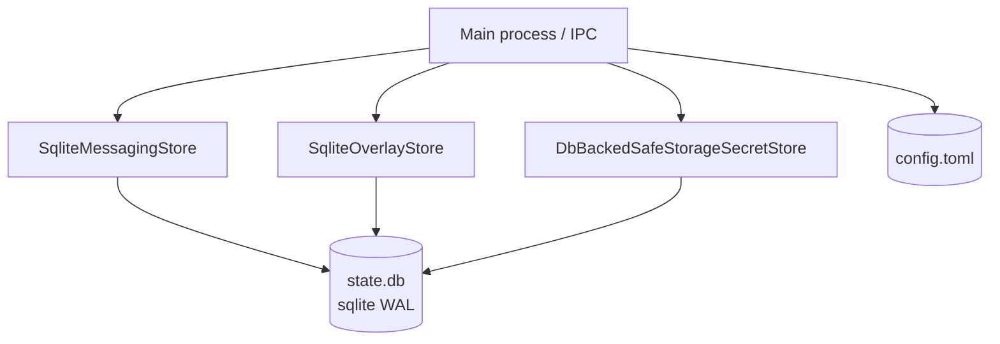
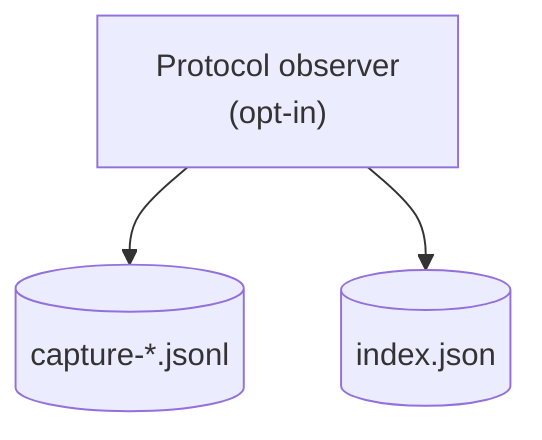
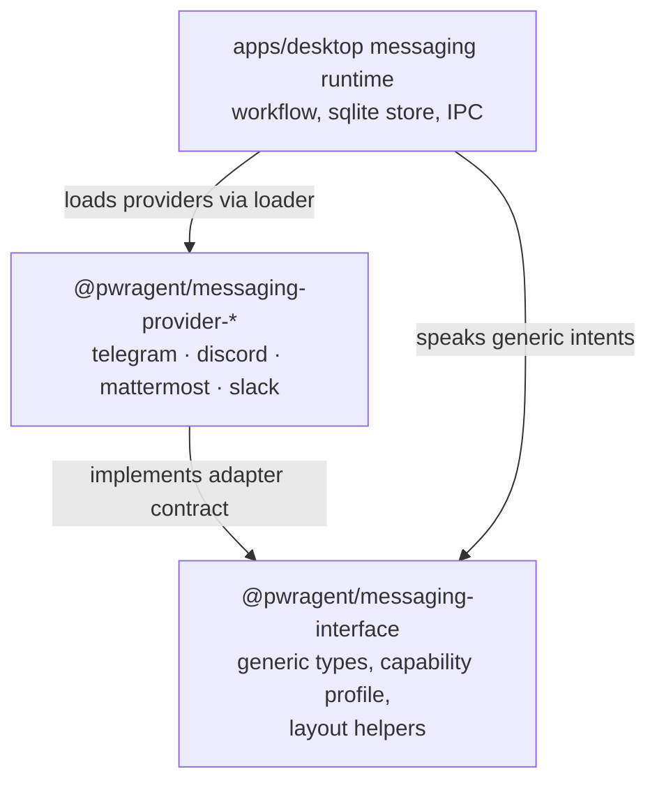
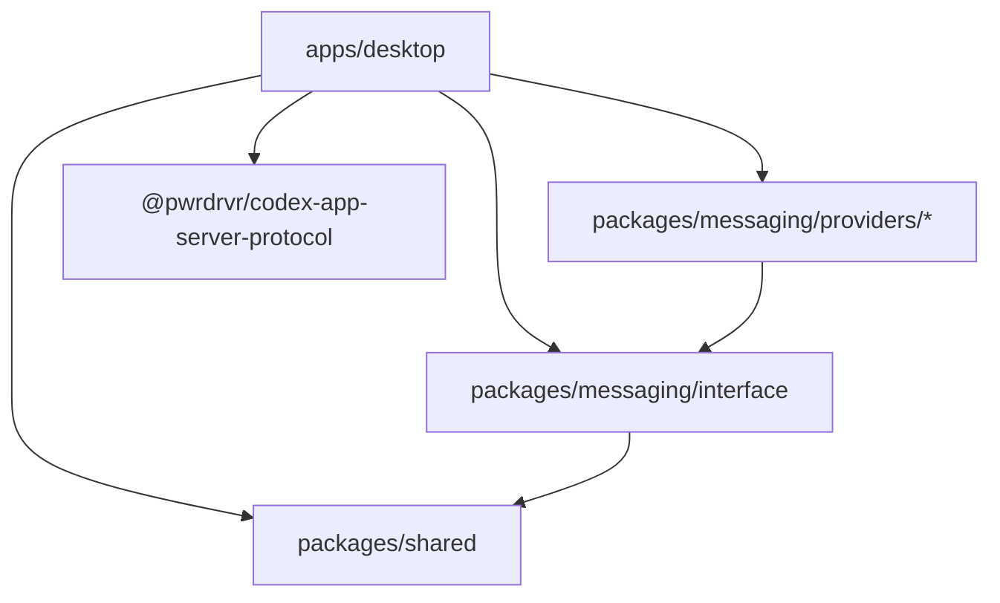

# Architecture

This document is the engineer's first pass through PwrAgent. It covers the
process model, where data lives, how messaging is layered, and the
dependency rules that keep the codebase navigable. For the user-facing
pitch, see [README.md](README.md). For day-to-day development setup, see
[CONTRIBUTING.md](CONTRIBUTING.md).

## Process model

PwrAgent is an Electron app whose coding-agent runtimes execute outside
Electron main. The renderer (React UI) talks to the main process over the
standard Electron IPC bridge. Electron main connects to Codex App Server and
to installed ACP coding-agent CLIs, including Grok Build.

A few invariants worth knowing up front:

- The renderer may only import `@pwragent/shared` from the workspace.
  Everything else is gated behind IPC.
- Coding-agent stdout is protocol-only. Child diagnostics go to stderr so
  they cannot corrupt Codex or ACP framing.
- One messaging adapter, one controller, one capability profile. See
  [Messaging layer](#messaging-layer) below.

Codex authentication remains Codex-owned. ACP agent authentication and
conversation storage remain owned by the installed CLI. PwrAgent persists the
session metadata and desktop overlay state needed to locate and present those
threads without duplicating full provider transcripts in sqlite.

Codex configuration overlays are process-local arguments on the profile's
single App Server connection. `models.codex.config_overrides` in PwrAgent TOML
maps to `models.codex.configOverrides` in settings patches/projections; the
settings resolver supplies its ordered `key=value` strings to
`buildCodexClientArgs` as individual `-c` arguments. Codex owns value parsing and
config precedence. PwrAgent validates the envelope and reserves its approval,
sandbox-mode, PATH and CODEX_HOME launch keys (including parent-table writes).
No overlay is written to the selected Codex home. Existing per-thread protocol
settings still override process defaults; overlays do not migrate saved thread
model selections or add model capability metadata.

Overlay changes enter the existing provider fingerprint/invalidation path and
reconnect Codex at an idle boundary, then resolve the current overlay again.
Invalid edits retain the config store's last-known-good snapshot; a cold start
with invalid config and no such snapshot cannot launch Codex using defaults.
The setting is additive, so there is no legacy field to migrate or dual-write.
Clearing it with an empty array restores ordinary launch arguments. Overrides
are plaintext configuration, including in process arguments; provider secrets
belong in environment variables referenced by Codex's `env_key` or
`env_http_headers`. No new periodic or per-turn persistence is introduced.

## Git information reads

Navigation Git information goes through main-process stores. Directory enrichment
is owned by `main/git-info/directory-store.ts`, shared by production Codex clients.
Its filesystem observation and Git subprocess implementation live under
`git-info/private/`; dependency-cruiser rejects imports of those probes from
outside the store layer. Renderer imports of main-process implementations,
`child_process`, Dugite, simple-git, and isomorphic-git are forbidden too.

`GitReadCache` owns admission before any I/O. Directory enrichment reuses confirmed
results for one second and negative or unconfirmed results for five seconds.
After that window, filesystem identity decides whether Git needs to run. External
branch changes therefore become visible on the next admitted read; missing paths
and failed probes retry after the negative window. No watcher or timer is required.
`GitDirectoryService` and `GitWorkingStateService` use the same admission primitive
for their status reads, retaining their three-second default freshness windows.

Callers may report `userAction`, but cannot demand a bypass by deleting cached
status. The stores share one process-wide allowance of ten user refreshes,
refilling at one per second on a monotonic clock. In-flight reads coalesce before
spending a token. An exhausted allowance falls back to normal cache freshness;
cold or expired entries still load normally. Errors identify the caller and path,
rate-limited to one log per ten seconds with suppressed denials counted. Actual
mutation events may invalidate affected working state. Admission state is entirely
in memory and adds no SQLite writes.

An admitted user refresh also refreshes branch/worktree inventory beneath the
directory status cache. Automatic forced scheduling carries no user intent and
does not spend the user allowance.

## Thread state and lifecycle

### Runtime and refresh

- Navigation snapshots own thread summaries, ordering, unread state, and
  selection metadata.
- Selected-thread session state owns transcript history, active-turn state,
  approvals, and lazy skill state.
- Active selected threads consume thread events incrementally instead of
  rereading complete transcripts after each event.
- Cached inactive threads use summary freshness before full transcript
  hydration.
- Electron main normalizes provider events into stable transcript contracts
  before the renderer consumes them.
- Plan updates are first-class transcript entries rendered inline in
  conversation chronology.
- Questionnaire requests keep separate renderer state and return
  protocol-shaped answer maps.
- Thread history archival and worktree snapshot archival use distinct APIs and
  provider-specific restore paths.

### Display reads and federation

- Desktop transcripts use `readThread` with `display.resource = "transcript"`.
  The owning main process prepares completed-turn usage activities and compact
  pricing totals. It sends each transcript message once in `replay.entries`;
  the renderer derives its message list from those entries. Historical pricing
  lines, tool invocations, Code Mode observations, and duplicate last-message
  fields are absent from this response.
- Pricing, tool-call, and sub-agent panels request their own display resource
  when opened. Pages contain up to 50 top-level rows (20 by default), with
  totals computed over the complete owner history. Sub-agent categories have
  independent pages and counts over their full history. Cursors are tied to a
  resource revision. A stale cursor requires a refresh; an open panel refreshes
  the number of pages the operator has already requested.
- A pricing row includes its displayed gate children and decision details.
  Transcript text and expanded panel details retain their content; a row-count
  limit is not a hard byte limit on an individual message or row.
- Pricing, tool-accounting, and sub-agent events invalidate display resources
  instead of pushing their complete histories. Spend and tool alerts retain
  their notification data. Loaded transcript turns request owner-prepared
  usage corrections through the `accounting` resource, without replaying the
  transcript. Inspection tools and the Tool Output Incident Explorer explicitly
  request accounting data through ordinary reads.
- Remote transcripts with event-subscription permission use the sequenced
  stream and catch up after stream acknowledgement or reconnection. Peers
  granting only thread-detail reads retain navigation-timestamp and idle-status
  snapshot recovery.
- These projections apply before both local renderer IPC and federation event
  delivery. Federation payload reduction comes from resource selection and
  projection; the transport does not compress the payload.

### Configuration and identity

- New chats remain launchpad state until first send, so provider selection
  stays editable before thread creation.
- After creation, backend identity is fixed to the thread.
- Model, reasoning, service-tier, and fast-mode defaults are persisted per
  thread for later turns.
- Composer controls render only capabilities advertised by the selected
  backend and model.
- Thread identity is the backend plus thread identifier.
- Thread titles expose explicit, derived, and fallback sources as distinct
  states.
- Explicit names prevent generated titles from replacing operator intent.

### Transcript invariants

- Transcript order is canonical before grouping, collapsing, hydration, or
  role presentation.
- Observed live sequence outranks coarse hydrated timestamps when transcript
  entries merge.
- Grouping may contain only adjacent entries and may not cross intervening
  transcript content.
- When entry identity is ambiguous, preserve order before deduplicating.

### Thread search

- Thread search runs through a bounded main-process service rather than the
  sidebar filter.
- SQLite stores compact PwrAgent-owned thread projections, not provider
  transcripts.
- Provider content search uses supported capabilities and reports unavailable
  scopes explicitly.
- Semantic search remains disabled by default and limited to approved
  projections or excerpts.

## Storage layers

Persistent state is split across three categories. Each has its own
location, its own format, and its own concurrency story. The diagrams
below are layered separately so you can read each layer on its own.

### Desktop state (sqlite WAL)

The desktop main process owns a single sqlite database holding messaging
bindings, the thread overlay (per-thread UI state), and
`safeStorage`-encrypted secret blobs. Multiple PwrAgent instances may share
the same profile DB safely thanks to sqlite WAL mode.

Secrets — bot tokens, API keys — are never written to TOML and are never
stored as plaintext in sqlite. PwrAgent encrypts them with Electron
[`safeStorage`](https://www.electronjs.org/docs/latest/api/safe-storage)
and persists only the ciphertext blob. On macOS, Electron backs
`safeStorage` with Keychain Access for the encryption keys, so decrypting
the blob requires the same OS/user/app Keychain context. The app refuses
to write secrets when Electron reports an unsafe or unavailable
`safeStorage` backend.

### Usage and pricing ledger

- Usage facts and priced line items live in profile SQLite, separate from
  transcript activity rendering.
- Each usage line records the turn-scoped settings and pricing catalog version
  used for its cost.
- The main process normalizes live, hydrated, and monitor usage before writing
  ledger records.
- Pricing backfill uses app-server protocol data and never reads Codex-owned
  storage.

### Protocol captures (dev-only)

For replay tests and debugging, the desktop main process can record
protocol traffic from supported replay capture paths. Captures are
gated behind an environment variable and never run by default.

See [CONTRIBUTING.md](CONTRIBUTING.md) for the recording / export /
fixture-derivation workflow.

### Where things live on disk

| Layer | Path | Purpose |
|---|---|---|
| Desktop state | `~/.pwragent/profiles/<name>/state/state.db` | Messaging bindings, thread overlay, encrypted secret blobs |
| Desktop config | `~/.pwragent/profiles/<name>/config.toml` | Desktop settings (messaging, models, worktrees) |
| Protocol captures | `~/.pwragent/profiles/<name>/state/protocol-captures/` | Dev-only JSON-RPC session recordings |

Override the PwrAgent root with `PWRAGENT_HOME=/path/to/root` (useful for
isolated E2E or dev-profile use). Select a named profile with
`PWRAGENT_PROFILE=<name>`. See [docs/state-layout.md](docs/state-layout.md)
for the full directory layout, environment-variable list, and migration
details.

## Messaging layer

PwrAgent's messaging system is provider-agnostic: producers of outbound
content (status cards, approval prompts, resume browsers) never branch on
platform names. Each provider declares a *capability profile* describing
what it can render; the workflow layer adapts content to fit. A new
platform is a new adapter, not a tree of `if (platform === "telegram")`
branches.

Three layers, three jobs:

- **Generic contract** (`@pwragent/messaging-interface`). Channel-neutral
  types, the capability-profile shape, and layout helpers. No provider
  names. No platform SDK imports.
- **Provider adapters** (`packages/messaging/providers/*`). Each adapter
  is its own package. It translates platform events into generic inbound
  events and renders generic intents into platform-native messages. It
  cannot import other providers or the desktop app.
- **Workflow orchestration** (`apps/desktop/src/main/messaging/`). Turn
  admission, binding lifecycle, picker state machines, audit trails,
  sqlite persistence. Speaks only the generic interface.

The dependency direction is one-way: `interface → shared`,
`providers → interface`, `desktop → interface (+ providers via the loader)`.

For the full layered story — data flow, callback delivery models, the
capability-profile system, and the canonical command catalog — see
[docs/messaging-architecture.md](docs/messaging-architecture.md). For the
adapter contract every provider must satisfy, see
[docs/messaging-adapter-contract.md](docs/messaging-adapter-contract.md).
For a hands-on walkthrough when adding a new platform, see
[docs/messaging-adding-a-provider.md](docs/messaging-adding-a-provider.md).

## Dependency boundaries

PwrAgent enforces a strict layered dependency architecture via
[`dependency-cruiser`](.dependency-cruiser.cjs). The hierarchy reads
bottom to top — leaves at the bottom import nothing else internal.

The rules in [`.dependency-cruiser.cjs`](.dependency-cruiser.cjs) are
load-bearing and not negotiable. If a rule blocks a change, the change
is architecturally wrong — redesign it rather than loosen the rule. See
the "Dependency Boundary Enforcement" section of
[CLAUDE.md](CLAUDE.md) for the full policy.

Additional renderer constraint: code under
`apps/desktop/src/renderer/` may only import `@pwragent/shared`. All
other package access crosses the IPC bridge through the main process.
Run `pnpm lint:boundaries` locally before pushing; CI fails the build on
any violation.

## Workspace map

| Path | What's there |
|---|---|
| `apps/desktop` | Electron app — main process, renderer, IPC bridge |
| `packages/shared` | Cross-package types: app-server enums, navigation snapshots, thread identifiers |
| `packages/messaging/interface` | Generic messaging types, capability profile, layout helpers |
| `packages/messaging/providers/telegram` | Telegram adapter (`grammy`) |
| `packages/messaging/providers/discord` | Discord adapter (`discord.js`) |
| `packages/messaging/providers/mattermost` | Mattermost adapter (`@mattermost/client` + HTTP callback listener) |
| `packages/messaging/providers/slack` | Slack adapter (`@slack/web-api` + Socket Mode) |

Codex App Server protocol bindings are consumed from
`@pwrdrvr/codex-app-server-protocol` on npm instead of checked into this
workspace. Workspace packages remain marked `private: true` for publishing control,
but the source in this repository is MIT-licensed.

### Local models through Codex

The Codex adapter accepts every non-hidden model advertised by `model/list`.
Known OpenAI models retain their picker order; other models retain their provider
labels and capability metadata. A custom provider can supply a Codex
`model_catalog_json` with its exact model IDs, context limits, modalities, reasoning
levels, and service tiers. PwrAgent reads capabilities through Codex's protocol;
the optional local launcher can discover server modalities as described below.
PwrAgent does not infer capabilities from model filenames. Unknown
models remain unpriced unless explicitly declared local. No-auth providers without an OpenAI account skip account
quota polling. Title generation prefers Luna when advertised, otherwise the catalog
default or first available model, using only its supported reasoning settings.

`models.codex.local_model_ids` (typed settings `localModelIds`) declares exact
model IDs with zero local API cost for this PwrAgent profile. It applies to
Codex turn and helper usage, including existing history, as a reversible read
projection. The raw ledger and token counts stay intact; clearing the declaration
restores ordinary catalog pricing. No periodic or per-event database writes are
added. Authentication state, loopback URLs, filenames, and unknown rate entries
do not imply free inference. Electricity and hardware costs are outside API
pricing. Pricing cards and model spend groups use the discovered catalog label;
absolute path IDs fall back to the filename if the catalog is unavailable. The
exact model ID remains the accounting key and is available on the card tooltip.

`scripts/codex-local-responses-bridge.mjs` is an optional Codex executable wrapper
for local Responses servers whose chat templates require one leading system message
and whose tool parser accepts only flat functions. It consolidates instructions,
flattens namespace tool names, and restores namespaces in streamed responses and
tool history. It rejects unsupported tool types instead of silently dropping them.
Its HTTP listener uses an ephemeral loopback port and lives with the wrapped Codex
process; the upstream must also use loopback. The wrapper accepts `--codex PATH`,
`--upstream http://127.0.0.1:PORT/v1`, `--provider NAME`, then `--` and Codex's
arguments. It passes the bridge URL as a process-local `-c` override and does not
edit Codex configuration, copy authentication, or log request bodies. The profile's
catalog must disable unsupported built-in tools such as freeform patching and
hosted web search. Shell-based file edits remain available.

With `--model-catalog TEMPLATE`, the launcher refreshes the single-model
template's input modalities from llama.cpp's `/v1/models` and `/props` before
starting Codex. The configured model ID must match both endpoints, and an
explicit `modalities.vision` boolean controls whether `image` is advertised.
Labels, instructions, reasoning levels, and tool settings remain in the template.
Generic `multimodal` metadata alone is not enough to distinguish images from audio.
The launcher writes a private temporary catalog, passes its path through
`-c model_catalog_json=...`, and removes it when Codex exits. Neither the template
nor shared Codex config is rewritten. Metadata requests stay on loopback, reject
redirects, and have five-second timeouts and 1 MiB response limits. Unavailable,
unknown, or mismatched metadata fails startup explicitly instead of advertising
stale capabilities. Version probes skip discovery. Restart the provider connection
after changing the loaded model's vision projector so Codex reloads the catalog.

## Background PR status and Star Map

- The main process polls tracked pull requests with focused, warm, and cold
  cadences under a shared request-token budget.
- The transition seam persists changed statuses and publishes renderer deltas,
  while branch discovery attaches PRs through thread branches.
- The Star Map uses federation health, navigation snapshots, and per-card
  session state for local and remote thread surfaces.
- Star Map arrangements and celestial assignments persist in `state.db` and
  converge through gateway-mediated last-writer-wins synchronization.
- Star Map filters remain operator-local preferences and do not participate in
  federation synchronization.

## UI direction

For renderer UI work, follow the desktop style guide and UI theme
documents before inventing local styling:

- [docs/UI-THEME.md](docs/UI-THEME.md) — tokens and visual language.
- [docs/design/desktop-style-guide.md](docs/design/desktop-style-guide.md)
  — desktop UI direction.
- [docs/design/pwragent-v2/SOURCE.md](docs/design/pwragent-v2/SOURCE.md)
  — provenance and the "reference, not copy verbatim" policy for the
  PwrAgent v2 design source bundle.

## Releasing

The Mac release pipeline (signing, notarization, distribution,
auto-update) is documented in:

- [docs/desktop-release-runbook.md](docs/desktop-release-runbook.md) —
  how to cut a release.

PwrAgent is MIT-licensed, owned by PwrDrvr LLC. The repo-root `LICENSE`,
package `license: "MIT"` declarations, and third-party license
aggregation are load-bearing release metadata; see
[docs/third-party-license-notices.md](docs/third-party-license-notices.md)
for the Electron/Chromium runtime notice policy.

## Cross-references

- [README.md](README.md) — user-facing pitch and quick start
- [CONTRIBUTING.md](CONTRIBUTING.md) — development workflow, testing, and diagnostics
- [CLAUDE.md](CLAUDE.md) — repository conventions and the full
  dependency-boundary policy
- [docs/messaging-architecture.md](docs/messaging-architecture.md)
- [docs/messaging-adapter-contract.md](docs/messaging-adapter-contract.md)
- [docs/messaging-adding-a-provider.md](docs/messaging-adding-a-provider.md)
- [docs/messaging-platform-integration.md](docs/messaging-platform-integration.md)
- [docs/state-layout.md](docs/state-layout.md)
- [docs/config-file-evolution.md](docs/config-file-evolution.md)
