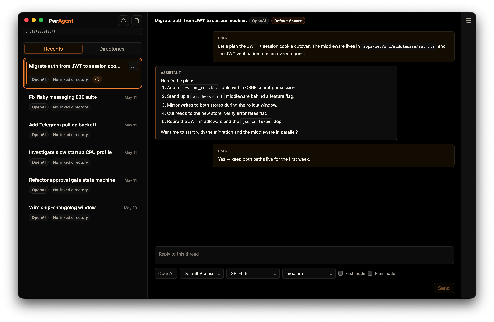
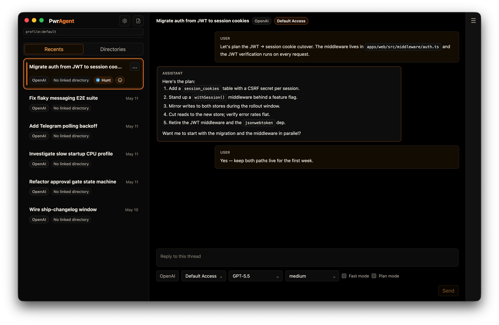
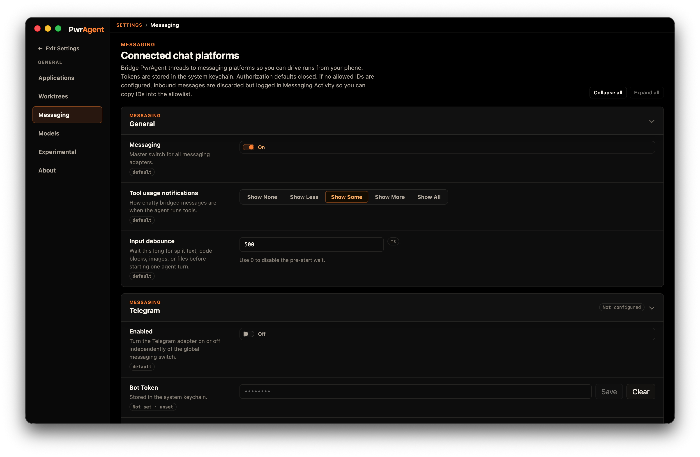
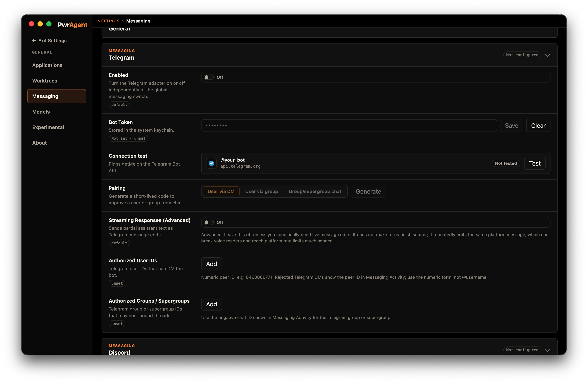
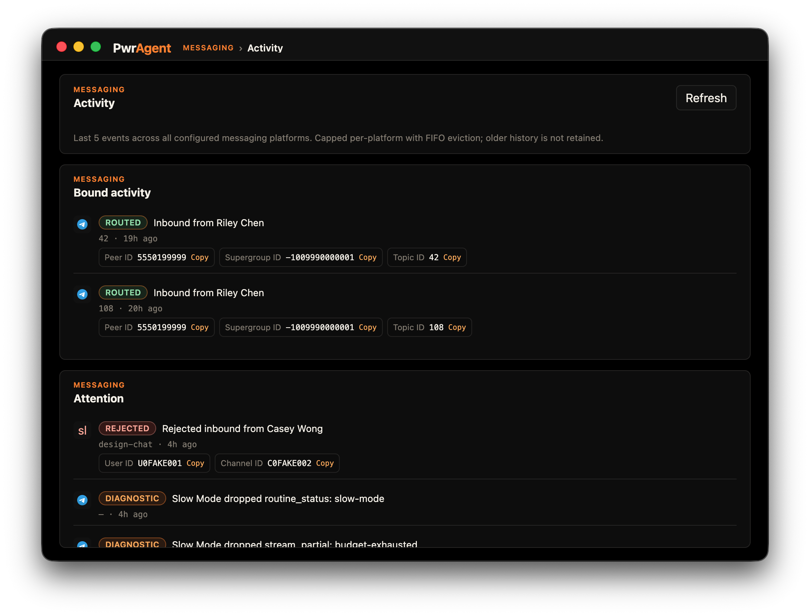

# PwrAgent

**Run a coding agent. Drive it from your messenger.**

PwrAgent is a thread-first desktop app that pairs a coding agent with the
chat platforms you already use. Start a thread on your laptop, follow it
from Telegram, approve a destructive command from Discord, hand the
conversation back to the desktop when you're ready to read the diff.

> **Status: beta.** macOS only today. PwrAgent is intentionally
> non-destructive between releases: the config system migrates settings
> forward without breaking older versions, only writes the keys it means
> to change, and preserves keys it doesn't recognize so newer releases
> can introduce settings without invalidating older ones. The contract
> with users is a stable, steadily evolving project — not churn. See
> [docs/config-file-evolution.md](docs/config-file-evolution.md) for the
> read-fallback, lazy-conversion, and downgrade-compatibility rules.


<!-- screenshot: screenshot-recents-hero.png — Recents lens populated with several threads, at least one carrying a messenger badge. 1440×900, macOS, light theme. -->

## What you can do

### Monitor bound threads from your messenger

Every thread can be bound to a conversation on Telegram or Discord.
Updates flow both ways: the desktop sees what you typed on your phone,
the bot sees what the agent did on your laptop. No copy-paste, no
context loss.


<!-- screenshot: screenshot-bound-thread.png — Thread detail view with the linked messenger context visible. -->

### See messenger status at a glance

PwrAgent surfaces messenger connection state, allowlisted users, and
recent activity in one card. If your bot drops a connection or a
webhook stops delivering, you'll know.


<!-- screenshot: screenshot-messenger-status.png — Settings or status surface showing Telegram/Discord/Mattermost connection state. -->

### Pair the desktop with a chat bot

Bring your own bot. Paste a token, allowlist your platform user ID, and
PwrAgent does the rest — no cloud relay, no third-party service in the
middle.


<!-- screenshot: screenshot-pairing.png — Pairing / binding flow (or a clean settings card if there is no dedicated wizard). -->

### Closed by default

PwrAgent runs in default-access mode out of the box. Destructive actions
prompt for approval, and the approval surface is mirrored on the bound
messenger so you can say "yes" from the same place you saw the
question.


<!-- screenshot: screenshot-closed-by-default.png — Approval gate UI / closed state that conveys "the agent isn't acting on its own." -->

## Quick Start

### macOS

1. Grab the latest signed build from the
   [GitHub Releases page](https://github.com/pwrdrvr/PwrAgent/releases).
2. Open the app. PwrAgent stores all config and state under `~/.pwragent/`.
3. (Optional) Pair a messenger from **Settings → Messaging**. You'll need
   a bot token from Telegram, Discord, or Mattermost and your own
   platform user ID for the allowlist.

### From source

```bash
git clone https://github.com/pwrdrvr/PwrAgent.git
cd PwrAgent
pnpm install
pnpm dev
```

Configure your coding-agent credentials either in your shell environment
or in `~/.config/grok-app-server/config.toml`. See
[CONTRIBUTING.md](CONTRIBUTING.md) for the development workflow.

## Roadmap

- macOS-first today. Linux and Windows are not yet supported.
- Beta-stable. New features arrive on a steady cadence; the config and
  state systems are designed to migrate forward without breaking older
  installs.
- The desktop release pipeline (signing, notarization, auto-update) is
  documented in
  [docs/desktop-release-runbook.md](docs/desktop-release-runbook.md).
- A versioned online docs site is planned; until then, this repository
  is the source of truth.

## Background

PwrAgent grew out of
[openclaw-codex-app-server](https://github.com/pwrdrvr/openclaw-codex-app-server),
a PwrDrvr LLC project that brought Codex into Telegram and Discord.
PwrAgent supersedes it: a desktop-first, thread-centric coding-agent
shell with first-class messenger integration, and a generic messaging
protocol that lets a single workflow layer drive Telegram, Discord,
Mattermost, and Slack from the same code path. That protocol is now
stable enough that the next step is bringing it back upstream into
OpenClaw.

## Going deeper

- [ARCHITECTURE.md](ARCHITECTURE.md) — process model, storage layers,
  messaging layer summary, dependency boundaries, workspace map.
- [CONTRIBUTING.md](CONTRIBUTING.md) — development workflow, testing,
  replay fixtures, diagnostics, internal agent-core notes.
- [SECURITY.md](SECURITY.md) — how to report vulnerabilities.
- [docs/messaging-architecture.md](docs/messaging-architecture.md) —
  layered messaging architecture, capability profiles, callback delivery
  models.
- [docs/messaging-platform-integration.md](docs/messaging-platform-integration.md)
  — operator setup, command surface, Cloudflare-Tunnel / Tailscale-Funnel
  guidance for HTTP-callback providers.
- [docs/state-layout.md](docs/state-layout.md) — on-disk state layout,
  environment variables, profiles.

## License

PwrAgent is licensed under the [MIT License](LICENSE). Third-party
dependency notices are aggregated in
[THIRD_PARTY_LICENSES](THIRD_PARTY_LICENSES) and shipped with desktop
distributions. See
[docs/third-party-license-notices.md](docs/third-party-license-notices.md)
for the Electron/Chromium runtime notice policy.
