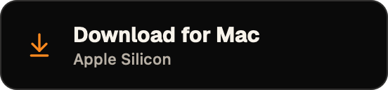
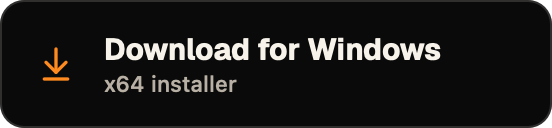
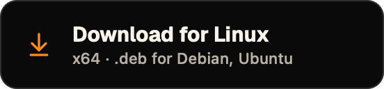
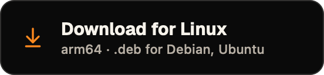
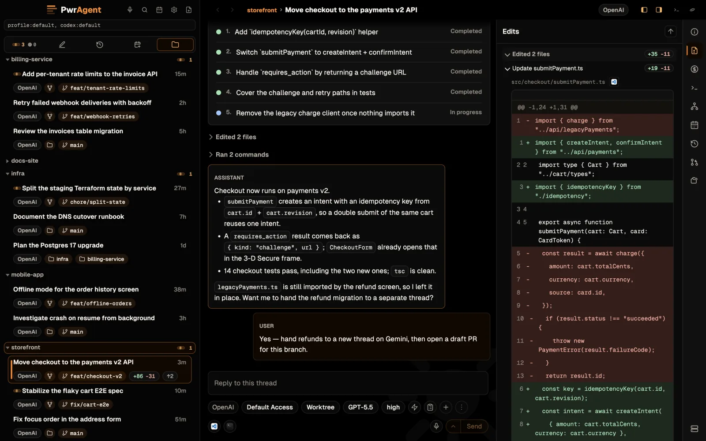
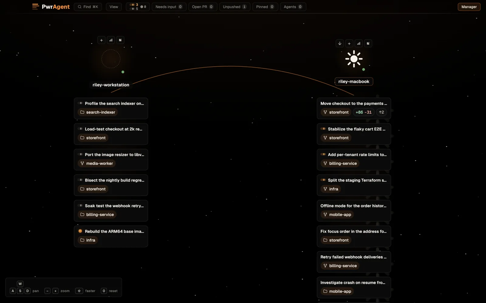
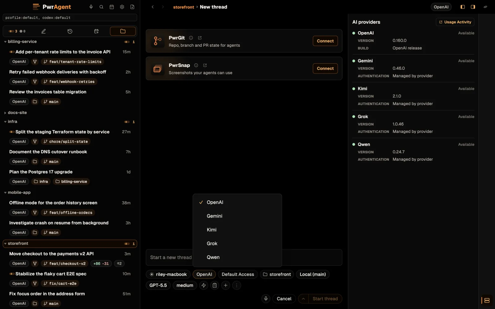
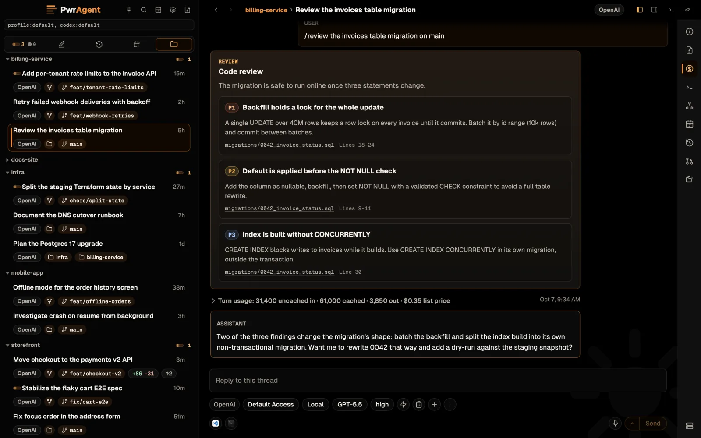
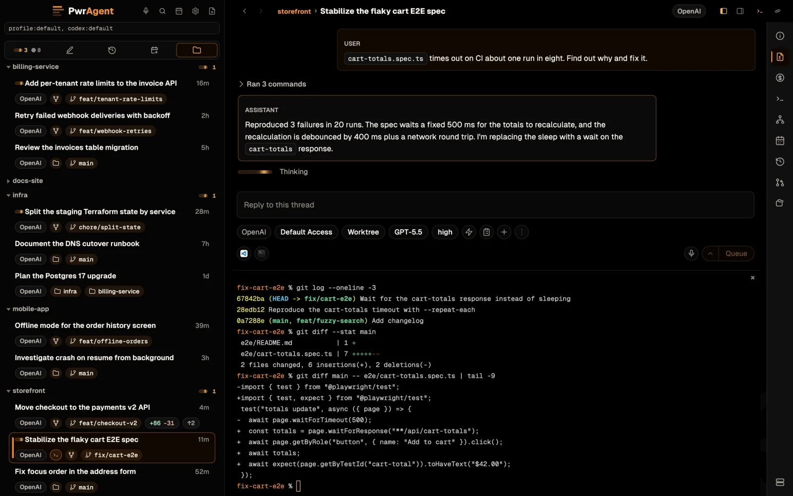

<div align="center">


<h1>PwrAgent</h1>

<strong>Run coding agents by the dozen.</strong>

<p>A desktop for running coding agents on machines you own.<br>
Many threads across many repositories, each in its own Git worktree, on Codex,
Gemini CLI, Grok Build, Kimi Code, or Qwen Code.</p>

<p>
  <a href="https://github.com/pwrdrvr/PwrAgent/releases/latest/download/PwrAgent.dmg"></a>
  <a href="https://github.com/pwrdrvr/PwrAgent/releases/latest/download/PwrAgent-arm64.dmg"></a>
  <a href="https://github.com/pwrdrvr/PwrAgent/releases/latest/download/PwrAgent.Setup.exe"></a>
</p>

<p>
  <a href="https://github.com/pwrdrvr/PwrAgent/releases/latest/download/PwrAgent-linux-x64.deb"></a>
  <a href="https://github.com/pwrdrvr/PwrAgent/releases/latest/download/PwrAgent-linux-arm64.deb"></a>
</p>

<sub>More Linux formats — x64: <a href="https://github.com/pwrdrvr/PwrAgent/releases/latest/download/PwrAgent-linux-x64.rpm">.rpm</a> · <a href="https://github.com/pwrdrvr/PwrAgent/releases/latest/download/PwrAgent-linux-x64.pacman">.pacman</a> · <a href="https://github.com/pwrdrvr/PwrAgent/releases/latest/download/PwrAgent-linux-x64.tar.gz">.tar.gz</a> &nbsp;·&nbsp; arm64: <a href="https://github.com/pwrdrvr/PwrAgent/releases/latest/download/PwrAgent-linux-arm64.rpm">.rpm</a> · <a href="https://github.com/pwrdrvr/PwrAgent/releases/latest/download/PwrAgent-linux-arm64.pacman">.pacman</a> · <a href="https://github.com/pwrdrvr/PwrAgent/releases/latest/download/PwrAgent-linux-arm64.tar.gz">.tar.gz</a></sub><br>
<sub>Homebrew: <code>brew install --cask pwrdrvr/tap/pwragent</code></sub>

<p>
  <a href="https://docs.pwragent.ai"></a>
  <a href="https://pwragent.ai"></a>
  <a href="https://pwrdrvr.com/about"></a>
</p>

<sub>macOS 12 Monterey or newer · Windows 10 or newer · Linux x64 and arm64 · MIT</sub><br>
<sub>Signed and notarized for macOS, Authenticode-signed for Windows. Git and Git LFS ship inside the app.</sub>

<br><br>



</div>

## Why PwrAgent

One agent in one terminal is easy. A dozen, across repositories, each needing a
review and a pull request, is the part PwrAgent is for.

- **Threads that don't collide.** Each thread can run in its own Git worktree.
  The Directories lens groups threads by repository and worktree, and a
  thread's work can be handed off to another worktree or another agent.
- **Five agent CLIs.** Codex is the default. Gemini CLI, Grok Build, Kimi Code,
  and Qwen Code run over ACP; pick the agent per thread. Grok Build ships with
  the installer and you sign in with your own xAI account. The others use the
  CLI you already installed and signed in to.
- **Works alongside Codex Desktop.** Codex threads share Codex's thread store:
  start in either app, finish in the other.
- **Review and pull requests in the thread.** Code reviews with prioritized
  findings, PR status and checks in the rail, and **Auto-fix PR**, which sends
  the thread back to work when CI fails or a merge conflict appears.
- **A terminal where the agent works.** An integrated terminal opens in the
  thread's worktree.
- **Queue and steer.** Stack follow-ups while a turn runs, or steer the turn in
  progress.
- **<kbd>Command+K</kbd> to any thread or project**, including threads on your
  other machines. <kbd>Control+K</kbd> on Windows and Linux.
- **Your machines, one view.** Federation connects the machines you run agents
  on. The Star Map shows threads around their projects on each machine, and a
  Codex thread can be copied or moved to another machine with its workspace and
  uncommitted work. Roles are set in **Settings → Access Control**.
- **Reach it from your phone.** Telegram, Discord, Slack, Mattermost,
  Feishu / Lark, or LINE. Closed by default; see [Privacy](#privacy).
- **Profiles.** Separate windows for work and personal projects, each with its
  own state, Codex sign-in, and messaging credentials.

## A closer look

<table>
  <tr>
    <td width="50%"></td>
    <td width="50%"></td>
  </tr>
  <tr>
    <td><b>The Star Map.</b> Threads on this machine and the machines it is federated with, in one view.</td>
    <td><b>Choose the agent per thread.</b> Codex by default; Gemini CLI, Grok Build, Kimi Code, and Qwen Code over ACP.</td>
  </tr>
  <tr>
    <td width="50%"></td>
    <td width="50%"></td>
  </tr>
  <tr>
    <td><b>Reviews in the thread.</b> Findings ranked P1 to P3, each pointing at the file and lines it is about.</td>
    <td><b>Integrated terminal.</b> A shell in the thread's worktree, one click from the transcript.</td>
  </tr>
</table>

## Install

| Platform | Download | Notes |
|---|---|---|
| macOS, Intel or not sure | [PwrAgent.dmg](https://github.com/pwrdrvr/PwrAgent/releases/latest/download/PwrAgent.dmg) | Universal. Runs natively on Intel and Apple Silicon. |
| macOS, Apple Silicon | [PwrAgent-arm64.dmg](https://github.com/pwrdrvr/PwrAgent/releases/latest/download/PwrAgent-arm64.dmg) | M1 or newer. The smaller download. |
| macOS, Homebrew | `brew install --cask pwrdrvr/tap/pwragent` | Picks the right build for your Mac. |
| Windows 10 / 11, x64 | [PwrAgent.Setup.exe](https://github.com/pwrdrvr/PwrAgent/releases/latest/download/PwrAgent.Setup.exe) | Per-user installer. |
| Linux, x64 / arm64 | `.deb` · `.rpm` · `.pacman` · `.tar.gz` | Commands below. |

macOS builds are Developer ID-signed and Apple-notarized; macOS 12 Monterey or
newer. The Windows installer is Authenticode-signed through Azure Artifact
Signing. There is no Windows arm64 build yet.

**Linux** — swap `x64` for `arm64` on an ARM machine:

```bash
# Debian, Ubuntu
curl -fLO https://github.com/pwrdrvr/PwrAgent/releases/latest/download/PwrAgent-linux-x64.deb \
  && sudo apt install ./PwrAgent-linux-x64.deb

# Fedora, RHEL, openSUSE (zypper also accepts the URL)
sudo dnf install https://github.com/pwrdrvr/PwrAgent/releases/latest/download/PwrAgent-linux-x64.rpm

# Arch
sudo pacman -U https://github.com/pwrdrvr/PwrAgent/releases/latest/download/PwrAgent-linux-x64.pacman
```

The `.tar.gz` is a portable build: extract it and run `pwragent`. Each release
carries checksum files per platform: `SHA256SUMS` (Linux),
`PwrAgent-windows-SHA256SUMS`, and `PwrAgent-macos-SHA256SUMS`.

**Agents.** PwrAgent drives agent CLIs; it does not replace them. Install and
sign in to Codex, or any of Gemini CLI, Kimi Code, or Qwen Code. Grok Build is
included; sign in with your xAI account. **Settings → AI Providers** shows what
PwrAgent found.

**Updates** come from GitHub Releases, on a Stable or Beta train with Latest
and Prerelease tracks (**Settings → Updates → Release channel**; the default is
Stable, Latest). macOS and Windows update in place. On Linux, install the newer
package the same way you installed the first one.

Setup walkthroughs, messaging pairing, and settings reference:
[docs.pwragent.ai](https://docs.pwragent.ai).

## Privacy

No account, no telemetry, no PwrAgent server. Agents run on your machine
through your own CLI sign-ins. Configuration and state live under
`~/.pwragent/` ([layout](docs/state-layout.md)). Secrets such as bot tokens
are encrypted at rest through Electron `safeStorage`, which uses the operating
system's credential store.

Messaging is closed by default. Only platform user IDs you allowlist can reach
the bot. In shared spaces — Slack workspaces, Discord servers, Telegram
supergroups — the space and the user must both be on the allowlist; inviting
the bot into a workspace authorizes no one. Denied attempts appear in the
messaging activity log. Adding a user or space is a change you make on the
desktop.

Before installing on a work machine or connecting a work messenger, check your
employer's policy. Keep work and personal installs apart with
[profiles](https://docs.pwragent.ai/desktop/#multiple-profiles), and don't pair
a work install with a personal bot.

## Ways to help

- **[Star the repository](https://github.com/pwrdrvr/PwrAgent)** — it is the
  main way anyone else finds PwrAgent.
- **[Open an issue](https://github.com/pwrdrvr/PwrAgent/issues)** for a bug or
  a rough edge.
- **Send a pull request.** Development setup, architecture, and the checks CI
  runs are in [CONTRIBUTING.md](CONTRIBUTING.md).
- **Report vulnerabilities privately** — see [SECURITY.md](SECURITY.md).

What changed in each release: [CHANGELOG.md](CHANGELOG.md).

## License

[MIT](LICENSE). Third-party dependency notices are in
[THIRD_PARTY_LICENSES](THIRD_PARTY_LICENSES) and ship with every release; the
Electron and Chromium runtime notice policy is in
[docs/third-party-license-notices.md](docs/third-party-license-notices.md).

Created by [PwrDrvr LLC](https://pwrdrvr.com). Follow
[@PwrAgentAI](https://x.com/PwrAgentAI) for releases.
