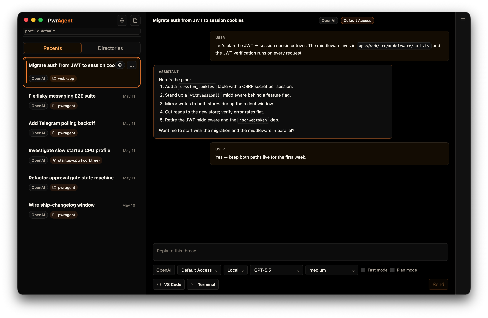

# The PwrAgent desktop

PwrAgent is an Electron desktop app. It runs locally, stores its
state under `~/.pwragent/`, and pairs a Codex thread list with a
thread-detail view, a composer, and a sidebar of recents. There's no
cloud relay and no PwrAgent-owned account — see
[Settings](../settings/) for how the desktop discovers your local
Codex install and how authentication works.

The rest of this page covers what the desktop **does**, what's not in
it yet, and what's coming soon.

## What's in the desktop today

### Sidebar lenses



The left sidebar carries three thread lenses you can switch between:

- **Inbox** — the default browsing lens. Shows threads with unread
  activity at the top, with the rest of your active work below.
- **Recents** — every active thread in most-recently-touched order.
- **Directories** — threads grouped by the project / repository
  they're rooted in.

User-curated **Pins** live as a scrollable section at the top of
both the Inbox and Recents lenses.

Unread state on a thread shows as an orange cookie marker on the
row, not a punctuation badge.

### Thread workspaces: Local and Worktree

Each PwrAgent thread is rooted in a project (a Git repository).
Within a project, a thread runs in one of two **workspaces**:

- **Local** — the working copy you'd normally check out. The thread
  shares your repo with whatever else you're doing in that directory.
- **Worktree** — a `git worktree` PwrAgent manages for you, isolated
  from your main checkout. The thread does its work in the worktree
  so your `main` (or whatever you have checked out) isn't disturbed.

Threads can be **handed off** between Local and Worktree from the
status card — PwrAgent moves the thread's working state and updates
the binding. Local-to-Worktree handoff asks which branch should
remain checked out in Local before it moves you over; Worktree-to-
Local handoff asks for confirmation.

<!-- screenshot: desktop-worktree-picker.png — Handoff dialog with Local-to-Worktree branch picker. See DOCS_SITE_SHOT_LIST.md. -->

Worktree storage location is configurable — see
[Settings → Worktrees](../settings/#worktrees).

### Per-thread settings

Unlike Codex Desktop, where model / reasoning effort / Fast mode /
permissions mode are global, PwrAgent scopes them **per thread**.
You can run an experiment on a cheaper model with **Default Access**
while a refactor runs on a stronger model with **Full Access** —
the settings stay scoped to their thread. Set them on the **Start
Card** before sending the first prompt, or on the bound-thread
status card afterward.

### Auto-naming

PwrAgent gives threads automatic names so the sidebar list is
scannable as it grows. The first prompt is the primary signal; the
agent's responses adjust the name as the thread takes shape. You
can rename manually from the thread header at any time.

### Access modes

The two access modes that gate what the agent can do:

- **Default Access** — the agent asks before executing
  potentially-destructive shell commands or writing outside the
  workspace.
- **Full Access** — no prompts. The agent runs commands and writes
  files freely within the workspace. Use deliberately.

The mode is per-thread (see above). Mid-turn changes queue at the
turn boundary — see
[Using Codex via Messaging → Start Card buttons](../using-codex/#start-card-buttons)
for the queueing details, which apply equally on the desktop.

### Approval surface

When a thread is in Default Access and the agent wants to run
something approval-gated, the desktop shows an inline approval card
inside the transcript. Approvals are mirrored to any bound messengers
so you can approve from wherever you happen to be reading the
conversation.

### Markdown composer

The composer parses Markdown as you type:

- Triple backticks + space opens a code block.
- `>` + space opens a blockquote.
- `-` or `*` + space starts a bulleted list; press Enter on an empty
  bullet to exit.
- `1.` + space starts a numbered list; subsequent Enters keep the
  numbering going until you exit on an empty item.
- Standard inline formatting (`**bold**`, `*italic*`, `~~strikethrough~~`,
  `` `code` ``, links) renders as you type.

Codex Desktop doesn't have this yet.

### Search, pins, branch / PR / emoji markers

The sidebar's filter accepts branch names, PR numbers, emoji
markers, and free text. Pin threads you want to keep at the top of
Recents; the pinned section is scrollable independently of the rest
of the list.

## Multiple profiles

PwrAgent has **two independent profile mechanisms** that compose.
Read once; the rest of the section is a worked setup.

### PwrAgent profiles

A **PwrAgent profile** is selected by the `PWRAGENT_PROFILE` env
var at launch. Each profile carries its own:

- `config.toml` (settings) and `state.db` (sqlite session DB).
- New-thread sticky settings (the per-thread defaults you've
  carried forward).
- **Messaging profile**, entirely isolated from other PwrAgent
  profiles. One PwrAgent profile can have Telegram + Slack
  configured; another can have just Mattermost; a third can have
  the same Telegram platform but a **different bot token**. They
  don't talk to each other.

Creating a new PwrAgent profile is trivial: pick a name, set the
env var, launch. PwrAgent creates the profile on first run under
`~/.pwragent/profiles/<name>/`.

> **Use case.** Two PwrAgent profiles pointed at the **same Codex
> auth** share the underlying Codex threads, settings, and account
> — but they're independent at the PwrAgent layer. That's how you
> run **multiple bots of the same platform** (e.g. one Telegram bot
> for personal work and another Telegram bot for a small team,
> both driving the same Codex thread list).

### Codex profiles

A **Codex profile** is an isolated `CODEX_HOME` directory the
Codex App Server uses for its own state — auth tokens, thread
history, config. Each Codex profile points at its own OpenAI Codex
identity (or the same identity, if you want).

> **Use case.** Two Codex profiles for a single PwrAgent install:
> `~/.codex/profiles/work/` (your day-job Codex account) and
> `~/.codex/profiles/personal/` (your personal account). Threads
> stay separated; auth stays separated. Switch between them by
> changing the Codex auth profile selection in Settings → Models.

> **Cheekier use case.** Four Codex profiles, each pointed at a
> different Codex Pro account, because you are an animal and need
> four accounts worth of tokens to rule the world. PwrAgent will
> not stop you.

### How the two profile mechanisms compose

| What's isolated | PwrAgent profile | Codex profile |
|---|---|---|
| PwrAgent settings (`config.toml`) | ✅ | — |
| PwrAgent state DB (`state.db`) | ✅ | — |
| Messaging adapters + bot tokens | ✅ | — |
| Codex threads + history | — | ✅ |
| Codex auth (OpenAI account) | — | ✅ |
| Per-thread settings stickiness | ✅ | — |

You can compose them however you want. Examples:

- **1 PwrAgent × 1 Codex.** Default. Single install.
- **2 PwrAgent × 1 Codex.** Two messaging surfaces (different bots
  for the same platform; or one with messaging, one without)
  sharing the same Codex threads.
- **1 PwrAgent × 2 Codex.** One PwrAgent install switching between
  work and personal Codex identities via Settings → Models.
- **N PwrAgent × M Codex.** Whatever combination makes sense.

### Setting up an alternate Codex profile

Today this is a CLI bootstrap (we're working on making it in-app —
see [Coming soon](#coming-soon)). The flow:

```bash
# Pick a name. Avoid spaces; use lowercase / underscore / dash.
export CODEX_PROFILE_NAME=work

# Create the Codex home for that auth profile.
mkdir -p "$HOME/.codex/profiles/$CODEX_PROFILE_NAME"

# Optional: copy your existing Codex config as a starting point.
cp "$HOME/.codex/config.toml" "$HOME/.codex/profiles/$CODEX_PROFILE_NAME/config.toml"

# Log Codex into that isolated CODEX_HOME.
CODEX_HOME="$HOME/.codex/profiles/$CODEX_PROFILE_NAME" codex login

# Verify it's logged in.
CODEX_HOME="$HOME/.codex/profiles/$CODEX_PROFILE_NAME" codex login status
```

If you use API-key auth instead of browser-flow login:

```bash
printenv OPENAI_API_KEY | \
  CODEX_HOME="$HOME/.codex/profiles/$CODEX_PROFILE_NAME" \
  codex login --with-api-key
```

### Wiring it into PwrAgent

After the alternate `CODEX_HOME` is logged in, point a PwrAgent
profile at it:

1. Launch PwrAgent with the PwrAgent profile you want this Codex
   profile attached to. **From source:**

   ```bash
   PWRAGENT_PROFILE=dev pnpm --filter @pwragent/desktop dev:no-messaging
   ```

   **From the installed `.app`:**

   ```bash
   PWRAGENT_PROFILE=work /Applications/PwrAgent.app/Contents/MacOS/PwrAgent &
   ```

   This invokes the bundled binary directly with the env var set.
   The `&` backgrounds the app so your terminal stays usable.

2. Open **Settings → Models → Codex**.
3. In the **Auth profile** picker, choose the directory you
   created (`work` in the example above).
4. Save and restart PwrAgent so the App Server re-launches with
   the new `CODEX_HOME`.

The selection writes to that PwrAgent profile's config only — for
the example above, `~/.pwragent/profiles/dev/config.toml`:

```toml
[models.codex]
profile = "work"
```

### Verifying without guessing

After the wire-up:

```bash
# Confirm PwrAgent dev selected the Codex auth profile.
rg -n 'profile = "work"|\[models.codex\]' \
  ~/.pwragent/profiles/dev/config.toml

# After starting a Codex thread from PwrAgent, confirm Codex state
# lands in the isolated CODEX_HOME.
find ~/.codex/profiles/work -maxdepth 4 -type f | sort | head -80
```

You should see something like:

```
~/.codex/profiles/work/auth.json
~/.codex/profiles/work/config.toml  # if copied or created
~/.codex/profiles/work/session_index.jsonl
~/.codex/profiles/work/sessions/...
~/.codex/profiles/work/worktrees/...  # if Codex user-home worktrees are used
```

### Mental model

- `PWRAGENT_PROFILE=<name>` selects PwrAgent's **own** DB, config,
  and secrets directory.
- The **Codex auth profile** picked inside that PwrAgent profile
  selects which `CODEX_HOME` PwrAgent hands to the Codex App Server.

The two settings live at different layers and don't interact. Pick
each one for its own reason.

## Not yet

Features the desktop **doesn't have today** that operators have
asked about — captured here so you can plan around them:

- **Forking a thread.** No way to branch a thread into two parallel
  paths from a chosen point. If you need to explore an alternative
  while preserving the original, the workaround is to manually
  archive the current state and start a new thread.
- **Restoring archived threads.** Once archived, a thread is gone
  from the active list. The transcript and overlay state are still
  on disk, but there's no UI to surface them. (Roadmap.)
- **Tight auto-archiving.** Threads stay in Recents indefinitely
  unless you archive them. There's no policy that says "archive
  threads I haven't touched in N days."
- **Branch auto-naming via button click.** Branch names default
  to the worktree hash. There's no button that says "rename this
  branch to something derived from the thread title" yet.

## Coming soon

Active development areas that have shipped designs but aren't in
release builds yet:

- **Environment setup on new worktree.** When PwrAgent creates a
  worktree, it'll optionally run a configurable setup hook (install
  deps, run codegen, warm caches) before handing the worktree to
  the agent. Today you have to do this manually.
- **Environment cleanup on archive or handoff.** Inverse of the
  above — tear down the worktree's working environment when a
  thread is archived or handed back to Local. Today nothing
  cleans up.
- **In-app profile management.** Creating, switching, and
  configuring PwrAgent profiles (and the Codex profiles bound to
  them) currently requires the CLI bootstrap described in
  [Multiple profiles](#multiple-profiles). The flow lands inside
  the app shortly — pick / create / switch profiles from the
  PwrAgent UI without dropping to a terminal.

If either of these would be load-bearing for your workflow, watch
the [GitHub repo](https://github.com/pwrdrvr/PwrAgent) for the
relevant PRs.

## See also

- **[Settings](../settings/)** — application discovery, Codex App
  Server / Codex Desktop coordination, worktree storage location.
- **[Messaging](../messaging/)** — drive PwrAgent's threads from
  Telegram, Discord, Slack, Mattermost, Feishu / Lark, or LINE.
- **[Using Codex via Messaging](../using-codex/)** — the end-to-end
  flow for driving a thread from a messenger.
