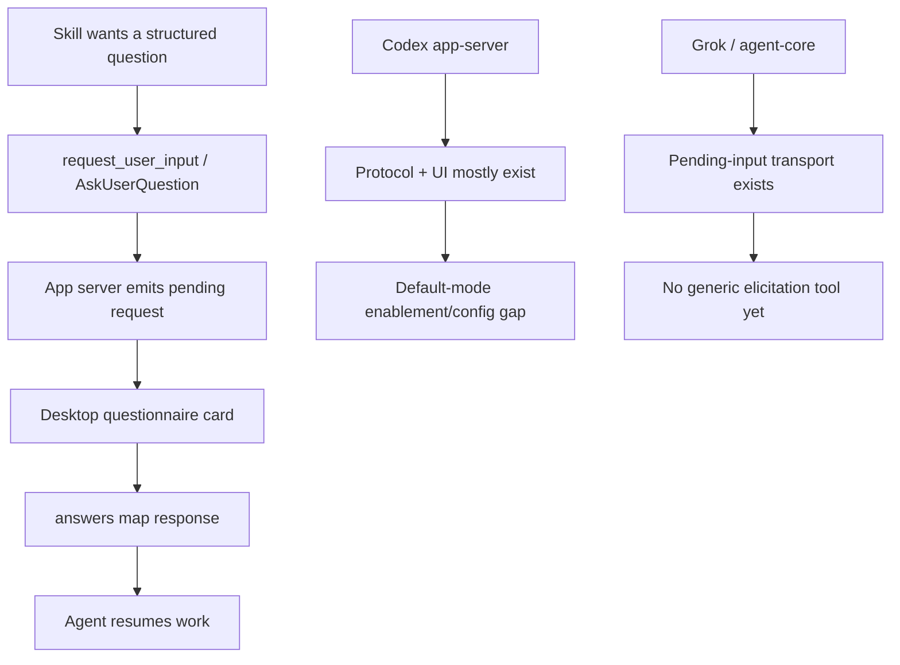

# Default-Mode Questionnaire Elicitation

## Problem Frame

Claude Code skills such as `/Users/huntharo/github/last30days-skill` can declare `AskUserQuestion` in `allowed-tools` and use structured questionnaires while still performing work. Codex currently behaves differently in this session and in PwrAgnt's desktop affordance: structured `request_user_input` questionnaires are treated as Plan-mode behavior, so a skill that wants to both ask a structured setup question and then create/update files has no obvious non-plan path.

The user value is not "Plan mode everywhere." The value is a reusable elicitation surface that a skill can invoke when it needs one or two decisions before continuing execution.

Confirmed external context:
- Anthropic describes `AskUserQuestion` as a Claude Code tool that can be called at any point, displays a modal, and blocks the agent loop until the user answers: https://claude.com/blog/seeing-like-an-agent
- Anthropic's general tool-use docs describe this as normal tool calling with JSON-schema input, not a markdown convention to parse from assistant text: https://platform.claude.com/docs/en/agents-and-tools/tool-use/define-tools
- A closed Claude Code issue documents an earlier bug where `AskUserQuestion` only worked after toggling Plan mode; the desired behavior was availability "at any point": https://github.com/anthropics/claude-code/issues/9846

## Current PwrAgnt / Codex Findings

- Codex already has a structured app-server request for this: `item/tool/requestUserInput`.
- The app-server protocol shape is `questions[]` with `id`, `header`, `question`, `isOther`, `isSecret`, and `options[]`, and the response shape is `{ answers: { [questionId]: { answers: string[] } } }`.
- PwrAgnt desktop already recognizes `item/tool/requestUserInput`, stores it separately from approval requests, renders a `PendingQuestionnaire`, and submits the protocol-shaped response.
- The PwrAgnt composer currently only sends `collaborationMode: { mode: "plan" }` when the Plan mode checkbox is enabled.
- Upstream Codex has an under-development feature flag named `default_mode_request_user_input` that explicitly allows `request_user_input` in Default mode.
- Upstream Codex's default-mode template changes its instruction text based on that flag: when enabled, it says the `request_user_input` tool is available in Default mode and should be preferred over textual multiple-choice questions when a risky ambiguity cannot be resolved locally.
- Upstream Codex's request handler still rejects `request_user_input` from subagent threads, even with the default-mode feature enabled.
- PwrAgnt `agent-core` already has a generic provider event path for pending input, but the Grok provider/tool layer currently only uses it for approval-style requests, not a first-class `request_user_input` tool.

## Requirements

**Codex Default-Mode Support**
- R1. PwrAgnt must support structured `request_user_input` questionnaires during non-plan Codex turns when the underlying Codex app-server supports `default_mode_request_user_input`.
- R2. The default path must reuse Codex's existing `item/tool/requestUserInput` protocol and response shape rather than parsing markdown or inventing a PwrAgnt-only questionnaire syntax.
- R3. The feature must remain distinct from Plan mode: enabling structured questions in Default mode must not force plan collaboration instructions, plan rendering, or plan-specific model defaults.
- R4. PwrAgnt must not route questionnaire requests through approval cards or approval-shaped responses.

**Configuration and Capability Detection**
- R5. PwrAgnt must detect or configure whether Codex default-mode `request_user_input` is enabled, using the upstream feature flag path where available.
- R6. The UI must expose capability accurately: if default-mode elicitation is unavailable, skills should fall back to plain concise questions or Plan mode rather than showing a broken questionnaire path.
- R7. A thread-level or launchpad-level opt-in should be possible for testing and rollout before making default-mode elicitation globally enabled.

**Skill Authoring Compatibility**
- R8. Codex-facing skill guidance must map Claude's `AskUserQuestion` concept to Codex `request_user_input` when the capability is available.
- R9. Skills must be able to ask one to three short structured questions and continue execution after the user answers.
- R10. The feature must preserve the root-thread limitation until upstream Codex supports subagent usage; subagents should fail clearly or delegate the question to the parent/root agent.

**Grok / Agent-Core Parity**
- R11. Grok/agent-core should eventually expose an equivalent `request_user_input` tool that emits the same normalized pending-input notification used by the desktop questionnaire UI.
- R12. Agent-core should keep elicitation as a generic pending-input request type, separate from approvals, so future providers can share the same UI and response lifecycle.

## Approach Options

| Option | Description | Pros | Cons |
|---|---|---|---|
| A. Enable upstream Codex default-mode feature first | Configure or expose `features.default_mode_request_user_input=true` for Codex threads, keep using `item/tool/requestUserInput`, and update skill guidance. | Smallest implementation, aligns with upstream protocol, immediately helps Codex skills. | Depends on bundled Codex version and feature availability; still root-thread only. |
| B. Add PwrAgnt normalized elicitation layer | Define provider-agnostic `requestUserInput` in agent-core and map Codex plus Grok into it. | Best long-term parity across Codex and Grok. | More implementation surface; risks duplicating upstream protocol if done before Codex enablement is understood. |
| C. Parse questionnaire markdown from assistant text | Let skills emit a special syntax that the renderer turns into a questionnaire. | Works without tool availability. | Anthropic explicitly rejected this shape as unreliable; high drift risk and poor protocol clarity. |

Recommended sequence: start with Option A, then add Option B for Grok/agent-core parity. Avoid Option C except as a temporary fallback for human-readable numbered options.

## Success Criteria

- A Codex Default-mode turn can invoke a skill that uses structured questions, display the existing PwrAgnt questionnaire card, submit answers, and continue the same turn.
- A non-plan questionnaire request does not create a plan card, switch the collaboration mode to Plan, or use approval response payloads.
- A skill with Claude `AskUserQuestion` guidance has a documented Codex-compatible path using `request_user_input`.
- Grok/agent-core has a clear follow-up plan for provider-agnostic elicitation instead of Codex-only behavior.

## Scope Boundaries

- Do not implement markdown questionnaire parsing as the primary protocol.
- Do not change Plan mode semantics just to support skill questionnaires.
- Do not promise subagent questionnaire support until upstream Codex removes the root-thread restriction.
- Do not make Grok parity block the first Codex implementation path.

## Key Decisions

- Reuse `item/tool/requestUserInput`: It already exists in Codex, PwrAgnt's desktop already renders it, and the response contract is stable enough to test against.
- Treat Default-mode availability as a feature/capability: Upstream Codex marks `default_mode_request_user_input` as under development and disabled by default.
- Keep the first implementation Codex-focused: This answers the immediate skill compatibility problem without forcing a new provider abstraction prematurely.
- Follow with agent-core parity: The generic pending-input event already exists, so Grok should converge on the same UI and lifecycle rather than invent a second questionnaire surface.

## Dependencies / Assumptions

- The bundled Codex app-server version used by PwrAgnt includes the `default_mode_request_user_input` feature flag and `item/tool/requestUserInput` protocol.
- PwrAgnt can pass thread config overrides such as `features.default_mode_request_user_input=true` or otherwise enable the equivalent setting in Codex config.
- Skills can be updated to say "use `request_user_input` in Codex when available, otherwise ask one concise plain-text question."

## Outstanding Questions

### Resolve Before Planning
- [Affects R5][User decision] Should the first rollout be a hidden config/feature flag for developers only, or should the desktop expose a visible "structured questions in Default mode" setting?

### Deferred to Planning
- [Affects R5][Technical] Confirm the exact PwrAgnt startup/config path for passing `features.default_mode_request_user_input=true` into the Codex app-server thread.
- [Affects R6][Technical] Determine whether PwrAgnt should call a Codex capability/list endpoint, inspect config, or infer support from generated protocol availability.
- [Affects R11][Technical] Design the Grok/agent-core `request_user_input` tool descriptor and AI SDK adapter path.

## Next Steps

Resolve the rollout-surface question, then run `/prompts:ce-plan` for structured implementation planning.
