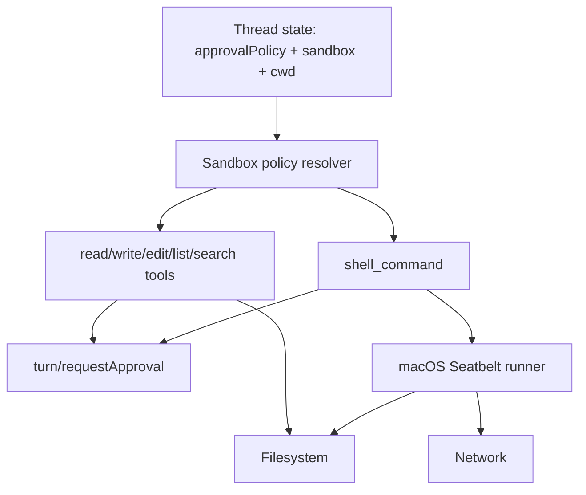

# feat: Add macOS tool sandboxing for Default Access

## Overview

Implement real file and network sandboxing for the Grok-backed app-server tools on macOS. `Default Access` should allow useful work inside the selected workspace without prompting for every file mutation, while still protecting special repository metadata, blocking reads and writes outside the sandbox unless explicitly approved, and denying network access until the user grants it. `Full Access` should keep its existing broad behavior.

This is a macOS-first plan. Linux and Windows are documented as future platform backends, not part of the first implementation pass.

## Problem Frame

PwrAgnt already exposes `Default Access` and `Full Access` as thread modes, and the desktop backend registry maps them to `approvalPolicy: "on-request", sandbox: "workspace-write"` and `approvalPolicy: "never", sandbox: "danger-full-access"`. That contract exists in the UI and thread/session metadata, but the Grok app-server tools do not currently enforce a Codex-style OS sandbox.

The current local tool behavior is closer to a legacy approval model:

- `write_file` and `edit_file` request approval before every workspace write when `approvalPolicy` is `on-request`.
- `shell_command` asks for approval based on a command classifier before mutating or ambiguous commands.
- Read/list/search tools constrain their explicit path argument to the workspace, but `shell_command` can still run a read-only command such as `cat /etc/hosts` because there is no platform sandbox around the child process.
- The `sandbox` field is currently stored and passed through as a string, but the Grok tool executor does not convert `workspace-write` into macOS Seatbelt restrictions.

That means `Default Access` is currently more annoying for normal in-workspace edits and less protective for shell side effects than the desired Desktop behavior. The target is not "ask before every write." The target is "run tools inside a real sandbox, and ask only when the tool needs access outside the default sandbox."

## Requirements Trace

- R1. In `Default Access` on macOS, writes inside the thread workspace are allowed without per-write approval.
- R2. In `Default Access` on macOS, top-level `.git`, `.agents`, and `.codex` under writable roots are protected from writes unless the user approves an access expansion.
- R3. In `Default Access` on macOS, file reads outside the sandbox are blocked unless the user approves an access expansion.
- R4. In `Default Access` on macOS, network access is blocked by the sandbox unless the user approves a per-invocation expansion.
- R5. In `Full Access`, existing broad execution behavior remains available and should not be forced through the restrictive sandbox.
- R6. The implementation must preserve existing desktop approval request plumbing and surface sandbox-expansion approvals through the same pending request UI pattern.
- R7. Non-macOS platforms must not pretend to provide the new OS sandbox. They should keep current behavior or fail closed for newly introduced sandbox-only paths until Linux and Windows backends are implemented.
- R8. The implementation must be grounded in the Codex Rust App Server sandbox design, but should not import "legacy" Codex CLI behavior that prompts for every in-workspace file write.

## Scope Boundaries

- In scope: Grok app-server local tools in `packages/agent-core`, especially `shell_command`, `write_file`, `edit_file`, `read_file`, `list_files`, and `search_code`.
- In scope: macOS Seatbelt profile generation and execution through `/usr/bin/sandbox-exec`.
- In scope: per-invocation approval expansion for protected file paths, outside-workspace file access, and network access.
- In scope: preserving existing `Default Access` / `Full Access` thread mode contracts in the desktop backend registry.
- Out of scope: implementing Linux bubblewrap/seccomp or Windows restricted-token enforcement in this pass.
- Out of scope: managed domain-aware network proxying or domain allowlists. First pass is network disabled vs network enabled per approved invocation.
- Out of scope: changing Codex-backed threads, which already delegate sandbox behavior to the real Codex App Server.
- Out of scope: a product redesign of the approval UI. This plan reuses the existing pending request path.

## Context & Research

### Relevant Code and Patterns

- `apps/desktop/src/main/app-server/backend-registry.ts` already defines `Default Access` as `approvalPolicy: "on-request"` and `sandbox: "workspace-write"`, and `Full Access` as `approvalPolicy: "never"` and `sandbox: "danger-full-access"`.
- `packages/agent-core/src/app-server/session-state.ts` defaults new Grok threads to `approvalPolicy: "on-request"` and `sandbox: "workspace-write"`.
- `packages/agent-core/src/providers/responses-tool-loop.ts` builds `ToolExecutionContext` from the thread state and forwards tool approval requests through `turn/requestApproval`.
- `packages/agent-core/src/tools/shell-command-tool.ts` currently uses `child_process.exec` directly with the workspace as `cwd` and no OS sandbox.
- `packages/agent-core/src/tools/write-file-tool.ts` and `packages/agent-core/src/tools/edit-file-tool.ts` currently use approval as the guard before every guarded write.
- `packages/agent-core/src/tools/workspace-paths.ts` contains the current workspace path resolver and should be replaced or extended with canonical policy-aware resolution.
- `packages/agent-core/src/__tests__/write-file-tool.test.ts`, `packages/agent-core/src/__tests__/edit-file-tool.test.ts`, and `packages/agent-core/src/__tests__/shell-command-tool.test.ts` encode the current legacy approval behavior and must be updated.
- `apps/desktop/e2e/fixtures/approval-pending/replay.fixture.json` and related approval tests already prove that pending approvals can be surfaced in the desktop UI.

### Codex Prior Art

- `/Users/huntharo/github/codex/codex-rs/utils/approval-presets/src/lib.rs` maps the Codex `Default` preset to `OnRequest` plus `workspace-write`.
- `/Users/huntharo/github/codex/codex-rs/protocol/src/permissions.rs` converts `workspace-write` into a split filesystem policy and carves `.git`, `.agents`, and `.codex` back to read-only under writable roots.
- `/Users/huntharo/github/codex/codex-rs/sandboxing/src/seatbelt.rs` generates the macOS Seatbelt command, including file read, file write, network, and proxy-related policy fragments.
- `/Users/huntharo/github/codex/codex-rs/sandboxing/src/seatbelt_base_policy.sbpl` starts closed by default with `(deny default)`.
- `/Users/huntharo/github/codex/codex-rs/sandboxing/src/seatbelt_network_policy.sbpl` only adds network support when network access is enabled or proxy access is intentionally allowed.
- `/Users/huntharo/github/codex/codex-rs/linux-sandbox/src/bwrap.rs` and `/Users/huntharo/github/codex/codex-rs/linux-sandbox/src/landlock.rs` are the right future references for Linux, but should not be pulled into the macOS-first implementation.

### Platform Notes

- The local macOS `sandbox-exec` man page marks the command deprecated for app sandboxing, but it remains the mechanism Codex uses for command-level sandboxing. Use it as a pragmatic parity choice, behind a macOS-only backend and with clear future portability boundaries.
- Network blocking is not DNS-only in Codex. The sandbox denies network operations; DNS and direct IP connections fail because socket access is not available. PwrAgnt should preserve that mental model.

### Institutional Learnings

- No `docs/solutions/` entry currently covers sandbox implementation in PwrAgnt.
- The existing completed access-mode plan establishes that `Default Access` / `Full Access` are already user-facing thread modes. This plan should extend the implementation beneath those modes rather than introducing new mode names.

## Key Technical Decisions

- **Introduce a real sandbox policy layer under existing mode strings:** Keep `sandbox: "workspace-write"` and `sandbox: "danger-full-access"` at the app-server contract boundary, but normalize them into explicit filesystem and network policies inside `packages/agent-core`.
- **Do not prompt for ordinary in-workspace writes:** In `Default Access`, `write_file`, `edit_file`, and shell commands that write only inside the workspace should run without approval. The sandbox is the guard.
- **Protect repository and agent metadata as read-only carveouts:** Match Codex by treating top-level `.git`, `.agents`, and `.codex` as protected write-deny subpaths inside the writable workspace. `.git` pointer files should also protect the resolved gitdir when implementation can resolve it safely.
- **Use stricter reads than Codex legacy workspace-write for PwrAgnt Default Access:** Codex legacy `workspace-write` allows broad disk reads by default. For PwrAgnt, make Default Access read-limited to the workspace plus minimal platform/runtime necessities, because the requested product behavior is that reading outside the sandbox should require permission.
- **Make direct file-tool path handling policy-aware, not workspace-only:** Built-in file tools should remain friendly to relative workspace paths, but the resolver must also classify absolute paths. Absolute paths outside the workspace are allowed only in Full Access or after an explicit sandbox expansion approval.
- **Sandbox child processes, guard in-process file tools explicitly:** `shell_command`, `rg` helpers, and other child processes must run through Seatbelt. Direct in-process file tools should use the same policy resolver before calling `fs` because they cannot be sandboxed per call without moving them into a helper process.
- **Keep approval expansions per invocation for the first pass:** A user approval should rerun or continue one tool invocation with extra file or network permission. Persisted per-thread allowlists are a later product decision.
- **Preserve current behavior on non-macOS:** Until Linux and Windows backends exist, non-macOS `workspace-write` should keep the current guarded behavior rather than advertising a platform sandbox it does not enforce.
- **Use `/usr/bin/sandbox-exec` by absolute path:** Follow Codex's defensive choice and avoid resolving `sandbox-exec` through `PATH`.

## Open Questions

### Resolved During Planning

- **What is "legacy sandbox" in this repo?** In PwrAgnt today it is the combination of `approvalPolicy` and `sandbox` strings plus tool-level approval checks. It is not an OS sandbox for Grok tools. This plan replaces per-write prompting on macOS with real sandbox enforcement for Default Access.
- **Should Default Access prompt before every write?** No. Workspace writes are the normal allowed path. Protected paths, outside-sandbox file access, and network access are the approval cases.
- **Should PwrAgnt copy Codex's full-disk read behavior for `workspace-write`?** No for the Grok implementation. Use workspace-limited reads for a clearer desktop security model, while documenting the difference from Codex legacy policy.
- **Should the first macOS implementation include a managed network proxy?** No. Start with network disabled by default and network enabled per approved invocation. Domain-aware policy can be layered later.

### Deferred to Implementation

- The exact minimum macOS platform paths needed for common tools such as shell, Node, Git, and ripgrep to start cleanly under Seatbelt without over-opening the filesystem.
- The exact sandbox-denial strings to classify as retryable permission failures across macOS versions and tools.
- Whether `.codex` should be protected only at the workspace root or for every additional writable root once multi-root Grok threads are supported.
- Whether a future UI should let users grant "for this turn" or "for this thread" sandbox expansions. First pass stays per invocation.

## High-Level Technical Design

> *This illustrates the intended approach and is directional guidance for review, not implementation specification. The implementing agent should treat it as context, not code to reproduce.*

### Default Access Policy Matrix

| Operation | Default Access on macOS | Full Access |
|---|---|---|
| Read workspace file | Allow | Allow |
| Write workspace file | Allow | Allow |
| Read top-level `.git`, `.agents`, `.codex` | Allow unless later made unreadable by profile | Allow |
| Write top-level `.git`, `.agents`, `.codex` | Approval expansion required | Allow |
| Read outside workspace | Approval expansion required | Allow |
| Write outside workspace | Approval expansion required | Allow |
| Network connection by hostname or IP | Approval expansion required | Allow |
| Non-macOS `workspace-write` | Preserve current guarded behavior until backend exists | Allow per current behavior |

## Implementation Units

- [ ] **Unit 1: Define sandbox policy and access decisions**

**Goal:** Add a policy model that converts existing thread mode strings into explicit file and network access decisions.

**Requirements:** R1, R2, R3, R4, R5, R8

**Dependencies:** None

**Files:**
- Create: `packages/agent-core/src/sandbox/sandbox-policy.ts`
- Create: `packages/agent-core/src/sandbox/path-policy.ts`
- Modify: `packages/agent-core/src/tools/tool-contract.ts`
- Modify: `packages/agent-core/src/tools/workspace-paths.ts`
- Test: `packages/agent-core/src/__tests__/sandbox-policy.test.ts`
- Test: `packages/agent-core/src/__tests__/workspace-paths.test.ts`

**Approach:**
- Normalize `sandbox: "workspace-write"` into a policy with workspace read/write, protected read-only subpaths, and disabled network.
- Normalize `sandbox: "danger-full-access"` into unrestricted file and network behavior.
- Canonicalize workspace and target paths before comparing access so symlink escapes cannot bypass policy.
- Preserve the relative-path friendly tool API for normal use, but allow absolute paths to be classified by policy instead of rejected before approval can occur.
- Add approval request types for filesystem and network sandbox expansion without removing existing command/file approval plumbing yet.

**Patterns to follow:**
- Codex protected-subpath behavior in `/Users/huntharo/github/codex/codex-rs/protocol/src/permissions.rs`.
- Existing `ToolExecutionContext` threading in `packages/agent-core/src/providers/responses-tool-loop.ts`.

**Test scenarios:**
- Happy path: `workspace-write` allows reading and writing `src/file.ts` under `cwd`.
- Happy path: `danger-full-access` allows paths outside `cwd`.
- Edge case: a symlink inside `cwd` pointing outside `cwd` is classified as outside-sandbox access.
- Edge case: an absolute path outside `cwd` is classified as an approval-required path in Default Access rather than being rejected before the approval flow can run.
- Edge case: top-level `.git/config`, `.agents/SKILL.md`, and `.codex/config.toml` are writable only after an approval expansion.
- Edge case: a `.git` file containing a `gitdir:` pointer protects the resolved gitdir path when it can be resolved.
- Error path: malformed or missing `cwd` produces the existing missing-workspace error instead of silently falling back to the process cwd.
- Integration: `ToolExecutionContext` can carry the derived policy and any approved per-invocation expansion through a tool call.

**Verification:**
- Policy tests describe the complete file and network access contract before any tool behavior changes.

- [ ] **Unit 2: Build the macOS Seatbelt runner**

**Goal:** Add a macOS-only process runner that executes child processes under a generated Seatbelt profile for Default Access.

**Requirements:** R1, R2, R3, R4, R5, R7

**Dependencies:** Unit 1

**Files:**
- Create: `packages/agent-core/src/sandbox/macos-seatbelt-profile.ts`
- Create: `packages/agent-core/src/sandbox/macos-sandbox-runner.ts`
- Create: `packages/agent-core/src/sandbox/sandbox-runner.ts`
- Modify: `packages/agent-core/src/index.ts`
- Test: `packages/agent-core/src/__tests__/macos-seatbelt-profile.test.ts`
- Test: `packages/agent-core/src/__tests__/macos-sandbox-runner.test.ts`

**Approach:**
- Generate a closed-by-default Seatbelt profile with explicit read roots, write roots, protected write exclusions, minimal process/sysctl allowances, and no network allow rules unless a network expansion is present.
- Invoke `/usr/bin/sandbox-exec` by absolute path and pass the profile through `-p`.
- For `danger-full-access`, bypass Seatbelt and use the existing child-process path.
- For non-macOS, expose a runner result that lets callers preserve current behavior or mark a macOS-only sandbox test as skipped.
- Keep the profile generator deterministic so unit tests can assert that protected paths are excluded from write rules and network rules are absent by default.

**Patterns to follow:**
- Codex `create_seatbelt_command_args` in `/Users/huntharo/github/codex/codex-rs/sandboxing/src/seatbelt.rs`.
- Codex closed-by-default base policy in `/Users/huntharo/github/codex/codex-rs/sandboxing/src/seatbelt_base_policy.sbpl`.

**Test scenarios:**
- Happy path: a generated Default Access profile contains read access for the workspace and write access for the workspace.
- Happy path: a generated Full Access command bypasses Seatbelt.
- Edge case: generated Default Access write rules exclude `.git`, `.agents`, and `.codex`.
- Edge case: generated Default Access profile contains no network outbound allow rule.
- Edge case: generated network-expanded profile includes network allowances only for that invocation.
- Error path: on non-macOS, the macOS runner reports unsupported rather than pretending the command was sandboxed.
- Integration: on macOS, `printf ok > allowed.txt` succeeds under the runner inside a temporary workspace.
- Integration: on macOS, writing to `.git/config` fails under Default Access without an approved expansion.
- Integration: on macOS, a direct network socket attempt fails with network denied or operation-not-permitted semantics under Default Access.

**Verification:**
- Child-process execution can be restricted by macOS Seatbelt independently from tool-level approval heuristics.

- [ ] **Unit 3: Replace per-write approvals in file tools with policy checks**

**Goal:** Make built-in file tools honor Default Access policy directly, so normal workspace writes no longer prompt and protected or outside-sandbox access does prompt.

**Requirements:** R1, R2, R3, R5, R6

**Dependencies:** Unit 1

**Files:**
- Modify: `packages/agent-core/src/tools/write-file-tool.ts`
- Modify: `packages/agent-core/src/tools/edit-file-tool.ts`
- Modify: `packages/agent-core/src/tools/read-file-tool.ts`
- Modify: `packages/agent-core/src/tools/list-files-tool.ts`
- Modify: `packages/agent-core/src/tools/search-code-tool.ts`
- Modify: `packages/agent-core/src/tools/workspace-paths.ts`
- Test: `packages/agent-core/src/__tests__/write-file-tool.test.ts`
- Test: `packages/agent-core/src/__tests__/edit-file-tool.test.ts`
- Test: `packages/agent-core/src/__tests__/read-file-tool.test.ts`
- Test: `packages/agent-core/src/__tests__/list-files-tool.test.ts`
- Test: `packages/agent-core/src/__tests__/search-code-tool.test.ts`

**Approach:**
- Remove the blanket `approvalPolicy !== "never"` write approval from `write_file` and `edit_file`.
- Require approval only when the policy resolver says the target needs an expansion, such as a protected subpath or an outside-sandbox path.
- Accept absolute paths in file-tool arguments only through the policy resolver, so outside-workspace reads or writes can become approval requests instead of hard path-escape errors.
- Apply policy-aware path resolution before any `fs.readFile`, `fs.writeFile`, `fs.mkdir`, fallback directory walk, or ripgrep child process.
- For `list_files` and `search_code`, run any `rg` child process through the sandbox runner on macOS so the helper process cannot read beyond the intended roots even if arguments are wrong.
- Keep existing binary-file and edit-anchor validations unchanged.

**Execution note:** Start with the existing tests that assert per-write approval and invert them into the new expected behavior.

**Patterns to follow:**
- Existing test harness in `packages/agent-core/src/testing/test-harness.ts`.
- Existing tool result shapes so transcript rendering remains stable.

**Test scenarios:**
- Happy path: `write_file` creates `src/new-file.ts` in Default Access without calling `requestApproval`.
- Happy path: `edit_file` edits `src/demo.ts` in Default Access without calling `requestApproval`.
- Happy path: `read_file` reads `src/demo.ts` in Default Access.
- Edge case: writing `.git/config` in Default Access calls `requestApproval` with a filesystem-expansion reason before mutating.
- Edge case: declining protected-path approval leaves the protected file unchanged.
- Edge case: reading `/etc/hosts` through `read_file` in Default Access asks for outside-read approval and does not expose contents when declined.
- Edge case: writing an absolute path outside the workspace in Default Access asks for outside-write approval and does not create parent directories when declined.
- Edge case: listing a symlinked directory that points outside the workspace is rejected or requires approval instead of traversing it.
- Error path: `read_file` outside the allowed read roots produces a permission-style failure rather than leaking file contents.
- Integration: after approving a protected-path write, the tool mutates only the requested path and reports the approved path in its result data.

**Verification:**
- Default Access file tools are less noisy for normal workspace edits and stricter for protected or outside-sandbox access.

- [ ] **Unit 4: Run shell commands through the sandbox with approval expansion**

**Goal:** Make `shell_command` use the macOS sandbox for Default Access and convert sandbox-expansion needs into approval requests instead of preemptive per-mutation prompts.

**Requirements:** R1, R2, R3, R4, R5, R6, R7

**Dependencies:** Units 1 and 2

**Files:**
- Modify: `packages/agent-core/src/tools/shell-command-tool.ts`
- Modify: `packages/agent-core/src/tools/shell-safety.ts`
- Modify: `packages/agent-core/src/providers/responses-tool-loop.ts`
- Test: `packages/agent-core/src/__tests__/shell-command-tool.test.ts`
- Test: `packages/agent-core/src/__tests__/shell-safety.test.ts`
- Test: `packages/agent-core/src/__tests__/grok-provider-tools.test.ts`

**Approach:**
- Replace direct `child_process.exec` with the sandbox runner for macOS Default Access.
- Stop treating all mutating or unknown commands as approval-required when the target sandbox can enforce file and network boundaries.
- Keep command approval only for cases the sandbox cannot safely represent or when the user must approve a broader per-invocation expansion.
- Add a small preflight classifier for obvious network commands such as package managers, `curl`, `wget`, `git fetch`, `git pull`, `ssh`, and `gh`, so the user sees a network approval prompt before the command runs and fails.
- Classify known macOS sandbox-denial failures as retryable. When a command fails because it appears to need outside-sandbox file or network access, request approval once and rerun with the approved expansion.
- Preserve timeout, abort, combined stdout/stderr, and transcript item behavior.

**Patterns to follow:**
- Existing `requestToolApprovalFromProvider` flow in `packages/agent-core/src/providers/responses-tool-loop.ts`.
- Existing command action extraction in `packages/agent-core/src/tools/shell-safety.ts`.

**Test scenarios:**
- Happy path: `touch created.txt` in Default Access succeeds without calling `requestApproval`.
- Happy path: `rg -n NEEDLE .` still runs without approval and returns search output.
- Happy path: an obvious network command in Default Access emits a network approval request before execution.
- Happy path: approving a network command reruns or runs the command with network enabled for that invocation only.
- Edge case: declining a network approval leaves the command unexecuted or returns the existing declined-result shape.
- Edge case: a command that writes `.git/config` fails or prompts for protected filesystem expansion and does not mutate when declined.
- Edge case: `cat /etc/hosts` in Default Access triggers outside-read approval or returns a sandbox-denied result without exposing file contents.
- Error path: if `/usr/bin/sandbox-exec` is unavailable or fails to start on macOS, the command returns a clear sandbox setup failure.
- Integration: a provider tool call that needs network produces a `turn/requestApproval` request and later emits `serverRequest/resolved` after the user's decision.

**Verification:**
- Shell commands in Default Access are guarded by OS sandbox boundaries rather than a blanket mutation prompt.

- [ ] **Unit 5: Preserve desktop approval and status behavior**

**Goal:** Ensure sandbox-expansion approvals look like normal pending approvals in the desktop UI and do not regress existing approval fixtures.

**Requirements:** R6

**Dependencies:** Units 3 and 4

**Files:**
- Modify: `packages/shared/src/contracts/app-server.ts`
- Modify: `apps/desktop/src/main/codex-app-server/client.ts`
- Modify: `apps/desktop/src/main/grok-app-server/client.ts`
- Modify: `apps/desktop/src/main/app-server/backend-registry.ts`
- Modify: `apps/desktop/src/renderer/src/lib/useThreadSessionState.ts`
- Modify: `apps/desktop/src/renderer/src/features/thread-detail/ThreadView.tsx`
- Modify: `apps/desktop/src/renderer/src/features/thread-detail/TranscriptList.tsx`
- Test: `apps/desktop/src/main/__tests__/grok-app-server-client.test.ts`
- Test: `apps/desktop/src/main/__tests__/backend-registry.test.ts`
- Test: `apps/desktop/src/renderer/src/lib/__tests__/useThreadSessionState.test.tsx`
- Test: `apps/desktop/src/renderer/src/features/thread-detail/__tests__/thread-view.test.tsx`
- Test: `apps/desktop/e2e/approval-pending.spec.ts`

**Approach:**
- Extend approval request payloads enough to distinguish command approval, filesystem sandbox expansion, and network sandbox expansion while keeping the same request/resolve lifecycle.
- Render sandbox-expansion approvals with clear user-facing copy that names the blocked resource class: protected file path, outside-sandbox file path, or network.
- Keep existing Codex approval normalization intact; this unit should support both Codex App Server approval requests and Grok-generated sandbox approval requests.
- Update replay fixture derivation only if the normalized method names or payload shapes intentionally change.

**Patterns to follow:**
- Existing pending approval handling in `apps/desktop/src/renderer/src/lib/useThreadSessionState.ts`.
- Existing `approval-pending` replay fixture.

**Test scenarios:**
- Happy path: a Grok network sandbox approval appears as a pending approval card and composer waiting state.
- Happy path: approving the request resolves it and clears pending UI state.
- Happy path: declining the request resolves it and shows the declined tool result.
- Edge case: an approval request without a path but with `network` scope still renders useful copy.
- Edge case: a stale approval response is rejected without changing the active thread.
- Integration: the existing Codex approval-pending replay fixture still passes after the expanded approval contract.

**Verification:**
- Users see sandbox permission requests in the same place as existing approvals, without breaking Codex approval replay coverage.

- [ ] **Unit 6: Document platform boundaries and future Linux/Windows backends**

**Goal:** Record exactly what macOS implements now and what Linux/Windows need later, so future work does not reverse-engineer the intended abstraction.

**Requirements:** R7, R8

**Dependencies:** Units 1 and 2

**Files:**
- Create: `docs/solutions/macos-tool-sandboxing.md`
- Modify: `docs/plans/2026-04-16-004-feat-codex-access-mode-toggle-plan.md` only if a short cross-link is useful and does not rewrite completed history
- Test expectation: none -- documentation-only unit

**Approach:**
- Document that PwrAgnt's macOS Default Access is stricter than Codex legacy workspace-write on reads, while preserving Codex's workspace-write and protected-subpath spirit.
- Document that Linux should use a future `PlatformSandboxRunner` implementation backed by bubblewrap network namespaces plus seccomp network denial, following Codex `bwrap.rs` and `landlock.rs`.
- Document that Windows should use a future restricted-token or brokered-helper model and should fail closed where split read/write policies cannot be represented.
- Document that managed network proxying is a future enhancement, not part of the first macOS implementation.

**Patterns to follow:**
- Project guidance that durable solved patterns belong under `docs/solutions/`.
- Codex Linux and Windows references for future parity.

**Test scenarios:**
- Test expectation: none -- documentation-only unit.

**Verification:**
- Future implementers can add Linux or Windows sandbox runners without changing the public Default Access contract.

## System-Wide Impact

- **Interaction graph:** The change touches thread state, provider tool execution, local tool implementations, desktop pending approval state, and replay-backed approval coverage.
- **Error propagation:** Sandbox setup failures should return tool failures. User-declined sandbox expansions should return declined tool results. Tool timeouts and aborts should preserve current behavior.
- **State lifecycle risks:** Per-invocation approvals must not persist accidentally across future turns or unrelated tool calls.
- **API surface parity:** Existing `approvalPolicy` and `sandbox` strings remain stable. The internal policy layer should not force a desktop contract rename.
- **Integration coverage:** Unit tests prove policy decisions; macOS integration tests prove Seatbelt enforcement; renderer/main tests prove approval UX remains wired.
- **Unchanged invariants:** Codex-backed threads continue delegating sandboxing to the Codex App Server. Full Access remains broad. Non-macOS does not claim macOS sandbox parity.

## Linux and Windows Future Notes

### Linux

Linux should eventually implement the same `PlatformSandboxRunner` interface using a two-layer model:

- bubblewrap for mount namespace, read-only root binding, writable root binding, protected read-only re-binds, and `--unshare-net`
- seccomp for network syscall denial and proxy-only hardening when managed proxy support exists

Codex's Linux code indicates that blocking network is not DNS-specific: it removes or restricts the network namespace and blocks socket-related syscalls. PwrAgnt should follow that shape rather than relying on host firewall or DNS tricks.

### Windows

Windows should eventually implement the same policy using restricted tokens or a brokered helper process. If a Windows backend cannot express split policies such as "workspace writable except `.git` read-only," it should fail closed for Default Access instead of silently running unsandboxed. Full Access can continue using current behavior.

## Risks & Dependencies

| Risk | Mitigation |
|------|------------|
| Seatbelt profiles are easy to make too restrictive for common developer tools. | Start with deterministic profile generation tests plus a small macOS integration suite for shell, rg, file writes, protected path writes, and network denial. Expand only documented platform allowances. |
| Direct in-process file tools bypass OS sandboxing. | Route every direct file operation through the same policy resolver, and keep child-process helpers under Seatbelt. Consider helper-process file tools later only if policy guards prove insufficient. |
| Network approval becomes too broad. | Keep first-pass network expansion per invocation only. Do not persist network grants or add global allowlists in this plan. |
| Sandbox-denial detection may vary by macOS version. | Treat denial parsing as best-effort. Tests should assert no sensitive contents leak even if the exact stderr changes. |
| Non-macOS users may think Default Access is equally sandboxed. | Preserve current behavior and document platform capability explicitly in backend summaries or developer docs if user-facing capability copy is affected. |
| Protecting `.git` writes may break legitimate git commands. | Allow normal git reads/status. When a command truly needs to mutate git metadata, require explicit protected-path approval or route users to Full Access. |

## Documentation / Operational Notes

- Update user-facing copy only if needed to avoid promising Linux/Windows sandbox parity before it exists.
- Add developer documentation after implementation in `docs/solutions/macos-tool-sandboxing.md`.
- Keep approval copy product-facing: "Allow network for this command" or "Allow writing protected Git metadata for this command," not implementation terms like Seatbelt profile.
- The first implementation should not require a managed network proxy, certificates, or new daemon process.

## Sources & References

- Related plan: `docs/plans/2026-04-16-004-feat-codex-access-mode-toggle-plan.md`
- Current backend mode mapping: `apps/desktop/src/main/app-server/backend-registry.ts`
- Current Grok tool context: `packages/agent-core/src/providers/responses-tool-loop.ts`
- Current shell tool: `packages/agent-core/src/tools/shell-command-tool.ts`
- Current file tools: `packages/agent-core/src/tools/write-file-tool.ts`, `packages/agent-core/src/tools/edit-file-tool.ts`, `packages/agent-core/src/tools/read-file-tool.ts`
- Current path guards: `packages/agent-core/src/tools/workspace-paths.ts`
- Codex preset mapping: `/Users/huntharo/github/codex/codex-rs/utils/approval-presets/src/lib.rs`
- Codex filesystem protected subpaths: `/Users/huntharo/github/codex/codex-rs/protocol/src/permissions.rs`
- Codex macOS Seatbelt runner: `/Users/huntharo/github/codex/codex-rs/sandboxing/src/seatbelt.rs`
- Codex Linux future references: `/Users/huntharo/github/codex/codex-rs/linux-sandbox/src/bwrap.rs`, `/Users/huntharo/github/codex/codex-rs/linux-sandbox/src/landlock.rs`
- macOS local reference: `man sandbox-exec`
