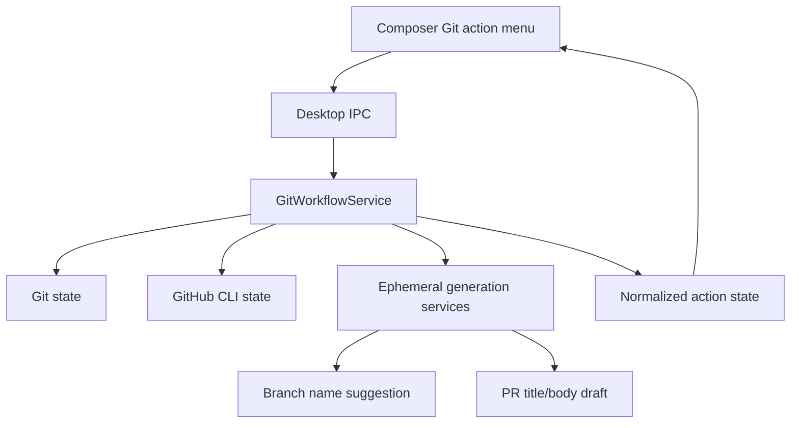
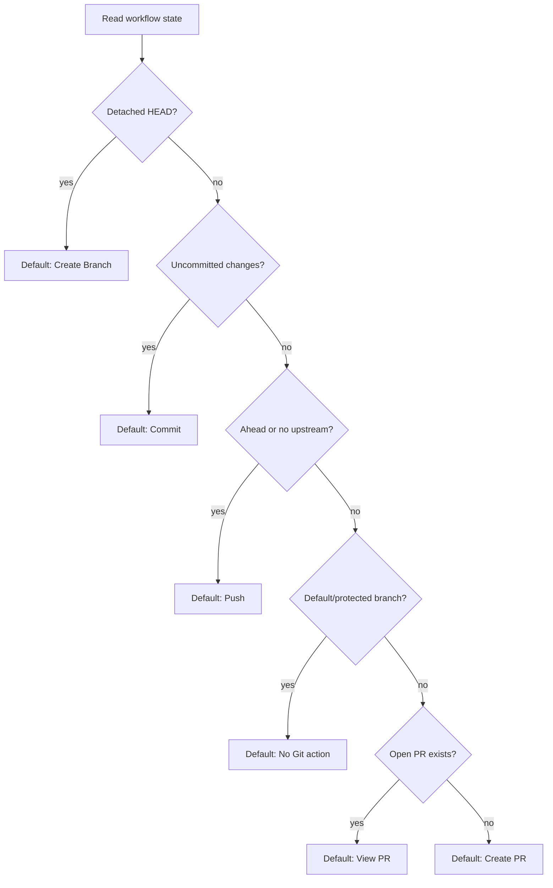
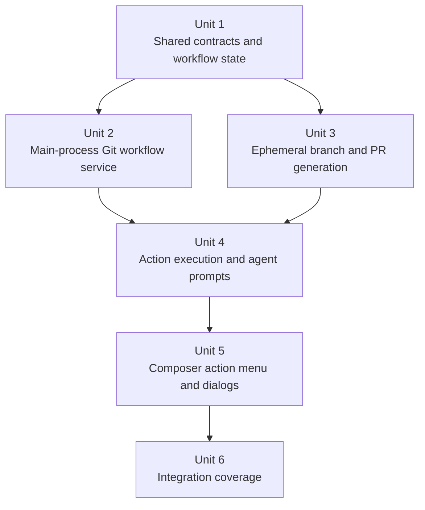

# feat: Add guided git workflow actions

## Overview

Add a compact Git workflow action menu beside the composer controls. The menu should infer the most likely next Git action for the current thread or launchpad workspace, then let the user run or switch to adjacent actions such as `Create Branch`, `Commit`, `Push`, `Create PR`, and `View PR`.

This plan also adds two desktop-owned ephemeral model calls: one for branch-name suggestions, and one for PR title/body drafting. These should follow the existing thread-title-generation pattern: use the user's prompt and workspace context only as naming or drafting input, never as instructions to execute the user's task.

## Problem Frame

Detached worktrees are useful for starting work, but they currently leave the user without a direct "what should I do next?" workflow once a thread has enough Git state. PwrAgnt already shows branch and workspace context, has an out-of-band thread title generation flow, and has a workspace handoff menu in the composer control row. The next step is to turn that area into a lightweight Git workflow launcher.

The feature should remain thread-first. It should not turn the composer footer into a full Git client. It should expose the next likely operation, keep dangerous actions reviewable, preserve user control over generated branch names and PR copy, and route GitHub CLI setup through a normal Workspace thread when the local environment is not ready.

## Requirements Trace

- R1. Suggest a Git branch name through an ephemeral model call similar to thread title generation.
- R2. The branch-name prompt must explicitly say not to perform the user's prompt and to use it only as context for naming the branch.
- R3. Show a compact dropdown/list-menu in the composer control row near workspace/model/handoff controls.
- R4. Infer the default action from current Git state: `Create Branch` on detached HEAD, `Commit` with uncommitted changes, `Push` with unpushed commits, `Create PR` when pushed and no PR exists, and `View PR` when a PR exists.
- R5. Keep the menu switchable so the inferred action is a default, not a hidden automation decision.
- R6. Detect GitHub CLI availability and authentication before PR actions depend on it.
- R7. If GitHub CLI is missing or lacks required auth, show a setup path that can start a Workspace thread with a prompt to install/configure `gh` and obtain the right OAuth scopes.
- R8. The GitHub CLI setup popup must let the user choose Default Access or Full Access for the setup Workspace thread.
- R9. For `Create PR`, generate a PR title and description through an ephemeral model call using repository context and any repo PR template.
- R10. Present generated PR title/body to the user for review and editing before creating the PR.
- R11. Persist the reviewed PR body to a file, preferring `.local/PR.md` when `.local` is ignored, and pass that file to GitHub CLI PR creation to avoid command-line quoting issues.
- R12. Keep direct Git mutations explicit and recoverable; do not silently commit, push, branch, or create PRs because the menu inferred an action.
- R13. Refresh navigation/thread Git state after successful workflow actions so branch, upstream, and PR state are visible without a manual app restart.
- R14. Do not infer `Create PR` from the repository default/protected branch when it is clean and up to date; treat that state as no action or a blocked/manual PR action unless an existing PR is detected.

## Scope Boundaries

- In scope: desktop main-process Git state inspection, GitHub CLI readiness checks, branch creation, push, PR draft/create/view flow, renderer menu/dialogs, and ephemeral model prompts.
- In scope: route `Commit` and GitHub CLI setup through Workspace agent prompts in the first implementation, because those workflows depend on user policy, signing, installed tools, and credentials.
- In scope: Codex-backed ephemeral helper turns for branch and PR drafting, with Grok/xAI support through the existing ephemeral object-call pattern where available.
- Out of scope: implementing a full Git staging UI, file picker, conflict resolver, commit editor, or PR review dashboard.
- Out of scope: direct desktop-owned commit creation in the first slice.
- Out of scope: managing ignored files, generated artifacts outside the PR body draft, or non-Git directories.
- Out of scope: replacing the existing workspace handoff menu; the new action menu should sit alongside it and reuse visual primitives.

## Context & Research

### Relevant Code and Patterns

- `apps/desktop/src/main/app-server/thread-title-prompt.md`, `thread-title-prompt.ts`, and `thread-title-generation-service.ts` define the existing prompt-file plus structured-output service pattern to mirror for branch names and PR drafts.
- `apps/desktop/src/main/codex-app-server/client.ts` already starts ephemeral Codex helper threads for title generation, suppresses helper notifications, and accepts output schemas.
- `apps/desktop/src/main/app-server/ephemeral-object-call.ts` wraps xAI structured object calls for Grok-compatible desktop-owned generation.
- `apps/desktop/src/main/app-server/git-directory-service.ts` reads current branch, branches, upstream, ahead/behind state, default branch, and handoff branch options.
- `apps/desktop/src/main/app-server/git-workspace-handoff-service.ts` and `worktree-archive-service.ts` show the existing boundary for main-process Git transactions that should not be sequenced from the renderer.
- `packages/shared/src/contracts/navigation.ts`, `packages/shared/src/contracts/agent.ts`, and `packages/shared/src/contracts/normalized-app-server.ts` hold renderer/main-process contracts for launchpads, thread workspaces, and app-server actions.
- `apps/desktop/src/shared/ipc.ts`, `apps/desktop/src/preload/index.ts`, and `apps/desktop/src/renderer/src/lib/desktop-api.ts` are the established route for new desktop IPC capabilities.
- `apps/desktop/src/renderer/src/features/composer/Composer.tsx` already has the compact `ComposerDropdown`, custom workspace menu, launchpad branch selector, model selector, and handoff dialog in the exact screen area targeted by this feature.
- `apps/desktop/src/renderer/src/features/composer/__tests__/composer.test.tsx` has tests for workspace menu behavior, launchpad branch menus, model controls, and handoff flows.
- `docs/UI-THEME.md` and `docs/design/desktop-style-guide.md` require dense, calm, non-native desktop controls and discourage turning the shell into a generic dashboard.
- `.github/workflows/ci.yml` is the only current GitHub workflow file; no PR template was found in this checkout, so template discovery must handle "no template" cleanly.

### Institutional Learnings

- No `docs/solutions/` directory exists in this repo yet.
- `docs/brainstorms/2026-04-16-thread-centric-agent-desktop-requirements.md` requires users to see linked directories, branches, and pull requests when opening a thread.
- `docs/brainstorms/2026-04-18-directories-launchpad-requirements.md` keeps branch/workspace setup controls with the composer, not in the directory row.
- `docs/plans/2026-04-28-001-feat-desktop-out-of-band-thread-naming-plan.md` established the desktop-owned ephemeral generation pattern and freshness/soft-failure posture.
- `docs/plans/2026-04-29-001-feat-thread-workspace-handoff-plan.md` established the custom workspace menu pattern and main-process Git transaction boundary.

### External References

- None. Local repo patterns are sufficient for this plan.

## Key Technical Decisions

- Keep Git state inspection in the main process. The renderer should receive a normalized workflow-state summary and action list, not run Git or `gh` itself.
- Add a focused `GitWorkflowService` rather than expanding `GitDirectoryService` indefinitely. `GitDirectoryService` can continue to provide directory status, while the workflow service handles action inference, GitHub CLI readiness, PR lookup, PR body file placement, and action execution.
- Use explicit action contracts. Each action should return structured success, blocked, or failed results so the UI can refresh state and show recoverable errors without parsing stderr.
- Treat inferred action as UI prioritization only. The user still opens the menu or confirms the dialog before creating a branch, pushing, creating a PR, or launching a setup/commit Workspace thread.
- Reuse the thread-title generation adapter shape for branch and PR generation. Keep prompt files, prompt version constants, schemas, adapter injection, timeout handling, validation, and soft failure behavior visible in tests.
- Branch names should be generated as safe Git ref names with a conventional prefix when the prompt supports one, for example `feat/`, `fix/`, `docs/`, `test/`, `refactor/`, or `chore/`. The validator should reject unsafe output instead of trying to repair dangerous ref names.
- `Commit` should launch a Workspace thread in the first implementation instead of direct desktop commit creation. This respects user signing preferences, lets the agent inspect/stage intentionally, and avoids building a half-Git-client in the composer footer.
- `Push` can be a direct explicit action because the branch and upstream state are knowable, but it should present confirmation when no upstream exists or when the push would publish a new branch.
- `Create PR` should use a generated, user-editable draft and a body file. The app should prefer `.local/PR.md` only when `.local` is ignored; otherwise it should use another ignored/safe temp location and tell the user where the draft went in the dialog.
- Default/protected branch guard: a clean, up-to-date default branch should not default to `Create PR`. The workflow service should mark PR creation unavailable for default/protected branches unless implementation discovers a reliable reason to allow it, while still allowing `View PR` if GitHub CLI reports an existing PR.
- GitHub CLI setup should be an agent workflow, not an embedded installer. The app should start a Workspace thread with the selected access mode and a clear prompt to install/configure `gh`, run auth setup, and obtain the scopes needed for repository PR operations.

## Open Questions

### Resolved During Planning

- Should branch-name generation execute the user's task? No. The prompt must explicitly forbid doing the user's request and use the request only to name the branch.
- Should `Commit` directly create a commit from the desktop app? No for the first implementation. It should launch a Workspace thread prompt because staging, message quality, and signing are policy-sensitive.
- Should `Create PR` create the PR immediately after generation? No. The user must review/edit title and body first.
- Should PR template absence block PR creation? No. The generator should use available commit/diff context and omit template-specific sections when no template exists.
- Should the menu replace workspace handoff? No. It sits in the same composer control area but remains a separate workflow menu.

### Deferred to Implementation

- Exact GitHub CLI scope guidance should be verified against the local `gh` version and repository visibility during implementation.
- Exact file path fallback when `.local` is not ignored depends on existing ignore rules in the target repo.
- Exact amount of diff/commit context sent to the PR generator depends on size limits and available summaries; implementation should prefer concise summaries over dumping huge diffs into an ephemeral prompt.
- Exact action refresh cadence should be tuned during implementation so Git state updates after actions without making every composer render run Git.

## High-Level Technical Design

> *This illustrates the intended approach and is directional guidance for review, not implementation specification. The implementing agent should treat it as context, not code to reproduce.*

## Implementation Units

- [ ] **Unit 1: Add shared Git workflow contracts and IPC surface**

**Goal:** Define the normalized state, action list, request, and response contracts needed by the renderer and main process.

**Requirements:** R3, R4, R5, R6, R7, R8, R12, R13

**Dependencies:** None

**Files:**
- Modify: `packages/shared/src/contracts/navigation.ts`
- Modify: `packages/shared/src/contracts/agent.ts`
- Modify: `apps/desktop/src/shared/ipc.ts`
- Modify: `apps/desktop/src/preload/index.ts`
- Modify: `apps/desktop/src/renderer/src/lib/desktop-api.ts`
- Test: `apps/desktop/src/main/__tests__/app-server-ipc.test.ts`
- Test: `apps/desktop/src/main/__tests__/agent-ipc.test.ts`

**Approach:**
- Add a `GitWorkflowAction` style union for `createBranch`, `commit`, `push`, `createPr`, `viewPr`, and `configureGh`.
- Add a workflow state response with repository path, working path, branch/detached state, dirty state, upstream/ahead/behind state, pushed state, PR metadata, GitHub CLI readiness, inferred default action, and action availability reasons.
- Keep blocked reasons structured, for example missing Git repo, detached but branch generation unavailable, `gh` unavailable, auth missing, no remote, no pushed branch, PR already exists, or action disabled during an active turn.
- Add IPC channels for reading workflow state, executing one explicit action, generating branch suggestion, generating PR draft, and creating PR from a reviewed draft.
- Keep contracts independent from renderer labels so future messaging surfaces can use the same state.

**Patterns to follow:**
- `packages/shared/src/contracts/navigation.ts`
- `packages/shared/src/contracts/agent.ts`
- `apps/desktop/src/shared/ipc.ts`
- `apps/desktop/src/preload/index.ts`
- `apps/desktop/src/renderer/src/lib/desktop-api.ts`

**Test scenarios:**
- Happy path: IPC forwards a workflow-state request with backend, thread id, repository path, and working path to the registry/service and returns the normalized response.
- Happy path: IPC forwards action execution requests without dropping action-specific fields.
- Edge case: missing optional desktop API functions keeps the renderer type-compatible with existing tests.
- Error path: service errors propagate as rejected IPC calls with actionable messages rather than malformed responses.

**Verification:**
- Renderer code can request Git workflow state and invoke actions through typed desktop APIs without importing main-process modules.

- [ ] **Unit 2: Implement main-process Git workflow state and GitHub CLI readiness**

**Goal:** Add a main-process service that classifies the current workspace and infers the default action.

**Requirements:** R4, R5, R6, R7, R12, R13, R14

**Dependencies:** Unit 1

**Files:**
- Create: `apps/desktop/src/main/app-server/git-workflow-service.ts`
- Modify: `apps/desktop/src/main/app-server/backend-registry.ts`
- Modify: `apps/desktop/src/main/app-server/git-directory-service.ts`
- Test: `apps/desktop/src/main/__tests__/git-workflow-service.test.ts`
- Test: `apps/desktop/src/main/__tests__/backend-registry.test.ts`

**Approach:**
- Resolve repository root, current working path, detached state, branch name, upstream, ahead/behind count, dirty state, remote URL, default branch, and protected/default-branch status using existing Git helper style.
- Detect whether the branch has an open PR by invoking GitHub CLI when available and authenticated; return `ghUnavailable` or `ghUnauthenticated` instead of treating the absence as "no PR".
- Infer the default action in this precedence: detached HEAD, dirty working tree, unpushed commits or missing upstream, open PR, non-default pushed branch without PR, otherwise no Git action.
- Cache workflow state briefly, similar to directory status caching, but invalidate after action execution and relevant navigation refreshes.
- Keep GitHub CLI checks bounded and non-blocking enough for composer UI; slow or failed checks should return a degraded state with a blocked PR action.

**Patterns to follow:**
- `apps/desktop/src/main/app-server/git-directory-service.ts`
- `apps/desktop/src/main/app-server/git-workspace-handoff-service.ts`
- `apps/desktop/src/main/app-server/backend-registry.ts`
- `apps/desktop/src/main/__tests__/git-directory-service.test.ts`

**Test scenarios:**
- Happy path: detached HEAD with no branch name reports `Create Branch` as the default action.
- Happy path: normal branch with dirty tracked or non-ignored untracked files reports `Commit`.
- Happy path: clean branch ahead of upstream reports `Push`.
- Happy path: clean pushed branch with an open PR reports `View PR` and includes PR number/title/url.
- Happy path: clean pushed branch with no open PR reports `Create PR`.
- Edge case: clean up-to-date default branch with no open PR does not infer `Create PR` and reports PR creation as unavailable or manual-only.
- Edge case: no Git repository returns a state where all Git actions are unavailable.
- Edge case: `gh` missing or unauthenticated leaves non-PR Git actions available and marks PR actions as blocked by GitHub CLI readiness.
- Error path: malformed Git or `gh` output returns structured unavailable reasons without crashing the registry.

**Verification:**
- The service can explain why each action is available or blocked, and the inferred default matches the requested precedence.

- [ ] **Unit 3: Add ephemeral branch-name and PR-draft generation services**

**Goal:** Generate safe branch names and editable PR drafts through prompt-file driven structured model calls.

**Requirements:** R1, R2, R9, R10, R11

**Dependencies:** Unit 1

**Files:**
- Create: `apps/desktop/src/main/app-server/git-branch-name-prompt.md`
- Create: `apps/desktop/src/main/app-server/git-pr-draft-prompt.md`
- Create: `apps/desktop/src/main/app-server/git-workflow-generation-service.ts`
- Modify: `apps/desktop/src/main/codex-app-server/client.ts`
- Modify: `apps/desktop/src/main/app-server/backend-registry.ts`
- Test: `apps/desktop/src/main/__tests__/git-workflow-generation-service.test.ts`
- Test: `apps/desktop/src/main/__tests__/codex-client.test.ts`

**Approach:**
- Mirror the thread-title prompt pattern: prompt markdown files, prompt builders, prompt version constants, JSON schemas, adapter interfaces, injected generator support for tests, timeout handling, and typed invalid/unavailable/failed results.
- Branch prompt requirements should include: do not execute the user's task, use the prompt only to name a branch, prefer concise kebab-case, use safe Git ref characters, infer a conventional prefix when obvious, preserve ticket identifiers, avoid `main`/`master`/remote names, and return only JSON.
- Branch validation should reject empty output, unsafe refs, overlong names, missing required ticket references, duplicate existing branch names, and reserved names.
- PR prompt requirements should include: use the supplied PR template when present, write a conventional PR title, summarize what changed from commit/diff context, include verification only when evidence is supplied, do not claim tests were run unless present in context, and return only JSON with title/body.
- PR generation context should include branch name, base branch, commit summaries, concise diff stats or focused summaries, existing template content, and any user prompt/thread title context available.
- Keep prompt input bounded. Large diffs should be summarized or truncated with clear context rather than passed wholesale.

**Patterns to follow:**
- `apps/desktop/src/main/app-server/thread-title-prompt.md`
- `apps/desktop/src/main/app-server/thread-title-generation-service.ts`
- `apps/desktop/src/main/codex-app-server/client.ts`
- `apps/desktop/src/main/__tests__/thread-title-generation-service.test.ts`

**Test scenarios:**
- Happy path: a branch suggestion such as `feat/guided-git-actions` is accepted for a feature prompt.
- Happy path: a prompt containing `PROJECT-123` produces a branch suggestion preserving that identifier.
- Edge case: branch suggestions containing spaces, shell metacharacters, leading dots, lock-file suffixes, or reserved names are rejected.
- Edge case: duplicate branch suggestion returns an invalid result so the UI can ask for regeneration or manual edit.
- Happy path: a PR draft generated with a template preserves required template headings and fills only evidence-backed sections.
- Edge case: no PR template still produces a valid title/body draft.
- Error path: malformed generated JSON or missing title/body returns `invalid` and does not create a PR body file.
- Integration: Codex helper generation can be reused for branch and PR objects without leaking helper notifications to normal renderer subscribers.

**Verification:**
- Generated branch names and PR drafts are schema-validated, bounded, and safe to present for user review.

- [ ] **Unit 4: Wire explicit action execution and Workspace prompt launches**

**Goal:** Execute safe explicit actions and launch agent-assisted workflows where direct desktop automation would be too opinionated.

**Requirements:** R6, R7, R8, R10, R11, R12, R13, R14

**Dependencies:** Units 1, 2, and 3

**Files:**
- Modify: `apps/desktop/src/main/app-server/git-workflow-service.ts`
- Modify: `apps/desktop/src/main/app-server/backend-registry.ts`
- Modify: `apps/desktop/src/main/ipc/agent-ipc.ts`
- Modify: `apps/desktop/src/main/ipc/app-server.ts`
- Test: `apps/desktop/src/main/__tests__/git-workflow-service.test.ts`
- Test: `apps/desktop/src/main/__tests__/backend-registry.test.ts`
- Test: `apps/desktop/src/main/__tests__/agent-ipc.test.ts`
- Test: `apps/desktop/src/main/__tests__/app-server-ipc.test.ts`

**Approach:**
- `Create Branch`: use the generated or user-edited safe branch name, create/switch the current worktree to that branch from detached HEAD, and update thread branch metadata or overlays through existing registry helpers.
- `Commit`: start a Workspace thread in the current repository/worktree with a prompt to inspect, stage intentionally, create a signed checkpoint commit, and report the result. Do not auto-commit from the desktop action.
- `Push`: run an explicit push action after confirmation, setting upstream when needed and returning the remote branch state.
- `Configure gh`: start a Workspace thread with the selected Default/Full Access mode and a prompt to install/configure GitHub CLI, authenticate, and verify PR-capable scopes for the repo.
- `Create PR`: after the reviewed draft is accepted, write the body file to the chosen ignored path, invoke GitHub CLI PR creation with the reviewed title and body file, then return the PR metadata.
- `View PR`: open the PR URL through the Electron-safe external-open path when available, or return the URL for the renderer to display/copy.
- Invalidate workflow and navigation caches after successful branch, push, or PR actions.

**Patterns to follow:**
- `apps/desktop/src/main/app-server/backend-registry.ts`
- `apps/desktop/src/main/app-server/git-workspace-handoff-service.ts`
- `apps/desktop/src/main/ipc/agent-ipc.ts`
- `apps/desktop/src/main/ipc/app-server.ts`

**Test scenarios:**
- Happy path: create branch from detached HEAD switches to the reviewed branch name and updates branch metadata.
- Happy path: commit action launches a Workspace thread with the selected access mode and current workspace cwd.
- Happy path: push action sets upstream when no upstream exists and returns updated ahead/upstream state.
- Happy path: configure-gh action launches a setup Workspace thread with Default Access or Full Access based on the popup choice.
- Happy path: create PR writes a body file to `.local/PR.md` when `.local` is ignored and returns PR metadata from GitHub CLI output.
- Edge case: `.local` not ignored chooses a safe fallback path and reports that path.
- Error path: GitHub CLI unavailable blocks create/view PR and offers configure-gh instead of failing late.
- Error path: branch changed between draft generation and create PR aborts with a stale-state message.
- Error path: create PR from a default/protected branch is blocked before draft generation unless the workflow state explicitly allows it.

**Verification:**
- Every direct mutation requires a user-triggered action and returns enough state for the UI to refresh or show a recovery path.

- [ ] **Unit 5: Add the composer Git action menu and review dialogs**

**Goal:** Render the inferred action menu in the circled composer control area and provide review/confirmation UI for branch, PR, push, and setup flows.

**Requirements:** R3, R4, R5, R7, R8, R10, R12, R13

**Dependencies:** Units 1 through 4

**Files:**
- Modify: `apps/desktop/src/renderer/src/features/composer/Composer.tsx`
- Modify: `apps/desktop/src/renderer/src/features/thread-detail/ThreadView.tsx`
- Modify: `apps/desktop/src/renderer/src/lib/useThreadNavigation.ts`
- Modify: `apps/desktop/src/renderer/src/styles/app.css`
- Test: `apps/desktop/src/renderer/src/features/composer/__tests__/composer.test.tsx`
- Test: `apps/desktop/src/renderer/src/lib/__tests__/useThreadNavigation.test.tsx`
- Test: `apps/desktop/src/renderer/src/features/thread-detail/__tests__/thread-view.test.tsx`

**Approach:**
- Reuse `ComposerDropdown` and the custom workspace menu styling rather than native selects.
- Place the menu after workspace controls and before provider/model controls when a Git workspace is known. Hide or disable it with a concise reason when no Git state exists.
- Show the inferred action as the compact button label and list adjacent actions in the menu with disabled reasons where useful.
- For `Create Branch`, open a small review dialog with generated branch name, editable input, regenerate/manual edit affordance, and clear confirmation.
- For `Push`, show the branch/upstream target and require confirmation, especially when publishing a branch for the first time.
- For `Create PR`, open a review dialog with editable title and body, template-aware sections, PR body file path, create button, and errors from GitHub CLI readiness or stale state.
- For GitHub CLI setup, open a popup with Default Access and Full Access choices, then start the setup Workspace thread through the existing start-thread path.
- Keep layout stable under long branch names, disabled states, and async loading. Use mono styling for branch/path machine state and tangerine only for active/focus signal.

**Patterns to follow:**
- `apps/desktop/src/renderer/src/features/composer/Composer.tsx`
- `apps/desktop/src/renderer/src/features/composer/__tests__/composer.test.tsx`
- `docs/UI-THEME.md`
- `docs/design/desktop-style-guide.md`

**Test scenarios:**
- Happy path: detached HEAD renders `Create Branch` as the default menu label and opens branch review.
- Happy path: dirty workspace renders `Commit` as the default and launches the Workspace thread path after access-mode choice when needed.
- Happy path: clean ahead branch renders `Push` and shows a confirmation dialog.
- Happy path: pushed branch without PR renders `Create PR`, generates a draft, allows editing, and submits reviewed content.
- Happy path: branch with PR renders `View PR` and exposes the PR URL/open action.
- Edge case: GitHub CLI unavailable renders PR actions as blocked and offers the configure setup popup.
- Edge case: long branch names truncate without resizing composer controls or overlapping model/access selectors.
- Error path: active turn or pending user input disables workflow actions with a stable disabled state.

**Verification:**
- The composer footer remains compact, stable, and consistent with the existing workspace/model dropdowns while exposing the next Git action.

- [ ] **Unit 6: Add focused integration and regression coverage**

**Goal:** Prove the end-to-end state/action flow across main-process services, IPC, renderer UI, and replay-friendly desktop behavior.

**Requirements:** R3, R4, R6, R7, R9, R10, R11, R13

**Dependencies:** Units 1 through 5

**Files:**
- Create: `apps/desktop/e2e/git-workflow-actions.spec.ts`
- Modify: `apps/desktop/e2e/directory-launchpad-workspace.spec.ts`
- Modify: `apps/desktop/e2e/thread-branch-drift.spec.ts`
- Test: `apps/desktop/e2e/git-workflow-actions.spec.ts`
- Test: `apps/desktop/src/main/__tests__/git-workflow-service.test.ts`
- Test: `apps/desktop/src/renderer/src/features/composer/__tests__/composer.test.tsx`

**Approach:**
- Add unit coverage for action inference with fixture repos because this is where most logic bugs will live.
- Add renderer tests for each default-action state using mocked workflow state, not real Git.
- Add IPC tests to prove request/response plumbing.
- Add one focused E2E path around detached worktree to create-branch UI, and one PR-readiness path with GitHub CLI unavailable so the setup popup is covered without needing live GitHub credentials.
- Keep live `gh` PR creation out of required E2E unless a deterministic fixture/mocked IPC layer is added.

**Patterns to follow:**
- `apps/desktop/e2e/thread-branch-drift.spec.ts`
- `apps/desktop/e2e/directory-launchpad-workspace.spec.ts`
- `apps/desktop/src/main/__tests__/git-directory-service.test.ts`
- `apps/desktop/src/renderer/src/features/composer/__tests__/composer.test.tsx`

**Test scenarios:**
- Integration: detached launchpad worktree shows `Create Branch`, accepts a generated branch name, and refreshes the branch label after success.
- Integration: dirty workspace shows `Commit` and starts the expected Workspace thread prompt instead of direct commit mutation.
- Integration: ahead branch shows `Push`, completes through mocked service success, and refreshes action state.
- Integration: no GitHub CLI shows `Create PR` blocked and offers Default/Full Access setup choices.
- Integration: PR draft review preserves edited title/body before invoking create.
- Regression: existing workspace handoff menu still opens and submits unchanged after the Git action menu is added.

**Verification:**
- Unit, renderer, IPC, and focused E2E coverage prove the feature without requiring live GitHub credentials in the default test path.

## System-Wide Impact

- **Interaction graph:** Composer UI reads workflow state through `useThreadNavigation`, which calls desktop IPC, which routes to `DesktopBackendRegistry` and `GitWorkflowService`; action execution may update Git, overlay branch metadata, navigation cache, and thread state.
- **Error propagation:** Git and GitHub CLI failures should become structured blocked/failed action results with user-visible recovery paths. Raw command output should stay in logs or concise detail fields, not become generic UI copy.
- **State lifecycle risks:** Workflow state can become stale while an agent turn changes files or branches. Actions should re-read critical Git state immediately before mutation and abort on branch/dirtiness changes that invalidate the reviewed action.
- **API surface parity:** Shared contracts should be renderer/main-process friendly and not tied to the current composer only. Messaging surfaces can later reuse the same normalized action state.
- **Integration coverage:** Unit tests alone will not prove composer geometry or menu coexistence with workspace/model controls, so renderer and E2E coverage are required.
- **Unchanged invariants:** Existing thread-title generation, workspace handoff, launchpad worktree creation, branch drift detection, and model/access selectors should continue to behave independently of the new action menu.

## Risks & Dependencies

| Risk | Mitigation |
|------|------------|
| Git state changes while the user reviews a branch or PR draft | Re-read branch, dirty state, and upstream/PR state before mutation; abort stale actions with a clear message. |
| GitHub CLI auth differs by repo visibility or host | Detect readiness through `gh` and route setup through a Workspace thread when missing; keep exact scope details implementation-verified. |
| Generated branch names are unsafe or duplicate existing branches | Validate Git ref safety, reserved names, ticket preservation, and duplicates before presenting confirmation. |
| Generated PR body claims unverified tests or misses template sections | Feed verification evidence explicitly and instruct the prompt not to invent; validate required template headings when a template exists. |
| Composer footer becomes cluttered | Reuse existing compact dropdown/menu primitives, hide unavailable Git actions when no Git workspace exists, and test long-label layout. |
| Direct push or PR creation surprises users | Require explicit user-triggered action and confirmation/review dialogs for publishing operations. |

## Documentation / Operational Notes

- Update desktop docs only if the UI labels or GitHub CLI setup flow need operator-facing explanation.
- The PR body draft file should be documented in the dialog so the user can inspect it if GitHub CLI creation fails.
- Logs should include workflow action names and blocked reasons but avoid dumping full PR bodies, templates, or secrets.

## Sources & References

- Origin: user directive in this thread.
- Related requirements: `docs/brainstorms/2026-04-16-thread-centric-agent-desktop-requirements.md`
- Related requirements: `docs/brainstorms/2026-04-18-directories-launchpad-requirements.md`
- Related plan: `docs/plans/2026-04-28-001-feat-desktop-out-of-band-thread-naming-plan.md`
- Related plan: `docs/plans/2026-04-29-001-feat-thread-workspace-handoff-plan.md`
- Related code: `apps/desktop/src/main/app-server/thread-title-generation-service.ts`
- Related code: `apps/desktop/src/main/codex-app-server/client.ts`
- Related code: `apps/desktop/src/main/app-server/git-directory-service.ts`
- Related code: `apps/desktop/src/renderer/src/features/composer/Composer.tsx`
