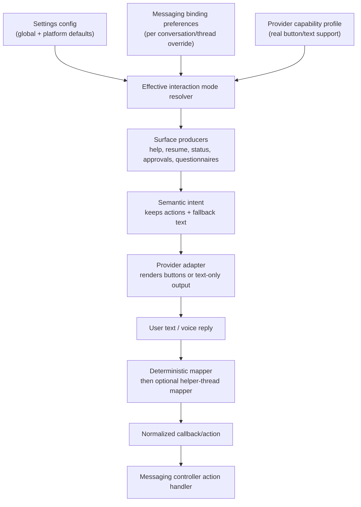
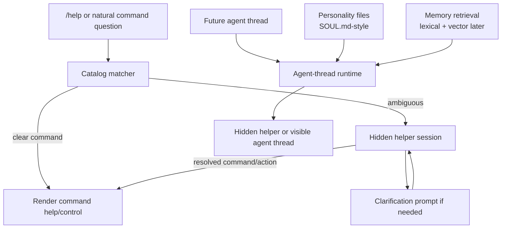
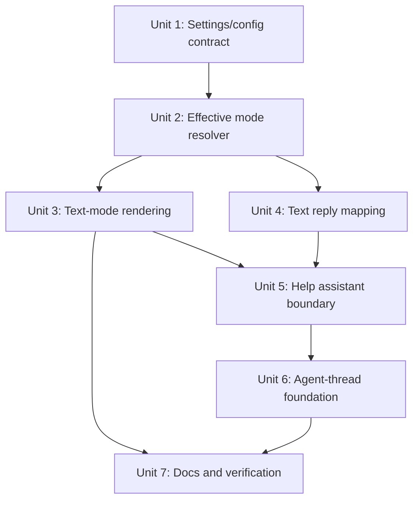

# feat(messaging): text mode controls and agent-thread foundation

## Overview

Add a user-controlled text interaction mode for messaging platforms and thread bindings that can render buttons but should sometimes behave as text-first surfaces. The immediate use case is voice-driven operation while driving: CarPlay/Siri can dictate “approve” or “option two”, but it cannot reliably press Telegram, Discord, Mattermost, Slack, or LINE buttons for the user.

This plan also lays the foundation for model-backed helper threads and future agent threads. The text-mode mapper, command help assistant, thread naming service, and eventual personality/memory-backed agent conversations should share one non-Codex-coding-agent helper runtime boundary rather than each inventing its own ephemeral model call.

## Implementation Update

The first implementation pass shipped the settings contract, effective text-mode rendering, and deterministic fallback mapping. That was necessary but incomplete relative to the original product intent: it made text mode operable by typed command tokens, but it did not yet provide the “say what you mean” model-backed mapping that a voice user expects.

The immediate correction is to add a structured, ephemeral model-backed mapper behind `ModelInteractionMapper`. The mapper should run only after deterministic matching cannot confidently resolve the reply, use a repo-owned system prompt plus the visible choices/pending intent as context, and return one of three safe outcomes: a known action id, pass-through text, or a short clarification. The default helper path should match thread naming: Codex ephemeral `gpt-5.4-mini` helper threads when available, with provider-specific object-call clients only as fallback/options. The controller should keep the original pending intent active across clarification so the next reply still maps against the same offered choices.

This correction intentionally stops short of the full hidden multi-turn helper-session and future visible agent-thread architecture. The full helper session/agent-thread boundary in Units 5 and 6 remains the durable follow-up for persisted clarification state, SOUL.md-style personality files, memory, and agent conversations that are not registered as normal Codex project threads.

## Problem Frame

PwrAgent already has a channel-neutral messaging surface contract with actions, `fallbackText`, capability profiles, managed surfaces, callback handles, deterministic text mapping, and Settings-backed messaging configuration. That is the right base for voice-friendly controls, but button-capable providers currently still render buttons by default whenever actions fit the provider profile.

For a driver using CarPlay, the platform’s button support is the wrong signal. The user needs command surfaces, approval prompts, questionnaires, status controls, and help to be operable by spoken replies without the assistant asking them to touch the screen. Some help responses may also need a small model-backed clarification flow so “what was that thing for changing access mode?” can map to `/status`, the Permissions control, or future settings without polluting the visible Codex project thread list.

## Requirements Trace

- R1. Users can choose text interaction mode globally for messaging and per platform.
- R2. Users can override text/button behavior per bound conversation or thread where buttons are supported.
- R3. Text mode does not lie about provider capability. Providers still declare real button support; the controller applies an effective user preference when building intents.
- R4. Every affected interactive surface remains completable through deterministic text replies: help, resume/project pickers, status controls, approvals, questionnaires, confirmations, queued-turn controls, and handoff/branch pickers.
- R5. Button-capable providers render no action rows in text mode, but message bodies expose the choices in voice-friendly text.
- R6. Existing text-only providers remain supported by capability profiles without needing a separate preference.
- R7. The Settings UI exposes the platform defaults using existing Messaging settings patterns and preserves env override semantics.
- R8. Help should remain cheap and deterministic by default, while allowing a model-backed clarification flow for ambiguous command questions.
- R9. Model-backed helper work must not create normal visible project threads unless explicitly promoted by future UX.
- R10. The helper runtime must be reusable for future agent threads that use personality files, memory, and non-Codex “coding agent” system prompts.
- R11. Authorization, audit identity, pending-intent scope, callback expiry, and binding revocation behavior remain fail-closed.
- R12. Desktop users can reach the relevant Settings surface from app chrome, including a Help-menu entry that deep-links to Messaging settings when the platform menu is the current affordance.

## Scope Boundaries

- In scope: text interaction mode settings, effective-preference resolution, text-mode rendering for existing messaging surfaces, deterministic text reply expansion, command help routing, a hidden helper-thread service boundary, and a documented path toward agent threads.
- In scope: Telegram, Discord, Mattermost, Slack, and LINE defaults where the current settings/provider surfaces already exist.
- Out of scope: a first-party iOS or CarPlay app.
- Out of scope: implementing a full vector memory store or SOUL.md personality editor in this pass.
- Out of scope: changing Codex app-server protocol behavior except where helper-thread parameters are already available and can be reused safely.
- Out of scope: pretending text mode is a security boundary. It is a UX/accessibility mode; authorization and callback validation remain separate.

## Context & Research

### Relevant Code and Patterns

- `docs/brainstorms/2026-04-30-messaging-platform-integration-requirements.md` defines the CarPlay/voice goal, semantic conversation surface, and light-agent mapping requirements.
- `docs/brainstorms/2026-05-04-messaging-capability-discovery-requirements.md` and `docs/plans/2026-05-04-002-feat-messaging-capability-discovery-plan.md` establish capability profiles and text baseline behavior.
- `packages/messaging/interface/src/index.ts` defines `MessagingCapabilityProfile`, `MessagingSurfaceAction.fallbackText`, `applyActionCapabilityLimits`, `capabilityProfilePageSize`, `MessagingBindingPreferences`, pending intents, browse sessions, and callback handles.
- `apps/desktop/src/main/messaging/core/messaging-controller.ts` owns command routing, pending-intent text mapping, help surfaces, resume browsing, status callbacks, approvals, and delivery.
- `apps/desktop/src/main/messaging/core/deterministic-interaction-mapper.ts` already maps labels, numbers, approval synonyms, navigation synonyms, and pass-through instructions against pending intents.
- `apps/desktop/src/main/messaging/core/model-interaction-mapper.ts` is currently a stub and is the natural place to finish the model-backed mapper once a helper runtime exists.
- `apps/desktop/src/main/messaging/core/messaging-command-catalog.ts` is the canonical `/help` command source and already paginates help actions against capability profiles.
- `apps/desktop/src/main/settings/desktop-config.ts`, `apps/desktop/src/main/settings/desktop-settings-service.ts`, `packages/shared/src/contracts/settings.ts`, and `apps/desktop/src/renderer/src/features/settings/MessagingSettings.tsx` are the existing settings/config path for messaging preferences.
- `apps/desktop/src/main/app-server/thread-title-generation-service.ts` and `apps/desktop/src/main/app-server/thread-title-prompt.md` show the current ephemeral object-call pattern for hidden helper work.
- `packages/codex-app-server-protocol/src/v2/ThreadStartParams.ts`, `ThreadForkParams.ts`, and `Thread.ts` already expose `ephemeral`, base/developer instructions, and personality-related parameters that should inform helper-thread design.

### Institutional Learnings

- `docs/solutions/2026-05-07-codex-permission-mode-state-machine.md` is relevant because text-mode controls include permission/status actions. Do not add silent fallbacks around permission-like state; log routing decisions and make effective mode visible enough to debug.

### External References

- External research was skipped. The repo already has direct, current patterns for messaging capability profiles, settings, pending intents, and helper model calls. No provider API or third-party library behavior needs to be decided for the plan.

## Key Technical Decisions

- **Model text mode as an interaction preference, not a provider capability.** Provider profiles continue to report actual button support. The controller resolves an effective `MessagingInteractionMode` from binding preference, platform setting, global default, then provider capability.
- **Use `buttons` / `text` as the durable preference vocabulary.** Avoid names like “voice mode” because the mode is also useful for screen readers, low-bandwidth surfaces, platform clients with poor button accessibility, and users who simply prefer text commands.
- **Store per-conversation overrides in binding preferences.** Existing `MessagingBindingPreferences` already holds binding-scoped controls such as model, reasoning, fast mode, streaming, and tool updates. Text interaction mode belongs there so a chat binding can differ from the platform default.
- **Keep action semantics in intents even when rendering text-only.** Text mode should suppress rendered provider buttons, but pending intents still need their `actions`/`choices`/`decisions` so the mapper can resolve replies against the same semantic control set.
- **Centralize text-mode narration in producers/helpers, not providers.** Providers should not synthesize product-specific numbered lists from arbitrary actions. Producers already know what a picker, approval, status card, or help prompt means and can produce voice-friendly `fallbackText` and bodies.
- **Deterministic mapper first, model mapper second.** Common replies such as numbers, labels, “next”, “back”, “approve”, “approve for session”, “decline”, “cancel”, “model”, “reasoning”, “permissions”, and “full access” should resolve without model latency or ambiguity.
- **Introduce a hidden helper-thread runtime boundary before using model mapping broadly.** Command help clarification and future agent threads need multi-turn prompt state, non-Codex system prompts, and possibly memory. Building that boundary now prevents one-off ephemeral calls from becoming unmaintainable.
- **Do not register helper threads in the visible project thread list.** Hidden helper sessions can be persisted for continuity and audit, but Recents/Directories should only show user project/agent work unless a future UX explicitly promotes a helper session.
- **Treat agent threads as a separate thread class, not just Codex threads with different prompts.** Future agent threads need personality files, memory retrieval, and non-coding-agent prompts. This plan should create shared terminology and storage hooks but defer the full product surface.
- **Expose Settings from the Help menu as a narrow app-menu bridge.** The renderer already owns the Settings overlay. The main menu should request the existing Settings view, ideally with an initial Messaging section, rather than opening a second settings implementation.

## Open Questions

### Resolved During Planning

- **Should text mode be platform-level only?** No. The user explicitly called out platforms and threads. The effective preference should support global, platform, and binding/thread scopes.
- **Should text mode remove actions from intents?** No. Removing actions would break text mapping and audit parity. It should remove provider-rendered action rows while preserving semantic actions.
- **Should the help clarification flow be a normal Codex project thread?** No. It should be a hidden helper session so command lookup does not clutter the visible project thread list.
- **Should full SOUL.md-style personality and vector memory ship in this same implementation?** No. The helper runtime should be designed for it, but full memory/personality UX is a follow-on feature.

### Deferred to Implementation

- Exact TOML key names should follow the existing snake_case settings convention during implementation. Proposed shape is directional: `[messaging] interaction_mode`, `[messaging.<platform>] interaction_mode`.
- Exact text-mode body phrasing for each surface should be validated against current rendered messages and tests while implementing.
- Whether a `/textmode` or status-card command should toggle per-binding preference is deferred until the Settings and mapper path land; the plan includes a binding-preference API so adding the command is small.
- Exact helper-session persistence storage is deferred until the implementer compares sqlite messaging state, overlay state, and app-server protocol constraints.

## High-Level Technical Design

> *This illustrates the intended approach and is directional guidance for review, not implementation specification. The implementing agent should treat it as context, not code to reproduce.*

## Implementation Units

- [ ] **Unit 1: Add text interaction settings**

**Goal:** Persist and expose global/platform text interaction defaults using the existing Settings and TOML machinery.

**Requirements:** R1, R3, R7, R12

**Dependencies:** Existing desktop settings/config service.

**Files:**
- Modify: `packages/shared/src/contracts/settings.ts`
- Modify: `apps/desktop/src/main/settings/desktop-config.ts`
- Modify: `apps/desktop/src/main/settings/desktop-settings-service.ts`
- Modify: `apps/desktop/src/main/settings/desktop-settings-env.ts`
- Modify: `apps/desktop/src/main/index.ts`
- Modify: `apps/desktop/src/preload/index.ts`
- Modify: `apps/desktop/src/renderer/src/App.tsx`
- Modify: `apps/desktop/src/renderer/src/features/settings/MessagingSettings.tsx`
- Modify: `apps/desktop/src/renderer/src/features/settings/settings-patch-delta.ts`
- Test: `packages/shared/src/contracts/__tests__/settings.test.ts`
- Test: `apps/desktop/src/main/__tests__/desktop-settings-service.test.ts`
- Test: `apps/desktop/src/main/__tests__/desktop-settings-patch-translator.test.ts`
- Test: `apps/desktop/src/main/__tests__/agent-ipc.test.ts`
- Test: `apps/desktop/src/renderer/src/__tests__/app-shell.test.tsx`
- Test: `apps/desktop/src/renderer/src/features/settings/__tests__/settings-screen.test.tsx`
- Test: `apps/desktop/src/renderer/src/features/settings/__tests__/settings-patch-delta.test.ts`

**Approach:**
- Add a shared `MessagingInteractionMode` union with `buttons` and `text`.
- Add global `messaging.interactionMode` and per-provider `interactionMode` snapshots with source/override metadata.
- Add env overrides using the existing naming style, for example `PWRAGENT_MESSAGING_INTERACTION_MODE` and `PWRAGENT_MESSAGING_TELEGRAM_INTERACTION_MODE`.
- Extend TOML parse/write paths without rewriting unknown settings or user comments.
- Add a compact segmented control in Settings -> Messaging General for the default and each platform section for platform overrides. Keep labels practical: “Buttons” and “Text”.
- Add a Help-menu `Settings` or `Messaging Settings` item that sends a main-to-renderer request to show the existing Settings overlay, using `Messaging` as the initial section. Do not duplicate settings UI in the main process.
- Keep defaults conservative: button-capable providers default to `buttons`; text-only capability profiles still render text regardless of preference.

**Patterns to follow:**
- `toolUpdateMode`, `streamingResponses`, and attachment settings in `apps/desktop/src/main/settings/desktop-settings-service.ts`
- Existing Settings segmented controls in `apps/desktop/src/renderer/src/features/settings/MessagingSettings.tsx`
- Comment-preserving config edits in `apps/desktop/src/main/settings/desktop-config.ts`

**Test scenarios:**
- Happy path: absent config and env resolves global and platform interaction mode to `buttons`.
- Happy path: TOML global `interaction_mode = "text"` appears in the settings snapshot with source `config`.
- Happy path: platform-specific TOML value overrides the global default for that platform.
- Happy path: env override wins over TOML and marks the field as env-sourced without mutating config.
- Edge case: invalid env value surfaces an error and falls back to a safe default.
- Edge case: saving a provider section writes only the changed interaction mode and does not copy unrelated env-resolved fields into TOML.
- Integration: Settings UI toggling a platform mode sends the minimal patch and refreshes the snapshot.
- Integration: selecting the Help-menu settings item opens the renderer Settings overlay focused on Messaging without disturbing the selected thread.

**Verification:**
- The settings snapshot can express global and provider interaction modes with the same source semantics as existing messaging settings.

- [ ] **Unit 2: Resolve effective interaction mode per delivery**

**Goal:** Teach messaging orchestration to resolve whether a given outbound surface should render buttons or text, without changing provider capability declarations.

**Requirements:** R2, R3, R6, R11

**Dependencies:** Unit 1 settings contract.

**Files:**
- Modify: `packages/messaging/interface/src/index.ts`
- Modify: `apps/desktop/src/main/messaging/core/messaging-adapter.ts`
- Modify: `apps/desktop/src/main/messaging/core/messaging-controller.ts`
- Modify: `apps/desktop/src/main/messaging/messaging-config.ts`
- Modify: `apps/desktop/src/main/messaging/messaging-runtime.ts`
- Modify: `apps/desktop/src/main/messaging/core/messaging-store.ts`
- Modify: `apps/desktop/src/main/messaging/core/messaging-migrations.ts`
- Modify: `apps/desktop/src/main/state/messaging-store-sqlite.ts`
- Test: `packages/messaging/interface/src/__tests__/messaging-interface.test.ts`
- Test: `apps/desktop/src/main/__tests__/messaging-config.test.ts`
- Test: `apps/desktop/src/main/__tests__/messaging-controller.test.ts`
- Test: `apps/desktop/src/main/__tests__/messaging-store.test.ts`
- Test: `apps/desktop/src/main/__tests__/messaging-store-sqlite.test.ts`

**Approach:**
- Add `interactionMode?: MessagingInteractionMode` to `MessagingBindingPreferences`.
- Add a small resolver that accepts provider profile, platform config, optional binding preferences, and optional per-surface override and returns `buttons` or `text`.
- Make the resolver return `text` when `profile.actions` is absent regardless of user preference.
- Pass the effective mode to surface builders so they can suppress provider actions while keeping semantic actions for pending intent mapping.
- Persist binding-level preference updates so future `/status` or settings-driven per-thread controls can flip a bound conversation without losing state on restart.
- Log effective-mode decisions at debug level with platform, binding id, source, and intent kind, but never log message text or secrets.

**Patterns to follow:**
- Binding preference handling in `apps/desktop/src/main/messaging/core/messaging-controller.ts`
- Capability-profile use in `apps/desktop/src/main/messaging/core/messaging-resume-browser.ts`
- Store migration patterns in `apps/desktop/src/main/messaging/core/messaging-migrations.ts` and sqlite store tests

**Test scenarios:**
- Happy path: provider supports actions, no preference set -> effective mode `buttons`.
- Happy path: provider supports actions, platform default text -> effective mode `text`.
- Happy path: binding preference buttons overrides platform default text for that conversation.
- Happy path: binding preference text overrides platform default buttons for that conversation.
- Edge case: provider has no action capability and binding asks for buttons -> effective mode remains `text`.
- Error path: malformed persisted binding preference is ignored or migrated to default without crashing message handling.
- Integration: a binding preference survives store reload and affects the next delivered status surface.

**Verification:**
- Effective mode is deterministic, source-aware, and independent of provider-specific branches.

- [ ] **Unit 3: Render existing interactive surfaces in text mode**

**Goal:** Make current command surfaces voice-friendly when effective mode is `text`, while preserving button behavior when effective mode is `buttons`.

**Requirements:** R4, R5, R6, R11

**Dependencies:** Unit 2 resolver.

**Files:**
- Modify: `apps/desktop/src/main/messaging/core/messaging-renderer.ts`
- Modify: `apps/desktop/src/main/messaging/core/messaging-resume-browser.ts`
- Modify: `apps/desktop/src/main/messaging/core/messaging-status-card.ts`
- Modify: `apps/desktop/src/main/messaging/core/messaging-command-catalog.ts`
- Modify: `apps/desktop/src/main/messaging/core/messaging-approval-renderer.ts`
- Modify: `packages/messaging/interface/src/index.ts`
- Modify: `packages/messaging/providers/telegram/src/telegram-adapter.ts`
- Modify: `packages/messaging/providers/discord/src/discord-adapter.ts`
- Modify: `packages/messaging/providers/mattermost/src/mattermost-adapter.ts`
- Modify: `packages/messaging/providers/slack/src/slack-adapter.ts`
- Modify: `packages/messaging/providers/line/src/line-adapter.ts`
- Test: `apps/desktop/src/main/__tests__/messaging-controller.test.ts`
- Test: `apps/desktop/src/main/__tests__/messaging-resume-browser.test.ts`
- Test: `apps/desktop/src/main/__tests__/messaging-status-card.test.ts`
- Test: `apps/desktop/src/main/__tests__/messaging-command-catalog.test.ts`
- Test: `apps/desktop/src/main/__tests__/messaging-approval-renderer.test.ts`
- Test: `packages/messaging/interface/src/__tests__/messaging-contract.test.ts`
- Test: `packages/messaging/providers/telegram/src/__tests__/telegram-grammy-adapter.test.ts`
- Test: `packages/messaging/providers/discord/src/__tests__/discord-adapter.test.ts`
- Test: `packages/messaging/providers/mattermost/src/__tests__/mattermost-adapter.test.ts`
- Test: `packages/messaging/providers/slack/src/__tests__/slack-adapter.test.ts`
- Test: `packages/messaging/providers/line/src/__tests__/line-adapter.test.ts`

**Approach:**
- Add a shared helper for voice-friendly action lists so producers consistently describe choices as numbered or named replies.
- In text mode, build intents with `actions` preserved for mapper/pending-intent semantics but mark provider-rendered action rows as suppressed through a generic intent/rendering hint.
- Extend provider adapters to honor the generic suppression hint by omitting native action rows/components/quick replies while still delivering the text body and preserving managed-surface update behavior.
- Update help, resume/project pickers, status card controls, approvals, questionnaires, confirmations, queued-turn actions, and handoff/branch picker bodies to include concise text instructions.
- Prefer stable reply tokens already present in `fallbackText`; add missing fallback text where actions currently rely on labels only.
- Ensure text-mode messages do not become sprawling transcripts. Status and help should list only commands or controls relevant to the current surface.
- Preserve managed-surface update/dismiss behavior where possible. Text mode should update the same help/status/resume surface; it should not spam a new message for every navigation action.

**Patterns to follow:**
- `formatMessagingCommandHelpBody` and `buildHelpActions` in `apps/desktop/src/main/messaging/core/messaging-command-catalog.ts`
- Existing resume browser fallback text in `apps/desktop/src/main/messaging/core/messaging-resume-browser.ts`
- Existing approval fallback text in `apps/desktop/src/main/messaging/core/messaging-approval-renderer.ts`

**Test scenarios:**
- Happy path: `/help` in text mode renders command prose and no provider action row, while pending actions remain available to the mapper.
- Happy path: `/resume` in text mode lists visible threads with numeric replies and supports next/back/projects/new/cancel by text.
- Happy path: `/status` in text mode lists available controls and reply tokens for refresh, stop, detach, model, reasoning, fast mode, permissions, compaction, tool updates, and streaming mode.
- Happy path: an approval prompt in text mode clearly lists “approve”, “approve for session”, “decline”, and “cancel” without buttons.
- Edge case: a provider with no buttons produces equivalent text-mode output even when user preference is unset.
- Edge case: a high-action status surface remains short enough for mobile/voice clients and does not exceed provider text limits.
- Error path: an adapter that ignores the suppression hint cannot execute unauthorized callbacks because pending intent authorization still gates actions.
- Integration: text-mode help/resume/status updates target the prior managed surface when a text reply navigates the flow.

**Verification:**
- Button-capable providers can be driven through all existing interactive surfaces using only text replies.

- [ ] **Unit 4: Expand deterministic text reply mapping**

**Goal:** Cover the common spoken/text alternatives that text mode needs before introducing model-backed ambiguity resolution.

**Requirements:** R4, R8, R11

**Dependencies:** Unit 3 text-mode fallback tokens.

**Files:**
- Modify: `apps/desktop/src/main/messaging/core/deterministic-interaction-mapper.ts`
- Modify: `apps/desktop/src/main/messaging/core/interaction-mapper.ts`
- Test: `apps/desktop/src/main/__tests__/messaging-interaction-mapper.test.ts`
- Test: `apps/desktop/src/main/__tests__/messaging-controller.test.ts`

**Approach:**
- Expand normalization for voice punctuation, command prefixes, numeric ordinals (“one”, “option two”, “number 3”), and common synonyms.
- Add status-control synonyms for model, reasoning, permissions, access mode, full access, default access, fast mode, slow mode, compact, stop, refresh, detach, tool updates, and streaming.
- Keep pass-through conservative: three-word instructions still route to the bound agent when they are not likely control choices.
- Return richer ambiguity reasons from the mapper so the controller can decide whether to prompt, fall through to helper mapping, or pass through.
- Keep mapping scoped to the current pending intent; never let a generic phrase mutate a thread without a matching offered action.

**Patterns to follow:**
- Current `actionsForIntent` and approval synonym handling in `apps/desktop/src/main/messaging/core/deterministic-interaction-mapper.ts`
- Pending-intent dispatch in `MessagingController.handleText`

**Test scenarios:**
- Happy path: “option two”, “number 2”, and “two” select the second visible picker action.
- Happy path: “approve for this session” maps to the approval session decision.
- Happy path: “turn on full access” maps only when a matching permissions/status action is present.
- Happy path: “next page” and “go back” map to navigation actions.
- Edge case: “change the model to grok” passes through when no model picker/status action is pending.
- Edge case: empty or one-word unknown replies return ambiguous rather than pass-through.
- Error path: a reply from a different actor cannot resolve another actor’s pending intent.
- Integration: text replies and native button callbacks reach the same controller action path and produce equivalent audit records.

**Verification:**
- The deterministic mapper handles the normal CarPlay/Siri vocabulary without model calls for common flows.

- [ ] **Unit 5: Add hidden helper-thread service for command help and model mapping**

**Goal:** Provide a reusable hidden helper runtime for ambiguous command-help questions and future model-backed interaction mapping.

**Requirements:** R8, R9, R10, R11

**Dependencies:** Units 3 and 4.

**Files:**
- Create: `apps/desktop/src/main/agent-helper/helper-thread-service.ts`
- Create: `apps/desktop/src/main/agent-helper/helper-thread-prompts.ts`
- Modify: `apps/desktop/src/main/messaging/core/model-interaction-mapper.ts`
- Modify: `apps/desktop/src/main/messaging/core/messaging-controller.ts`
- Modify: `apps/desktop/src/main/app-server/thread-title-generation-service.ts`
- Test: `apps/desktop/src/main/__tests__/model-interaction-mapper.test.ts`
- Test: `apps/desktop/src/main/__tests__/messaging-controller.test.ts`
- Test: `apps/desktop/src/main/__tests__/thread-title-generation-service.test.ts`
- Test: `apps/desktop/src/main/__tests__/agent-helper-service.test.ts`

**Approach:**
- Extract a helper-thread/object-call abstraction that can run structured helper prompts with system instructions, user prompt, schema, timeout, audit metadata, and optional hidden session id.
- Preserve the current thread title behavior by adapting it to the shared helper service without changing its prompt contract.
- Implement model-backed command/help classification behind `ModelInteractionMapper`, but only call it after deterministic mapping returns ambiguous and the pending surface allows helper mapping.
- Add a command-help classifier that maps natural questions to the command catalog, status controls, or a clarification prompt. Use the user question as user prompt and a repo-owned system prompt as the instruction source.
- Persist only minimal helper session metadata needed for multi-turn clarification: actor/channel scope, created/updated timestamps, purpose, pending candidates, and expiry. Do not register helper sessions as visible navigation threads.
- Require hidden helper outputs to return structured JSON with action id, pass-through, or clarification text. Never allow free-form model text to directly mutate state.

**Patterns to follow:**
- `apps/desktop/src/main/app-server/thread-title-generation-service.ts`
- `apps/desktop/src/main/app-server/ephemeral-object-call.ts`
- `apps/desktop/src/main/messaging/core/model-interaction-mapper.ts`
- `apps/desktop/src/main/messaging/core/messaging-command-catalog.ts`

**Test scenarios:**
- Happy path: an ambiguous `/help` text such as “how do I change access mode” maps to the status/permissions guidance without creating a visible project thread.
- Happy path: helper returns a clarification prompt when two commands are plausible; the next user reply resolves against the same hidden helper session.
- Happy path: model mapper returns a known pending action id and the controller routes it through the normal callback path.
- Edge case: helper session expires and the controller asks the user to restate the request.
- Edge case: helper returns an unknown action id and the controller treats it as ambiguous, not executable.
- Error path: helper failure or timeout falls back to deterministic help text, not a broken command.
- Integration: thread title generation still works through the shared helper service with the same output validation and timeout semantics.

**Verification:**
- Hidden helper work can support one-turn and short multi-turn classification without polluting Recents/Directories or bypassing authorization.

- [ ] **Unit 6: Establish agent-thread foundation**

**Goal:** Define the internal model for future non-Codex agent threads so text-mode helper sessions, command help, and future personality/memory-backed conversations converge instead of diverging.

**Requirements:** R9, R10

**Dependencies:** Unit 5 helper service.

**Files:**
- Create: `docs/agent-threads.md`
- Create: `apps/desktop/src/main/agent-helper/agent-thread-types.ts`
- Modify: `packages/shared/src/contracts/agent.ts`
- Modify: `packages/shared/src/contracts/navigation.ts`
- Test: `packages/shared/src/contracts/__tests__/agent.test.ts`
- Test: `apps/desktop/src/main/__tests__/agent-helper-service.test.ts`

**Approach:**
- Document and type the distinction between project coding threads, hidden helper sessions, and future visible agent threads.
- Define metadata fields that future agent threads need: thread class, visibility, purpose, personality file references, memory namespace, owner scope, and created/updated timestamps.
- Keep visible navigation unchanged for this pass. The navigation contract should be ready to exclude hidden helper sessions and eventually include visible agent threads when the UI is designed.
- Define personality/memory hooks as references, not implementations. A future pass can load SOUL.md-style files and vector memory behind those references.
- Make clear that agent threads do not receive Codex app-server’s “you are a coding agent” prompts unless their configured agent profile asks for that behavior.

**Patterns to follow:**
- Thread-first direction in `docs/brainstorms/2026-04-16-thread-centric-agent-desktop-requirements.md`
- Navigation contract patterns in `packages/shared/src/contracts/navigation.ts`
- Helper prompt isolation from Unit 5

**Test scenarios:**
- Happy path: hidden helper session metadata serializes with `visibility = hidden` and is excluded from visible navigation fixtures.
- Happy path: a future visible agent-thread metadata object can reference a personality file and memory namespace without requiring those systems to exist yet.
- Edge case: unknown thread class is rejected or treated as hidden/unavailable rather than shown as a project thread.
- Test expectation: no UI behavior changes in this unit beyond contract readiness.

**Verification:**
- The codebase has a clear type/documentation boundary for hidden helper sessions and future agent threads without shipping unfinished memory UX.

- [ ] **Unit 7: Documentation, activity, and regression coverage**

**Goal:** Update operator/developer docs and lock the text-mode behavior across messaging, settings, and helper flows.

**Requirements:** R1-R12

**Dependencies:** Units 1-6.

**Files:**
- Modify: `docs/messaging-architecture.md`
- Modify: `docs/messaging-platform-integration.md`
- Modify: `docs/messaging-adapter-contract.md`
- Modify: `docs/config-file-evolution.md`
- Modify: `docs/agent-threads.md`
- Test: `apps/desktop/src/main/__tests__/messaging-docs-links.test.ts`
- Test: `apps/desktop/src/main/__tests__/messaging-controller.test.ts`
- Test: `apps/desktop/src/main/__tests__/messaging-runtime.test.ts`

**Approach:**
- Document the interaction-mode resolution order and make clear it is a preference overlay on top of provider capability.
- Update manual messaging validation scenarios to test approvals, questionnaires, resume browsing, and status controls with both button and text modes.
- Add docs for env vars, TOML keys, Settings labels, and per-binding override semantics.
- Document the helper-thread boundary and the rule that hidden helper sessions do not appear in Recents/Directories.
- Add activity/audit notes for text-mode control resolution and helper mapping outcomes where useful, avoiding noisy logs for every token or ambiguous phrase.

**Patterns to follow:**
- Existing capability profile and text fallback docs in `docs/messaging-architecture.md`
- Operator validation checklists in `docs/messaging-platform-integration.md`

**Test scenarios:**
- Happy path: docs link checks include the new agent-thread and interaction-mode sections.
- Happy path: regression tests cover at least one full text-mode flow for help, resume, status, approval, and questionnaire.
- Edge case: docs specify fallback behavior for providers with no actions and for providers with actions disabled by preference.
- Integration: messaging runtime reads Settings interaction modes and controllers receive the expected platform config.

**Verification:**
- A contributor can implement or debug text mode from docs without rediscovering the effective-mode order or helper-thread visibility rules.

## System-Wide Impact

- **Interaction graph:** Settings config feeds `DesktopMessagingRuntime`, each `MessagingController` resolves effective mode, surface producers build button or text-mode output, adapters deliver, and inbound text routes through deterministic/model mapping to the same callback handlers used by native buttons.
- **Error propagation:** Invalid settings values surface in Settings snapshots; helper/model failures degrade to deterministic text help; expired pending intents continue to produce recoverable “action expired” style prompts.
- **State lifecycle risks:** Binding-level text-mode overrides must be revoked with bindings, survive app restart, and not leak across conversations. Helper sessions need TTL cleanup and actor/channel scoping.
- **API surface parity:** The renderer, main-process settings service, messaging runtime, file-backed store, sqlite store, and shared contracts all need matching interaction-mode fields.
- **Integration coverage:** Unit tests should prove text replies and button callbacks converge on identical controller actions. Settings tests should prove env overrides do not get written back to TOML.
- **Unchanged invariants:** Provider adapters still own platform SDKs and platform limits. Renderer imports remain limited to `@pwragent/shared`. Messaging interface remains channel-neutral and provider packages still do not import desktop code.

## Risks & Dependencies

| Risk | Mitigation |
|------|------------|
| Text mode becomes a second copy of every command surface | Keep semantic intents/actions intact and change only rendering preference plus body/fallback text. |
| Voice-friendly text becomes too verbose for chat clients | Add shared text-mode list formatting and per-surface tests for concise bodies. |
| Model helper mutates state from hallucinated output | Require structured output, known action ids, pending-intent scope, and normal callback routing. Unknown outputs become ambiguity prompts. |
| Binding preference state drifts from Settings defaults | Resolve effective mode from explicit order and log source/debug metadata. Binding preference wins only for that binding. |
| Helper sessions clutter user thread navigation | Store helper sessions with hidden visibility and add tests that visible navigation excludes them. |
| Permission/status controls regress | Follow the permission state-machine learning: no silent security-relevant fallback, keep audit identity, and route through existing status handlers. |
| Scope expands into full memory/personality UX | Unit 6 documents and types hooks only; vector memory and SOUL.md editing are future work. |

## Documentation / Operational Notes

- Settings documentation should name both TOML and env forms for global and provider interaction mode.
- Messaging platform docs should add a manual “driving/text mode” checklist that exercises the same workflows without touching buttons.
- Agent-thread docs should explain hidden helper sessions versus future visible agent threads so future work does not accidentally expose internal helper conversations.

## Sources & References

- Related requirements: `docs/brainstorms/2026-04-30-messaging-platform-integration-requirements.md`
- Related requirements: `docs/brainstorms/2026-05-04-messaging-capability-discovery-requirements.md`
- Related requirements: `docs/brainstorms/2026-04-16-thread-centric-agent-desktop-requirements.md`
- Related plan: `docs/plans/2026-05-04-002-feat-messaging-capability-discovery-plan.md`
- Related plan: `docs/plans/2026-04-30-002-feat-messaging-command-surfaces-plan.md`
- Institutional learning: `docs/solutions/2026-05-07-codex-permission-mode-state-machine.md`
- Relevant code: `packages/messaging/interface/src/index.ts`
- Relevant code: `apps/desktop/src/main/messaging/core/messaging-controller.ts`
- Relevant code: `apps/desktop/src/main/messaging/core/deterministic-interaction-mapper.ts`
- Relevant code: `apps/desktop/src/main/messaging/core/model-interaction-mapper.ts`
- Relevant code: `apps/desktop/src/main/app-server/thread-title-generation-service.ts`
