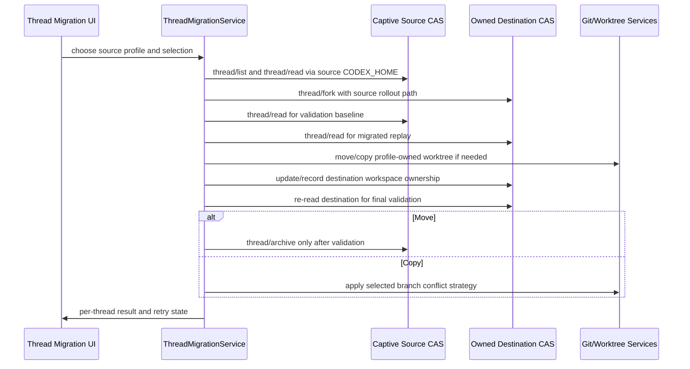

# feat: Add cross-profile thread migration

## Overview

Add a desktop Thread Management / Thread Migration surface that lets an operator
copy or move Codex threads from another Codex auth profile into the currently
owned PwrAgent profile. The implementation must use Codex App Server (CAS) as
the only interface to Codex-owned thread storage: PwrAgent may pass rollout
paths to source and destination CAS instances, but must not read or write Codex
session JSONL, rollout files, or Codex databases directly.

The intended migration primitive is destination CAS `thread/fork` using the
source thread's rollout path. `thread/inject_items` remains a research fallback
for edge cases where fork-by-path cannot preserve the necessary model-visible
history.

## Problem Frame

PwrAgent profiles isolate settings, state, worktrees, and selected Codex auth
profiles. Today a user running a profile such as `work` cannot conveniently pull
threads from another Codex profile such as system default or `personal` into the
current profile. The recent thread-fork work proves that a forked thread can
preserve history when CAS performs the fork, and the generated Codex protocol
types show that `thread/fork` can target a rollout `path`. That gives PwrAgent a
profile-safe way to ask the destination CAS to copy a source thread without
opening Codex private storage itself.

The hard part is not the thread history copy alone. A real migration must also
handle selection by source profile/project/thread, validation, source archive,
and profile-owned worktrees. Move is the safest operator workflow because there
is one surviving thread/worktree owner after validation. Copy is inherently more
complex because Git cannot keep the same branch checked out in two worktrees, so
copy requires an explicit branch-conflict strategy.

## Requirements Trace

- R1. List Codex auth profiles other than the current profile's selected Codex
  auth profile.
- R2. Start a captive source CAS instance for a selected source profile, using
  only CAS methods for source thread list/read/archive behavior.
- R3. Present source threads grouped by project/workspace, with selection for all
  threads, one project, or individual threads.
- R4. Copy selected source threads into the current owned destination CAS by
  passing source rollout paths to destination `thread/fork`.
- R5. Validate migrated threads by comparing source and destination CAS-visible
  replay/history before any destructive source-side action.
- R6. Make Move the primary workflow: fork/copy, migrate worktrees, validate,
  then archive the source thread only after the destination is complete.
- R7. Support Copy as an advanced workflow that leaves source threads intact and
  forces a branch-conflict strategy for profile-owned source worktrees.
- R8. Preserve the Codex storage boundary: PwrAgent may pass rollout paths to CAS
  but must not parse, mutate, or index Codex-owned storage files directly.
- R9. Keep destination threads in the same project folders where practical, and
  copy/move profile-owned worktrees into current-profile-owned locations.
- R10. Surface per-thread migration status, validation failures, and partial
  completion so the operator can retry or inspect failures without guessing.
- R11. Avoid logging migrated transcript content, raw Responses items, auth
  tokens, or source-profile secrets while still logging enough ids/statuses to
  debug failed runs.

## Scope Boundaries

- In scope: Codex-backed threads and Codex auth profiles discoverable under the
  existing Codex profile model.
- In scope: local desktop migration driven from the active PwrAgent profile.
- In scope: active and archived source thread listing if source CAS supports it.
- In scope: profile-owned worktree paths under `.codex`, `.pwragent`, or
  `.pwragnt` worktree roots already recognized by PwrAgent.
- In scope: Move and Copy with explicit validation and branch conflict handling.
- Out of scope: migrating Grok or ACP threads.
- Out of scope: migrating messaging bindings, automations, reactions, pins, or
  PwrAgent overlay metadata from another PwrAgent profile database.
- Out of scope: reading or writing Codex rollout/session files directly.
- Out of scope: cross-machine migration, remote storage synchronization, or
  resolving divergent Git remotes beyond branch/worktree safety checks.
- Out of scope: showing source transcript contents in the migration picker before
  the operator explicitly opens or migrates a source thread.

## Context & Research

### Relevant Code and Patterns

- `apps/desktop/src/main/settings/codex-profiles.ts` already discovers Codex auth
  profiles and resolves `CODEX_HOME` for a named Codex profile.
- `apps/desktop/src/main/settings/desktop-settings-service.ts` freezes the active
  profile's startup `CODEX_HOME` and exposes the environment used for owned
  Codex subprocesses.
- `apps/desktop/src/main/codex-app-server/client.ts` owns the stdio JSON-RPC CAS
  transport, `thread/list`, `thread/read`, `thread/fork`, and `thread/archive`.
- `packages/codex-app-server-protocol/src/v2/ThreadForkParams.ts` supports
  `path` as an unstable rollout path input. When present, CAS ignores
  `threadId`.
- `packages/codex-app-server-protocol/src/v2/ThreadInjectItemsParams.ts` exposes
  `thread/inject_items` for raw Responses API items, but PwrAgent currently has
  no wrapper and normalized `readThread` replay is too lossy to be the first
  migration primitive.
- `apps/desktop/src/main/app-server/backend-registry.ts` is the current desktop
  orchestration boundary for thread fork, archive, read, and worktree owner
  recording.
- `apps/desktop/src/main/app-server/git-directory-service.ts` records
  `codex-thread.json` worktree owner metadata without reading Codex private
  storage.
- `apps/desktop/src/main/app-server/worktree-archive-service.ts` contains the
  existing snapshot/restore pattern for removing and restoring Git worktrees.
- `packages/shared/src/worktree-paths.ts` centralizes detection of tool-managed
  worktree paths.
- `apps/desktop/src/renderer/src/features/settings/ArchivedThreadsSettings.tsx`
  and `ProfilesSettings.tsx` show existing Settings patterns for grouped thread
  rows, profile rows, and profile actions.
- `apps/desktop/src/renderer/src/lib/useThreadNavigation.ts` and
  `Sidebar.tsx` already consume fork/archive capabilities and can refresh
  navigation after thread lifecycle changes.

### Institutional Learnings

- `docs/solutions/2026-05-07-codex-permission-mode-state-machine.md` documents
  that Codex thread state is sticky and CAS-owned. PwrAgent should drive thread
  changes through CAS APIs rather than assuming on-disk state can be safely
  patched from the desktop process.
- `docs/plans/2026-04-16-004-feat-codex-access-mode-toggle-plan.md` established
  the pattern of keeping Codex profile/process routing below the `codex` backend
  identity, rather than exposing process/profile internals as separate user
  backends.

### External References

- None. This plan depends on the generated local Codex App Server protocol types
  in this repository and on existing PwrAgent profile/worktree architecture.

## Key Technical Decisions

- Use fork-by-path as the primary history migration primitive. Destination CAS
  can receive the source rollout path and perform the copy without PwrAgent
  opening Codex private storage. This is better aligned with the repository's
  Codex storage boundary than reconstructing history from normalized replay.
- Keep captive source CAS clients main-process only. The renderer sees source
  profile, project, thread, and status summaries through PwrAgent IPC, not raw
  CAS clients or filesystem paths beyond operator-facing labels.
- Exclude the active destination Codex auth profile from selectable sources. A
  profile should never migrate from itself into itself.
- Treat Move as the recommended action and Copy as an advanced action. Move has a
  single final owner and avoids duplicate worktree branch checkout conflicts.
- Archive the source thread last in Move. Source archive can remove or invalidate
  worktrees through PwrAgent cleanup or CAS-side lifecycle behavior, so the
  destination thread and worktree must be complete and validated first.
- Reuse existing worktree ownership and archive/restore concepts, but add a
  migration-specific worktree path flow. Migration needs "move/copy to the
  destination profile-owned location" before source archive, not "archive source
  first and restore later."
- Validate at CAS-visible boundaries. Source CAS `thread/read` and destination
  CAS `thread/read` should agree on the user/assistant-visible history shape
  before destructive cleanup proceeds.
- Keep `thread/inject_items` behind a narrow spike or fallback. It requires raw
  Responses API items and can become subtly lossy if fed from PwrAgent's
  normalized transcript replay.
- Persist migration runs in PwrAgent state. Operators need recovery, retry, and
  failure visibility if a batch partially migrates.
- Store migration diagnostics as metadata, not transcript content. Run state can
  record source/destination ids, profile ids, validation counts, status, and
  error summaries, but should not persist full message text or raw Responses
  items outside CAS.

## Open Questions

### Resolved During Planning

- Should PwrAgent read Codex rollout/session files directly to migrate history?
  No. PwrAgent may pass rollout paths to CAS but must not parse or mutate Codex
  private files or databases.
- Should source archive happen before worktree migration? No. Move must fork,
  migrate/copy worktrees, validate, and only then archive the source thread.
- Should Copy be first-class? Yes, but not the primary recommendation. It needs
  explicit branch conflict handling before proceeding.
- Should this be placed under Settings or the main thread surface? Plan for a
  Settings-hosted Thread Management tool first, because it is a profile/data
  maintenance workflow rather than normal thread navigation.

### Deferred to Implementation

- Whether current CAS `thread/list` summaries always expose the rollout path
  needed for fork-by-path, or whether source CAS `thread/read` must provide it.
  Implementation should discover this through protocol tests and add only the
  minimum normalized metadata needed.
- Exact validation strictness: implementation should start with message-count,
  role-order, and text/part checks, then tighten only if CAS returns stable item
  identifiers across fork-by-path.
- Exact destination path naming for moved profile-owned worktrees when the
  destination worktree root already contains a collision.
- Whether source archived threads should be included in the first release of the
  picker or deferred behind a toggle.
- Whether destination CAS returns a source rollout path in `thread/list` or only
  in `thread/read`; the implementation should prove the least-privilege source
  call through tests before broadening metadata exposed to the renderer.

## High-Level Technical Design

> *This illustrates the intended approach and is directional guidance for review,
> not implementation specification. The implementing agent should treat it as
> context, not code to reproduce.*

### Operation Matrix

| Operation | Source thread | Source worktree | Destination thread | Destination worktree |
|---|---|---|---|---|
| Move | Archived last, after validation | Moved/copied before archive, old owner removed only after success | New fork-by-path copy | Current-profile-owned path |
| Copy with source suffix | Left active | Source branch renamed with source-profile suffix if needed | New fork-by-path copy | Original or generated branch in destination |
| Copy with destination suffix | Left active | Left intact | New fork-by-path copy | Destination branch gets generated suffix |
| Copy detached | Left active | Left intact | New fork-by-path copy | Destination worktree checked out detached when branch cannot be shared |

For Copy, "left active" means the source thread and source worktree remain
usable. The source-suffix strategy may rename the branch currently checked out
by the source worktree, but it must not remove or archive the source worktree.

## Implementation Units

- [x] **Unit 1: Add migration contracts and run state**

**Goal:** Define the main/renderer contract for listing source profiles, browsing
source threads, creating migration runs, and reporting per-thread migration
status.

**Requirements:** R1, R3, R10

**Dependencies:** None

**Files:**
- Modify: `packages/shared/src/contracts/agent.ts`
- Modify: `packages/shared/src/contracts/backend.ts`
- Modify: `packages/shared/src/contracts/navigation.ts`
- Modify: `packages/shared/src/contracts/normalized-app-server.ts`
- Modify: `apps/desktop/src/shared/ipc.ts`
- Modify: `apps/desktop/src/renderer/src/lib/desktop-api.ts`
- Modify: `apps/desktop/src/preload/index.ts`
- Test: `packages/shared/src/__tests__/profile-names.test.ts`
- Create test: `apps/desktop/src/renderer/src/lib/__tests__/desktop-api.test.ts`

**Approach:**
- Add explicit types for source Codex profile summaries, source project groups,
  source thread summaries, migration selection, operation type, branch conflict
  strategy, and migration run item status.
- Keep source profile ids aligned with existing Codex profile naming: empty
  string remains the system default sentinel and named profiles use normalized
  names.
- Do not expose raw source CAS handles to the renderer. Expose only bounded
  summaries and migration action requests.
- Include enough status structure for partial batch recovery: pending, copying,
  validating, worktree handling, source archiving, completed, failed, skipped.

**Patterns to follow:**
- Existing settings/profile contracts in `packages/shared/src/contracts/settings.ts`.
- Existing thread lifecycle request/response contracts in
  `packages/shared/src/contracts/normalized-app-server.ts`.

**Test scenarios:**
- Happy path: a request selecting one source profile and three thread ids
  serializes through preload without dropping operation or strategy fields.
- Edge case: the empty source profile id is accepted as the system default but
  invalid named profile strings are rejected or normalized consistently.
- Error path: a migration run item can represent a validation failure with an
  operator-facing reason and without losing the source thread id.

**Verification:**
- Shared contracts compile across main, preload, and renderer.
- Renderer-facing APIs expose migration operations without importing desktop
  main-process modules.

- [x] **Unit 2: Extend Codex client support for fork-by-path and raw migration metadata**

**Goal:** Let PwrAgent ask destination CAS to fork a source rollout path and
capture the minimum CAS-visible source metadata needed for migration.

**Requirements:** R2, R4, R5, R8

**Dependencies:** Unit 1

**Files:**
- Modify: `apps/desktop/src/main/codex-app-server/client.ts`
- Modify: `apps/desktop/src/main/app-server/backend-registry.ts`
- Test: `apps/desktop/src/main/__tests__/codex-client.test.ts`
- Test: `apps/desktop/src/main/__tests__/backend-registry.test.ts`

**Approach:**
- Extend the existing `forkThread` path to optionally send a rollout path to CAS
  while preserving current thread-id fork behavior for sidebar forks.
- Normalize source rollout path metadata only as data returned by CAS. Do not
  inspect the file.
- Add a narrow `readThreadForMigration` or equivalent internal helper only if
  existing `readThread` cannot expose the necessary path/metadata safely.
- Add a small `thread/inject_items` client wrapper only if the fork-by-path spike
  shows a real gap; keep it out of the default migration flow until proven.

**Patterns to follow:**
- Existing `buildThreadForkPayload` and request fallback patterns in
  `apps/desktop/src/main/codex-app-server/client.ts`.
- Existing client tests around `thread/fork` and `thread/archive`.

**Test scenarios:**
- Happy path: `forkThread` with a source path sends `thread/fork` with `path`
  and still includes permission/model overrides where applicable.
- Happy path: existing thread-id sidebar fork requests continue to send
  `threadId` without `path`.
- Error path: destination CAS returning no `threadId` still raises the existing
  normalized error.
- Integration: backend registry can call the extended client without changing
  existing sidebar fork behavior.

**Verification:**
- Existing thread fork tests still pass.
- New tests prove no Codex storage file is opened by the fork-by-path path.
- Client diagnostics do not include raw transcript content or raw Responses
  items.

- [x] **Unit 3: Add captive source CAS lifecycle**

**Goal:** Create, cache, and dispose source-profile CAS clients that list and
read threads from non-active Codex profiles without contaminating the owned
destination CAS.

**Requirements:** R1, R2, R3, R8

**Dependencies:** Unit 1

**Files:**
- Create: `apps/desktop/src/main/app-server/thread-migration-service.ts`
- Modify: `apps/desktop/src/main/app-server/backend-registry.ts`
- Modify: `apps/desktop/src/main/settings/codex-profiles.ts`
- Modify: `apps/desktop/src/main/settings/desktop-settings-service.ts`
- Test: `apps/desktop/src/main/__tests__/thread-migration-service.test.ts`
- Test: `apps/desktop/src/main/__tests__/codex-profiles.test.ts`

**Approach:**
- Build source CAS clients with the same command/args conventions as the owned
  `CodexAppServerClient`, but with `CODEX_HOME` set to the selected source
  profile's home.
- Exclude the active effective destination Codex profile from the source list.
- Scope lifecycle to the migration window/tool: start lazily when the user opens
  a source, reuse while browsing that source, close on window close, profile
  switch, or app shutdown.
- Keep source CAS read-only until the user confirms Move and the migration item
  reaches the final archive stage.

**Patterns to follow:**
- Existing `CodexAppServerClient` construction in `BackendRegistry`.
- Existing profile discovery and auth status flows in `settings/codex-profiles.ts`
  and `ipc/profiles.ts`.
- Existing replay client injection style in backend registry tests.

**Test scenarios:**
- Happy path: active `work` destination excludes the `work` Codex auth profile
  and includes system default plus other named profiles.
- Happy path: selecting `default` starts a source client with `CODEX_HOME` for
  system default and lists source threads through CAS.
- Error path: missing auth or missing profile directory returns an unavailable
  profile row instead of spawning a broken client.
- Error path: source client startup failure is isolated to the migration tool and
  does not affect the owned destination CAS.
- Error path: source profile list includes account/profile availability metadata
  but does not expose auth tokens or secret material.
- Integration: closing the migration tool closes any captive source client.

**Verification:**
- Source and destination clients can be constructed with distinct environments.
- The active destination profile cannot be selected as its own source.

- [ ] **Unit 4: Implement migration run orchestration and validation**

Progress note 2026-06-01: initial main-process migration orchestration now
forks by source CAS rollout path, validates source/destination replay
fingerprints, archives source last for non-worktree Move, and blocks Move before
fork/archive when a profile-owned worktree is detected. Persistent run storage,
retry/cancel semantics, and full archive-failure recovery remain open.

**Goal:** Execute batch Copy/Move requests as resumable migration runs with
per-thread validation, clear failure states, and source archive only after
destination success.

**Requirements:** R4, R5, R6, R10, R11

**Dependencies:** Units 2 and 3

**Files:**
- Modify: `apps/desktop/src/main/app-server/thread-migration-service.ts`
- Modify: `apps/desktop/src/main/state/overlay-store-sqlite.ts`
- Modify: `packages/agent-core/src/persistence/overlay-store.ts`
- Create test: `apps/desktop/src/main/__tests__/thread-migration-service.test.ts`
- Create test: `apps/desktop/src/main/__tests__/thread-migration-store.test.ts`

**Approach:**
- Persist migration run state in the active PwrAgent profile database or overlay
  state so a partial batch remains inspectable after restart.
- For each selected thread, read source metadata/replay through source CAS,
  fork into destination CAS by path, read destination replay, compare validation
  fingerprints, then proceed to worktree handling.
- For Move, call source archive only after destination history and worktree
  validation pass.
- Treat failures as per-item failures rather than aborting the entire batch
  unless the source/destination CAS connection itself becomes unavailable.
- Store source profile id, source thread id, destination thread id, operation,
  validation summary, worktree result, and final status.
- Store validation fingerprints/counts and status summaries, not full transcript
  text or raw model items.

**Patterns to follow:**
- Existing per-thread transition logs in overlay store.
- Existing archive result structure in `ArchiveThreadCleanupResult`.
- Existing list cache invalidation after archive/fork in `BackendRegistry`.

**Test scenarios:**
- Happy path: Move forks a source thread, validates replay, migrates worktree
  metadata, then archives the source thread last.
- Happy path: Copy forks and validates but never calls source archive.
- Edge case: a batch with one failing thread and one valid thread completes the
  valid item and records the failed item with retryable state.
- Error path: validation mismatch prevents source archive and marks the item
  failed with source/destination thread ids for inspection.
- Error path: source archive failure after successful destination migration marks
  the item as `archive_failed` or equivalent without deleting destination state.
- Error path: a validation failure stores enough metadata to retry/inspect but
  does not persist message bodies in the PwrAgent state database.
- Integration: destination thread list cache is invalidated after successful
  migration so the new thread appears in navigation.

**Verification:**
- A failed validation never archives the source thread.
- A successful Move archives source only after destination history and worktree
  handling are complete.

- [ ] **Unit 5: Handle profile-owned worktree move/copy and branch conflicts**

**Goal:** Preserve or duplicate profile-owned worktrees safely during migration,
with explicit branch conflict handling for Copy.

**Requirements:** R6, R7, R9

**Dependencies:** Unit 4

**Files:**
- Modify: `apps/desktop/src/main/app-server/thread-migration-service.ts`
- Modify: `apps/desktop/src/main/app-server/git-directory-service.ts`
- Modify: `apps/desktop/src/main/app-server/worktree-archive-service.ts`
- Modify: `packages/shared/src/worktree-paths.ts`
- Test: `apps/desktop/src/main/__tests__/thread-migration-service.test.ts`
- Test: `apps/desktop/src/main/__tests__/git-directory-service.test.ts`
- Test: `apps/desktop/src/main/__tests__/backend-registry.test.ts`

**Approach:**
- Detect source worktrees using existing linked directory metadata and
  `isToolManagedWorktreePath`.
- For Move, materialize or relocate the worktree under the destination profile's
  owned worktree root before source archive. Record destination ownership with
  `recordCodexWorktreeOwnerThread`.
- For Copy, require one of the supported strategies before copying a worktree:
  source branch suffix, destination branch suffix, or detached destination.
- Prefer branch suffix strategies in the UI copy. Detached destination should be
  available for expert use but described as less convenient for continued work.
- Avoid reusing `archiveThreadWorktrees` as the first move step because archive
  is a cleanup path; migration needs destination materialization before source
  cleanup.

**Patterns to follow:**
- Existing worktree owner file logic in `git-directory-service.ts`.
- Existing snapshot-ref logic in `worktree-archive-service.ts`.
- Existing archive tests for preserving shared worktrees.
- Git's own worktree branch exclusivity rules; every strategy must preflight
  `git worktree list` before changing branch state.

**Test scenarios:**
- Happy path: Move of a profile-owned source worktree creates a destination-owned
  worktree and records the destination thread as owner before source archive.
- Happy path: Move of a local non-profile-owned checkout leaves the checkout in
  place and only links the destination thread to the same project path.
- Copy strategy: source suffix renames the branch checked out by the source
  worktree without removing or archiving the source thread/worktree, then the
  destination claims or creates the requested branch.
- Copy strategy: destination suffix creates the destination worktree on a new
  suffixed branch while leaving source untouched.
- Copy strategy: detached destination creates a destination worktree without a
  branch conflict.
- Error path: dirty worktree or untracked changes that cannot be safely copied
  block source archive and surface an actionable failure.
- Error path: branch already exists for the chosen suffix returns a collision
  error with suggested alternate suffix.
- Integration: shared worktrees not owned by the source thread are not removed
  during Move.

**Verification:**
- Git never has the same branch checked out in two worktrees.
- Move does not archive source before destination worktree handling finishes.

- [ ] **Unit 6: Build the Thread Management renderer surface**

Progress note 2026-06-01: Settings now includes a Thread Management section
that lists migration source profiles, groups source threads by project, supports
project/thread multi-select, runs Move/Copy through the migration IPC, and shows
per-thread run status. Remaining UI work includes richer progress events,
retry/cancel affordances, final copy/worktree strategy validation, and visual
polish against replay-backed fixtures.

**Goal:** Add a Settings-hosted Thread Management tool for source profile
selection, grouped thread selection, Move/Copy action choice, branch strategy,
and migration progress.

**Requirements:** R1, R3, R6, R7, R10

**Dependencies:** Units 1, 3, 4, and 5

**Files:**
- Create: `apps/desktop/src/renderer/src/features/settings/ThreadManagementSettings.tsx`
- Modify: `apps/desktop/src/renderer/src/features/settings/SettingsScreen.tsx`
- Modify: `apps/desktop/src/renderer/src/features/settings/SettingsLayout.tsx`
- Modify: `apps/desktop/src/renderer/src/lib/useThreadNavigation.ts`
- Modify: `apps/desktop/src/renderer/src/lib/desktop-api.ts`
- Modify: `apps/desktop/src/renderer/src/styles/app.css`
- Test: `apps/desktop/src/renderer/src/features/settings/__tests__/settings-screen.test.tsx`
- Test: `apps/desktop/src/renderer/src/lib/__tests__/useThreadNavigation.test.tsx`

**Approach:**
- Follow existing Settings section primitives instead of adding a separate visual
  system.
- Present source profiles first, then grouped projects, then thread rows with
  multi-select controls.
- Make Move the primary action. Copy should require an explicit branch strategy
  when selected source threads include profile-owned worktrees.
- Render per-thread run status inline: queued, copied, validating, worktree,
  archiving, complete, failed.
- Keep the picker summary-oriented: project, title, source profile, branch, and
  status are enough for selection. Full transcript content should remain in the
  normal thread view after migration or in source CAS read/validation internals.
- After successful destination migration, refresh navigation so migrated threads
  become visible in Inbox/Recents/Directories.

**Patterns to follow:**
- `ArchivedThreadsSettings.tsx` for grouped thread rows and restore/archive
  status copy.
- `ProfilesSettings.tsx` for profile list rows and profile actions.
- Existing desktop style guide and app chrome token rules.

**Test scenarios:**
- Happy path: user selects a source profile, selects a project group, sees Move
  enabled, starts migration, and sees completed per-thread statuses.
- Happy path: selecting Copy with worktree threads reveals branch strategy
  controls and blocks start until a strategy is chosen.
- Edge case: no other Codex profiles shows an empty state and no migration
  action.
- Error path: unavailable source profile shows its failure reason without
  disabling other profiles.
- Error path: migration item failure remains visible after a refresh.
- Accessibility: project and thread selection controls have stable labels and
  keyboard-operable state.

**Verification:**
- The Settings UI remains consistent with existing Settings layout.
- Move is visually and interaction-wise the default recommended action.

- [ ] **Unit 7: Add IPC wiring, progress events, and lifecycle cleanup**

**Goal:** Wire renderer actions to the migration service through preload and IPC,
with progress notifications and cleanup of captive source clients.

**Requirements:** R2, R3, R10

**Dependencies:** Units 1, 3, 4, and 6

**Files:**
- Modify: `apps/desktop/src/main/ipc/app-server.ts`
- Modify: `apps/desktop/src/main/ipc/profiles.ts`
- Modify: `apps/desktop/src/main/index.ts`
- Modify: `apps/desktop/src/preload/index.ts`
- Modify: `apps/desktop/src/shared/ipc.ts`
- Test: `apps/desktop/src/main/__tests__/profiles-ipc.test.ts`
- Test: `apps/desktop/src/main/__tests__/backend-registry.test.ts`
- Test: `apps/desktop/src/renderer/src/features/settings/__tests__/settings-screen.test.tsx`

**Approach:**
- Add IPC handlers for listing migration sources, listing source profile threads,
  starting a migration run, reading run status, and cancelling pending items
  before they become destructive.
- Emit progress events through existing notification patterns so the renderer
  does not poll aggressively.
- Ensure app shutdown, profile switch, and migration window close dispose captive
  source CAS clients.
- Keep archive confirmation server-side: the service should never call source
  archive until the persisted run item has reached the validated pre-archive
  state.

**Patterns to follow:**
- Existing app-server IPC methods for list/read/archive thread.
- Existing profile IPC for open/create/delete profile.
- Existing notification forwarding in backend registry.

**Test scenarios:**
- Happy path: IPC start request creates a migration run and progress events
  update renderer state.
- Error path: renderer cannot request migration from the active source profile.
- Error path: cancelling a pending item prevents fork/archive for that item.
- Lifecycle: closing the tool disposes source clients without interrupting owned
  destination CAS.
- Integration: successful migration refreshes navigation and archived-source
  state only after source archive.

**Verification:**
- No renderer code imports main-process migration service modules.
- Captive source clients do not survive past their intended lifecycle.

- [ ] **Unit 8: Add end-to-end replay fixtures and manual validation path**

**Goal:** Prove the migration flow against replay-backed CAS fixtures and a
manual dev-profile workflow before shipping.

**Requirements:** R4, R5, R6, R7, R8, R9, R10

**Dependencies:** Units 2 through 7

**Files:**
- Create: `apps/desktop/e2e/thread-profile-migration.spec.ts`
- Create: `apps/desktop/e2e/fixtures/thread-profile-migration/`
- Modify: `apps/desktop/package.json`
- Test: `apps/desktop/e2e/thread-profile-migration.spec.ts`

**Approach:**
- Seed replay fixtures with two Codex auth profile environments and source
  threads grouped across at least two projects.
- Include one profile-owned worktree fixture and one local checkout fixture.
- Validate Move order explicitly: destination fork and validation happen before
  source archive.
- Validate Copy strategy UI and branch conflict handling without depending on
  real operator Codex data.
- Add a manual validation checklist in the plan or PR notes rather than
  hard-coding operator-specific paths.

**Patterns to follow:**
- Project-local desktop E2E fixture seeding skill guidance in
  `.agents/skills/desktop-e2e-fixture-seeding/SKILL.md`.
- Existing archive worktree E2E fixture in
  `apps/desktop/e2e/thread-archive-worktree-cleanup.spec.ts`.

**Test scenarios:**
- E2E happy path: Move one source thread, validate the destination appears in
  current profile navigation, and source archive is called last.
- E2E happy path: Copy one source thread with destination branch suffix and leave
  source active.
- E2E edge case: select an entire project group and migrate multiple threads
  with independent per-thread statuses.
- E2E error path: validation mismatch blocks source archive and leaves a visible
  failed item.
- E2E boundary: fixture asserts PwrAgent never reads Codex session files
  directly by routing all source thread access through replayed CAS messages.

**Verification:**
- Replay-backed desktop E2E covers Move and Copy with worktree and non-worktree
  threads.
- Manual validation confirms a real forked/migrated thread has correct history.

## System-Wide Impact

- **Interaction graph:** Settings UI, preload IPC, app-server IPC,
  `BackendRegistry`, new migration service, owned Codex client, captive source
  Codex clients, Git worktree services, overlay/state persistence, and
  navigation refresh all interact in this flow.
- **Error propagation:** Source profile discovery and source CAS startup errors
  should remain scoped to the migration UI. Per-thread migration errors should
  not abort unrelated batch items unless the underlying source/destination client
  becomes unavailable.
- **State lifecycle risks:** Migration run state must survive refresh/restart,
  source clients must be disposed, destination list caches must invalidate after
  success, and source archive must never occur before destination validation.
- **API surface parity:** Renderer, preload, shared contracts, and main IPC all
  need the same operation/status vocabulary.
- **Integration coverage:** Unit tests alone will not prove the destructive
  sequencing. E2E or replay-backed integration must assert source archive order
  relative to fork, validation, and worktree migration.
- **Unchanged invariants:** PwrAgent still treats Codex-owned storage as private.
  Existing sidebar thread fork behavior remains thread-id based and should not
  be coupled to cross-profile migration.

## Risks & Dependencies

| Risk | Mitigation |
|---|---|
| CAS does not expose stable rollout path metadata in the current normalized list/read path | Add the smallest CAS-returned metadata field needed; do not fall back to filesystem parsing. |
| Source archive removes worktrees before they are moved | Make source archive the final Move step and test call ordering explicitly. |
| Copy creates duplicate branch checkout conflicts | Require an explicit Copy branch strategy and preflight Git worktree state before creating destination worktrees. |
| Validation is too strict and fails valid forks | Start with role/order/content fingerprints and defer item-id equality unless CAS guarantees it. |
| Validation is too loose and misses lost context | Include message parts and assistant/user ordering; add manual validation for a real forked thread before shipping. |
| Captive source CAS leaks process lifetime | Tie source client lifecycle to migration tool/window and app shutdown cleanup. |
| Migration partially succeeds and confuses the operator | Persist per-item status and expose retryable/failed states in the UI. |
| Implementation accidentally reads Codex JSONL/session files | Add tests/review checks around migration service and keep all source access behind CAS client calls. |
| Migration logs leak transcript content or raw Responses payloads | Log ids, statuses, counts, and short error summaries only; keep message bodies inside CAS-visible replay and UI surfaces that already show thread content. |

## Documentation / Operational Notes

- Update the Settings/Thread Management user-facing copy to recommend Move when
  profile-owned worktrees are involved.
- PR notes should include a manual validation checklist for one Move and one Copy
  flow using non-sensitive test profiles.
- Contributor-facing docs may need a short note in `apps/desktop/AGENTS.md` if
  the replay fixture seeding process for profile migration differs from existing
  desktop E2E fixture patterns.

## Alternative Approaches Considered

- **Reconstruct history with `thread/inject_items`:** Rejected as the first
  approach because PwrAgent's normalized `readThread` replay is not guaranteed to
  preserve raw Responses API item shape. Keep as a fallback spike only.
- **Read source Codex rollout files directly:** Rejected because repo guidance
  explicitly forbids reading Codex-owned storage directly from PwrAgent code.
- **Archive source first and restore/move worktrees afterward:** Rejected because
  source archive may remove or invalidate worktree state needed for the
  destination.
- **Open another full PwrAgent profile window to migrate:** Rejected for the main
  flow because it makes CAS ownership and user confirmation harder to reason
  about; a captive source CAS is narrower and easier to clean up.

## Success Metrics

- A user running one PwrAgent profile can list other Codex profiles and migrate a
  selected thread without leaving the app.
- A moved thread appears in the current profile with CAS-visible history matching
  the source.
- Source archive happens only after destination validation and worktree handling.
- Copy cannot proceed on profile-owned worktrees until the operator chooses a
  branch conflict strategy.
- Tests cover the CAS boundary: migration uses CAS calls and does not parse
  Codex private files.

## Sources & References

- Related branch: `feat/thread-subthreads`
- Related commits: `428b4e822 feat(threads): fork Codex threads from sidebar`,
  `21d117a8e fix(threads): preserve shared worktrees on archive`
- Related code: `apps/desktop/src/main/codex-app-server/client.ts`
- Related code: `apps/desktop/src/main/app-server/backend-registry.ts`
- Related code: `apps/desktop/src/main/settings/codex-profiles.ts`
- Related code: `apps/desktop/src/main/app-server/worktree-archive-service.ts`
- Related protocol: `packages/codex-app-server-protocol/src/v2/ThreadForkParams.ts`
- Related protocol: `packages/codex-app-server-protocol/src/v2/ThreadInjectItemsParams.ts`
