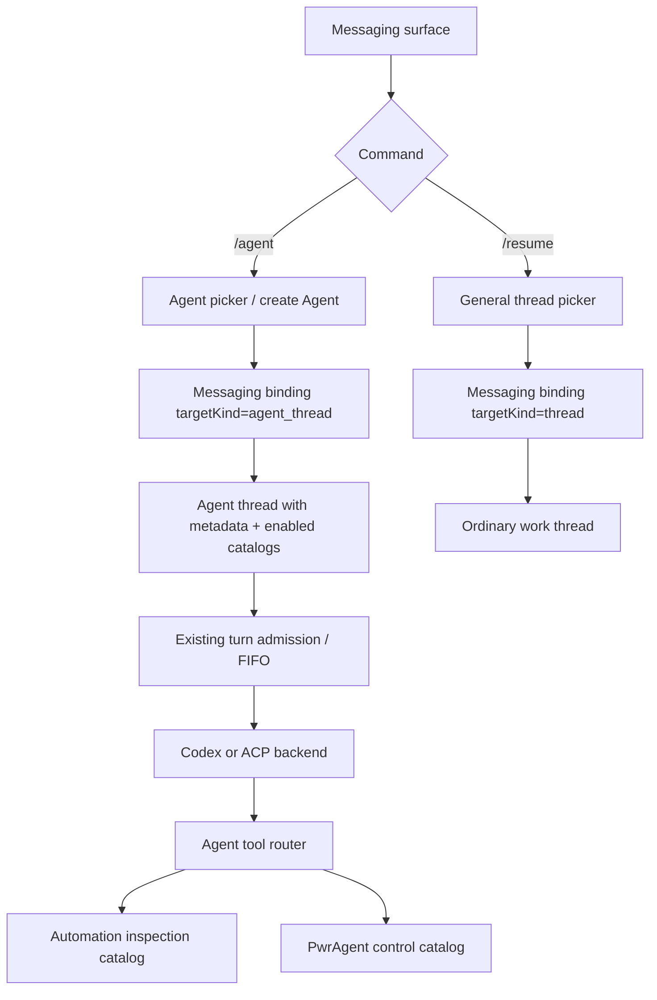
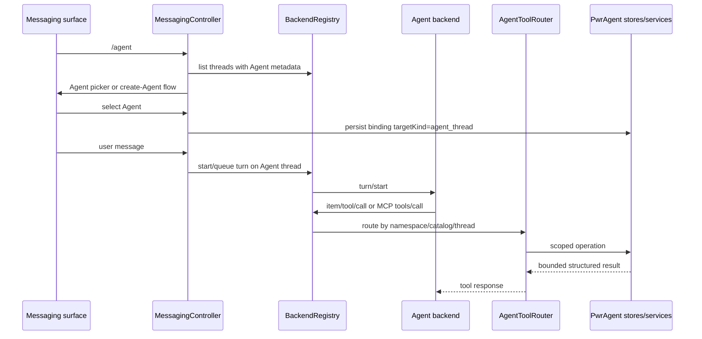

# feat: Route messaging surfaces to Agent threads with reusable dynamic tools

## Summary

Make Agent threads a first-class messaging target and turn PwrAgent's current automation-only dynamic tools into a reusable Agent tool substrate. The first product slice adds an explicit `/agent` messaging flow, keeps `/resume` for general thread binding, preserves shared context when multiple surfaces bind to the same Agent thread, and exposes PwrAgent control tools through the same Codex dynamic-tool and ACP MCP paths.

---

## Problem Frame

PwrAgent already has the important primitives: threads can be marked with `ThreadAgentMetadata`, automations attach only to Agent threads, automation inspection tools are exposed as Codex dynamic tools and ACP MCP tools, and messaging can bind a conversation to any backend/thread pair. Those pieces are still joined narrowly. Messaging does not have an Agent-specific route, and each new tool family would currently need bespoke wiring in `backend-registry.ts`.

The next step is to make "talk to an Agent from Telegram, Discord, Slack, or Mattermost" an intentional workflow. A user should bind one messaging surface to "Jarvis", optionally bind other surfaces to the same Agent thread, and expect shared context plus single-turn queueing. When the Agent needs PwrAgent-side information or action, it should call scoped tools instead of relying on prompt stuffing or ad hoc command parsing.

---

## Requirements

**Agent Messaging**

- R1. Messaging must add an explicit `/agent` command that lists only Agent threads and creates a new Agent thread when needed.
- R2. `/resume` must remain the general thread browser and must not silently filter to Agent threads.
- R3. Binding a messaging surface to an Agent thread must reuse the existing binding model while preserving an Agent-specific target kind for copy, picker behavior, and future policy.
- R4. Multiple messaging surfaces may bind to the same Agent thread; they share context because they route to one backend/thread pair.
- R5. Concurrent messages from different bound surfaces must use existing single-turn admission and queueing semantics, with messaging feedback that a later message was queued or rejected.
- R6. An unattached shared channel must not auto-create or auto-bind an Agent from arbitrary plain text; the user enters through `/agent`, a help action, or a configured future default.

**Agent Identity**

- R7. V1 Agent identity is the existing thread-level Agent metadata: name, short persona instructions, backend, thread id, and enabled tool catalogs.
- R8. V1 must not introduce the full Bot/RBAC/import-export model from issue #292, but the data model must leave room for future Agent definitions or Bot definitions.
- R9. Creating an Agent thread from messaging must let the operator name the Agent and optionally provide compact instructions without exposing large persona-file workflows.

**Dynamic Tools**

- R10. PwrAgent must define one reusable Agent tool catalog/dispatcher abstraction instead of adding each new dynamic tool family directly to `backend-registry.ts`.
- R11. Automation inspection must migrate onto that abstraction without changing its public operation names, scoping, bounded outputs, or ACP MCP parity.
- R12. Tool catalogs must be selected per Agent thread and per backend capability: Codex receives dynamic tool specs at thread start, ACP receives MCP server configuration only when supported, and unsupported paths fail closed with visible diagnostics.
- R13. Tool calls must be scoped to a live turn on the calling Agent thread unless a catalog explicitly declares a different safe scope.
- R14. Tool results must be bounded, structured, and recorded as visible tool activity where the backend protocol reports it.

**PwrAgent Control Tools**

- R15. The first general PwrAgent tool catalog must support read-only thread discovery and status inspection across known PwrAgent threads.
- R16. Mutating tools must start with narrow, auditable operations: create a new thread/worktree from an Agent request, enqueue a message into a target thread, and propose or apply a pending approval only when policy allows it.
- R17. Approval-related tools must never bypass the current approval, execution-mode, or Full Access policy surfaces; when the decision is not already authorized, the tool must create a user-visible decision request instead of silently approving.
- R18. Tool families must be individually enableable for an Agent thread so a low-trust Agent can inspect automations without receiving thread-control or approval tools.

**Update Orchestration**

- R19. App update availability must be deliverable to selected Agent threads as an event-driven notification, not only as the renderer update banner.
- R20. A user authorized for the bound messaging surface may request `upgrade` from an Agent-bound conversation when an update is downloaded or available.
- R21. Upgrade requests must inspect active and queued thread work before restarting. Threads attached to the initiating Agent do not block that Agent's requested restart; unrelated busy threads do.
- R22. If unrelated threads are busy, PwrAgent must publish a sticky upgrade-status card to the initiating Agent and keep the waiting list current as threads start, finish, or are queued.
- R23. When the waiting list reaches zero, PwrAgent must start the update install through the existing updater and quit/restart path, then post that the upgrade is starting.
- R24. After restart, PwrAgent must synthesize a startup notification back to the initiating Agent that the requested upgrade completed or that the previous upgrade attempt did not complete cleanly.
- R25. Upgrade orchestration state must persist across restart and must not depend on renderer-local toast state.

---

## Scope Boundaries

- In scope: `/agent` messaging flow, Agent-only picker and creation path, Agent-target binding metadata, reusable dynamic-tool catalog abstraction, automation-tool migration, Codex dynamic-tool registration, ACP MCP registration, and initial PwrAgent thread/control tools.
- In scope: tests proving same-Agent multi-surface queueing, Agent-only browsing, tool scoping, and parity between Codex dynamic tools and ACP MCP tools.
- In scope as a follow-on phase: event-driven update notifications attached to Agent threads, authorized `upgrade` requests from messaging, sticky upgrade-status cards, busy-thread waiting, and post-restart completion notices.
- Out of scope: full Bot/RBAC trust boundaries, import/export, marketplace sharing, per-actor capability differences, cross-machine Agent sync, cloud execution, and automatic bot-to-bot delegation.
- Out of scope: making every unattached message surface automatically start an Agent thread by default.

### Deferred to Follow-Up Work

- First-class Bot/Agent definition files with capability and trust boundaries from issue #292.
- Per-turn or per-thread Codex skill allowlists from issue #293; this plan can only record desired tool catalogs and use the current dynamic-tool/MCP surfaces.
- Channel-state policy generalization from issue #288 beyond ensuring `/agent` works with the existing shared-channel mention rules.
- Rich persona-file bundles and reusable Agent templates. V1 stores compact instructions on the thread.

---

## Context & Research

### Existing PwrAgent Patterns

- `packages/shared/src/contracts/navigation.ts` defines `ThreadAgentMetadata` and stores Agent/persona metadata on thread overlays.
- `apps/desktop/src/main/state/overlay-store-sqlite.ts` implements `setThreadAgent`, validates Agent names, and stores compact instruction metadata.
- `apps/desktop/src/renderer/src/features/thread-detail/ThreadContextPanel.tsx` and `ThreadHeader.tsx` already surface Agent marking in desktop UI.
- `packages/shared/src/contracts/automations.ts` treats automations as attached to Agent threads through backend/thread identity.
- `apps/desktop/src/main/automations/desktop-automation-service.ts` rejects automation creation against non-Agent threads.
- `packages/shared/src/contracts/automation-tools.ts`, `apps/desktop/src/main/automations/automation-inspection-tool-catalog.ts`, `automation-inspection-codex-tools.ts`, and `automation-inspection-mcp.ts` are the current read-only tool surface.
- `apps/desktop/src/main/app-server/backend-registry.ts` attaches automation dynamic tools to Codex thread starts and rejects automation tool calls unless they originate from a live turn on the same thread.
- `apps/desktop/src/main/app-server/acp-backend-adapter.ts` passes automation MCP server configuration to ACP sessions when runtime capabilities allow it.
- `apps/desktop/src/main/messaging/core/messaging-controller.ts`, `messaging-resume-browser.ts`, `messaging-status-card.ts`, and `messaging-command-catalog.ts` own slash commands, binding mutation, picker surfaces, and status cards.
- `packages/messaging/interface/src/index.ts` and `apps/desktop/src/main/messaging/core/messaging-store.ts` define persisted binding and browse-session shapes that can carry an Agent target kind.
- `apps/desktop/src/main/auto-updater.ts` tracks update availability, download progress, downloaded status, and install requests through `AppUpdateStatus`.
- `apps/desktop/src/renderer/src/features/update/AppUpdateBanner.tsx` currently shows the downloaded-update toast and calls the update install IPC.
- `apps/desktop/src/main/quit-manager.ts` already gates update installs through `requestQuit({ source: "update-install" })` and checks in-progress thread counts.
- `apps/desktop/src/main/app-server/backend-registry.ts` exposes `getInProgressThreadSnapshotForQuit()` and emits `thread/turnQueue/updated` events that can drive a live waiting list.

### PwrSnap Patterns To Borrow

- PwrSnap's chat tools are catalog/dispatcher pairs: `defineTool`, `buildLibraryToolCatalog`, `dispatchLibraryToolCall`, and `makeSizzleChatTools` keep schema, description, namespace, validation, and dispatch together.
- PwrSnap derives dynamic tool specs from zod schemas, validates arguments before dispatch, returns tool errors instead of throwing across the protocol boundary, and scopes Sizzle mutations to the calling chat's project.
- PwrSnap treats product-surface tools as explicit catalogs. Library chat, Sizzle chat, and future MCP/HTTP transports can share command-bus semantics without making every tool global.

### Related Issues And Plans

- Issue #292 defines the larger first-class Bot/Agent capability and trust-boundary model. This plan deliberately does not implement that whole security/sharing surface.
- Issue #288 frames channel-state-aware bot behavior. This plan keeps explicit `/agent` entry and does not auto-reply to all shared-channel messages.
- Issue #293 defines skill profiles and notes Codex does not currently support per-turn skill allowlists. This plan should not pretend tool catalogs solve skill context-budget control.
- Issue #543 clarifies sub-threads are visual grouping only, not shared agent context. Agent threads in this plan are the opposite: one thread shared across surfaces means one context.
- Issue #646 is relevant to ACP diagnostics: detected-but-unavailable agents and capability gaps should be visible rather than silently dropped.
- `docs/plans/2026-05-24-001-feat-automation-agent-tool-bridge-plan.md` completed the first read-only automation tool bridge and should be treated as the implementation baseline.
- `docs/plans/2026-05-22-001-feat-messaging-new-thread-backend-selection-plan.md` establishes messaging pre-thread backend selection and launchpad-default parity.

---

## Key Technical Decisions

- **Add `/agent`; keep `/resume` general.** Agent binding is a distinct mental model, so the command surface should be distinct. General thread resume remains useful for ordinary work threads and should not be overloaded.
- **Use Agent thread metadata for V1 identity.** The existing thread overlay is already the automation attachment boundary and desktop marker. A separate Agent-definition table would pull this plan into issue #292's scope before messaging and tools prove value.
- **Persist target kind on bindings and browse sessions.** Inferring Agent-ness from overlay metadata alone is fragile if an Agent marker is later cleared. Binding records should remember whether the operator entered through `/agent` or `/resume`.
- **Make dynamic tools catalog-driven.** PwrAgent should mirror PwrSnap's catalog/dispatcher shape so tool definitions, validation, protocol projection, and dispatch live together. `backend-registry.ts` should route calls, not own every tool family's behavior.
- **Register tools at thread start and diagnose staleness.** Codex dynamic tools are attached through `thread/start`; the plan should use catalog fingerprints and visible diagnostics when an Agent's enabled catalog changes after a thread is already loaded.
- **ACP is MCP-first with capability gates.** ACP runtime capabilities already report MCP support. PwrAgent should pass MCP server definitions only when supported and surface unavailable tool exposure instead of silently pretending parity exists.
- **Start mutating tools narrow and audited.** Read-only inspection is safe to expose broadly. New thread/worktree creation, message enqueueing, and approval decisions cross product boundaries and must be logged, policy-checked, and test-covered.
- **No default auto-bind in V1.** A future default Agent per messaging instance is useful, but automatic creation from plain unattached text would conflict with shared-channel behavior and trust-boundary work.
- **Treat updates as event-driven Agent notifications.** Update availability is not a timer automation, but it should use the same Agent-attached reporting model: an app event creates a source-labeled card, the Agent/user can act, and PwrAgent keeps state outside the normal chat transcript.
- **Persist upgrade intent through restart.** The initiating Agent, requested version, status card, and waiting-thread set must live in PwrAgent-owned state so the restarted process can report completion or failure.

---

## High-Level Technical Design

---

## Implementation Units

### U1. Shared Agent Target And Tool Catalog Contracts

**Goal:** Define the durable concepts that messaging, tool routing, and renderer surfaces can share without crossing package boundaries.

**Requirements:** R3, R7, R8, R10, R12, R18.

**Dependencies:** None.

**Files:**

- Modify: `packages/shared/src/contracts/navigation.ts`
- Modify: `packages/shared/src/contracts/messaging.ts`
- Modify: `packages/shared/src/contracts/automation-tools.ts`
- Modify: `packages/shared/src/index.ts`
- Test: `packages/shared/src/contracts/__tests__/messaging.test.ts`
- Test: `packages/shared/src/contracts/__tests__/automation-tools.test.ts`

**Approach:** Add a small `MessagingBindingTargetKind` or equivalent union with `thread` and `agent_thread`. Add shared Agent tool catalog metadata that can name enabled catalog families without importing desktop implementation. Keep tool implementation details in desktop main; shared contracts should carry stable IDs, target kind, namespace, and serializable diagnostics only.

**Progress 2026-06-07:** Added `MessagingBindingTargetKind` with safe legacy normalization, plus shared Agent tool catalog identifiers/summaries for the v1 `automation_inspection` catalog. Navigation summaries and persisted binding records still need to adopt the target kind when U4/U5 wire Agent-thread messaging bindings.

**Patterns to follow:** Existing `ThreadAgentMetadata`, `AutomationInspectionOperationName`, and messaging capability-profile contracts.

**Test scenarios:**

- Happy path: a binding target kind serializes and defaults old records to `thread`.
- Happy path: Agent tool catalog identifiers are stable and do not collide with `pwragent_automations`.
- Edge case: an unknown target kind from persisted state normalizes to `thread` with a safe diagnostic.
- Error path: invalid automation operation names remain rejected.

**Verification:** Shared contract tests show old messaging records remain readable and new Agent target records round-trip.

### U2. Agent Tool Catalog And Router Substrate

**Goal:** Create a desktop-main tool substrate that can build Codex dynamic specs, MCP tools, and dispatchers from the same catalog definitions.

**Requirements:** R10, R11, R12, R13, R14, R18.

**Dependencies:** U1.

**Files:**

- Create: `apps/desktop/src/main/agent-tools/agent-tool-definition.ts`
- Create: `apps/desktop/src/main/agent-tools/agent-tool-router.ts`
- Create: `apps/desktop/src/main/agent-tools/agent-tool-catalog-registry.ts`
- Create: `apps/desktop/src/main/agent-tools/__tests__/agent-tool-router.test.ts`
- Modify: `apps/desktop/src/main/automations/automation-inspection-tool-catalog.ts`
- Modify: `apps/desktop/src/main/automations/automation-inspection-codex-tools.ts`
- Modify: `apps/desktop/src/main/automations/automation-inspection-mcp.ts`
- Test: `apps/desktop/src/main/__tests__/automation-inspection-bus.test.ts`

**Approach:** Borrow PwrSnap's catalog/dispatcher shape but adapt it to PwrAgent's dependency boundaries. Each tool definition owns namespace, name, description, JSON schema, annotations, scope guard, and dispatch. The router accepts caller context, validates namespace/tool/arguments, enforces live Agent-thread scope, runs the handler, and returns protocol-neutral content items plus structured data.

**Progress 2026-06-07:** Added the desktop-main Agent tool definition/router substrate, Codex dynamic-tool projection, MCP projection, shared dispatch response formatting, and direct router tests. Automation inspection now defines its tools once and uses the router for both Codex dynamic tools and ACP MCP tools. A separate catalog registry and per-Agent catalog resolution remain for U3.

**Patterns to follow:** PwrSnap `defineTool` and `dispatchLibraryToolCall`; current PwrAgent automation inspection bus and MCP adapter.

**Test scenarios:**

- Happy path: a fixture catalog builds Codex dynamic specs and MCP tools from one definition.
- Happy path: a valid tool call receives caller backend, Agent thread id, turn id, and bounded arguments.
- Edge case: namespace mismatch returns a tool error rather than throwing.
- Edge case: malformed arguments return a tool error with actionable validation text.
- Error path: a tool call from the wrong thread or without a live turn is rejected before dispatch.
- Integration: automation inspection tools behave identically before and after migration.

**Verification:** Router tests cover Codex and MCP projections; existing automation inspection tests still pass without operation-name changes.

### U3. Backend Registry Integration For Per-Agent Tool Catalogs

**Goal:** Replace hard-coded automation dynamic-tool attachment with per-Agent catalog resolution and route all supported tool calls through the new router.

**Requirements:** R11, R12, R13, R14, R18.

**Dependencies:** U1, U2.

**Files:**

- Modify: `apps/desktop/src/main/app-server/backend-registry.ts`
- Modify: `apps/desktop/src/main/app-server/acp-backend-adapter.ts`
- Modify: `apps/desktop/src/main/acp/acp-client.ts`
- Test: `apps/desktop/src/main/__tests__/backend-registry.test.ts`
- Test: `apps/desktop/src/main/__tests__/backend-registry-replay.test.ts`

**Approach:** Resolve enabled tool catalogs when starting or resuming an Agent thread. Codex starts receive dynamic tool specs. ACP sessions receive MCP server definitions only when `BackendAcpRuntimeAgentCapabilities.mcp` supports a compatible transport. The registry logs catalog fingerprints and stores enough active-turn context for the router to prove same-thread liveness.

**Progress 2026-06-07:** Added a desktop-main Agent tool catalog resolver and an explicit `startThread({ agent })` contract. Codex Agent starts now attach the automation inspection catalog and persist Agent metadata, while ordinary Codex starts no longer advertise Agent tools. ACP MCP catalog resolution, resume-time catalog refresh, stale-catalog warnings, and PwrAgent control tools remain follow-up work.

**Patterns to follow:** Existing `buildAutomationInspectionDynamicToolSpecs`, `readAutomationInspectionDynamicToolCall`, `isLiveAutomationInspectionToolCall`, and `buildAutomationInspectionAcpMcpServers`.

**Test scenarios:**

- Happy path: starting a Codex Agent thread attaches automation and PwrAgent control tool specs.
- Happy path: starting a non-Agent Codex thread attaches no Agent tool catalogs.
- Happy path: ACP Agent sessions receive MCP tools when runtime capabilities advertise MCP support.
- Edge case: an ACP backend without MCP support starts normally and surfaces a tool-unavailable diagnostic.
- Edge case: changing enabled catalogs while a Codex thread is loaded logs a stale-catalog fingerprint warning.
- Error path: `item/tool/call` for an unknown PwrAgent namespace falls through to existing request handling.

**Verification:** Backend registry tests prove dynamic tools remain Agent-only and existing approval/user-input/MCP elicitation paths still work.

### U4. Messaging `/agent` Command, Picker, And Creation Flow

**Goal:** Add an explicit Agent messaging workflow that binds surfaces to Agent threads and can create a new Agent thread from messaging.

**Requirements:** R1, R2, R3, R4, R6, R7, R9.

**Dependencies:** U1.

**Files:**

- Modify: `apps/desktop/src/main/messaging/core/messaging-command-catalog.ts`
- Modify: `apps/desktop/src/main/messaging/core/messaging-controller.ts`
- Modify: `apps/desktop/src/main/messaging/core/messaging-resume-browser.ts`
- Modify: `apps/desktop/src/main/messaging/core/messaging-status-card.ts`
- Modify: `apps/desktop/src/main/messaging/core/messaging-store.ts`
- Modify: `apps/desktop/src/main/state/messaging-store-sqlite.ts`
- Test: `apps/desktop/src/main/__tests__/messaging-command-catalog.test.ts`
- Test: `apps/desktop/src/main/__tests__/messaging-controller.test.ts`
- Test: `apps/desktop/src/main/__tests__/messaging-resume-browser.test.ts`
- Test: `apps/desktop/src/main/__tests__/messaging-store.test.ts`
- Test: `apps/desktop/src/main/__tests__/messaging-store-sqlite.test.ts`

**Approach:** Add `/agent` to the channel-neutral command catalog. Reuse browse-session mechanics with a new mode or launch action that filters thread summaries to `thread.agent`. The Agent creation path should reuse messaging's existing new-thread backend/project flow, then pass Agent metadata through `startThread({ agent })` so metadata and dynamic tool catalogs attach at startup. Binding records persist `targetKind: "agent_thread"` and status cards label the binding as an Agent.

**Progress 2026-06-07:** Added the `/agent` command, an Agent-only browse mode, stale-selection rejection for ordinary threads, and `targetKind: "agent_thread"` persistence through JSON and sqlite messaging stores. `/resume` keeps the existing all-thread behavior. Discord and Mattermost native command registration now include `agent`, and status cards/confirmation text label Agent bindings. `/agent --new` and the Agent picker's `New Agent` action now reuse the existing `/resume --new` project/options/first-prompt flow, start a default `Messaging Agent` via `startThread({ agent })` or materialized launchpads, and bind the surface as an Agent target. Named Agent template selection remains follow-up work.

**Patterns to follow:** `/resume --new`, backend selection plan implementation, status-card action budgeting, and the automation editor's Agent-only picker.

**Test scenarios:**

- Happy path: `/agent` lists only threads with Agent metadata.
- Happy path: selecting an Agent thread binds the conversation with `targetKind: "agent_thread"`.
- Happy path: `/resume` still lists ordinary and Agent threads according to existing behavior.
- Happy path: creating an Agent from messaging starts a thread, marks it as an Agent, binds the surface, and posts an Agent status card.
- Edge case: zero existing Agent threads presents a create-Agent path rather than an empty general resume picker.
- Edge case: providers with tight button budgets can still reach Agent selection through pagination or text fallback.
- Error path: attempting to bind an ordinary thread through the `/agent` picker is rejected as a stale or invalid selection.

**Verification:** Messaging controller tests prove `/agent` and `/resume` have separate browsing semantics and that persisted bindings survive store round-trip.

### U5. Multi-Surface Agent Queueing And Messaging Feedback

**Goal:** Make the shared-context behavior explicit and visible when several messaging surfaces route to the same Agent thread.

**Requirements:** R4, R5.

**Dependencies:** U4.

**Files:**

- Modify: `apps/desktop/src/main/messaging/core/messaging-controller.ts`
- Modify: `apps/desktop/src/main/messaging/core/messaging-turn-state.ts`
- Modify: `apps/desktop/src/main/messaging/core/messaging-status-card.ts`
- Test: `apps/desktop/src/main/__tests__/messaging-controller.test.ts`
- Test: `apps/desktop/src/main/__tests__/messaging-thread-state.test.ts`

**Approach:** Reuse existing turn admission and binding refresh. Add Agent-specific copy where a second inbound message targets an Agent thread already running from another surface. The feedback should say the message was queued, superseded, or rejected according to existing queue policy; it should not imply separate per-surface context.

**Patterns to follow:** Existing messaging turn admission, thread FIFO behavior, and tool-update policy notices.

**Test scenarios:**

- Happy path: Telegram DM and Discord DM bound to the same Agent thread both route to the same backend/thread id.
- Happy path: a second message during an active Agent turn receives queued feedback and later starts in order.
- Edge case: two surfaces send attachments while the Agent is busy; attachment processing follows the existing per-turn policy.
- Error path: startTurn rejection drains or reports the pending queue according to issue #557's expected behavior.

**Verification:** Tests show no per-surface shadow thread is created and messaging feedback is tied to the shared Agent thread queue.

### U6. PwrAgent Thread Inspection Tool Catalog

**Goal:** Let Agent threads inspect the PwrAgent thread catalog and check status on other known threads through read-only tools.

**Requirements:** R15, R18.

**Dependencies:** U2, U3.

**Files:**

- Create: `apps/desktop/src/main/agent-tools/pwragent-thread-tools.ts`
- Create: `apps/desktop/src/main/agent-tools/__tests__/pwragent-thread-tools.test.ts`
- Modify: `apps/desktop/src/main/app-server/backend-registry.ts`
- Test: `apps/desktop/src/main/__tests__/backend-registry.test.ts`

**Approach:** Add a `pwragent_threads` namespace with read-only tools such as `search_threads`, `get_thread_status`, and `get_thread_queue`. Results should use existing `NavigationThreadSummary`, turn-queue notifications, backend summary, and overlay state rather than Codex-owned storage. Return compact results by default and require explicit IDs for detail.

**Patterns to follow:** Automation inspection tools, navigation snapshot enrichment, and the Codex storage boundary guidance.

**Test scenarios:**

- Happy path: an Agent can search recent PwrAgent threads by title, backend, Agent marker, and linked directory.
- Happy path: an Agent can inspect a target thread's status, backend, current model/settings, worktree summary, and active queue state.
- Edge case: archived threads are excluded by default but can be included with an explicit flag.
- Edge case: result limits are clamped and report truncation.
- Error path: unknown thread ids return `not_found` without leaking filesystem paths beyond existing thread summaries.

**Verification:** Tool tests prove the catalog reads only PwrAgent-owned state and bounded app-server protocol summaries.

### U7. Guarded PwrAgent Control Tools

**Goal:** Add narrow mutating tools for Agent-initiated orchestration: create a new thread/worktree, enqueue a message, and handle approval decisions under existing policy.

**Requirements:** R16, R17, R18.

**Dependencies:** U2, U3, U6.

**Files:**

- Create: `apps/desktop/src/main/agent-tools/pwragent-control-tools.ts`
- Create: `apps/desktop/src/main/agent-tools/__tests__/pwragent-control-tools.test.ts`
- Modify: `apps/desktop/src/main/app-server/backend-registry.ts`
- Modify: `apps/desktop/src/main/app-server/thread-turn-queue.ts`
- Modify: `apps/desktop/src/main/messaging/core/messaging-controller.ts`
- Test: `apps/desktop/src/main/__tests__/backend-registry.test.ts`
- Test: `apps/desktop/src/main/__tests__/messaging-controller.test.ts`

**Approach:** Start with explicit tools whose names reveal risk: `create_thread`, `enqueue_thread_message`, and `submit_pending_decision`. `create_thread` should reuse backend selection, launchpad/worktree creation, model settings, and Full Access warning logic instead of inventing a parallel launcher. `submit_pending_decision` should require a pending request id, target thread id, and decision. If the current policy requires human confirmation, the tool creates a visible PwrAgent decision card and returns that it is waiting for the operator.

**Patterns to follow:** Messaging new-thread backend selection, Full Access approval handling, thread-turn queue lifecycle, and MCP elicitation UI handling.

**Test scenarios:**

- Happy path: an Agent creates a new Codex thread for a selected project with a new worktree and an initial prompt.
- Happy path: an Agent enqueues a message into an idle target thread and receives the created queue entry metadata.
- Happy path: an Agent proposes an approval decision and PwrAgent surfaces a human confirmation when policy requires it.
- Edge case: requested model/backend/worktree settings are normalized through existing launchpad resolvers.
- Edge case: a target thread already running receives a queued message rather than a parallel turn.
- Error path: approval tool calls without a matching pending request id fail closed.
- Error path: a tool attempts Full Access escalation from messaging where escalation is disabled and receives a policy error.

**Verification:** Integration tests prove mutating tools use existing services and policy gates rather than direct store writes or protocol shortcuts.

### U8. Renderer And Settings Surface Polish

**Goal:** Make Agent thread tool configuration and messaging bindings inspectable in desktop UI without turning this into the full Bot management UI.

**Requirements:** R7, R8, R18.

**Dependencies:** U1, U3, U4.

**Files:**

- Modify: `apps/desktop/src/renderer/src/features/thread-detail/ThreadContextPanel.tsx`
- Modify: `apps/desktop/src/renderer/src/features/thread-detail/ThreadHeader.tsx`
- Modify: `apps/desktop/src/renderer/src/features/automations/ThreadAutomationsPanel.tsx`
- Modify: `apps/desktop/src/renderer/src/lib/useThreadNavigation.ts`
- Test: `apps/desktop/src/renderer/src/features/thread-detail/__tests__/ThreadContextPanel.test.tsx`
- Test: `apps/desktop/src/renderer/src/features/thread-detail/__tests__/thread-view.test.tsx`

**Approach:** Extend the existing Agent section in the context panel to show enabled tool catalog families and messaging binding count. Provide simple toggles for built-in catalogs if the shared contract supports them; otherwise show read-only diagnostics and leave management to follow-up work. Keep copy compact and avoid Bot/RBAC terminology in V1.

**Patterns to follow:** Existing Agent marker UI, automation panel Agent-only messaging, and desktop style guide token usage.

**Test scenarios:**

- Happy path: an Agent thread shows its name, instruction summary, enabled tool catalogs, and attached messaging surfaces.
- Happy path: an ordinary thread shows the existing "make this an Agent" affordance without tool catalog controls.
- Edge case: instructions over the line guidance show the existing warning.
- Error path: tool catalog diagnostics from an unavailable ACP backend are visible without crashing the panel.

**Verification:** Renderer tests show Agent metadata and catalog state render from navigation snapshots without importing desktop-main code.

### U9. Documentation And Operator Guidance

**Goal:** Document the Agent-thread messaging model, dynamic-tool substrate, and current security boundaries for contributors and operators.

**Requirements:** R1-R18.

**Dependencies:** U1-U8.

**Files:**

- Modify: `docs/messaging-architecture.md`
- Modify: `docs/messaging-platform-integration.md`
- Modify: `docs/messaging-adapter-contract.md`
- Create: `docs/agent-thread-tools.md`
- Test: `apps/desktop/src/main/__tests__/messaging-command-catalog.test.ts`

**Approach:** Update contributor docs to distinguish ordinary thread binding from Agent thread binding. Add a tool-substrate document that explains catalog definition, Codex dynamic registration, ACP MCP exposure, live-turn scoping, and why tools must not read Codex-owned storage directly.

**Patterns to follow:** Existing messaging architecture diagrams and automation tool contract docs.

**Test scenarios:**

- Happy path: command catalog tests include `/agent` in rendered help.
- Documentation expectation: no automated doc test beyond command help unless existing docs tests require it.

**Verification:** Docs explain how to add a new Agent tool catalog without touching provider adapters or loosening dependency boundaries.

### U10. Agent-Attached Update Notification And Deferred Upgrade Orchestration

**Goal:** Deliver app-update availability to configured Agent threads and let an authorized Agent-bound user request a restart-safe upgrade that waits for unrelated busy threads.

**Requirements:** R19, R20, R21, R22, R23, R24, R25.

**Dependencies:** U1, U4, U5, U6, U7.

**Files:**

- Modify: `apps/desktop/src/main/auto-updater.ts`
- Modify: `apps/desktop/src/main/quit-manager.ts`
- Modify: `apps/desktop/src/main/app-server/backend-registry.ts`
- Modify: `apps/desktop/src/main/messaging/core/messaging-command-catalog.ts`
- Modify: `apps/desktop/src/main/messaging/core/messaging-controller.ts`
- Modify: `apps/desktop/src/main/messaging/core/messaging-status-card.ts`
- Create: `packages/shared/src/contracts/update-orchestration.ts`
- Create: `apps/desktop/src/main/updates/agent-update-orchestrator.ts`
- Create: `apps/desktop/src/main/updates/update-orchestration-store.ts`
- Test: `apps/desktop/src/main/__tests__/agent-update-orchestrator.test.ts`
- Test: `apps/desktop/src/main/__tests__/auto-updater.test.ts`
- Test: `apps/desktop/src/main/__tests__/messaging-controller.test.ts`
- Test: `packages/shared/src/contracts/__tests__/update-orchestration.test.ts`

**Approach:** Add an event-driven update orchestrator that subscribes to `AppUpdateStatus` transitions. When an update becomes available or downloaded, it posts a source-labeled card to configured Agent threads. Add an Agent/messaging upgrade intent path that accepts `upgrade` only from an authorized actor in an Agent-bound conversation. The orchestrator snapshots active and queued threads, subtracts threads attached to the initiating Agent, and either installs immediately or maintains a sticky waiting card. On `thread/turnQueue/updated` and turn completion, recompute the waiting list and update the card. When the list is empty, call the existing update install path through `requestQuit({ source: "update-install" })`, persist a "restart pending" marker, and post an "upgrade starting" card. On startup, consume that marker and publish a synthetic completion or recovery notification to the initiating Agent.

**Patterns to follow:** Automation cards as Agent-attached event notifications, `AppUpdateBanner` status handling, `registerAppUpdateIpcHandlers`, quit-manager in-progress thread checks, and thread-turn queue lifecycle events.

**Test scenarios:**

- Happy path: a downloaded update posts an update-available card to an Agent configured for update notifications.
- Happy path: an authorized messaging actor says `upgrade` in an Agent-bound conversation while no unrelated threads are busy; PwrAgent posts that upgrade is starting and calls the update install path.
- Happy path: unrelated busy threads block upgrade, a sticky card lists them, and the list shrinks as those threads complete.
- Happy path: only threads attached to the initiating Agent are busy; the upgrade proceeds because no unrelated threads are blocking.
- Happy path: after restart, startup consumes the persisted pending-upgrade marker and posts a synthetic completion notice to the initiating Agent.
- Edge case: an update is available but not downloaded; the sticky card reports waiting for download before it can restart.
- Edge case: a new unrelated thread becomes busy while waiting; the sticky card grows to include it before restart starts.
- Edge case: update status changes from available to downloaded while waiting; the card updates without creating a duplicate request.
- Error path: an unauthorized actor says `upgrade` and receives the existing authorization failure behavior.
- Error path: no downloaded update is ready; the Agent reports the current update state and does not restart.
- Error path: update install is cancelled or fails; the sticky card records the failure and leaves the app running.

**Verification:** Orchestrator tests prove update notifications are event-driven, restart intent is persisted, busy-thread waiting is computed from registry state, and post-restart Agent notification does not depend on renderer toast state.

---

## Acceptance Examples

- AE1. Given a Telegram DM has no binding, when the user sends `/agent`, then PwrAgent shows only Agent threads plus a create-Agent option.
- AE2. Given Telegram and Discord are both bound to the same Agent thread, when Telegram starts a turn and Discord sends another message, then Discord receives queue feedback and the message targets the same Agent thread.
- AE3. Given an Agent asks "what happened in the weather automation?", when it calls `pwragent_automations.list_automations` and `get_automation_run_artifact`, then it receives bounded attached-automation data scoped to itself.
- AE4. Given an Agent asks to inspect a non-Agent work thread, when it calls `pwragent_threads.get_thread_status`, then it receives status from PwrAgent-owned summaries without reading Codex storage.
- AE5. Given an Agent asks to create a new PwrAgent worktree thread for issue 123, when it calls `pwragent_control.create_thread`, then PwrAgent uses the normal launchpad/worktree policy path and reports the new thread id or the required operator decision.
- AE6. Given an Agent tries to approve a pending Full Access request where policy requires human confirmation, when it calls the approval tool, then PwrAgent posts a visible confirmation request instead of silently approving.
- AE7. Given an update is downloaded and update notifications are attached to Jarvis, when the updater status changes to downloaded, then Jarvis receives an update-available card even if no renderer toast is visible.
- AE8. Given an authorized Telegram actor says `upgrade` to Jarvis while unrelated threads are busy, when those threads finish, then the sticky upgrade card updates to zero waiting threads, PwrAgent starts the update restart, and Jarvis receives a startup completion notice after relaunch.

---

## System-Wide Impact

- **Messaging behavior:** A conversation can now be bound as an Agent target or ordinary thread target. Provider adapters still render channel-neutral intents; workflow decisions stay in desktop messaging.
- **Thread identity:** Agent-ness remains overlay metadata in V1. Clearing that metadata after a messaging Agent binding must not crash routing; status surfaces should show a diagnostic until the operator rebinds or restores the Agent marker.
- **Tool exposure:** Automation inspection moves from a single hard-coded catalog to the first catalog on a general substrate. Future tool families should register through that substrate.
- **Security posture:** This plan expands what an Agent can ask PwrAgent to do. Mutations must go through existing policy gates, audit logs, and approval surfaces.
- **ACP parity:** ACP backends vary. Tool availability must reflect runtime capabilities instead of assuming every installed ACP agent accepts per-session MCP servers.
- **Update lifecycle:** Update notifications become another Agent-attached event stream. They need durable state because the app intentionally exits during install.
- **Dependency boundaries:** Renderer code imports only `@pwragent/shared`; messaging providers remain adapter-only and do not learn Agent workflow semantics.

---

## Risks & Dependencies

| Risk | Mitigation |
| --- | --- |
| Agent binding becomes a hidden RBAC feature | Keep V1 scoped to thread metadata and existing messaging authorization; leave Bot trust/capability boundaries to issue #292. |
| Mutating tools bypass user approval expectations | Route through existing launchpad, Full Access, turn queue, and approval services; add policy tests before exposing tools by default. |
| Codex dynamic tool catalogs go stale after thread start | Record catalog fingerprints, log/notify when enabled catalogs changed, and require restart/reload where the protocol cannot refresh. |
| ACP MCP support differs by agent | Gate on runtime capabilities and show unavailable diagnostics; do not fail ACP session creation because PwrAgent tools cannot attach. |
| `/agent` and `/resume` duplicate too much picker code | Extend browse-session mode and shared rendering helpers instead of copying the resume browser. |
| Tool results leak too much thread state | Use existing bounded summaries, explicit limits, and target ids; avoid raw transcript or Codex-owned storage reads. |
| Shared Agent context surprises users across surfaces | Status cards should identify the Agent thread and say when messages are queued on that shared Agent. |
| Upgrade restarts interrupt unrelated work | Compute a live waiting list from active and queued threads, ignore only threads attached to the initiating Agent, and install only when the unrelated list reaches zero. |
| Upgrade completion notice is lost across restart | Persist initiating Agent and requested version before calling `quitAndInstall`, then consume that marker on startup. |
| Sticky upgrade card becomes stale | Recompute it on update-status events and thread queue lifecycle events; include a recovery message if state cannot be reconciled. |

---

## Documentation / Operational Notes

- Operator docs should describe `/agent` as "bind this conversation to a named Agent thread" and `/resume` as "bind this conversation to any PwrAgent thread."
- Contributor docs should state that new Agent tool families must implement a catalog plus dispatcher and must be exposed through Codex dynamic tools and ACP MCP from the same definitions.
- Release notes should call out that `/agent` is explicit and V1 does not auto-bind shared channels or create default Agents from plain text.
- Update docs should describe Agent-attached update notifications as event-driven app lifecycle cards, not scheduled automations.

---

## Sources & References

- Origin requirements: `docs/brainstorms/2026-05-22-agent-thread-attached-automations-requirements.md`
- Completed automation tool bridge: `docs/plans/2026-05-24-001-feat-automation-agent-tool-bridge-plan.md`
- Agent automation delta: `docs/plans/2026-05-23-001-feat-agent-attached-automation-delta-plan.md`
- Messaging backend selection: `docs/plans/2026-05-22-001-feat-messaging-new-thread-backend-selection-plan.md`
- ACP runtime capability discovery: `docs/plans/2026-05-21-001-feat-acp-runtime-capability-discovery-plan.md`
- Durable ACP capability cache: `docs/plans/2026-06-05-001-feat-acp-durable-capability-cache-plan.md`
- Related GitHub issue: `https://github.com/pwrdrvr/PwrAgent/issues/292`
- Related GitHub issue: `https://github.com/pwrdrvr/PwrAgent/issues/288`
- Related GitHub issue: `https://github.com/pwrdrvr/PwrAgent/issues/293`
- Related GitHub issue: `https://github.com/pwrdrvr/PwrAgent/issues/543`
- Related GitHub issue: `https://github.com/pwrdrvr/PwrAgent/issues/646`
- Related code: `apps/desktop/src/main/auto-updater.ts`
- Related code: `apps/desktop/src/main/quit-manager.ts`
- Related code: `apps/desktop/src/renderer/src/features/update/AppUpdateBanner.tsx`
- PwrSnap reference patterns: `apps/desktop/src/main/ai/define-tool.ts`, `apps/desktop/src/main/ai/library-tool-catalog.ts`, `apps/desktop/src/main/ai/sizzle-tool-catalog.ts`, and `apps/desktop/src/main/ai/codex-thread-client.ts` in the PwrSnap checkout.
