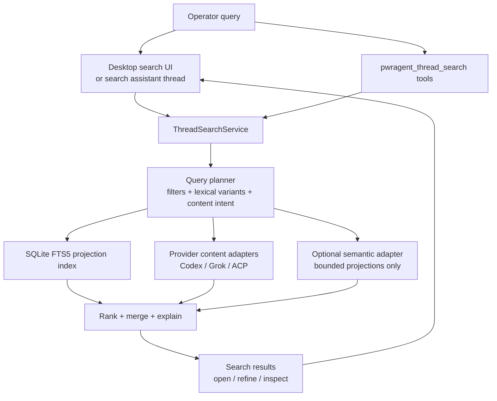

# feat: Add agentic thread search

## Overview

Add a thread search feature that lets an operator ask approximate questions like "find the thread named..." or "where did I ask about..." and get ranked, inspectable thread candidates. The first version should be hybrid but conservative: database-backed metadata filters and SQLite FTS5 over PwrAgent-owned searchable projections first, provider-backed content search only through supported protocol surfaces, and semantic search as an optional later layer over bounded projections or excerpts.

The core product bet is that the model should help plan searches, generate lexical variants, and decide when to ask a clarifying question, while the search service remains deterministic, bounded, provenance-rich, and respectful of provider storage boundaries.

---

## Problem Frame

Users often remember old threads imprecisely. They may have the title wrong, remember the project but not the date, remember a topic discussed inside the transcript, or ask for a thread by a rough description. A simple title filter will miss many useful matches; a naive full-history semantic index would be expensive, slow to backfill, privacy-sensitive, and likely to violate existing storage boundaries.

PwrAgent also has a deliberate persistence model:

- Desktop SQLite stores structured control-plane state such as thread metadata, overlays, launchpad defaults, messaging bindings, and approvals.
- Full conversation history remains owned by each provider. Codex App Server threads are restored from Codex-owned data. ACP providers should restore through `session/load` where available. Agent-Core/Grok stores history in append-only JSONL rollout files.
- PwrAgent code must not read Codex-owned session JSONL, rollout files, or sqlite databases directly. It must use the Codex App Server protocol or another supported provider surface.

PwrSnap's capture-library search sidecar gives the useful pattern: duplicate compact searchable projections into a local SQLite FTS index, keep bulky source material where it belongs, and expose bounded read-only search tools to a chat agent.

---

## Requirements

### Retrieval Behavior

- R1. Support searches by approximate title, exact title, project key, linked directory, folder path, backend, creation time, recent activity time, archive state, model, branch, and pinned or curated state.
- R2. Support natural-language topic queries such as "where did I ask about branch drift screenshots last week" by extracting likely filters, generating lexical variants, and searching available metadata, FTS projections, and provider content adapters.
- R3. Return ranked thread candidates with match reasons, provenance, and snippets where available.
- R4. Clearly distinguish high-confidence direct hits from low-confidence candidate sets, and ask for refinement when the top candidates are ambiguous.
- R5. Never fabricate transcript evidence. If provider content search is unavailable, results must say that only metadata/projection search was performed.

### Storage and Boundary Behavior

- R6. Do not store full prompts, assistant messages, streamed transcript updates, command output history, or provider rollout events in desktop SQLite.
- R7. Do not read Codex-owned storage files directly. Codex full-text search must go through Codex App Server, an ACP-backed provider capability, or another supported protocol capability.
- R8. Store only compact PwrAgent-owned searchable projections in SQLite, such as title, provider summary, project key, linked directory labels, normalized path tokens, branch, backend, model, timestamps, and archive state. Transcript snippets should be returned by provider content adapters at query time, not persisted in `state.db`, unless a provider explicitly exposes a durable searchable summary/projection contract.
- R9. Keep the projection index incrementally refreshed from `listThreads`, navigation snapshot hydration, thread overlay updates, provider notifications, and explicit reindex requests.

### Agent and UX Behavior

- R10. Expose bounded read-only thread-search tools to an agent/search thread so the model can decompose approximate user requests into concrete searches.
- R11. Enforce caps, argument validation, authorization, and result truncation in the tool handler, not in the model prompt.
- R12. Provide a desktop search surface that lets the operator run/refine a query, inspect why a result matched, and open the selected thread.
- R13. Keep the navigation filter lightweight. Thread search is a richer search workflow, not a replacement for the existing sidebar list filter.

### Semantic Search Behavior

- R14. Ship v1 without automatic full-history vectorization.
- R15. Allow local semantic search only as an opt-in, bounded index over searchable projections or provider-approved excerpts. Excerpt indexing must use an explicit provider/owner contract and must not silently turn `state.db` into a transcript store.
- R16. Treat remote embeddings as opt-in only, with explicit privacy and budget controls. Never remote-vectorize all history by default.

### Quality Gates

- R17. Add regression tests proving Codex storage is not accessed directly.
- R18. Add ranking tests for exact title, approximate title, metadata filters, lexical variants, low-confidence ambiguity, and provider-content-unavailable cases.
- R19. Add migration and FTS tests for fresh profiles, upgraded profiles, query sanitization, and projection refresh.
- R20. Add UI tests for search submission, no-results state, result opening, and text/snippet overflow.

---

## Scope Boundaries

### In Scope

- A shared thread-search contract and desktop IPC surface.
- A desktop-main `ThreadSearchService` that coordinates query planning, metadata search, provider search adapters, ranking, and result materialization.
- A SQLite FTS5 projection index for PwrAgent-owned searchable thread fields.
- Provider content-search adapters that use supported backend capabilities and return explicit unavailable states when no capability exists.
- Bounded read-only dynamic tools for agent-driven search planning.
- A desktop renderer search panel or search mode for entering queries, viewing candidates, and opening a thread.
- Tests and docs that lock the storage boundary.

### Out of Scope

- Direct `rg` over Codex session files, rollout files, or Codex sqlite databases.
- Storing full transcript history in desktop SQLite.
- Default-on vectorization of all Codex or PwrAgent history.
- Cross-device sync of the search index.
- A general chat-history data warehouse.
- Replacing the existing navigation lenses or sidebar filter.
- Making ACP providers implement content search in this plan; adapters can expose capability-detected unavailable states until providers add support.

---

## Context and Research

### Current PwrAgent Shape

- `docs/thread-history-persistence.md` states that desktop SQLite must not store thread conversation history. It may persist scalar metadata derived from history, but full messages and rollout events stay in provider-owned stores.
- `docs/state-layout.md` documents `state.db` as profile-local structured state, including thread overlays, backends, messaging, launchpads, ACP sessions, and automations.
- `apps/desktop/src/main/app-server/backend-registry.ts` already normalizes thread operations across Codex, Grok, and ACP backends. `BackendClient.listThreads` accepts a simple `filter`, but there is no richer search contract.
- `packages/shared/src/contracts/normalized-app-server.ts` already exposes enough thread summary metadata for a strong first search index: id, title, title source, summary, project key, timestamps, archive state, linked directories, git branch, source/backend, execution mode, model, service tier, and reasoning effort.
- `apps/desktop/src/main/automations/automation-inspection-codex-tools.ts` is the nearest pattern for exposing PwrAgent-owned read-only operations as Codex dynamic tools with namespace, schemas, argument normalization, JSON responses, and execution-time authorization.
- `packages/agent-core/src/tools/search-code-tool.ts` is the local pattern for controlled ripgrep usage: structured arguments, caps, read-only classification, fallback behavior, and no raw shell surface exposed to the model.

### PwrSnap Reference

Reference paths below are relative to the local PwrSnap checkout.

- `apps/desktop/src/main/persistence/migrations/0017_capture_search_fts.sql` creates a normal FTS5 virtual table over capture metadata, duplicates searchable text intentionally, and avoids external-content FTS footguns.
- `apps/desktop/src/main/persistence/captures-repo.ts` chooses between an FTS query plan and a filter-only recent-list plan, sanitizes FTS input, uses prepared statements, returns snippets, and caps limits.
- `apps/desktop/src/main/ai/chat-thread-store.ts` stores chat-thread metadata in SQLite while keeping turn journals in append-only JSONL, which matches PwrAgent's "metadata in DB, transcript elsewhere" model.
- `apps/desktop/src/main/ai/library-tool-allowlist.ts` and `apps/desktop/src/main/ai/library-tool-catalog.ts` expose bounded read-only library search tools to a chat agent and return compact JSON.

The transfer is not "put chat history in SQLite." The transfer is "put compact searchable projections in SQLite FTS, keep source history owned by its provider, and give the model safe search tools."

### Current FTS and Vector Options

- SQLite FTS5 is built for local full-text search and supports configurable tokenizers, snippets/highlighting, ranking helpers, prefix indexes, and tokenizer choices such as `unicode61`, `porter`, and `trigram`. The official docs show `unicode61` tokenization options, diacritic behavior, prefix indexes, and trigram substring matching. Source: <https://sqlite.org/fts5.html>
- `sqlite-vec` is a small local vector-search SQLite extension and successor to `sqlite-vss`, but its repository states it is pre-v1 and may have breaking changes. Source: <https://github.com/asg017/sqlite-vec>
- `sentence-transformers/all-MiniLM-L6-v2` maps text to 384-dimensional embeddings and is a small, common local semantic-search baseline. Source: <https://huggingface.co/sentence-transformers/all-MiniLM-L6-v2>
- `BAAI/bge-small-en-v1.5` is also 384-dimensional with 512-token sequence length in its model table and is a strong small English retrieval baseline. Source: <https://huggingface.co/BAAI/bge-small-en-v1.5>
- `nomic-ai/nomic-embed-text-v1.5` supports 8192 sequence length and Matryoshka dimensionality tradeoffs from 768 down to 64 dimensions. Source: <https://huggingface.co/nomic-ai/nomic-embed-text-v1.5>
- `Qwen/Qwen3-Embedding-0.6B` supports longer context and output dimensions up to 1024, but a 0.6B-parameter model is materially heavier than the small embedding baselines for a default desktop feature. Source: <https://huggingface.co/Qwen/Qwen3-Embedding-0.6B>
- OpenAI's embedding guide describes embeddings as a search/clustering primitive and notes model parameters for controlling output size. Source: <https://developers.openai.com/api/docs/guides/embeddings>

Practical conclusion: local semantic search is plausible for bounded projections, but a default full-history vector backfill is the wrong v1. A multi-GB history can produce a very large chunk count, multi-GB embedding storage, long CPU backfill time, native packaging complexity if using a SQLite vector extension, and privacy/cost concerns if using remote embeddings.

---

## Key Technical Decisions

- KTD1. Build a dedicated `ThreadSearchService` in the desktop main process instead of overloading `listThreads(filter)` or the navigation filter.
- KTD2. Use SQLite FTS5 for v1 metadata/projection search. It is local, already compatible with the current profile DB architecture, and mirrors PwrSnap's successful search sidecar pattern.
- KTD3. Store only compact searchable projections in SQLite. Full transcript search is delegated to provider adapters that use supported provider capabilities.
- KTD4. Codex content search must be capability-based. If Codex App Server, ACP, or another supported protocol surface does not expose a content-search method, the Codex adapter returns `unavailable`, and the UI/tool response says only metadata search was performed.
- KTD5. Grok/Agent-Core content search may be implemented behind an Agent-Core-owned API because Agent-Core owns its rollout store. Desktop should still call through a service/client abstraction rather than crawling files itself.
- KTD6. ACP content search is capability-detected. Prefer provider `session/load` or provider-native search when available; otherwise search only PwrAgent-owned fallback JSONL if that fallback exists and is explicitly owned by desktop.
- KTD7. Agentic search means "model plans tool calls," not "model ranks invisible data." The service returns deterministic ranked candidates with match reasons; the model can refine, explain, or ask follow-up questions.
- KTD8. Semantic search is phase-2/opt-in. Start with an interface and capability reporting, but no default local model dependency, no native vector extension dependency, and no remote embedding calls in v1.
- KTD9. Ranking blends deterministic signals: exact title/name match, title token overlap, FTS rank, field match weight, directory/project/time filters, provider content hit, recency, archive state, and pinned/user curation.
- KTD10. All result payloads are bounded and provenance-rich. Search tools return IDs, titles, metadata, snippets, match reasons, searched scopes, unavailable scopes, and truncation flags.

---

## High-Level Technical Design

### Provider Boundary Table

| Source | Searchable in v1 | Full transcript strategy | Boundary |
| --- | --- | --- | --- |
| Desktop overlay / navigation metadata | Yes | N/A | PwrAgent-owned SQLite projection |
| Codex App Server | Metadata yes, content only if protocol supports it | Use Codex App Server, ACP, or another supported protocol method | Never direct-read Codex storage |
| Agent-Core/Grok | Metadata yes, content via Agent-Core-owned API | Add/search through Agent-Core abstractions over its rollout store | Desktop does not crawl arbitrary provider internals |
| ACP providers | Metadata yes, content capability-detected | Provider-native search or `session/load`; fallback only for desktop-owned JSONL | Adapter returns unavailable when provider cannot search |
| Optional semantic index | Projection/excerpt only | No raw-history default | Explicit setting, caps, local-first |

---

## Implementation Units

- [ ] **Unit 1: Define shared thread-search contracts and IPC**

**Goal:** Establish stable request/response types for thread search without coupling renderer code to backend internals.

**Requirements:** R1-R5, R10-R13

**Dependencies:** None

**Files:**
- Add: `packages/shared/src/contracts/thread-search.ts`
- Modify: `packages/shared/src/index.ts`
- Modify: `apps/desktop/src/shared/ipc.ts`
- Modify: `apps/desktop/src/preload/index.ts`
- Test: `packages/shared/src/contracts/__tests__/thread-search.test.ts`
- Test: `apps/desktop/src/main/__tests__/thread-search-ipc.test.ts`

**Approach:**
- Define `ThreadSearchRequest`, `ThreadSearchFilters`, `ThreadSearchScope`, `ThreadSearchResult`, `ThreadSearchMatchReason`, `ThreadSearchSnippet`, `ThreadSearchUnavailableScope`, and `ThreadSearchResponse`.
- Include `query`, `backendScope`, `threadScope`, `dateRange`, `projectKeys`, `directoryIds`, `directoryPaths`, `includeArchived`, `limit`, `contentMode`, and `semanticMode`.
- Include result fields for `backend`, `threadId`, `identityKey`, `title`, `summary`, `projectKey`, timestamps, linked directories, source, score, confidence band, match reasons, snippets, searched scopes, unavailable scopes, and truncation flags.
- Add a desktop IPC channel such as `threadSearch:search` and an optional `threadSearch:refreshIndex`.
- Keep renderer access behind preload APIs and shared contracts.

**Tests:**
- Contract validation rejects malformed limits, unknown scopes, inverted dates, and empty all-whitespace queries unless a filter-only search is requested.
- Identity keys round-trip across backend/thread pairs.
- IPC handler returns structured validation errors instead of throwing opaque errors.

- [ ] **Unit 2: Add SQLite FTS projection store**

**Goal:** Maintain a local searchable projection index over PwrAgent-owned thread metadata.

**Requirements:** R1-R9, R17-R19

**Dependencies:** Unit 1

**Files:**
- Modify: `apps/desktop/src/main/state/state-db.ts`
- Add: `apps/desktop/src/main/thread-search/thread-search-store.ts`
- Add: `apps/desktop/src/main/thread-search/thread-search-fts-query.ts`
- Test: `apps/desktop/src/main/thread-search/__tests__/thread-search-store.test.ts`
- Test: `apps/desktop/src/main/state/__tests__/state-db-migrations.test.ts` or the existing migration test location

**Approach:**
- Bump the profile state DB version and add a normal FTS5 virtual table plus a compact metadata table. Do not use external-content FTS unless the implementation proves update/delete semantics are safer in this schema.
- Store one projection row per backend/thread identity. Suggested searchable columns: `title`, `summary`, `project_key`, `directory_labels`, `directory_path_tokens`, `git_branch`, `git_origin_tokens`, `model`, and `backend_label`. Do not persist transcript snippets in this table.
- Store non-indexed metadata needed for filtering and rendering: backend, thread id, identity key, created/updated/archived timestamps, source, title source, pinned state, linked directory ids, and serialized compact display metadata.
- Build FTS query helpers inspired by PwrSnap's `buildFts5Query`: tokenize user input, quote tokens, support prefix matching, cap token count, and fall back to filter-only search when no usable tokens exist.
- Consider a second trigram FTS table later for substring-heavy title/path search, but do not add that complexity until ranking tests prove token/prefix search misses common cases.

**Tests:**
- Fresh and upgraded DBs include the search tables.
- Upsert, delete, archive, and refresh operations keep rows consistent.
- FTS search handles diacritics, prefixes, punctuation, branch names, and path-like input.
- Query sanitizer prevents raw FTS syntax injection and handles empty or symbol-only input.
- No table stores full transcript payloads.

- [ ] **Unit 3: Implement `ThreadSearchService`, query planning, and ranking**

**Goal:** Coordinate metadata/FTS search and deterministic ranking before adding provider content search.

**Requirements:** R1-R5, R9, R12-R13, R18

**Dependencies:** Units 1-2

**Files:**
- Add: `apps/desktop/src/main/thread-search/thread-search-service.ts`
- Add: `apps/desktop/src/main/thread-search/thread-search-query-planner.ts`
- Add: `apps/desktop/src/main/thread-search/thread-search-ranking.ts`
- Modify: `apps/desktop/src/main/ipc/app-server.ts` or the appropriate IPC registration module
- Test: `apps/desktop/src/main/thread-search/__tests__/thread-search-service.test.ts`
- Test: `apps/desktop/src/main/thread-search/__tests__/thread-search-ranking.test.ts`

**Approach:**
- Hydrate or refresh projections from `BackendClient.listThreads({ archived, enrichDirectories })`, overlay state, and navigation snapshot sources.
- Extract simple deterministic filters from user text where reliable: quoted title fragments, `last week` or explicit dates, backend names, directory/project labels, archive terms, branch-looking tokens, and model names.
- Generate lexical variants conservatively: original query, dequoted phrase, title-heavy tokens, path/branch token variants, and a limited synonym set for PwrAgent domain terms.
- Run FTS/projection search and filter-only search as needed, merge duplicate backend/thread candidates, and score deterministically.
- Return confidence bands: `high` for exact/near-exact title or strong combined evidence, `medium` for plausible candidates, `low` for weak matches requiring refinement.

**Tests:**
- Exact title beats fuzzy title.
- Wrong title with overlapping tokens still returns likely candidates.
- Time/project/directory filters constrain results.
- Archive filters do not leak archived rows by default.
- Ambiguous top scores return multiple candidates and a refinement hint.
- Provider-content-unavailable is represented without failing the whole response.

- [ ] **Unit 4: Add provider content-search adapters**

**Goal:** Search transcript/content only through provider-owned or supported capabilities.

**Requirements:** R2-R8, R17-R18

**Dependencies:** Units 1-3

**Files:**
- Add: `apps/desktop/src/main/thread-search/thread-search-provider-adapters.ts`
- Modify: `apps/desktop/src/main/app-server/backend-registry.ts`
- Modify: `apps/desktop/src/main/grok-app-server/client.ts` if Agent-Core gets or already has a content-search method
- Modify: `apps/desktop/src/main/codex-app-server/client.ts` only for capability detection or a supported search method, not filesystem access
- Test: `apps/desktop/src/main/thread-search/__tests__/thread-search-provider-adapters.test.ts`
- Test: `apps/desktop/src/main/__tests__/codex-storage-boundary.test.ts` or extend the existing lint/test coverage

**Approach:**
- Define a `ThreadContentSearchAdapter` interface with `getCapabilities()` and `searchContent(request)` returning hits or explicit unavailable reasons.
- Codex adapter: detect protocol/server capability. If no supported method exists, return unavailable with a user-safe reason. Do not add fallback filesystem reads.
- Grok adapter: route through Agent-Core-owned APIs because Agent-Core owns its rollout persistence. If no API exists yet, this unit can add one in `packages/agent-core` behind the app-server client.
- ACP adapter: use provider-native search if advertised. Otherwise, optionally load bounded provider history through `session/load` only when that is the provider contract and caps make it safe. Do not cache full transcripts in SQLite.
- Normalize provider hits into snippets with source, field, thread id, score contribution, and truncation state.

**Tests:**
- Codex adapter never references Codex storage paths and returns unavailable when the protocol lacks search.
- Grok adapter searches through a client/service abstraction and returns bounded snippets.
- ACP adapter respects capability detection and does not throw when providers cannot search.
- Provider errors degrade to unavailable scopes unless the request itself is invalid.

- [ ] **Unit 5: Expose bounded thread-search tools to agent threads**

**Goal:** Let a chat/search agent plan and execute thread searches while the service enforces safety and result bounds.

**Requirements:** R10-R11, R17-R18

**Dependencies:** Units 1-4

**Files:**
- Add: `apps/desktop/src/main/thread-search/thread-search-tool-catalog.ts`
- Add: `apps/desktop/src/main/thread-search/thread-search-codex-tools.ts`
- Modify: `apps/desktop/src/main/app-server/backend-registry.ts`
- Modify: `packages/shared/src/contracts/thread-search.ts`
- Test: `apps/desktop/src/main/thread-search/__tests__/thread-search-codex-tools.test.ts`

**Approach:**
- Add a namespace such as `pwragent_thread_search`.
- Start with read-only tools:
  - `search_threads`: runs a bounded search and returns compact ranked candidates.
  - `get_thread_search_result`: expands one result with full metadata and bounded snippets.
  - `list_thread_search_capabilities`: reports searchable scopes by backend and why scopes may be unavailable.
- Match the automation-inspection dynamic-tool pattern: schema catalog, namespace check, argument normalization, handler injection, JSON response, and execution-time authorization.
- Authorize tools only for eligible PwrAgent-managed search/agent contexts. Return `forbidden` or `unavailable` explicitly when called outside the allowed context.
- Keep results compact enough for iterative search. Use IDs for follow-up expansion instead of dumping every snippet in the first tool result.

**Tests:**
- Tool schemas match shared contracts.
- Invalid args return model-correctable errors.
- Unauthorized calls are denied.
- Large result sets are capped and marked truncated.
- Tool responses include searched scopes and unavailable scopes.

- [ ] **Unit 6: Build the desktop search surface**

**Goal:** Give the operator a practical search workflow without disrupting the thread-first navigation model.

**Requirements:** R1-R5, R12-R13, R20

**Dependencies:** Units 1-5 can be partially parallel after Unit 1

**Files:**
- Add: `apps/desktop/src/renderer/src/features/thread-search/ThreadSearchPanel.tsx`
- Add: `apps/desktop/src/renderer/src/features/thread-search/useThreadSearch.ts`
- Modify: `apps/desktop/src/renderer/src/App.tsx` or the current shell/navigation component
- Modify: `apps/desktop/src/renderer/src/styles/app.css`
- Test: `apps/desktop/src/renderer/src/features/thread-search/__tests__/ThreadSearchPanel.test.tsx`
- E2E: `apps/desktop/e2e/thread-search.spec.ts` if current fixture support makes this feasible

**Approach:**
- Add a search affordance in the sidebar or command surface that opens a focused thread-search panel.
- Show result rows with title, backend, project/directory, last activity, confidence, match reasons, and one or two bounded snippets.
- Make unavailable scopes visible but not noisy, for example "Codex content search unavailable; searched title/project/directory metadata."
- Support refining the query and filters without losing the current result set.
- Opening a result should call the existing thread-show/open path rather than creating a separate navigation mechanism.
- Follow the desktop style guide and existing chrome tokens. This is an operational surface, so keep it dense, scannable, and restrained.

**Tests:**
- Search submits and renders ranked results.
- Empty/no-results state distinguishes "no matches" from "content search unavailable."
- Result open calls the expected desktop API.
- Long titles, path snippets, and branch names do not overflow their containers.

- [ ] **Unit 7: Add semantic-search scaffolding behind explicit opt-in**

**Goal:** Prepare for local semantic search without making vectors part of the v1 critical path.

**Requirements:** R14-R16

**Dependencies:** Units 1-3

**Files:**
- Add: `apps/desktop/src/main/thread-search/thread-search-semantic-adapter.ts`
- Modify: `packages/shared/src/contracts/thread-search.ts`
- Modify: settings files only if the first implementation exposes a setting
- Test: `apps/desktop/src/main/thread-search/__tests__/thread-search-semantic-adapter.test.ts`

**Approach:**
- Define an adapter interface and capability reporting for `disabled`, `local_projection_index`, `local_excerpt_index`, and `remote_embedding_index`.
- Default to disabled.
- Do not add a bundled model or vector SQLite extension in v1 unless a later implementation unit explicitly accepts the packaging and backfill cost.
- If local semantic search is implemented later, start with projection/excerpt embeddings only. Suitable first candidates are small 384-dimensional models such as `all-MiniLM-L6-v2` or `bge-small-en-v1.5`; higher-context models such as Nomic or Qwen should be evaluated only for explicit opt-in profiles.
- If remote embeddings are implemented later, require operator opt-in, explicit provider/model selection, index-size estimate, and cancellation/backpressure.

**Tests:**
- Semantic mode is disabled by default.
- Requests asking for semantic search report disabled capability instead of silently using remote calls.
- No remote embedding client is invoked without explicit settings.
- Indexing caps prevent whole-history backfills.

- [ ] **Unit 8: Update docs, lint gates, and rollout fixtures**

**Goal:** Lock in the storage-boundary decision and make the feature maintainable.

**Requirements:** R6-R9, R17-R20

**Dependencies:** Units 1-7

**Files:**
- Modify: `docs/thread-history-persistence.md`
- Modify: `docs/state-layout.md`
- Modify: `apps/desktop/AGENTS.md` if a local thread-search caveat is needed
- Modify or add tests for `pnpm lint:codex-storage`
- Optional E2E fixture updates under `apps/desktop/e2e/fixtures/` using the fixture seeding workflow if UI E2E coverage needs stable replay data

**Approach:**
- Document that thread search projections are allowed desktop metadata, while full transcripts remain disallowed in SQLite.
- Document the new DB tables and what they may contain.
- Add lint/test coverage for obvious forbidden direct Codex storage access patterns.
- Add a short implementation note explaining provider unavailable states so future contributors do not "fix" them by crawling private files.

**Tests:**
- `pnpm lint:codex-storage`
- `pnpm lint:sql`
- Focused Vitest suites for search contracts, store, service, providers, and UI.
- `pnpm test:desktop-e2e` for the search flow if the fixture is added.

---

## Acceptance Examples

- Query: `find the thread called desktop refresh thing`
  - Expected: exact and approximate title/project matches are searched first. Results show title candidates with match reasons such as `title_token_overlap`, `project_match`, and `recent_activity`.

- Query: `where did I ask about branch drift dialog screenshots last week`
  - Expected: planner extracts branch-drift/screenshot terms and a date window, searches metadata/FTS, asks provider adapters for content search, and returns snippets where available. If Codex content search is unavailable, the result states that Codex transcript content was not searched.

- Query: `find my kimi yolo thread in the pwragent folder`
  - Expected: backend/model/runtime-ish terms and directory tokens influence ranking. Directory-linked threads beat unrelated title-only matches.

- Query: `that thread about vectorizing all my codex history`
  - Expected: lexical metadata/projection search runs first; semantic search is not required. If no strong candidate exists, the search assistant offers focused refinements such as date range, backend, or directory.

- Disabled semantic mode:
  - Expected: `semanticMode: "required"` returns a clear disabled/unavailable scope, not a remote embedding call.

---

## Risks and Mitigations

- Risk: A future implementation crawls Codex-owned files because provider content search is unavailable.
  - Mitigation: adapter tests, `lint:codex-storage`, docs, and explicit unavailable states.

- Risk: The projection index drifts from provider state.
  - Mitigation: refresh on list/hydration, listen to thread overlay updates, add explicit reindex, and test stale/deleted rows.

- Risk: Model-driven search hallucinates evidence.
  - Mitigation: tools return structured provenance and snippets; UI distinguishes searched/unavailable scopes; ranking is deterministic.

- Risk: FTS5 misses substring-heavy or typo-heavy queries.
  - Mitigation: start with token/prefix variants, add trigram title/path index only if ranking tests show a real need.

- Risk: Native vector extensions complicate Electron packaging.
  - Mitigation: semantic adapter disabled by default; no vector native dependency in v1.

- Risk: Full-history embedding backfills are slow, expensive, and privacy-sensitive.
  - Mitigation: no default whole-history vectorization; local projection/excerpt caps; remote embedding opt-in with budget controls.

- Risk: Search result payloads become too large for agent tool loops.
  - Mitigation: caps, truncation flags, two-step result expansion, and compact JSON.

---

## Suggested Delivery Order

1. Units 1-3: shared contracts, FTS projection store, search service, and deterministic ranking. This gives useful metadata/title/project/directory search without touching provider transcript content.
2. Unit 4: provider content adapters with unavailable states first, then add real provider search only where supported.
3. Unit 5: agent dynamic tools once the service can already return bounded, provenance-rich results.
4. Unit 6: renderer search surface.
5. Unit 8: docs and lint gates should land with the first PR that introduces the projection store, then expand as provider adapters arrive.
6. Unit 7: semantic scaffolding can land after the lexical path is useful; actual local model integration should be a separate explicit decision.

---

## Open Questions

- Should the first UI be a sidebar search panel, a command-palette style overlay, or a dedicated search thread? Recommendation: ship a sidebar/search-panel workflow first, then let a chat/search thread use the same service and tools.
- Should provider content search be synchronous only, or should large providers return an async search run ID? Recommendation: synchronous for metadata and small provider searches; design contracts so a future async search run can be added without changing result shape.
- Should title typo tolerance use trigram FTS, edit distance, or model-generated variants? Recommendation: start with token/prefix variants and exact-ish ranking; add trigram title/path only if real test cases fail.
- Should local semantic search use a bundled model, Ollama/llama.cpp, Transformers.js, or a user-configured embedding endpoint? Recommendation: do not decide in v1. Keep adapter boundaries and require an explicit follow-up plan once lexical search is working.
- What exact provider protocol method should Codex expose for full-text thread search? Recommendation: keep this plan honest by returning unavailable until Codex App Server, ACP, or another supported protocol surface offers a supported search or transcript-query method.

---

## Research Sources

- PwrAgent: `docs/thread-history-persistence.md`
- PwrAgent: `docs/state-layout.md`
- PwrAgent: `apps/desktop/src/main/app-server/backend-registry.ts`
- PwrAgent: `apps/desktop/src/main/automations/automation-inspection-codex-tools.ts`
- PwrAgent: `packages/shared/src/contracts/normalized-app-server.ts`
- PwrAgent: `packages/agent-core/src/tools/search-code-tool.ts`
- PwrSnap reference: `apps/desktop/src/main/persistence/migrations/0017_capture_search_fts.sql`
- PwrSnap reference: `apps/desktop/src/main/persistence/captures-repo.ts`
- PwrSnap reference: `apps/desktop/src/main/ai/chat-thread-store.ts`
- SQLite FTS5 docs: <https://sqlite.org/fts5.html>
- sqlite-vec: <https://github.com/asg017/sqlite-vec>
- all-MiniLM-L6-v2 model card: <https://huggingface.co/sentence-transformers/all-MiniLM-L6-v2>
- BGE small English v1.5 model card: <https://huggingface.co/BAAI/bge-small-en-v1.5>
- Nomic Embed Text v1.5 model card: <https://huggingface.co/nomic-ai/nomic-embed-text-v1.5>
- Qwen3 Embedding 0.6B model card: <https://huggingface.co/Qwen/Qwen3-Embedding-0.6B>
- OpenAI embeddings guide: <https://developers.openai.com/api/docs/guides/embeddings>
