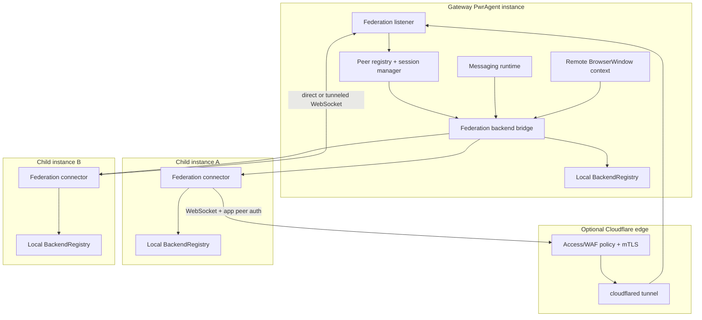
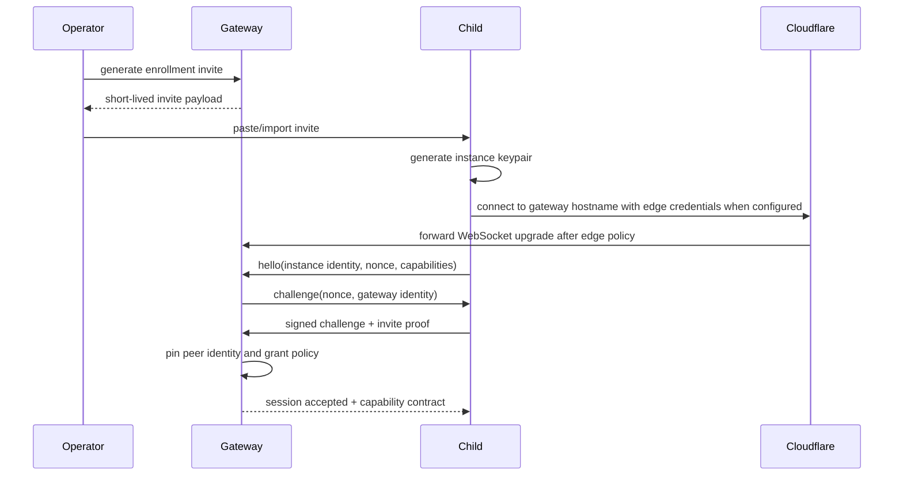
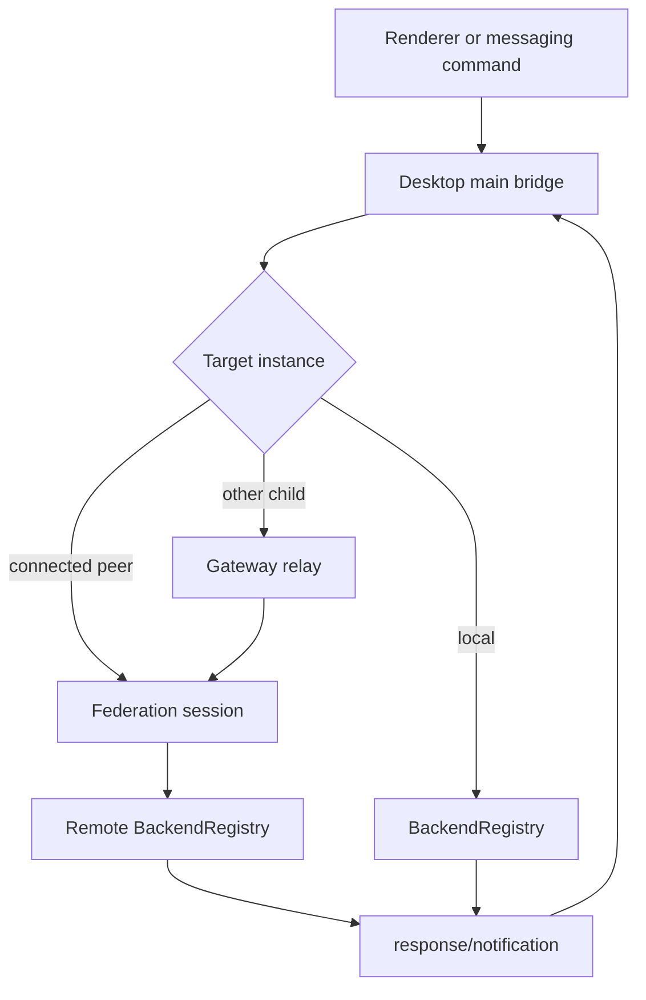
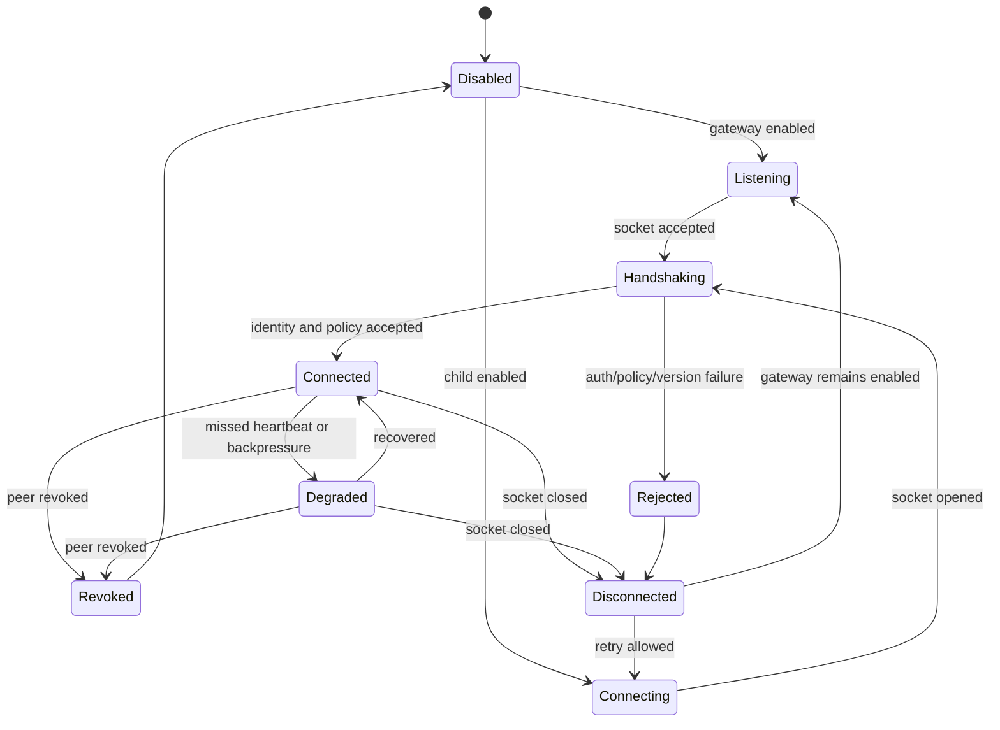

# feat: add secure PwrAgent instance federation

## Summary

This plan adds a secure federation layer where one PwrAgent instance can act as a gateway for locally and remotely connected PwrAgent instances. The first build supports Cloudflare Tunnel as the remote reachability path, a bidirectional authenticated WebSocket control plane, remote thread/window operation, federated search, and messaging routes that can target any authorized instance.

---

## Problem Frame

The operator wants one master PwrAgent instance that can reach child instances at home, on remote machines, or through a laptop-on-the-go posture without opening arbitrary public ports. The design must be secure enough for personal dogfooding, rich enough to validate remote UI and messaging workflows, and structured so a local-only or non-Cloudflare transport can be added later without rewriting thread, search, or messaging behavior.

The existing codebase has strong local patterns for thread operations through `BackendRegistry`, renderer IPC through `apps/desktop/src/main/ipc/app-server.ts`, and messaging orchestration through `apps/desktop/src/main/messaging/desktop-backend-bridge.ts`. It does not have an inter-instance transport, persistent peer identity model, or remote thread projection.

---

## Requirements

### Security and Enrollment

- R1. A gateway instance must accept federation traffic only from enrolled peer instances with revocable instance identity.
- R2. Cloudflare policy may block unauthenticated Internet traffic before it reaches the tunnel, but PwrAgent must still authenticate and authorize every peer at the application layer.
- R3. Direct local connections must support the same peer identity and authorization semantics as tunneled remote connections.
- R4. Private keys, Cloudflare service credentials, and enrollment secrets must be stored through the existing encrypted secret-store path and never written into plaintext config or logs.
- R5. Peer revocation must close active sessions and prevent reconnect with the revoked identity.

### Federation Protocol

- R6. Child instances must initiate long-lived bidirectional WebSocket sessions to the gateway and use the same channel for requests, responses, and backend notifications.
- R7. The protocol must support capability negotiation so older peers degrade safely when remote windows, search, or messaging routing features differ by version.
- R8. The gateway must route peer-to-peer requests through relay semantics rather than requiring children to connect directly to each other.
- R9. Requests must carry correlation ids, deadlines, actor/origin metadata, and redaction-safe error surfaces.

### Remote Operation

- R10. A local user must be able to open a separate PwrAgent window scoped to a remote instance/profile and operate remote threads as if they were local.
- R11. Remote actions such as thread start, turn steer, approvals, environment actions, scripts, and worktree operations must execute on the remote instance, not on the gateway machine.
- R12. Remote thread lists and thread detail views must clearly show the target instance without mixing remote execution context into the local default profile.

### Cross-Instance Features

- R13. Federated search must fan out across authorized connected instances, merge results, and preserve source instance identity in every result.
- R14. Messaging bindings on the gateway must be able to browse, bind, resume, and steer threads on authorized child instances.
- R15. Child instances must also be able to open remote windows or route requests through the gateway to another child or back to the gateway when authorization permits.

### Operations and Observability

- R16. Operators must be able to configure gateway/child mode, endpoint URL, local listen port, Cloudflare posture notes, and peer enrollment from Settings.
- R17. Federation health, last activity, protocol version, and authorization failures must be visible in a local diagnostics surface.
- R18. The implementation must preserve dependency-cruiser boundaries: renderer code imports only `@pwragent/shared`, messaging providers remain isolated, and desktop main owns orchestration.

---

## Key Technical Decisions

- KTD1. Add desktop-owned federation modules, not messaging-provider adapters: federation is a PwrAgent-to-PwrAgent control plane with richer privileges than ordinary messaging clients. It should reuse `BackendRegistry` and messaging bridge concepts but live under `apps/desktop/src/main/federation/`.
- KTD2. Use WebSocket over HTTP(S) as the first transport: Cloudflare documents WebSocket support for proxied HTTP requests, and Tunnel already exposes localhost services without a public origin IP. A direct localhost/LAN mode can use the same transport without Cloudflare.
- KTD3. Treat Cloudflare mTLS as an outer gate, not the only auth boundary: Cloudflare can require client certificates at the edge, but the localhost service must still perform peer authentication because tunnel/origin forwarding does not make Cloudflare's edge certificate validation equivalent to local process identity.
- KTD4. Use an application-level peer key handshake for PwrAgent identity: each instance has a generated asymmetric keypair and signed identity document; enrollment pins the public identity, not a bearer token. TLS client certs can be used for direct local mode, but the signed protocol handshake remains canonical across tunneled and direct transports.
- KTD5. Model remote instances as a new top-level desktop orchestration target, not as `AppServerBackendKind`: backend kind already means Codex/Grok/ACP runtime inside one instance. Federation adds an instance dimension above backend, so contracts should carry `{ instanceId, backend, threadId }` where remote identity matters.
- KTD6. Route remote windows through a dedicated window context: a remote window should have its own navigation snapshot source, transcript source, and command path so local and remote profiles do not silently share execution context.
- KTD7. Extend messaging at the bridge/controller boundary: gateway messaging should see remote threads through a federation-aware backend bridge, while provider packages keep the same generic adapter contract and never learn about remote instances.
- KTD8. Persist peer registry and audit state in sqlite, but keep private key material in the secret store: non-secret peer metadata belongs in `state.db`; secrets follow the existing `DbBackedSafeStorageSecretStore` pattern.

---

## High-Level Technical Design

### Component Topology

### Connection and Enrollment Flow

### Request Routing Model

### Peer Session State

---

## Scope Boundaries

### In Scope

- Gateway and child roles in the desktop app.
- Cloudflare Tunnel-compatible WebSocket transport.
- Edge mTLS guidance and in-app peer authentication.
- Remote window operation for thread navigation/detail/composer actions.
- Federated search across connected instances.
- Gateway messaging routing to local and remote threads.
- Relay routing through the gateway for child-to-child access.

### Deferred to Follow-Up Work

- A polished local-only transport that does not assume Cloudflare or a stable DNS hostname.
- Fully automated Cloudflare API provisioning of tunnels, hostnames, WAF rules, and Access policies.
- Multi-gateway mesh discovery or quorum behavior.
- End-user multi-tenant policy controls beyond the operator's personal trusted-instance model.
- Mobile native certificate installation workflows.

### Out of Scope

- Treating remote instances as ordinary Telegram/Discord/Slack/etc. providers.
- Running remote commands locally on the gateway for convenience.
- Allowing unauthenticated LAN discovery to auto-enroll peers.

---

## Implementation Units

### U1. Federation Contracts and Target Identity

**Goal:** Define shared type contracts for federated instance identity, target addressing, protocol envelopes, capabilities, health, and renderer-visible summaries.

**Requirements:** R6, R7, R8, R9, R10, R12, R13, R14, R18.

**Dependencies:** None.

**Files:**

- `packages/shared/src/contracts/federation.ts`
- `packages/shared/src/contracts/navigation.ts`
- `packages/shared/src/contracts/messaging.ts`
- `packages/shared/src/index.ts`
- `packages/shared/src/contracts/__tests__/federation.test.ts`
- `packages/shared/src/contracts/__tests__/navigation.test.ts`

**Approach:** Add a new shared federation contract rather than overloading backend or messaging contracts. Use `FederatedInstanceId`, `FederatedThreadRef`, `FederationProtocolEnvelope`, `FederationCapabilitySet`, `FederationPeerSummary`, and `FederationHealthStatus` as shared primitives. Keep protocol payloads typed around existing app-server request/response contracts where possible, but wrap them with source/target instance metadata and protocol version.

**Patterns to follow:** `packages/shared/src/contracts/normalized-app-server.ts` for app-server request shapes; `packages/shared/src/contracts/messaging.ts` for health/degradation status naming; `packages/shared/src/contracts/navigation.ts` for renderer-facing summaries.

**Test scenarios:**

- Happy path: a `FederatedThreadRef` with remote instance, backend, and thread id serializes without losing the local `AppServerBackendKind`.
- Edge case: local targets can be represented without a remote instance id so existing local-only callers do not need fake peer ids.
- Error path: invalid peer ids, protocol versions, and capability names fail normalization with redaction-safe messages.
- Integration: navigation summaries can include remote instance labels without requiring the renderer to import desktop-only code.

**Verification:** Shared contract tests cover target identity, capability negotiation types, and navigation/messaging extension compatibility.

### U2. Persistent Peer Registry, Secret Storage, and Config

**Goal:** Persist federation mode/configuration, enrolled peer metadata, revocation state, and encrypted peer private material.

**Requirements:** R1, R3, R4, R5, R16, R17, R18.

**Dependencies:** U1.

**Files:**

- `apps/desktop/src/main/state/state-db.ts`
- `apps/desktop/src/main/state/federation-store-sqlite.ts`
- `apps/desktop/src/main/settings/desktop-config.ts`
- `apps/desktop/src/main/settings/desktop-settings-service.ts`
- `apps/desktop/src/main/settings/desktop-secret-store.ts`
- `packages/shared/src/contracts/settings.ts`
- `apps/desktop/src/main/__tests__/federation-store.test.ts`
- `apps/desktop/src/main/__tests__/desktop-config.test.ts`
- `apps/desktop/src/main/__tests__/desktop-settings-service.test.ts`
- `packages/shared/src/contracts/__tests__/settings.test.ts`

**Approach:** Add sqlite tables for peer metadata, peer grants, invite records, session audit, and optional Cloudflare posture metadata. Store the local instance private key and any Cloudflare Access/service credentials through the existing secret-store abstraction. Add config keys under a new `[federation]` section with read-fallback and lazy conversion rules from `docs/config-file-evolution.md`.

**Execution note:** Add config and store tests before wiring runtime behavior because config shape is hard to change after dogfooding.

**Patterns to follow:** `messaging_pairing_tokens` and `app_runtime_instances` in `apps/desktop/src/main/state/state-db.ts`; `apps/desktop/src/main/messaging/desktop-messaging-pairing-store.ts`; encrypted secret access through `apps/desktop/src/main/state/secret-store-sqlite.ts`.

**Test scenarios:**

- Happy path: gateway config with a listen port, public endpoint, and enrolled peer round-trips through TOML and sqlite.
- Happy path: a child config with gateway URL and local identity id loads without requiring messaging to be enabled.
- Edge case: missing optional Cloudflare fields keeps local/direct mode valid.
- Error path: secret storage unavailable reports federation credentials as unavailable without writing plaintext fallback values.
- Error path: revoked peers remain stored for audit but cannot be returned as connectable peers.
- Integration: config patching preserves unrelated TOML comments and existing messaging settings.

**Verification:** Config, settings-service, shared settings, and sqlite store tests prove state persistence, encrypted secret routing, and backwards-compatible TOML edits.

### U3. Enrollment, Peer Authentication, and Session Policy

**Goal:** Implement invite-based enrollment, key generation, signed challenge/response, session policy evaluation, revocation, and heartbeat/backoff state.

**Requirements:** R1, R2, R3, R4, R5, R7, R9, R17.

**Dependencies:** U1, U2.

**Files:**

- `apps/desktop/src/main/federation/federation-identity.ts`
- `apps/desktop/src/main/federation/federation-enrollment.ts`
- `apps/desktop/src/main/federation/federation-policy.ts`
- `apps/desktop/src/main/federation/federation-session-state.ts`
- `apps/desktop/src/main/federation/federation-redaction.ts`
- `apps/desktop/src/main/__tests__/federation-identity.test.ts`
- `apps/desktop/src/main/__tests__/federation-enrollment.test.ts`
- `apps/desktop/src/main/__tests__/federation-policy.test.ts`

**Approach:** Generate a per-instance asymmetric keypair and expose short-lived enrollment invites from the gateway. During first connection, the child proves invite possession and key ownership; the gateway pins the public identity and grants explicit capabilities. Subsequent sessions authenticate with nonce signatures and check revocation/policy before protocol use. Do not trust Cloudflare-forwarded identity headers as the only peer identity signal.

**Technical design:** Directional guidance, not implementation specification: the handshake should have four phases: `hello`, `challenge`, `proof`, `accept/reject`. Every phase should include a protocol version, connection nonce, instance id, and redacted failure code so logs can diagnose bad certs, stale invites, and policy denials without logging secrets.

**Patterns to follow:** `apps/desktop/src/main/messaging/desktop-messaging-pairing-store.ts` for short-lived pairing; `packages/shared/src/messaging-id-validation.ts` for defensive identifier validation; the solution note in `docs/solutions/2026-05-07-codex-permission-mode-state-machine.md` for avoiding silent security fallbacks.

**Test scenarios:**

- Covers AE1. Happy path: a valid invite plus signed child challenge enrolls a peer and stores a pinned public identity.
- Happy path: an already-enrolled peer reconnects without an invite when its signature and policy match.
- Edge case: expired invite, reused invite, and invite for a different gateway are rejected.
- Error path: bad signatures, unknown peer ids, revoked peers, and capability-denied peers fail closed and log redacted diagnostics.
- Integration: revoking a peer terminates active sessions and prevents reconnect using the same identity.

**Verification:** Identity and policy tests cover first enrollment, reconnect, revocation, and redaction behavior without opening network sockets.

### U4. Federation Transport Runtime

**Goal:** Add the gateway listener, child connector, WebSocket envelope transport, request/response correlation, notification streaming, reconnect, and backpressure behavior.

**Requirements:** R2, R3, R6, R7, R8, R9, R15, R17.

**Dependencies:** U1, U2, U3.

**Files:**

- `apps/desktop/package.json`
- `apps/desktop/src/main/federation/federation-runtime.ts`
- `apps/desktop/src/main/federation/federation-listener.ts`
- `apps/desktop/src/main/federation/federation-connector.ts`
- `apps/desktop/src/main/federation/federation-transport.ts`
- `apps/desktop/src/main/federation/federation-protocol.ts`
- `apps/desktop/src/main/federation/federation-cloudflare.ts`
- `apps/desktop/src/main/index.ts`
- `apps/desktop/src/main/__tests__/federation-runtime.test.ts`
- `apps/desktop/src/main/__tests__/federation-transport.test.ts`
- `apps/desktop/src/main/__tests__/app-bootstrap.test.ts`

**Approach:** Add a direct `ws` dependency for Node WebSocket server/client support and keep the listener bound to configured loopback/local addresses by default. The gateway accepts WebSocket upgrades, delegates authentication to U3, and registers connected sessions. The child connector retries with bounded exponential backoff and exposes health transitions to Settings/diagnostics. Cloudflare-specific code should be limited to endpoint/policy metadata and header handling; it must not be required for direct local operation.

**Patterns to follow:** `DesktopMessagingRuntime` lifecycle queueing and health event emission in `apps/desktop/src/main/messaging/messaging-runtime.ts`; Mattermost callback listener hardening in `packages/messaging/providers/mattermost/src/mattermost-callback-server.ts`; app bootstrap wiring in `apps/desktop/src/main/index.ts`.

**Test scenarios:**

- Covers AE1. Happy path: child connects to a gateway through direct or Cloudflare-routed WebSocket, authenticates, negotiates capabilities, sends a request, receives a correlated response, and receives an async notification.
- Happy path: gateway listener binds only to configured host/port and reports health to subscribers.
- Edge case: peer reconnect replaces or rejects duplicate sessions according to policy without leaving stale listeners.
- Edge case: slow peer hits backpressure limits and degrades without blocking local registry events.
- Error path: malformed JSON, oversized envelopes, unknown message types, missed heartbeats, and deadline expiry close or reject safely.
- Integration: runtime start/stop through app bootstrap does not start when federation config is disabled.

**Verification:** Runtime tests exercise an in-process WebSocket gateway/child pair, protocol rejection paths, lifecycle stop/start, and health notifications.

### U5. Federation Backend Bridge and Relay

**Goal:** Bridge local app-server operations to remote instances and route child-to-child requests through the gateway relay.

**Requirements:** R6, R8, R9, R10, R11, R12, R15, R18.

**Dependencies:** U1, U3, U4.

**Files:**

- `apps/desktop/src/main/federation/federation-backend-bridge.ts`
- `apps/desktop/src/main/federation/federation-relay.ts`
- `apps/desktop/src/main/federation/federation-target-router.ts`
- `apps/desktop/src/main/app-server/backend-registry.ts`
- `apps/desktop/src/main/ipc/app-server.ts`
- `apps/desktop/src/main/messaging/desktop-backend-bridge.ts`
- `apps/desktop/src/main/__tests__/federation-backend-bridge.test.ts`
- `apps/desktop/src/main/__tests__/federation-relay.test.ts`
- `apps/desktop/src/main/__tests__/desktop-messaging-backend-bridge.test.ts`

**Approach:** Create a target router that can resolve local versus remote instance targets. Local operations continue to call `BackendRegistry`; remote operations serialize existing app-server requests over the federation protocol. The gateway relay authorizes both source peer and destination peer before forwarding, preserves correlation ids, and prevents loops with hop count/deadline fields.

**Technical design:** Directional guidance, not implementation specification: bridge operations should begin with the subset needed by remote windows and messaging: list/read thread, navigation snapshot, start/steer/interrupt/compact turn, submit pending request, set model/settings/execution mode, list skills, environment actions, and thread/workspace handoff. Low-use operations can be capability-gated rather than all shipped in the first unit.

**Patterns to follow:** `apps/desktop/src/main/messaging/desktop-backend-bridge.ts` for a narrow bridge over `BackendRegistry`; `BackendRegistry.onEvent` fan-out for notifications; `apps/desktop/src/main/ipc/app-server.ts` for renderer request shapes.

**Test scenarios:**

- Happy path: remote `getNavigationSnapshot`, `readThread`, and `startTurn` return the same response shape local callers expect, with source instance metadata added by the bridge.
- Happy path: remote backend notifications flow through the bridge to subscribed window/messaging consumers.
- Covers AE3. Happy path: a child-to-child request is authorized by the gateway and delivered to the destination child.
- Edge case: disconnected target returns a typed unavailable result rather than hanging.
- Error path: unauthorized source/destination combinations, expired deadlines, relay loops, and missing capabilities fail closed.
- Integration: existing local `DesktopMessagingBackendBridge` tests keep passing for local targets while new remote-target tests use a fake federation runtime.

**Verification:** Bridge and relay tests prove local behavior is preserved and remote/relay routing adds authorization, deadlines, and target metadata.

### U6. Remote Window Context and Renderer Integration

**Goal:** Let users open a separate PwrAgent window scoped to a remote instance/profile and operate remote threads through the federation bridge.

**Requirements:** R10, R11, R12, R16, R18.

**Dependencies:** U1, U5.

**Files:**

- `apps/desktop/src/main/window-open-remote-instance.ts`
- `apps/desktop/src/main/window-channels.ts`
- `apps/desktop/src/main/ipc/app-server.ts`
- `apps/desktop/src/preload/index.ts`
- `apps/desktop/src/shared/ipc.ts`
- `apps/desktop/src/renderer/src/App.tsx`
- `apps/desktop/src/renderer/src/lib/desktop-api.ts`
- `apps/desktop/src/renderer/src/lib/useThreadNavigation.ts`
- `apps/desktop/src/renderer/src/lib/useThreadTranscript.ts`
- `apps/desktop/src/renderer/src/features/navigation/Sidebar.tsx`
- `apps/desktop/src/renderer/src/features/thread-detail/ThreadHeader.tsx`
- `apps/desktop/src/main/__tests__/window-open-remote-instance.test.ts`
- `apps/desktop/src/main/__tests__/app-server-ipc.test.ts`
- `apps/desktop/src/renderer/src/__tests__/app-shell.test.tsx`
- `apps/desktop/src/renderer/src/lib/__tests__/useThreadNavigation.test.tsx`

**Approach:** Add a remote window creation path that injects a target instance context into preload/renderer bootstrap. Renderer hooks pass the target context through existing IPC calls without importing non-shared packages. The shell should visibly brand the remote instance/profile in chrome and thread headers, using existing titlebar/sidebar token patterns from `apps/desktop/src/renderer/src/styles/app.css`.

**Patterns to follow:** `apps/desktop/src/main/window-open-new-thread.ts` and `apps/desktop/src/main/window-show-thread.ts` for window routing; `apps/desktop/src/main/window.ts` for BrowserWindow hardening; existing renderer hooks for navigation and transcript state.

**Test scenarios:**

- Happy path: opening a remote instance window boots with the remote target context and fetches remote navigation.
- Covers AE2. Happy path: composer submission in a remote window sends `startTurn` to the remote instance.
- Edge case: if the remote disconnects while the window is open, the UI shows an unavailable state and does not fall back to local threads.
- Error path: window creation rejects unknown or unauthorized instance ids.
- Integration: local default windows continue to omit target context and use local IPC paths.

**Verification:** Main-process IPC/window tests cover target propagation; renderer tests cover remote labels, disabled states, and no local fallback.

### U7. Federated Search

**Goal:** Add cross-instance search that fans out to connected authorized peers, merges results, and preserves source identity.

**Requirements:** R13, R15, R17, R18.

**Dependencies:** U1, U5, U6.

**Files:**

- `apps/desktop/src/main/federation/federated-search-service.ts`
- `apps/desktop/src/main/ipc/app-server.ts`
- `apps/desktop/src/preload/index.ts`
- `apps/desktop/src/shared/ipc.ts`
- `apps/desktop/src/renderer/src/features/navigation/Sidebar.tsx`
- `apps/desktop/src/renderer/src/lib/useThreadNavigation.ts`
- `packages/shared/src/contracts/navigation.ts`
- `apps/desktop/src/main/__tests__/federated-search-service.test.ts`
- `apps/desktop/src/main/__tests__/app-server-ipc.test.ts`
- `apps/desktop/src/renderer/src/lib/__tests__/useThreadNavigation.test.tsx`

**Approach:** Start with thread finding rather than full transcript content search. Query local navigation/search data and all authorized connected peers in parallel with per-peer deadlines. Merge by relevance and recency, group or badge by source instance, and make partial failure visible without discarding successful peers.

**Patterns to follow:** navigation snapshot hydration in `apps/desktop/src/main/ipc/app-server.ts`; inbox/thread ranking logic in `packages/agent-core/src/domain/inbox.ts`; renderer sidebar search/filter patterns in `apps/desktop/src/renderer/src/features/navigation/Sidebar.tsx`.

**Test scenarios:**

- Covers AE5. Happy path: a query returns local and remote thread hits sorted with stable source labels.
- Edge case: one slow peer times out while other peers and local results still render.
- Edge case: duplicate-looking thread titles from different instances remain distinct.
- Error path: unauthorized peers are skipped and logged without revealing their thread metadata.
- Integration: selecting a remote search result opens or focuses the correct remote window context.

**Verification:** Search service tests cover fan-out, merge, timeout, authorization, and selection routing.

### U8. Messaging Routing Across Instances

**Goal:** Let gateway-hosted messaging browse, bind, resume, and steer threads that live on child instances while preserving provider-neutral adapter boundaries.

**Requirements:** R14, R15, R18.

**Dependencies:** U1, U5, U7.

**Files:**

- `apps/desktop/src/main/messaging/desktop-backend-bridge.ts`
- `apps/desktop/src/main/messaging/core/messaging-controller.ts`
- `apps/desktop/src/main/messaging/messaging-bindings-snapshot.ts`
- `apps/desktop/src/main/state/messaging-store-sqlite.ts`
- `packages/messaging/interface/src/index.ts`
- `packages/messaging/interface/src/__tests__/messaging-contract.test.ts`
- `apps/desktop/src/main/__tests__/messaging-controller.test.ts`
- `apps/desktop/src/main/__tests__/messaging-resume-browser.test.ts`
- `apps/desktop/src/main/__tests__/messaging-thread-state.test.ts`
- `apps/desktop/src/main/__tests__/desktop-messaging-backend-bridge.test.ts`

**Approach:** Extend binding and browse-session records with optional federated target metadata. The controller still produces channel-neutral intents and providers still render opaque callback handles. Remote operations go through the federation-aware backend bridge; status cards and browse results include source instance labels so operators know where a turn will run.

**Patterns to follow:** `docs/messaging-architecture.md` for workflow/provider separation; `docs/messaging-adapter-contract.md` for opaque callback state; `docs/plans/2026-05-02-001-refactor-messaging-live-thread-state-plan.md` for keeping live thread facts out of long-lived messaging bindings.

**Test scenarios:**

- Covers AE4. Happy path: `/resume` browse shows local and remote thread choices with source labels.
- Happy path: selecting a remote thread creates a binding whose callbacks route to the remote instance.
- Happy path: steering a bound remote thread sends the turn input to the child instance and delivers remote notifications back to the messaging surface.
- Edge case: remote binding remains visible but degraded when the child disconnects.
- Error path: revoked peer or removed remote thread causes callbacks to fail closed with a safe user-facing message.
- Integration: Telegram/Discord/provider tests do not need provider-specific changes because callback payloads remain opaque handles.

**Verification:** Messaging controller and backend bridge tests prove remote binding lifecycle, callback routing, degraded remote state, and provider-neutral behavior.

### U9. Settings, Diagnostics, and Operator Documentation

**Goal:** Expose federation setup and health in Settings, add diagnostics/audit surfaces, and document the Cloudflare Tunnel + mTLS posture.

**Requirements:** R2, R4, R5, R16, R17.

**Dependencies:** U2, U3, U4, U8.

**Files:**

- `apps/desktop/src/renderer/src/features/settings/FederationSettings.tsx`
- `apps/desktop/src/renderer/src/features/settings/SettingsScreen.tsx`
- `apps/desktop/src/renderer/src/features/settings/useDesktopSettings.ts`
- `apps/desktop/src/renderer/src/features/messaging-activity/MessagingActivityScreen.tsx`
- `apps/desktop/src/renderer/src/styles/app.css`
- `apps/desktop/src/main/ipc/settings.ts`
- `docs/federation.md`
- `docs/config-file-evolution.md`
- `apps/desktop/src/renderer/src/features/settings/FederationSettings.test.tsx`
- `apps/desktop/src/main/__tests__/settings-ipc.test.ts`
- `apps/desktop/src/main/__tests__/messaging-activity-log.test.ts`

**Approach:** Add a Settings section for mode selection, local listen endpoint, public gateway URL, invite generation/import, peer list, revocation, and health. Add operator documentation that distinguishes Cloudflare Tunnel reachability, Cloudflare edge mTLS, Access service tokens as an optional adjunct, and PwrAgent's mandatory app-level peer auth. Keep setup docs in this repo for contributor-facing architecture; operator-site walkthroughs can be added in the separate docs repo later.

**Patterns to follow:** `apps/desktop/src/renderer/src/features/settings/MessagingSettings.tsx` for secret-backed connection tests; `apps/desktop/src/renderer/src/features/messaging-activity/MessagingActivityScreen.tsx` for diagnostics; `docs/messaging-platform-integration.md` for Cloudflare/Tailscale deployment posture.

**Test scenarios:**

- Happy path: gateway mode displays endpoint, invite generation, enrolled peers, and active session health.
- Happy path: child mode accepts an invite payload, stores identity material through the secret store, and shows connection status.
- Edge case: Cloudflare fields are optional when direct local mode is selected.
- Error path: revoking a peer updates Settings state and the runtime health surface.
- Integration: Settings IPC redacts secrets and private keys in snapshots and logs.

**Verification:** Renderer and IPC tests cover settings state, redaction, peer revocation, and health rendering; docs explain the current Cloudflare-supported posture and the in-app auth boundary.

---

## Acceptance Examples

- AE1. Given a gateway with Cloudflare edge mTLS enabled and one enrolled child, when the child connects through the public hostname, then Cloudflare blocks clients without a valid edge certificate and PwrAgent still verifies the enrolled peer identity before accepting the WebSocket session.
- AE2. Given a local default window and a connected child instance, when the operator opens a remote child window and submits a prompt, then the prompt runs on the child machine and the local default profile remains unchanged.
- AE3. Given two connected child instances, when child A opens a thread on child B, then the request is relayed through the gateway, authorized against both peer policies, and executed by child B.
- AE4. Given gateway messaging is configured, when the operator runs a thread browse command from Telegram or Discord, then remote threads appear with source instance labels and selected remote bindings route callbacks to the owning child.
- AE5. Given one connected peer is slow or disconnected, when the operator runs federated search, then local and healthy-peer results still render with a visible partial-failure indication.

---

## System-Wide Impact

- **Security boundary:** Federation introduces remote control over machine-local coding agents, so auth failures must fail closed and logs must avoid raw tokens, private keys, invite payloads, and peer-provided identifiers beyond safe hashes.
- **Data model:** Thread identity becomes two-dimensional for remote surfaces: instance id plus backend/thread id. Local storage must avoid pretending remote threads are local overlay rows unless the row is explicitly remote-scoped.
- **Messaging behavior:** Gateway messaging can now steer work on other machines, which expands the meaning of binding authorization. Existing actor allowlists remain necessary but are not sufficient; remote peer policy must also allow messaging-originated operations.
- **Renderer posture:** Remote windows need clear chrome and no local fallback. A disconnected remote should be visibly unavailable, not silently replaced with the local inbox.
- **Operations:** Cloudflare setup is partly outside the app in the first build. Documentation and diagnostics need to make edge policy, app policy, and direct local mode distinct.

---

## Risks and Dependencies

| Risk | Impact | Mitigation |
|---|---|---|
| Cloudflare edge mTLS is mistaken for end-to-end peer identity | Unauthorized local or tunnel-origin traffic could be trusted too much | Keep app-level signed peer handshake mandatory and document Cloudflare as outer admission only |
| Remote target identity leaks into local-only assumptions | Local UI, messaging bindings, or overlay state could act on the wrong machine | Add `FederatedThreadRef` and target context tests before renderer/messaging integration |
| Long-lived WebSockets accumulate stale sessions | Remote health and routing become unreliable | Heartbeats, duplicate-session policy, deadlines, and revocation-triggered disconnects in the transport runtime |
| Messaging provider packages learn federation details | Dependency boundaries and channel-neutral architecture regress | Keep federation in desktop bridge/controller layers and add interface contract tests |
| Certificate/key recovery UX is rough | Dogfooding setup becomes fragile | Phase enrollment/import/export flows carefully and store secrets through the existing encrypted secret-store path |
| Desired Cloudflare mTLS policy is unavailable on the operator's current plan | Remote access could be less locked down than expected | Keep in-app peer auth mandatory and document Cloudflare plan validation before relying on edge mTLS as the outer gate |

---

## Documentation and Operational Notes

- `docs/federation.md` should include a Cloudflare Tunnel reference setup, edge mTLS policy guidance, optional Access service token notes, local-only direct mode notes, and a threat-model section.
- Operator-facing setup walkthroughs for `docs.pwragent.ai` are deferred because that site lives in a separate repository.
- The app should ship with federation disabled by default.
- Packaged builds must reject dev-only federation bypass flags if any are introduced, following the existing dev-only env var policy.

---

## Sources and Research

- `docs/messaging-architecture.md` and `docs/messaging-adapter-contract.md` define the existing messaging separation: providers normalize/render platform messages; desktop owns workflow, authorization, persistence, and backend routing.
- `apps/desktop/src/main/messaging/desktop-backend-bridge.ts` is the closest local pattern for a narrow bridge over `BackendRegistry`.
- `apps/desktop/src/main/messaging/messaging-runtime.ts` provides lifecycle, health, pairing, and event subscription patterns for a long-running desktop runtime.
- `apps/desktop/src/main/state/state-db.ts` and `apps/desktop/src/main/state/secret-store-sqlite.ts` show the profile-scoped sqlite plus encrypted secret-store model.
- `docs/solutions/2026-05-07-codex-permission-mode-state-machine.md` is relevant security guidance: avoid silent fallbacks and make security state structurally deterministic.
- Cloudflare Tunnel docs: `cloudflared` creates outbound-only connections and can expose local services without a public routable origin IP: https://developers.cloudflare.com/cloudflare-one/networks/connectors/cloudflare-tunnel/
- Cloudflare WebSocket docs: WebSocket upgrade requests are supported, and WAF/custom rules apply to the initial HTTP 101 request: https://developers.cloudflare.com/network/websockets/
- Cloudflare mTLS docs: Cloudflare can require client certificates for hostnames and exposes certificate verification at the edge; BYOCA is Enterprise-only, while Cloudflare-managed client certificates are the default path: https://developers.cloudflare.com/ssl/client-certificates/
- Cloudflare Access mTLS docs: Access can enforce mTLS policies for self-hosted applications and can use `Service Auth` for non-IdP clients: https://developers.cloudflare.com/cloudflare-one/access-controls/service-credentials/mutual-tls-authentication/
- Cloudflare service token docs: service tokens are an alternative or adjunct for automated systems reaching Access-protected applications, but they are bearer credentials and should not replace pinned peer identity: https://developers.cloudflare.com/cloudflare-one/access-controls/service-credentials/service-tokens/
