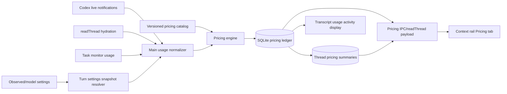
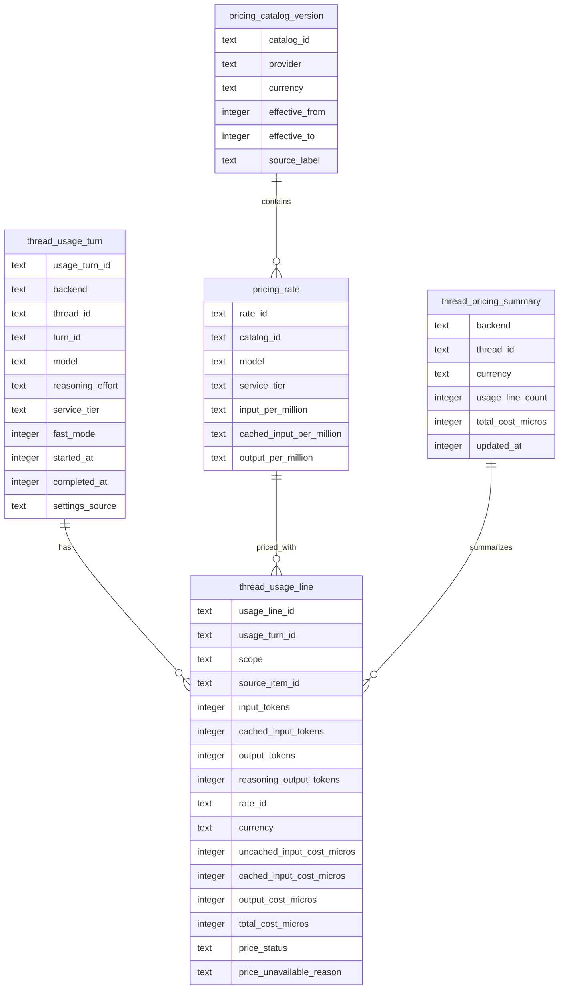

# Thread Pricing Usage Ledger

## Summary

Add a durable, turn-scoped pricing ledger for PwrAgent threads and expose it in a new Pricing tab in the right context rail.

The ledger records raw usage facts, the model/settings snapshot that applied to the turn, the pricing catalog/rate version used, and denormalized priced line items. Thread totals are stored as cached summaries so the UI can show running cost without re-totaling every transcript row, while still preserving enough rate metadata to explain historical costs when pricing changes.

This plan does not add invoices, spend caps, budget alerts, external billing reconciliation, or app code that reads Codex rollout/session storage directly.

## Problem Frame

The current list-price display is fragile because usage appears first as transcript/activity data. Token counts may arrive without a model, and model/fast-mode information may be present on nearby turn context, selected-thread state, or observed Codex settings. That works inconsistently across live, hydrated, and sub-agent paths.

The immediate bug fix can infer pricing in more cases, but the durable product surface needs a real source of truth:

- Turn usage must be stored independently from rendered activity strings.
- Model, reasoning effort, service tier, and fast mode must be captured per turn, not only as mutable thread settings.
- Costs must be priced with the rates that were applicable when the usage was recorded or backfilled.
- Thread totals must be cheap to read even when a thread spans multiple pricing periods.

## Scope

In scope:

- Store turn-level usage facts and pricing snapshots in PwrAgent-owned SQLite state.
- Store model, reasoning effort, service tier, and fast mode on the turn/usage record that used them.
- Store denormalized cost components and summary totals for each priced usage line.
- Store cached per-thread totals for fast UI reads.
- Add a read-only Pricing tab to the right context rail with thread totals and per-turn breakdowns.
- Backfill best-effort records from existing app-server transcript data already consumed through normal protocol paths.
- Include sub-agent/monitor usage in the same pricing model, linked back to the parent thread.
- Make missing model/pricing cases explicit in the UI and logs.

Out of scope:

- Billing reconciliation against provider invoices or dashboards.
- Spend caps, budget alerts, or enforcement.
- Export/reporting beyond the visible tab.
- Currency conversion. Each pricing catalog entry is currency-specific; PwrAgent does not derive non-USD rates from FX.
- App code reading Codex rollout files, Codex JSONL, or Codex-owned databases directly.

## Requirements

R1. Each persisted turn usage record has a stable identity that prevents double counting across live notifications, hydration, app restarts, and backfill.

R2. Each usage record stores raw token facts: uncached input, cached input, output, reasoning output, total tokens when available, and sanitized provider metadata when useful for diagnostics. It must not persist transcript text or arbitrary provider payload blobs as part of pricing.

R3. Each usage record stores a turn-scoped model settings snapshot: model, reasoning effort, service tier, fast mode, backend, source confidence, observed timestamp, and source event/item identifiers when available.

R4. Each priced usage record stores denormalized cost components: uncached input cost, cached input cost, output cost, total cost, currency, catalog id/version, effective pricing period, and the per-million rates used.

R5. Thread totals are cached and updated transactionally when usage line items are inserted, updated, or marked superseded.

R6. Historical costs remain explainable after pricing changes. The UI can show which catalog/rate version priced a row.

R7. The Pricing tab shows a running thread total, token totals, per-turn costs, per-turn model/settings, and missing-price reasons.

R8. Live token updates and hydrated `readThread` responses converge to the same persisted records and totals.

R9. Sub-agent usage is represented in the same ledger and can be included in parent-thread totals while remaining attributable to the monitor thread/turn.

R10. Tests reproduce the observed mixed case: usage with price, usage without model at the token event, usage after settings changes, sub-agent usage, and backfilled historical usage.

## Context And Research

Current repo facts:

- `apps/desktop/src/main/state/state-db.ts` owns additive SQLite schema migrations through `CURRENT_STATE_DB_USER_VERSION`.
- `apps/desktop/src/main/state/overlay-store-sqlite.ts` currently persists usage as `immutableUsageActivities` in a thread overlay payload through `persistThreadUsageActivity`.
- `apps/desktop/src/renderer/src/lib/useThreadSessionState.ts` currently builds live usage activity entries from `thread/tokenUsage/updated` and asks main to persist finalized activity.
- `apps/desktop/src/main/codex-app-server/client.ts` can reconstruct hydrated transcript activity from Codex app-server `turn_context` and `token_count` items.
- `apps/desktop/src/main/app-server/backend-registry.ts` already observes Codex settings via `thread/codexSettings/observed` and stores mutable thread model settings in the overlay.
- `apps/desktop/src/renderer/src/features/thread-detail/ThreadContextPanel.tsx` has a tab registry and sibling panel structure suitable for adding a Pricing tab.
- `apps/desktop/src/renderer/src/features/thread-detail/context-panels/SubAgentDetailsModal.tsx` already displays monitor token/pricing information, but it is stored as sub-agent summary state rather than a shared ledger record.
- `packages/shared/src/contracts/normalized-app-server.ts` defines `thread/tokenUsage/updated`, `thread/modelSettings/updated`, and `thread/codexSettings/observed` notification shapes.
- `packages/shared/src/token-usage-pricing.ts` now centralizes local OpenAI list-price estimation for immediate display.

External pricing facts:

- OpenAI pricing is published by model and separates input, cached input, and output token rates. The official pricing page also distinguishes processing modes such as Standard, Batch, and Data residency. Source: https://openai.com/api/pricing/
- Priority processing is request-scoped through `service_tier = "priority"` and is billed at a premium relative to Standard. Source: https://openai.com/api-priority-processing/
- Official priority-processing docs state cache discounts still apply to priority requests. Source: https://developers.openai.com/api/docs/guides/priority-processing

These facts argue against pricing thread-wide aggregate tokens after the fact. The correct durable unit is a priced usage line with its own settings and rate snapshot.

## Key Technical Decisions

KTD1. Store a ledger, not richer activity strings.

Rendered transcript activity remains presentation. Durable pricing lives in normalized SQLite tables and shared contracts. This avoids reparsing summaries like `Turn usage: ... list price` and lets future UI surfaces reuse the same state.

KTD2. Use turn-scoped settings snapshots.

Mutable thread settings are only the current preference. A usage row records the model/settings that applied to that turn or line item. If settings change later, old prices do not change.

KTD3. Denormalize priced line items and thread totals.

Each priced usage line stores component costs and the rates used. Thread totals are cached in a summary row. This keeps the Pricing tab cheap to render and handles mixed pricing periods without applying one rate to aggregate tokens.

KTD4. Keep raw usage facts beside denormalized prices.

Raw token counts and model/settings snapshots make historical rows inspectable and repriceable if a catalog entry was wrong. The default UI uses stored prices; repair tooling can explicitly supersede and recompute rows when needed.

KTD5. Use a versioned local pricing catalog for v1.

The first implementation ships a local catalog with catalog id, version, currency, provider, model, service tier, effective start/end, and token rates. No runtime pricing fetch is required. Adding another currency means adding provider-authored rates for that currency, not converting USD.

KTD6. Main process owns ingestion and persistence.

The renderer can display optimistic live usage, but main process normalization is responsible for persisting ledger records from live notifications, hydrated transcripts, and monitor usage. This keeps persistence consistent across focused and unfocused windows.

KTD7. Backfill uses app-server protocol data, not Codex private files.

For existing threads, backfill runs through `readThread`/client hydration and fields PwrAgent already receives, such as `turn_context` and `token_count`. Manual debugging may inspect local logs, but PwrAgent app code does not read Codex rollout files.

KTD8. Missing price is first-class state.

A usage row without a price stores an explicit reason such as `missing-model`, `missing-rate`, `unsupported-service-tier`, or `insufficient-token-breakdown`. The UI shows these rows instead of silently dropping list price.

## High-Level Technical Design

This diagram is descriptive, not a prescription for exact function names.

The persistence model is intentionally split between facts, rates, and summaries:

### Identity And Idempotency

Use deterministic ids where source ids exist:

- Parent turn usage: `backend/threadId/turnId/scope/sourceItemId-or-token-count`.
- Hydrated transcript usage: include Codex item id when present.
- Live notification without item id: use `turnId` plus usage scope and replace the pending row until terminal turn completion.
- Monitor usage: include parent thread id, monitor id, monitor thread id, monitor turn id, and phase.

Rows can be updated while a turn is active. When a terminal turn is observed, the final line is marked `finalized`. Later backfill may no-op if the finalized source identity already exists, or supersede a lower-confidence row if it has a better source item/settings snapshot.

### Data Integrity Invariants

- Active-turn rows may be replaced in place; finalized rows are immutable except for an explicit supersede operation.
- A superseded row remains queryable for diagnostics but is excluded from cached summaries.
- Summary updates happen in the same SQLite transaction as the line mutation that caused them.
- A usage line can contribute tokens without contributing cost when `price_status != "priced"`.
- Parent-thread rollups include sub-agent rows only once, keyed by parent thread plus monitor identity.
- Stored pricing diagnostics are sanitized usage/settings metadata, not model input/output text.

## Implementation Units

### U1. Shared Pricing And Usage Contracts

Files:

- `packages/shared/src/token-usage-pricing.ts`
- `packages/shared/src/contracts/normalized-app-server.ts`
- `packages/shared/src/contracts/navigation.ts`
- `packages/shared/src/index.ts`
- New shared tests near the pricing helper or contract tests.

Approach:

- Promote the local pricing catalog from a simple estimator into a versioned catalog API.
- Add shared types for `ThreadUsageTurnSnapshot`, `ThreadUsageLine`, `ThreadPricingSummary`, `ThreadPricingStatus`, and `ThreadPricingBreakdown`.
- Include rate metadata fields needed by the UI: provider, currency, catalog id/version, rate id, effective dates, service tier, and display label.
- Keep formatting helpers separate from pricing calculation so main can persist numeric values and renderer can format them.

Test scenarios:

- Prices a standard row with uncached input, cached input, and output components.
- Prices a priority/fast row using priority rates and records the tier.
- Returns explicit `missing-rate` when model or tier is unsupported.
- Selects rates by effective timestamp instead of current date.
- Does not derive another currency from USD rates.

### U2. SQLite Ledger Schema And Store API

Files:

- `apps/desktop/src/main/state/state-db.ts`
- `apps/desktop/src/main/state/overlay-store-sqlite.ts`
- New focused tests under `apps/desktop/src/main/state/` or `apps/desktop/src/main/__tests__/`.

Approach:

- Add additive SQLite schema tables for pricing catalog versions, pricing rates, usage turns, usage lines, and thread pricing summaries.
- Add indexes for `(backend, thread_id)`, `(backend, thread_id, turn_id)`, source identity, and summary lookup.
- Add store methods to upsert usage turns and usage lines transactionally.
- Update summaries in the same transaction that inserts, updates, finalizes, or supersedes a line.
- Keep existing `immutableUsageActivities` for compatibility during migration, but stop treating it as the canonical pricing source.
- Store monetary amounts as integer micros of the currency unit; store rates as decimal-safe strings. Avoid relying on binary floating point for persisted totals.

Test scenarios:

- Idempotent upsert of the same usage line does not double count.
- Superseding a lower-confidence line subtracts the old amount and adds the new amount.
- Multiple pricing catalog versions in one thread produce one correct cached total.
- Missing-price usage rows contribute token totals but no cost amount.
- Superseded rows remain inspectable but are excluded from active summaries.
- Migration from an older user version creates the new tables without modifying overlay payloads.

### U3. Main-Process Usage Normalization

Files:

- `apps/desktop/src/main/codex-app-server/client.ts`
- `apps/desktop/src/main/app-server/backend-registry.ts`
- `apps/desktop/src/main/ipc/app-server.ts`
- `apps/desktop/src/preload/index.ts`
- `apps/desktop/src/shared/ipc.ts`
- Existing and new tests under `apps/desktop/src/main/__tests__/`.

Approach:

- Create one main-process normalizer that accepts live token notifications, hydrated transcript token/count context, and monitor usage snapshots.
- Resolve settings in this order: explicit usage event fields, turn context/config, observed Codex settings for the turn, current thread overlay as low-confidence fallback.
- Persist the settings source and confidence so later support/debugging can distinguish exact turn context from a best-effort overlay fallback.
- Persist a usage turn snapshot before pricing line items.
- Price line items with the versioned catalog using the usage timestamp, not the current time.
- Log structured diagnostics when a usage event lacks model/settings or cannot be priced.
- Emit a new thread pricing update notification after successful ledger writes.

Test scenarios:

- Hydrated `token_count` plus sibling `turn_context` stores model, reasoning effort, fast mode, token facts, and price.
- Live `thread/tokenUsage/updated` without a model still prices when turn/thread settings are known.
- A settings change between two turns leaves the first turn priced with the original settings.
- A token event with no usable model is persisted with `missing-model` and visible in query results.
- Monitor/sub-agent usage writes a ledger row linked to both parent and monitor identifiers.

### U4. Renderer Session Integration And Transcript Display

Files:

- `apps/desktop/src/renderer/src/lib/useThreadSessionState.ts`
- `apps/desktop/src/renderer/src/features/thread-detail/live-transcript-activity.ts`
- Existing renderer tests under `apps/desktop/src/renderer/src/lib/__tests__/` and `apps/desktop/src/renderer/src/features/thread-detail/__tests__/`.

Approach:

- Keep optimistic live usage display for responsiveness, but treat persisted ledger state as authoritative once main emits a pricing update.
- Stop using renderer-generated activity as the only durable persistence request.
- Have transcript activity entries read already-priced breakdowns when available, falling back to optimistic estimation only while pending.
- Ensure hydration merges ledger-backed usage rows into transcript display without duplicate usage cards.

Test scenarios:

- Pending live usage appears quickly, then reconciles with persisted priced data.
- Hydrated thread with ledger rows shows price even if renderer did not see the original live notification.
- Duplicate live and hydrated usage entries merge by source identity.
- A missing-price row displays the unavailable reason rather than omitting the usage row.

### U5. Pricing Tab In The Right Context Rail

Files:

- `apps/desktop/src/renderer/src/features/thread-detail/ThreadContextPanel.tsx`
- `apps/desktop/src/renderer/src/features/thread-detail/context-panels/context-tab.ts`
- New `apps/desktop/src/renderer/src/features/thread-detail/context-panels/PricingPanel.tsx`
- `apps/desktop/src/renderer/src/styles/app.css`
- `apps/desktop/src/renderer/src/features/thread-detail/__tests__/ThreadContextPanel.test.tsx`

Approach:

- Add a `pricing` context tab with an existing icon primitive or lucide-compatible billing icon already present in the app icon set.
- Display summary at the top: total list price, currency, usage line count, priced/unpriced counts, and last updated time.
- Display token totals split by uncached input, cached input, output, and reasoning output.
- Display a per-turn table/list with timestamp, model, reasoning, service tier/fast mode, token breakdown, list price, and price status.
- Include sub-agent rows with attribution, not a separate pricing model.
- Keep the panel read-only in v1.

Test scenarios:

- The tab is keyboard reachable and follows the existing vertical tab ARIA pattern.
- Thread total and per-turn rows render from supplied pricing summary data.
- Mixed priced/unpriced rows show both the total and the unpriced-count warning.
- Long model names and missing fields do not overflow the rail.
- Empty state appears when no usage has been recorded.

### U6. Backfill And Repair Flow

Files:

- `apps/desktop/src/main/app-server/backend-registry.ts`
- `apps/desktop/src/main/codex-app-server/client.ts`
- Store tests from U2/U3.

Approach:

- On thread read or Pricing tab open, trigger a best-effort ledger hydration for that thread through normal app-server read paths.
- Backfill only records that can be reconstructed from PwrAgent-owned state or app-server transcript responses.
- Mark backfilled rows with `source = "backfill"` and a confidence/source detail.
- Prefer exact source ids from transcript items over synthetic ids.
- If a backfill row improves a live row, supersede the live row instead of adding a duplicate.
- Provide repair logs but no user-facing repair controls in v1.

Test scenarios:

- Existing thread with `turn_context` and `token_count` backfills priced rows.
- Existing thread without model context backfills token rows as unpriced with `missing-model`.
- Running backfill twice leaves summaries unchanged.
- Backfill after a pricing catalog update uses the rate effective on the turn date.

### U7. End-To-End Regression Coverage

Files:

- `apps/desktop/e2e/fixtures/` if a replay fixture is needed.
- Desktop E2E specs near existing thread/context-rail specs.
- Unit tests listed in U1-U6.

Approach:

- Add a focused replay-backed fixture or synthetic E2E that includes mixed usage cases:
  - usage with model in event,
  - usage where model comes from turn context,
  - usage where pricing is unavailable,
  - sub-agent usage with price,
  - settings changed between turns.
- Verify the transcript and Pricing tab agree on priced/unpriced state.
- Prefer unit tests for ledger math and idempotency; use E2E only for cross-layer rendering and update flow.

Test scenarios:

- A thread matching the reported pattern shows stable Pricing tab totals after refresh and app restart.
- No row loses price solely because the original `tokenUsage` event lacked a model.
- Sub-agent cost appears in parent-thread pricing and in the sub-agent detail surface.

## System-Wide Impact

Persistence:

- Adds new SQLite tables and user-version migration.
- Existing overlay payloads remain readable.
- Pricing summaries become a new cached state that must stay transactionally consistent with usage lines.

IPC and shared contracts:

- Adds renderer-readable pricing summary/detail contracts.
- Adds a pricing update notification so live totals refresh without rereading the entire transcript.
- May extend `readThread` or add a focused `readThreadPricing` IPC method. A focused method is preferred if the data grows beyond what every transcript read needs.

Renderer:

- Adds a context rail tab id, persisted active-tab compatibility, and a new panel.
- Refactors live usage display to reconcile against ledger-backed rows.

Sub-agents:

- Monitor summaries can continue to expose current `monitorUsage` for compatibility, but the ledger becomes the canonical cost record.

Search/indexing:

- No thread-search content changes required. Pricing data should not enter search documents.

## Backward Compatibility And Migration

- Additive migration only; do not rewrite existing thread overlay payloads.
- Old `immutableUsageActivities` continue to render until ledger-backed rows are available.
- Backfill is lazy and idempotent so opening a thread or Pricing tab can repair historical records without a blocking global migration.
- If a profile has no pricing tables, startup creates them before any pricing read/write.
- If catalog rates are missing, persist unpriced rows instead of failing transcript rendering.

## Risks And Mitigations

Double counting:

- Mitigate with deterministic source identities, unique constraints, finalized/superseded states, and idempotency tests.

Incorrect historical pricing:

- Mitigate with effective-dated catalog rows and persisted rate ids/rates per usage line.

Mutable settings drift:

- Mitigate with turn-scoped snapshots and source-confidence ordering.

Performance:

- Mitigate with summary rows and indexes. The Pricing tab reads summary plus paged/recent detail rows, not the full transcript activity list.

Decimal accuracy:

- Mitigate by storing integer micros for amounts and decimal strings for rates.

Privacy and payload growth:

- Mitigate by persisting only usage counts, settings metadata, source ids, and sanitized diagnostics. Do not store transcript content or arbitrary provider payloads in pricing tables.

Provider differences:

- Mitigate by making provider/currency/catalog fields explicit. OpenAI list pricing is the first provider catalog, not a hardcoded assumption throughout the UI.

Backfill confidence:

- Mitigate by storing source and confidence metadata, and by showing missing-price reasons for incomplete legacy rows.

## Verification Plan

Unit:

- Shared pricing catalog effective-date selection and missing-rate behavior.
- SQLite migration, upsert, supersede, and summary math.
- Main normalization from live token notifications, hydrated transcript data, and monitor usage.
- Renderer reconciliation and Pricing tab rendering.

Integration:

- `readThread` hydration populates ledger records and returns pricing details.
- Live `thread/tokenUsage/updated` writes a ledger row and emits a pricing update.
- Restart/reload preserves totals and per-turn rows.

E2E:

- Replay a thread with mixed priced/unpriced parent usage and priced sub-agent usage.
- Open the Pricing tab and verify totals, rows, missing-price reasons, and no duplicates after refresh.

Regression focus:

- Reproduce the observed alternating pattern:
  - Usage with price
  - Usage with no model in token event but price from turn context
  - Usage with no recoverable model and explicit unpriced reason
  - Sub-agent usage with price
  - Usage after settings change with correct historical rate/settings

## Open Questions

Resolved during planning:

- Should costs be denormalized? Yes. Store priced line items and cached summaries so mixed pricing periods do not require expensive or incorrect aggregate repricing.
- Should PwrAgent read Codex rollout files to compute this? No. Backfill uses app-server protocol data and PwrAgent-owned state only.
- Should v1 convert USD to other currencies? No. Currency is catalog-native, not converted.

Deferred to implementation:

- Exact table names and whether pricing detail is included in `readThread` or loaded through a focused `readThreadPricing` IPC method.
- Exact decimal-string representation for rates and display rounding rules.
- Whether the first UI release shows all historical rows or a recent/paged subset.
- Whether `immutableUsageActivities` should eventually be garbage-collected after enough releases.

## Acceptance Criteria

- A thread with token usage but no model on the `thread/tokenUsage/updated` event still shows list price when turn context or observed settings provide the model.
- A thread spanning two model/settings/rate periods shows a correct total assembled from denormalized usage line prices.
- A historical thread can be backfilled by opening it, and repeated backfill does not change totals after the first successful pass.
- The Pricing tab shows total list price, token totals, per-turn breakdown, model, reasoning, service tier/fast mode, and unpriced reasons.
- Sub-agent usage appears in parent-thread pricing totals and remains attributable to the sub-agent.
- No PwrAgent app code reads Codex private rollout/session/database files.
