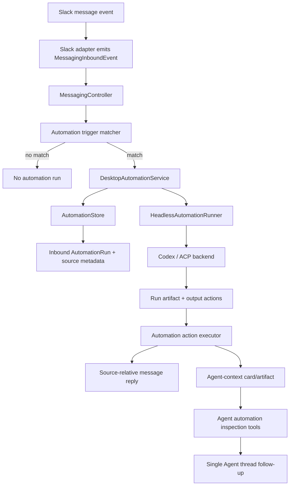
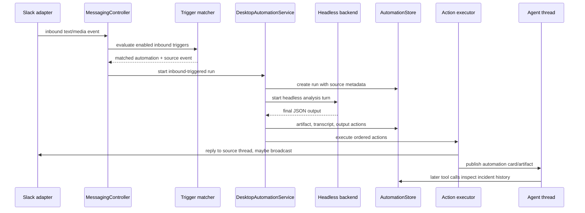

# feat: Add inbound-triggered automations

## Summary

Add inbound messaging triggers to Agent-attached automations so messages such as Datadog alerts in Slack can start a headless automation run, persist a short incident analysis artifact, and execute ordered delivery actions. The plan extends the existing automation lifecycle instead of creating a separate bot subsystem: triggered runs remain auditable artifacts, while selected results become tool-visible Agent context so one Agent instance can answer follow-up questions across repeated reports.

---

## Problem Frame

The current automation stack supports scheduled and manual headless runs attached to Agent threads. It already persists runs, artifacts, cards, and read-only inspection tools. The missing incident-bot shape is event-driven: a message from a specific sender in a specific messaging conversation should match a configured filter, start a headless analysis run with controlled model/tool settings, and reply back relative to the source message.

The important product behavior is not just "post a reply." Operators should be able to ask the attached Agent deeper questions after the first short analysis. If five reports arrive over a few minutes or hours, the Agent should see those incident artifacts through tools and be able to say that the issue is recurring or follows a time pattern. That longitudinal memory belongs to the single Agent thread, not to a separate Slack-only bot conversation.

---

## Requirements

**Inbound Triggers**

- R1. Automations must support an inbound-message trigger source in addition to scheduled and manual triggers.
- R2. Inbound triggers must match on channel-neutral messaging fields, including provider, conversation, sender identity, sender bot flag, literal text filters, and optional thread-root behavior.
- R3. Matching must be fail-closed: an automation only runs when an enabled trigger explicitly matches an authorized inbound event.
- R4. The first exercised provider is Slack, but the trigger model must not encode Slack-only workflow semantics into shared automation or messaging controller code.
- R5. Trigger matching must avoid creating PwrAgent turns for every channel message; non-matches should be cheap and logged only at diagnostic/debug level.

**Headless Incident Runs**

- R6. A matched inbound event must create an automation run with trigger metadata that records the source message, actor, channel, received time, matched trigger, and bounded source text.
- R7. The automation prompt must include inbound-event context alongside the task prompt and structured output instructions.
- R8. Runs must preserve the existing per-automation execution lane semantics: one active run at a time, with deterministic queue/coalesce/drop behavior for bursts.
- R9. Headless runs must use an automation-owned execution profile with inheritance defaults for backend, model, reasoning, access mode, working directory/environment, MCP exposure, skill/tool allowlists, service tier, and fast mode.
- R10. Headless runs must keep approval/user-input requests auto-cancelled unless a future plan explicitly adds interactive automation-run approvals.

**Agent-Visible Incident Memory**

- R11. Automation run artifacts created from inbound triggers must be discoverable through the attached Agent thread's tool-visible automation context.
- R12. Operators must be able to ask the single Agent thread follow-up questions about one incident or a cluster of repeated incident reports without binding a new Agent context to the source Slack thread.
- R13. The Agent inspection tools must expose enough bounded metadata for recurrence analysis: source conversation, sender identity, source timestamp, trigger name, run status, output decision, and summary/details.
- R14. The first implementation should support "this keeps happening" style analysis by tool inspection and prompt guidance; durable statistical aggregation can be deferred.

**Output Actions**

- R15. Automation output handling must support multiple ordered actions, not one implicit "post card" decision.
- R16. Actions must include writing a user-visible message relative to the source event: source thread reply, source channel message, or provider-supported thread reply with channel broadcast.
- R17. Actions must include delivering the analysis into the attached Agent context as an automation card/artifact so the Agent can inspect it later.
- R18. Actions may target an alternate configured messaging destination when the generic messaging target model can express it.
- R19. Action execution must be idempotent per run/action so retries or duplicate terminal notifications do not double-post.
- R20. If an action fails, the run artifact must record the failure and still preserve the analysis result for inspection.

**Operator Configuration**

- R21. The existing Automations UI/API must let operators configure trigger type, filter rules, execution profile, and output actions.
- R22. Existing scheduled automations must continue to work without requiring trigger/action/profile fields in persisted records.
- R23. The UI must make it clear that Agent-context delivery enables follow-up interaction through the Agent thread, while source-message replies are notifications back to the incident channel.

---

## Key Technical Decisions

- **Extend automations rather than add a bot subsystem.** Inbound alerts should produce `AutomationRunSummary` rows and artifacts, reuse the automation execution lane, and publish the same `automation/run/updated` events that desktop and messaging already understand.
- **Keep trigger matching in desktop orchestration.** Provider adapters should continue to emit generic `MessagingInboundEvent` values. The desktop messaging controller or a small sibling trigger service matches events against automation definitions.
- **Store source-event metadata with the run.** The run, not the messaging binding, must remember the exact Slack message target. That lets final actions reply to the incident thread even when the attached Agent thread has other messaging bindings.
- **Make source-event identity stable.** Duplicate suppression needs a stable source-event key. Prefer provider event ids when present, and otherwise derive a deterministic key from provider, conversation, message timestamp/id, thread root, and sender.
- **Make execution profile explicit but inheritable.** Scheduled runs currently inherit Agent overlay model/access settings. Inbound incident bots need stable run behavior, so automation configs should store profile overrides and use Agent/thread defaults only when a field is unset.
- **Use source-relative delivery actions for Slack broadcast.** Slack's `chat.postMessage` supports `thread_ts` for replies and `reply_broadcast` for surfacing important replies in the channel. Represent this generically in `MessagingSurfaceDeliveryPolicy`, and let Slack map it to native fields.
- **Treat Agent-context delivery as memory, not another chat turn.** The short analysis lands as an automation artifact/card visible to Agent tools. Human follow-up enters the attached Agent thread through existing turn admission, giving one serial Agent instance context across repeated incidents.
- **Keep interaction one-user-at-a-time through the Agent thread.** The first headless run is non-interactive. Follow-up steering uses the Agent thread's existing messaging queue, including queued/rejected feedback when several operators ask at once.
- **Bound all inbound text and external context.** Source messages, thread snippets, and tool-visible result lists must be compact by default, with explicit detail fetches through inspection tools.

---

## High-Level Technical Design

The action result state should be part of the run artifact, not a separate messaging transcript. A run can complete analysis successfully while one delivery action fails; inspection tools should expose both.

---

## Implementation Units

### U1. Automation Trigger and Action Contracts

**Goal:** Extend shared automation contracts to represent trigger definitions, inbound source metadata, execution profiles, and ordered output actions.

**Requirements:** R1, R2, R6, R9, R15, R16, R17, R18, R22.

**Dependencies:** None.

**Files:**

- Modify: `packages/shared/src/contracts/automations.ts`
- Modify: `packages/shared/src/contracts/__tests__/automations.test.ts`
- Modify: `packages/shared/src/index.ts`
- Modify: `apps/desktop/src/main/automations/automation-store.ts`
- Modify: `apps/desktop/src/main/__tests__/automation-store.test.ts`

**Approach:** Add an inbound trigger definition beside the existing schedule definition rather than replacing schedules. A first-pass shape should support `schedule` and `inbound_message` trigger kinds while preserving old schedule fields for migration compatibility. Add run source metadata to `AutomationRunPayload`, and add output action definitions/results to `AutomationRunArtifactPayload`.

The execution profile should be a serializable shared type with optional fields for backend/model/access/cwd/tool exposure. Keep provider-specific routing state under opaque messaging state; do not store Slack SDK payloads directly. V1 text filters should be literal `contains` or `equals` matches with an explicit case-sensitivity flag; regex/glob filters are deferred until there is a safe validation and preview story.

**Patterns to follow:** Existing `AutomationGateConfig`, `AutomationRunArtifact`, `AutomationTimelineCard`, and `MessagingBindingTargetKind` normalization patterns.

**Test scenarios:**

- Happy path: a legacy scheduled automation record without trigger/action/profile fields reads back unchanged and defaults to one schedule trigger.
- Happy path: an inbound-triggered automation stores a sender/text filter, source-relative reply action, Agent-context delivery action, and execution profile override.
- Edge case: unknown trigger/action/profile fields in persisted payload are ignored or normalized without throwing.
- Edge case: regex-like filter text is treated as literal text or rejected when the operator selected an unsupported match mode.
- Error path: invalid trigger text filters or unsupported action destinations fail validation before persistence.
- Integration: a created inbound run stores source event metadata and returns it in `listRunsForAutomation`.

**Verification:** Shared contract and store tests show old records still round-trip and new inbound trigger/action metadata is persisted, bounded, and listed.

### U2. Inbound Message Trigger Matcher

**Goal:** Evaluate messaging inbound events against enabled automation trigger filters without coupling provider adapters to automation rules.

**Requirements:** R2, R3, R4, R5, R6, R8.

**Dependencies:** U1.

**Files:**

- Create: `apps/desktop/src/main/automations/automation-trigger-matcher.ts`
- Create: `apps/desktop/src/main/__tests__/automation-trigger-matcher.test.ts`
- Modify: `apps/desktop/src/main/automations/desktop-automation-service.ts`
- Modify: `apps/desktop/src/main/messaging/core/messaging-controller.ts`
- Modify: `apps/desktop/src/main/__tests__/messaging-controller.test.ts`

**Approach:** Add a small matcher that accepts `MessagingInboundEvent`, enabled automation records, and current time. It returns zero or more matches containing the automation id, matched trigger id/name, bounded source text, actor summary, channel ref, routing state, provider event id when available, and a stable source-event key.

Text matching should be deliberately small in V1: literal `contains` and `equals`, plus explicit case sensitivity. That is enough for Datadog-style alert strings and avoids silently turning operator input into unsafe regex behavior.

The messaging controller should hand non-command inbound text/media events to the matcher before normal bound-thread routing. A matched automation should not require the source conversation to be bound to the Agent thread; it only requires the messaging provider authorization and automation trigger configuration to permit the source.

**Patterns to follow:** Existing `MessagingTurnAdmission` keeps provider inbound events generic; `MessagingStore.findActiveBindingForChannel` remains for normal user-chat routing and should not become the trigger lookup mechanism.

**Test scenarios:**

- Happy path: a Slack text event from a configured bot sender containing the expected string matches one automation trigger.
- Happy path: a trigger can match a source thread reply when configured to include thread replies.
- Happy path: duplicate source events produce the same stable source-event key for idempotent run/action handling.
- Edge case: a message from the same channel and text but a different sender does not match.
- Edge case: bot messages can match when `actor.isBot` or sender id rules allow them.
- Error path: malformed or missing channel/routing state produces no match and does not throw.
- Integration: normal `/agent`, `/resume`, and bound-thread text handling still behave unchanged when no trigger matches.

**Verification:** Unit tests cover the matcher matrix; messaging controller tests prove non-matches remain cheap and matched events start automation runs without creating ordinary Agent turns.

### U3. Inbound Run Submission and Prompt Context

**Goal:** Start headless automation runs from matched inbound events and include source-message context in the automation prompt and artifact trail.

**Requirements:** R6, R7, R8, R10, R11, R20.

**Dependencies:** U1, U2.

**Files:**

- Modify: `apps/desktop/src/main/automations/desktop-automation-service.ts`
- Modify: `apps/desktop/src/main/automations/automation-scheduler.ts`
- Modify: `apps/desktop/src/main/automations/automation-runner.ts`
- Modify: `apps/desktop/src/main/automations/automation-prompt.ts`
- Modify: `apps/desktop/src/main/__tests__/desktop-automation-service.test.ts`
- Modify: `apps/desktop/src/main/__tests__/automation-scheduler.test.ts`
- Modify: `apps/desktop/src/main/__tests__/automation-prompt.test.ts`

**Approach:** Add `runFromInboundEvent` or equivalent on `DesktopAutomationService`, backed by the same queue/active-run checks used by scheduled/manual runs. Widen `AutomationRunTrigger` to include `inbound_message` and store the source event in the run payload.

For bursts, keep the first implementation simple and deterministic: if the automation lane is active, use the automation's backlog policy. `coalesce` should queue one pending inbound batch with source-event summaries; `drop_missed` should record skipped runs for later inspection. The prompt should clearly distinguish scheduled windows, manual runs, and inbound source messages.

**Patterns to follow:** `AutomationScheduler.runNow`, `AutomationScheduler.evaluateAutomation`, and `buildAutomationTurnInput`.

**Test scenarios:**

- Happy path: a matched inbound event creates a run with trigger `inbound_message`, starts a headless turn, and records source metadata in the invocation transcript event.
- Happy path: prompt text includes sender, channel summary, received time, matched trigger name, bounded source message, and the configured task prompt.
- Edge case: a long Slack message is truncated with an explicit marker before prompt/artifact storage.
- Edge case: a second inbound event while the lane is active is queued/coalesced according to policy.
- Error path: headless submission failure marks the run failed and records source metadata for audit.
- Integration: terminal backend events still complete inbound runs and publish `automation/run/updated`.

**Verification:** Existing scheduled/manual automation tests still pass, and new tests prove inbound runs share the same lifecycle without routing source messages as ordinary Agent turns.

### U4. Automation Execution Profiles and Tool Exposure

**Goal:** Let each automation control headless launch settings and allowed tool/MCP exposure while inheriting safe defaults from the attached Agent thread.

**Requirements:** R9, R10, R21, R22.

**Dependencies:** U1, U3.

**Files:**

- Modify: `packages/shared/src/contracts/automations.ts`
- Modify: `apps/desktop/src/main/automations/automation-runner.ts`
- Modify: `apps/desktop/src/main/app-server/backend-registry.ts`
- Modify: `apps/desktop/src/main/app-server/acp-backend-adapter.ts`
- Modify: `apps/desktop/src/main/codex-app-server/client.ts`
- Modify: `apps/desktop/src/main/__tests__/backend-registry.test.ts`
- Modify: `apps/desktop/src/main/__tests__/desktop-automation-service.test.ts`

**Approach:** Thread execution settings already support model, reasoning, execution mode, sandbox, approval policy, service tier, and fast mode. Add an automation execution profile that maps into those launch parameters when `HeadlessAutomationRunner` calls `startAutomationHeadlessTurn`.

For tool exposure, use explicit allowlists. Codex dynamic tools should be selected from the existing Agent tool catalog registry plus automation-specific allowlists. ACP MCP exposure should stay capability-gated and reuse the existing MCP configuration path where supported. Keep approval policy defaulted to non-interactive behavior unless the automation explicitly and safely opts into a future capability.

**Patterns to follow:** `ThreadTurnQueueEntry`, `BackendRegistry.startTurnNow`, `BackendRegistry.startAutomationHeadlessTurn`, `resolveAgentToolCatalogs`, and `automation-inspection-mcp.ts`.

**Test scenarios:**

- Happy path: an automation profile pins a model/reasoning/access mode and the headless start receives those values instead of Agent overlay defaults.
- Happy path: unset profile fields inherit Agent/thread overlay values.
- Edge case: a provider that cannot support requested MCP exposure records a visible diagnostic and still runs with supported tools.
- Error path: an unsupported backend/model/tool selection fails validation before run start.
- Security path: headless automation pending approval/user-input requests remain auto-cancelled.
- Integration: dynamic tool specs for automation inspection remain available to Agent threads after the profile changes.

**Verification:** Backend registry tests prove profile overrides are forwarded only to headless automation starts and do not mutate normal Agent chat settings unexpectedly.

### U5. Ordered Output Action Execution

**Goal:** Parse and execute multiple ordered automation output actions, including source-relative messaging replies and Agent-context delivery.

**Requirements:** R15, R16, R17, R18, R19, R20.

**Dependencies:** U1, U3.

**Files:**

- Modify: `apps/desktop/src/main/automations/automation-output-decision.ts`
- Create: `apps/desktop/src/main/automations/automation-action-executor.ts`
- Modify: `apps/desktop/src/main/automations/desktop-automation-service.ts`
- Modify: `apps/desktop/src/main/messaging/core/messaging-controller.ts`
- Modify: `apps/desktop/src/main/__tests__/automation-output-decision.test.ts`
- Create: `apps/desktop/src/main/__tests__/automation-action-executor.test.ts`
- Modify: `apps/desktop/src/main/__tests__/desktop-automation-service.test.ts`

**Approach:** Keep support for the existing `{ decision: "post_card|quiet" }` result, but add a richer output schema with an `actions` array. The action executor should run after artifact persistence, record each action's status in the artifact, and skip already-completed actions on duplicate terminal processing.

Agent-context delivery should publish/store an automation card/artifact as it does today. Source-relative messaging delivery should build a generic `MessagingSurfaceIntent` using source event audit/channel/routing state, then call into the messaging delivery path without requiring an active binding to the Agent thread.

**Patterns to follow:** `renderAutomationDecisionForMessaging`, `DesktopAutomationService.publishAutomationRunUpdate`, `MessagingController.deliver`, and delivery recording in `MessagingStore.recordDelivery`.

**Test scenarios:**

- Happy path: a final JSON result with two actions posts an Agent-context card and sends a source-thread reply in order.
- Happy path: legacy `post_card` output still creates the current automation card behavior.
- Edge case: one action fails while a later Agent-context action succeeds; the artifact records both statuses.
- Edge case: duplicate terminal notifications do not repeat a completed messaging action.
- Error path: malformed actions fall back to parse-failed notable behavior and preserve raw final text.
- Integration: quiet output suppresses user-visible source replies unless an explicit action says otherwise.

**Verification:** Action executor tests use fake messaging delivery and store assertions to prove idempotency, partial failure recording, and backward compatibility.

### U6. Messaging Delivery Policy for Source-Relative Replies

**Goal:** Extend the generic messaging surface contract and Slack adapter so source-relative actions can reply in a thread and optionally broadcast that reply to the channel.

**Requirements:** R4, R16, R18, R19.

**Dependencies:** U1, U5.

**Files:**

- Modify: `packages/messaging/interface/src/index.ts`
- Modify: `packages/messaging/interface/src/__tests__/messaging-interface.test.ts`
- Modify: `packages/messaging/providers/slack/src/slack-adapter.ts`
- Modify: `packages/messaging/providers/slack/src/slack-formatting.ts`
- Modify: `packages/messaging/providers/slack/src/__tests__/slack-adapter.test.ts`
- Modify: `apps/desktop/src/main/messaging/core/messaging-controller.ts`
- Modify: `apps/desktop/src/main/__tests__/messaging-controller.test.ts`

**Approach:** Add provider-neutral delivery hints for source-relative posting, such as reply-to-source-thread and broadcast-thread-reply. Slack maps these to `thread_ts` and `reply_broadcast`. Providers without native broadcast support should either ignore the hint with a delivery warning or report unsupported, depending on the action policy.

The Slack adapter already resolves thread targets from `targetSurface` and `audit.channel`; this unit should only add the broadcast flag and tests around the source-message routing state.

**Patterns to follow:** Slack `resolveTarget`, `SlackPostBody`, existing `delivery.pin`/`delivery.mode` handling, and provider capability degradation patterns.

**Test scenarios:**

- Happy path: a source-relative Slack thread reply sends `thread_ts` equal to the parent message timestamp.
- Happy path: a source-relative Slack thread reply with broadcast enabled sends the provider's broadcast flag.
- Edge case: a provider without source thread state returns a failed or unsupported delivery result rather than posting to the wrong channel.
- Edge case: update/dismiss delivery modes are unaffected by the new source-relative policy.
- Integration: delivery budget/rate-limit handling still records and retries only replay-safe attempts.

**Verification:** Slack adapter tests assert the exact outbound body shape; interface tests prove generic delivery policy values round-trip.

### U7. Agent Inspection Context for Repeated Incidents

**Goal:** Make inbound-triggered incident artifacts useful to the attached Agent for follow-up and recurrence questions.

**Requirements:** R11, R12, R13, R14, R17.

**Dependencies:** U1, U3, U5.

**Files:**

- Modify: `packages/shared/src/contracts/automation-tools.ts`
- Modify: `packages/shared/src/contracts/__tests__/automation-tools.test.ts`
- Modify: `apps/desktop/src/main/automations/automation-inspection-bus.ts`
- Modify: `apps/desktop/src/main/automations/automation-inspection-tool-catalog.ts`
- Modify: `apps/desktop/src/main/__tests__/automation-inspection-bus.test.ts`
- Modify: `apps/desktop/src/main/agent-tools/__tests__/agent-tool-router.test.ts`

**Approach:** Extend existing read-only automation inspection outputs with inbound source metadata and compact action results. Add a recurrence-friendly list/summarize path that lets the Agent request recent runs for one automation or one trigger and group by source conversation/time window. Keep this as bounded structured data; do not precompute permanent incident statistics in V1.

Add tool descriptions or Agent guidance that tells the Agent to inspect recent runs before answering "is this recurring?" or "has this happened before?".

**Patterns to follow:** `AutomationInspectionBus.listRuns`, `summarize_automation_status`, output caps, and thread-scoped authorization.

**Test scenarios:**

- Happy path: listing runs for an Agent thread includes inbound source timestamp, trigger name, and source conversation summary.
- Happy path: inspecting one run returns action results and bounded source text.
- Edge case: repeated inbound runs from the same trigger can be fetched with a limit and sorted by activity time.
- Error path: an Agent cannot inspect inbound-triggered runs attached to another Agent thread.
- Integration: Codex dynamic tool and ACP MCP projections expose the updated schema consistently.

**Verification:** Inspection tests prove the Agent has enough data to reason over repeated incidents without prompt-stuffing full artifacts.

### U8. Automations UI and IPC Configuration Flow

**Goal:** Let operators configure inbound triggers, execution profiles, and output actions from the existing automation surfaces.

**Requirements:** R21, R22, R23.

**Dependencies:** U1, U4, U5, U6.

**Files:**

- Modify: `apps/desktop/src/main/ipc/automation-ipc.ts`
- Modify: `apps/desktop/src/preload/index.ts`
- Modify: `apps/desktop/src/renderer/src/features/automations/AutomationEditor.tsx`
- Modify: `apps/desktop/src/renderer/src/features/automations/AutomationsScreen.tsx`
- Modify: `apps/desktop/src/renderer/src/features/automations/ThreadAutomationsPanel.tsx`
- Modify: `apps/desktop/src/renderer/src/features/automations/automation-format.ts`
- Modify: `apps/desktop/src/renderer/src/features/automations/__tests__/automation-editor.test.tsx`
- Modify: `apps/desktop/src/renderer/src/features/automations/__tests__/automations-screen.test.tsx`

**Approach:** Add a trigger-type segmented control for scheduled vs inbound-message automations. For inbound triggers, expose provider/conversation selector fields using available messaging locations when possible, plus sender and text-match filters. Add compact profile controls that mirror launchpad settings without overloading the editor. Add an ordered actions section with defaults: Agent context card plus source thread reply.

Use existing desktop styling primitives from `app.css`; keep the form dense and operational rather than adding explanatory marketing copy.

**Patterns to follow:** Existing `AutomationEditor` schedule/gate controls, Agent picker filtering, and messaging status surfaces.

**Test scenarios:**

- Happy path: creating an inbound automation submits trigger filters, execution profile fields, and two output actions.
- Happy path: editing a legacy scheduled automation shows the schedule form and does not require inbound trigger fields.
- Edge case: validation blocks inbound automations with no source conversation or no filter.
- Edge case: source-relative broadcast is only selectable when the provider/capability path can support it or is clearly marked unsupported.
- Error path: IPC errors render the existing automation error surface.
- Integration: the Automations table distinguishes scheduled and inbound-triggered automations and shows latest inbound run status.

**Verification:** Renderer tests cover form submission and legacy behavior; manual visual QA should inspect the editor at narrow and desktop widths.

### U9. Documentation and Operator Setup Notes

**Goal:** Document how to configure incident-style inbound automations without moving operator-facing platform docs into this repo.

**Requirements:** R1, R4, R21, R23.

**Dependencies:** U1-U8.

**Files:**

- Modify: `docs/messaging-architecture.md`
- Modify: `docs/messaging-adapter-contract.md`
- Modify: `docs/automation-scheduling.md`
- Modify: `docs/messaging-platform-integration.md`

**Approach:** Update contributor-facing docs to explain that messaging adapters emit generic inbound events, desktop orchestration owns trigger matching, and automation actions use generic delivery intents. Keep per-platform operator setup walkthroughs out of this repo; add a short note pointing to `docs.pwragent.ai` for Slack setup if needed.

**Patterns to follow:** Existing messaging architecture docs and the repo guidance that operator-facing site content lives in `pwrdrvr/docs.pwragent.ai`.

**Test scenarios:**

- Test expectation: none -- documentation-only changes.

**Verification:** Docs describe the architecture without provider-specific branching guidance, and links still point to repo-local contributor docs or the external operator docs site as appropriate.

---

## Scope Boundaries

- In scope: inbound-message trigger definitions, Slack as the first exercised provider, trigger matching in desktop orchestration, inbound run metadata, automation execution profiles, multiple ordered actions, source-relative messaging delivery, Agent-context incident memory, UI/API configuration, and tests.
- In scope: read-only Datadog/AWS-style investigations through allowed tools/MCPs configured on the automation execution profile.
- Out of scope: building Datadog or AWS provider integrations themselves, adding new RBAC/trust boundaries, cloud scheduling, daemon execution while PwrAgent is closed, executable action buttons in incident cards, and arbitrary provider-specific workflow branches.
- Out of scope: making every unbound Slack channel message start or steer an Agent by default.

### Deferred to Follow-Up Work

- Durable recurrence analytics beyond bounded inspection-tool summaries.
- Rich incident grouping/deduplication UI across many triggers or services.
- Per-actor capability differences for who can steer the Agent after an incident card lands.
- A reusable incident-bot template/package marketplace flow.
- Interactive approval/user-input handling inside headless automation runs.

---

## System-Wide Impact

This feature crosses two load-bearing boundaries. Messaging providers must remain channel-neutral emitters and renderers; automation workflow semantics belong in desktop main. Automation execution must remain headless and artifact-backed; incident replies should not become ordinary assistant messages from the Agent thread.

The dependency boundary rules still apply: shared contracts live in `packages/shared` or `packages/messaging/interface`, provider-specific Slack mapping stays in `packages/messaging/providers/slack`, and orchestration stays in `apps/desktop/src/main`.

---

## Risks & Dependencies

- **Message loops:** Posting to a source channel can create new inbound events. Mitigation: provider adapters already ignore the bot's own Slack messages; trigger matcher tests should also reject self/bot identities unless explicitly configured for a different sender.
- **Duplicate event delivery:** Slack Events API can retry delivery. Mitigation: source event ids and action ids should be persisted and used for idempotent run/action handling.
- **Over-broad triggers:** A loose text filter could run on too many messages. Mitigation: require explicit conversation plus sender/text filters for V1 inbound automations.
- **Tool overexposure:** Incident analysis may need Datadog/AWS MCPs but should not get every Agent capability. Mitigation: automation execution profiles use allowlists and backend capability gates.
- **Slack rate limits:** Slack documents channel-level posting limits and stricter limits on `conversations.replies`. Mitigation: rely on existing messaging delivery budget/rate-limit handling and avoid fetching Slack thread history in V1 unless a configured tool/action requires it.
- **Context bloat:** Repeated incident reports could stuff too much into the Agent prompt. Mitigation: store artifacts and expose bounded inspection tools instead of injecting full histories.

---

## Acceptance Examples

- AE1. Given a Slack channel authorized for messaging and an automation trigger for Datadog bot messages containing `ERROR`, when Datadog posts a matching alert, PwrAgent starts one inbound automation run and records the source Slack message metadata.
- AE2. Given the automation output includes a source-thread reply action with broadcast enabled, when the run completes, Slack receives one threaded reply and the provider maps the broadcast hint to Slack's native reply broadcast behavior.
- AE3. Given the same alert fires five times in one hour, when an operator asks the attached Agent whether this keeps happening, the Agent can inspect recent automation runs and answer from the stored incident artifacts.
- AE4. Given an ordinary user message in the same Slack channel that does not match the trigger sender/text filters, when it arrives, no automation run is created and normal messaging binding behavior is unchanged.
- AE5. Given the source reply action fails but Agent-context delivery succeeds, when the operator inspects the run, the artifact shows the analysis plus the failed delivery action.

---

## Documentation / Operational Notes

The operator-facing Slack setup walkthrough belongs in the docs site repo, not here. This repo should document the contributor contract: providers emit generic inbound events; automation trigger matching and output action execution live in desktop main; provider adapters only map generic delivery hints to native APIs.

For the Datadog/AWS use case, the concrete automation package can later supply the prompt, Datadog MCP/tool allowlist, optional read-only AWS MCP, and default actions. This plan only adds the platform capability needed to host that package safely.

---

## Sources & Research

- `docs/brainstorms/2026-05-22-agent-thread-attached-automations-requirements.md` defines Agent-attached, headless, artifact-backed automations and Agent tool inspection.
- `docs/plans/2026-05-24-001-feat-automation-agent-tool-bridge-plan.md` establishes the read-only automation inspection tool bridge.
- `docs/plans/2026-06-07-001-feat-agent-thread-messaging-tools-plan.md` establishes Agent messaging targets and reusable dynamic tool routing.
- `docs/solutions/2026-05-07-codex-permission-mode-state-machine.md` is the security-state precedent for making impossible states structural rather than papering over drift.
- Slack `chat.postMessage` docs: `thread_ts` makes a message a reply and `reply_broadcast` can make important replies visible in the channel: https://docs.slack.dev/reference/methods/chat.postMessage/
- Slack Events API docs: event subscriptions deliver message events that business logic can filter and respond to: https://docs.slack.dev/apis/events-api/
- Slack message event docs: message events include subtypes such as bot/integration messages and thread broadcasts: https://docs.slack.dev/reference/events/message/
- Slack `app_mention` docs: app mentions are message-like events but not a replacement for general message subscriptions: https://docs.slack.dev/reference/events/app_mention/

---

## Build Progress & Design Corrections (2026-06-20)

The first pass of U8 shipped a freeform, low-confidence config UI and U6 left
Telegram source replies non-functional. This addendum records the corrections
made while finishing the feature; the original units above are kept as the
point-in-time record.

**U6 correction — Telegram source-relative delivery (was broken).** The Slack
adapter honored `delivery.sourceRelative`, but the Telegram adapter's
`resolveTarget` ignored it and always replied inside the originating topic, so
`source_channel` could not reach the supergroup root and the "broadcast" flag
was meaningless. Fixed in `telegram-adapter.ts`: `source_channel` now replies at
the supergroup (General) level; `source_thread`/default reply inside the topic.
Added Telegram source-relative delivery tests. Broadcast is now correctly
treated as Slack-only (`reply_broadcast`) and hidden for other providers.

**U8 correction — trustworthy config UI.** Rebuilt the inbound section of
`AutomationEditor`:
- Provider list is gated to providers actually enabled in settings
  (`readSettings`) instead of a hardcoded Slack/Telegram pair.
- Replaced the conflated "Group / Topic" box. Telegram picks a group from
  authorized supergroups (names from `messaging.telegram.authorizedSupergroups`)
  or manual entry, plus an explicit Whole-group vs Specific-topic scope. Other
  providers get a guided, validated conversation-id field. `conversationKind` /
  `parentId` / `title` are captured correctly (no more hardcoded `"channel"`).
- Added text match-mode + case sensitivity, optional sender scope
  (any/bots/people), and a Reply control (same thread / group level /
  Agent-context only).
- Exposed the execution profile's MCP + tool allowlists so an automation can be
  granted the MCP it needs (the Datadog use case) — the contract already
  supported these; the UI was dropping them.

**New — pairing-code conversation capture.** Reused the existing messaging
pairing infrastructure so an operator can drop a one-time code into the target
group/topic/channel; PwrAgent detects it, fills the conversation fields
(group/topic/scope + title), and authorizes the conversation so the trigger can
fire. This is the most reliable way to identify a conversation because the
identity comes from a real inbound event rather than scraped state.

**New — live filter preview.** Added a going-forward live preview
(`inbound-preview-bus` + a controller tap + IPC fan-out) so operators can see
recent senders/messages from the chosen conversation with the messages their
filter would match highlighted. Provides the "is this actually going to work"
confidence the freeform form lacked.

### Follow-up landed (2026-06-21)

- **Topic-name dropdown.** Added a `messaging:list-inbound-topics` IPC over the
  `messaging_managed_topics` registry. When a Telegram group is chosen and the
  scope is a specific topic, the editor offers known topics by name (with a
  manual-id fallback); the picked topic's name is stored on the trigger.
- **Slack history backfill for preview.** Added `conversations.history` to the
  Slack API + a `fetchRecentMessages` adapter method, surfaced through
  `DesktopMessagingRuntime.fetchRecentPreviewMessages`. Starting a preview on a
  Slack channel now backfills recent messages (best-effort; `[]` on missing
  `channels:history` scope) through the same preview event channel, oldest
  first. Telegram remains going-forward only (no Bot API history).

### Usability pass — make it operable by a non-expert (2026-06-21)

Critique: the editor was powerful but overwhelming, the prompt was a blank box,
and the alternate-destination action was a backend stub.

- **Alternate destination (was stubbed).** Implemented the `messaging_target`
  output action end to end: `automation-action-executor` delivers via a
  registered target handler; `MessagingController.deliverAutomationTargetMessage`
  builds a message intent addressed to the target snapshot and routes through
  the existing `deliver()` path (provider chosen by the target's channel). The
  editor's "Reply" control became "Where should the result go?" — reply in place
  / send to a different conversation (provider + group/topic picker) /
  Agent-context only.
- **Prompt help.** Added an example/help popover + placeholder, and a "Help me
  write a prompt" drafter backed by a one-shot Grok call
  (`automations:draft-prompt` IPC reusing the ephemeral object caller). Degrades
  to "unavailable" with no xAI key.
- **De-clutter.** Execution + Gate + Backlog are now inside a closed-by-default
  "Advanced settings" disclosure ("inherit the Agent's settings"), leaving the
  core path (agent → trigger → prompt → destination) visible first.

### Code-review hardening (2026-06-21)

From a review of the branch:

- **Run idempotency.** `sourceEventKey` was computed/stored but never enforced;
  promoted it to an indexed column (`automation_runs`, db user_version 23) and
  skip `runFromInboundEvent` when a run already exists for
  `(automationId, sourceEventKey)` — so a provider redelivery/restart can't
  double-run and re-post.
- **Inbound coalescing window.** Added a per-automation window
  (`inboundCoalesceWindowMs`, default 60s, 0 = off): the first matching message
  runs immediately (leading edge), further messages within the window batch into
  one run (`AutomationRunSourceMetadata.batchedEvents`), with dedup + count/char
  caps. Bounds the cost of a chatty channel, a loose filter, or a message loop.
- **Crash-safe delivery.** Persist a "pending" marker before posting an output
  action; the executor treats a persisted "pending" as a fence and won't blindly
  re-post on restart (favoring no-duplicate; analysis still preserved).
- **Editor correctness/UX.** Reset the selected topic when the group/provider
  changes (was submitting a stale topic id); reap live-preview scopes on
  webContents destroy + IPC dispose; use the real `--bg-panel-elevated` /
  `--accent-soft` tokens; scroll the validation banner into view.

### Deferred / follow-up

- **Provider-agnostic prompt drafting.** "Help me write a prompt" currently uses
  the xAI ephemeral one-shot. Routing it through the user's configured backend is
  not a clean swap: the Codex one-shot is title-locked at the result parser, ACP
  has no one-shot path at all, and Grok isn't guaranteed present. Pending a
  product decision (generalize the Codex structured one-shot, backend-aware with
  graceful "unavailable", or drop the LLM drafter and keep the example/help).
- **Ordered-actions editor.** The contract supports an arbitrary ordered
  `outputActions` array; the UI now composes one of: Agent context + source
  reply, Agent context + alternate target, or Agent context only. A general
  multi-action editor (e.g. reply in place AND mirror to another channel) is
  deferred until there's demand.
- **Cross-provider target validation.** The alternate-destination picker lets
  any enabled provider be chosen; delivery still requires that provider to be
  running. Live capability checks on the destination are deferred.
