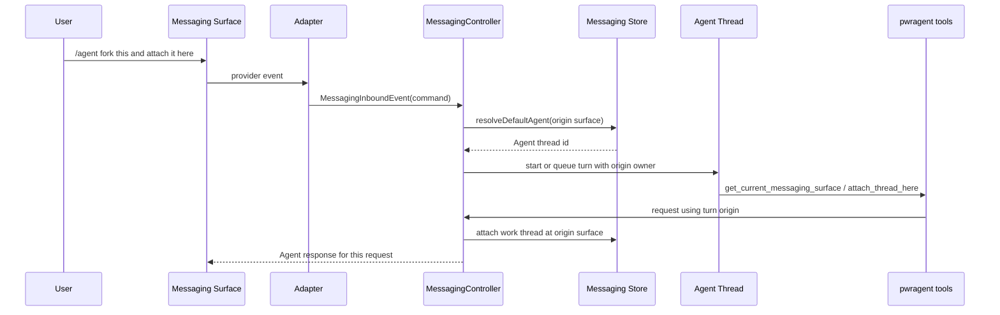
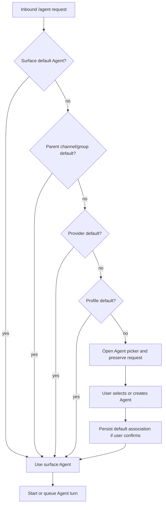
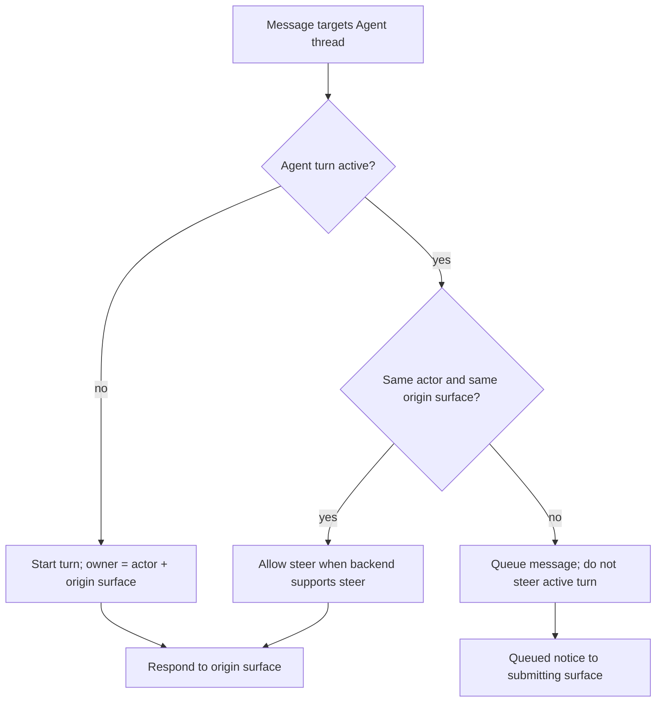

# feat: Add default Agent control routing from messaging

## Summary

Let a user in any messaging surface talk to the surface's configured/default PwrAgent Agent without breaking the existing binding for that surface.

The first implementation slice should be command-first: `/agent <request>` is the universal escape hatch from a work-bound conversation into the Agent control plane. It should work from Telegram groups/topics, Discord servers/channels/threads, Slack channels/threads, and future adapters through the existing provider-neutral inbound event model. Mention-based routing, inbound automation triggers, and source-message reply behavior are intentionally deferred so this work can land around PR #847 with limited overlap.

The Agent turn that starts from a messaging surface owns its response route. Other surfaces may enqueue additional messages to the same Agent thread, but they should not steer a turn they did not start.

## Problem Frame

PwrAgent messaging already supports binding a platform conversation to either a normal work thread or an Agent thread. That gives us the core mechanics for Agent-driven messaging tools, but it leaves an important interaction unresolved:

- A bound work conversation needs a way to ask the default Agent to do control-plane work like "fork this and attach it here" without sending that sentence to the work thread.
- The default Agent can exist at different scopes: whole PwrAgent instance, provider/platform, server/group/workspace, channel/topic/thread, or an explicit surface-level override.
- Platform affordances differ. Telegram bot commands behave differently from Discord slash commands, Slack mentions, Slack thread replies, and button callbacks.
- Multiple messaging surfaces can target the same Agent. Turn ownership needs to remain deterministic so one surface cannot unexpectedly steer another surface's active turn.
- PR #847 adds inbound-triggered automation behavior in nearby code. This feature should avoid automation handlers and provider adapter changes until #847 has landed.

## Existing Anchors

The plan builds on these existing repo capabilities:

- `MessagingController` already parses commands before bound-thread input, so `/agent` can bypass the work binding without replacing it.
- `MessagingBindingTargetKind` already includes `agent_thread`.
- The Agent browse flow already supports `MessagingBrowseMode = "agents"` and creating new Agent threads.
- Agent turns already remember messaging origin for `agent_thread` bindings and expose `pwragent.get_current_messaging_surface` plus `pwragent.attach_thread_here`.
- Turn admission already queues concurrent messages and renders steer/cancel actions.
- Adapter contracts already require providers to emit normalized inbound events and keep workflow semantics in the desktop messaging core.

## Requirements

### Addressing and Routing

1. `/agent <request>` from any messaging conversation MUST route the request to the resolved default Agent, not to the conversation's current work binding.
2. `/agent` with no request MUST open the existing Agent picker/browse flow.
3. If `/agent <request>` has no resolvable default Agent, the user MUST be prompted to choose or create an Agent, and the original request MUST be preserved for submission after selection.
4. Choosing an Agent for a surface MUST NOT replace an existing work-thread binding for that surface.
5. Ordinary text in a work-bound conversation MUST continue to route to the work thread unless it is explicitly addressed to the Agent.

### Default Agent Scope

6. The implementation MUST model default Agent assignment as a side-channel association, not as a second active `MessagingBinding` for the same platform conversation.
7. Resolution MUST prefer the most specific matching default:
   - conversation surface, including topic/thread when available
   - parent channel/group/server/workspace when the adapter exposes that shape
   - provider/platform profile
   - PwrAgent profile default
8. The first slice MAY implement only surface-level assignment plus profile-level fallback if the data model can expand to the full hierarchy without migration churn.
9. Default assignment state MUST use provider-neutral `MessagingChannelRef` and adapter-owned opaque routing state. The desktop core must not parse provider-native IDs.

### Agent Turn Ownership

10. Every `/agent <request>` MUST start or queue one Agent turn owned by the actor and origin surface that submitted it.
11. Responses for that request MUST return to the origin surface.
12. If another surface sends a message to the same Agent while a turn is active, it MAY queue a follow-up, but it MUST NOT steer the active turn unless it is the same actor and same origin surface.
13. The origin surface that started the turn MAY be offered steer/cancel controls when the backend supports them.
14. Status/audit updates to affected surfaces are allowed only when an Agent action changes those surfaces, for example after attaching a thread.

### Platform Behavior

15. Telegram: `/agent` MUST work in DMs, groups, and topics. Topic-originated requests should prefer the topic default before group fallback.
16. Discord: slash command or text command handling MUST preserve channel/thread origin so the default can be scoped at the right surface.
17. Slack: the first slice SHOULD rely on explicit `/agent` command events and existing normalized command handling. Mention and bot-message routing should wait until after PR #847.
18. Button/callback surfaces MAY invoke the same default-Agent routing path when slash commands are awkward or unavailable.

### PR #847 Boundary

19. This work MUST NOT implement inbound-triggered automations.
20. This work MUST NOT modify Slack adapter mention routing or source-message reply behavior.
21. This work SHOULD avoid files introduced mainly for PR #847 automation orchestration.
22. Any `MessagingController` changes SHOULD remain localized to command handling, Agent default resolution, turn origin capture, and queue ownership.

## High-Level Design







## Key Technical Decisions

### Command-first control plane

Use `/agent` as the reliable cross-platform escape hatch. It is explicit, provider-neutral, and already sits before bound-thread input in the controller. This avoids changing the meaning of ordinary text and avoids the platform-specific ambiguity of bot mentions.

Mention-based routing can still become a provider-specific affordance later, but it should be designed after PR #847 lands because Slack inbound handling and source-message context are moving there.

### Default Agent assignment is not a binding

Do not represent a work surface plus default Agent as two active bindings for the same channel. The stores currently assume one active binding per channel, and the sqlite store and test store differ in how aggressively they enforce that invariant. A separate default-Agent association avoids ambiguous binding lookup and keeps "where work text goes" independent from "where control-plane text goes."

### Agent tools remain the action surface

The control request should be plain Agent input. We should not build a large bespoke parser for phrases like "fork this and attach it here." Instead, the Agent uses dynamic messaging tools, starting with the advertised `get_current_messaging_surface` and `attach_thread_here` operations.

Follow-up slices can add tools for preferences such as "fast mode" once the routing and origin model is stable.

### Origin is actor plus surface

The active Agent turn must carry the exact origin that submitted it, including actor identity and provider-normalized conversation reference. Tool calls should resolve "here" from that origin, even when the surface is bound to a normal work thread rather than directly bound to the Agent thread.

### Provider-neutral core, provider-aware behavior

Platform quirks should be expressed through normalized events, capabilities, and opaque routing state. The desktop messaging core can choose different behavior based on available capabilities, but it should not branch on provider IDs to parse native channel semantics.

## Implementation Units

### 1. Default Agent Assignment Contract and Store

Add a persistent default-Agent association separate from `MessagingBinding`.

Likely files:

- `packages/shared/src/contracts/messaging.ts`
- `apps/desktop/src/main/messaging/core/messaging-store.ts`
- `apps/desktop/src/main/state/messaging-store-sqlite.ts`
- `apps/desktop/src/main/__tests__/messaging-store.test.ts`
- `apps/desktop/src/main/__tests__/messaging-store-sqlite.test.ts`

Shape:

- assignment id
- scope kind: `profile`, `provider`, `conversation`
- provider id/profile id where applicable
- optional `MessagingChannelRef` for conversation scope
- optional opaque routing state for adapter-managed placement
- target Agent backend/thread id
- created/updated timestamps
- active/revoked status

The first implementation can store only `profile` and `conversation` scopes if the schema leaves room for provider and parent-surface scopes.

### 2. `/agent <request>` Control Routing

Extend command handling so `/agent` can submit a request to the resolved default Agent without changing the current work binding.

Likely files:

- `apps/desktop/src/main/messaging/core/messaging-controller.ts`
- `apps/desktop/src/main/messaging/core/messaging-command-catalog.ts`
- `apps/desktop/src/main/__tests__/messaging-controller.test.ts`

Behavior:

- `/agent` with no args keeps the current browse/picker behavior.
- `/agent <request>` resolves the default Agent for the origin surface.
- If a default exists, submit the request to that Agent.
- If no default exists, open the Agent picker and preserve the request as pending input.
- After selection, offer or apply a default assignment for that surface, then submit the preserved request.

### 3. Origin Context for Side-channel Agent Turns

Generalize the current Agent messaging origin capture so side-channel `/agent <request>` turns have a valid origin even when the surface's active binding is a work thread.

Likely files:

- `apps/desktop/src/main/messaging/core/messaging-controller.ts`
- `apps/desktop/src/main/agent-tools/pwragent-messaging-agent-tools.ts`
- `packages/shared/src/contracts/messaging-tools.ts`
- `apps/desktop/src/main/__tests__/backend-registry.test.ts`
- `apps/desktop/src/main/__tests__/messaging-controller.test.ts`

Behavior:

- `get_current_messaging_surface` reports the origin surface, actor, managed conversation capability, and current work binding if one exists.
- `attach_thread_here` attaches at the origin surface, not at an Agent-bound shadow conversation.
- Tool responses remain clear when the origin has no managed native child conversation support.

### 4. Queue and Steer Ownership

Tighten queue/steer rules for Agent turns shared across surfaces.

Likely files:

- `apps/desktop/src/main/messaging/core/messaging-controller.ts`
- `apps/desktop/src/main/messaging/core/messaging-turn-admission.ts`
- `apps/desktop/src/main/__tests__/messaging-controller.test.ts`

Behavior:

- Active Agent turn ownership is `actor + origin surface`.
- Same owner may steer when backend support exists.
- Different owner or different surface queues a message.
- Queued notices go only to the surface that submitted the queued request.
- Existing multi-surface queue tests should be extended to prove the second surface cannot steer the first surface's turn.

### 5. Picker, Status, and Help Copy

Make the command discoverable without introducing provider-specific mention behavior.

Likely files:

- `apps/desktop/src/main/messaging/core/messaging-command-catalog.ts`
- `apps/desktop/src/main/messaging/core/messaging-resume-browser.ts`
- `apps/desktop/src/main/messaging/core/messaging-status-card.ts`
- `apps/desktop/src/main/__tests__/messaging-controller.test.ts`

Behavior:

- Help copy says `/agent <request>` asks the default Agent from this conversation.
- Agent picker copy distinguishes "bind this conversation to an Agent" from "set this conversation's default Agent."
- Status card actions can include an Agent control button where the adapter supports callbacks.

### 6. Contributor Documentation

Document the model and platform-specific behavior in repo docs.

Likely files:

- `docs/messaging-architecture.md`
- `docs/messaging-adapter-contract.md`
- `docs/messaging-platform-integration.md`

Content:

- `/agent` is the portable explicit control-plane route.
- Default Agent assignment is separate from the active work binding.
- Mention routing is deferred and provider-specific.
- Other surfaces can queue to an Agent but cannot steer turns they did not start.
- Adapter authors should emit normalized command/callback events and avoid workflow logic in provider packages.

## Acceptance Criteria

1. A Telegram topic bound to a work thread can send `/agent fork this and attach it here`; the request goes to the configured Agent, the work binding remains active, and the Agent can attach a thread back to that topic.
2. A Discord channel bound to a work thread can send `/agent <request>` and receive the Agent response in that channel without creating a shadow work thread.
3. `/agent <request>` with no configured default opens the Agent picker, preserves the request, and submits it after the user selects or creates an Agent.
4. Two messaging surfaces targeting the same Agent cannot both steer one active turn. The second surface queues and receives its own queued notice.
5. Help/status copy makes the explicit `/agent` route discoverable.
6. Slack mention text without `/agent` retains current behavior in this slice.
7. Existing Agent binding, Agent picker, and `attach_thread_here` tests continue to pass.
8. Store tests prove default Agent assignments do not create multiple active bindings for one conversation.

## Test Plan

Run focused tests first:

```bash
pnpm test apps/desktop/src/main/__tests__/messaging-controller.test.ts
pnpm test apps/desktop/src/main/__tests__/messaging-store.test.ts
pnpm test apps/desktop/src/main/__tests__/messaging-store-sqlite.test.ts
pnpm test apps/desktop/src/main/__tests__/backend-registry.test.ts
```

Then run boundary and package checks:

```bash
pnpm lint:boundaries
pnpm --filter @pwragent/messaging-interface test
pnpm --filter @pwragent/messaging-provider-telegram test
pnpm --filter @pwragent/messaging-provider-discord test
pnpm --filter @pwragent/messaging-provider-slack test
```

If renderer/status-card behavior changes, add the relevant desktop UI tests and run the desktop package test suite.

## PR #847 Conflict Avoidance

Avoid these areas in the first slice:

- `apps/desktop/src/main/automations/*`
- `apps/desktop/src/renderer/src/features/automations/*`
- inbound automation matching or scheduling docs
- Slack adapter mention/bot-message routing
- source-message reply delivery
- automation launch-profile override behavior

Expected overlap:

- `apps/desktop/src/main/messaging/core/messaging-controller.ts`
- `apps/desktop/src/main/messaging/messaging-runtime.ts` only if necessary for tool request plumbing
- shared messaging types if a default-assignment contract is added

Keep the controller change near command handling and Agent turn routing. PR #847's likely overlap is early inbound automation dispatch and source-relative delivery, so keeping this feature on the `/agent` path should make the eventual merge mechanical.

## Deferred Follow-up Work

- Mention-based Agent routing, including `@bot` in Discord/Slack and Telegram mention text.
- Inbound-triggered automation rules and default-Agent actions that run without explicit `/agent`.
- Full Settings UI for instance, provider, workspace/server/group, channel/topic/thread defaults.
- Richer Agent tools for preference changes such as model mode, launch profile, queue policy, or channel notification settings.
- Cross-surface audit feed for Agent actions that affect multiple messaging conversations.
- Operator-facing docs site updates in the separate `docs.pwragent.ai` repo.

## Sources and Research

- `docs/messaging-architecture.md`
- `docs/messaging-adapter-contract.md`
- `packages/messaging/AGENTS.md`
- `apps/desktop/AGENTS.md`
- `docs/brainstorms/2026-05-13-codex-via-messaging-docs-requirements.md`
- `docs/brainstorms/2026-05-22-agent-thread-attached-automations-requirements.md`
- `apps/desktop/src/main/messaging/core/messaging-controller.ts`
- `apps/desktop/src/main/agent-tools/pwragent-messaging-agent-tools.ts`
- `packages/shared/src/contracts/messaging-tools.ts`
- `apps/desktop/src/main/state/messaging-store-sqlite.ts`
- PR #847: `feat(automations): support inbound message triggers`
