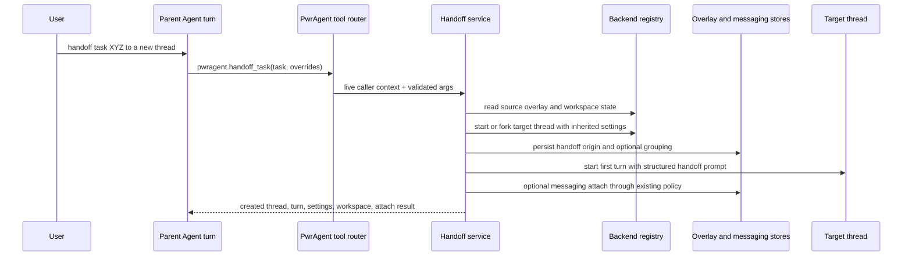
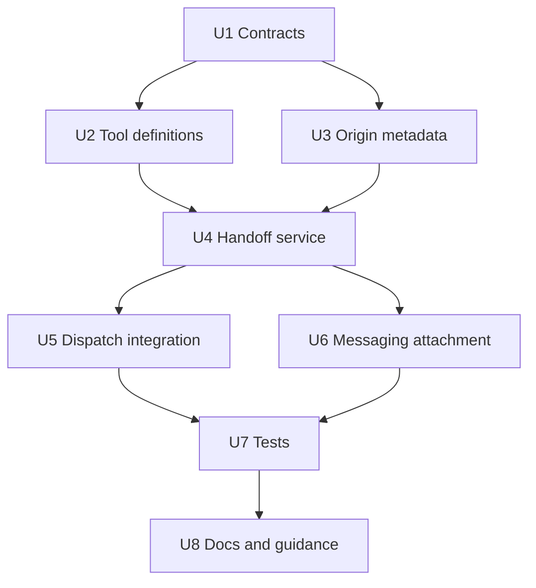

# feat: Add agent task handoff dynamic tool

## Summary

Add a first-class `pwragent` dynamic tool that lets an Agent hand a task to a newly created thread. The tool should inherit the invoking thread's provider, model, reasoning, fast mode, permission mode, Codex environment, and workspace by default, apply only explicit user overrides, start the new thread with a structured handoff prompt, and preserve a durable reference back to the spawning thread. Clean new-thread handoff is the default; transcript fork and sub-thread grouping are explicit modes.

---

## Problem Frame

Today PwrAgent can start threads, fork Codex threads, materialize launchpads, attach messaging surfaces, and spawn lightweight monitor delegates. Those capabilities are not yet available as a deterministic "handoff this task to a new thread" Agent tool. Without that tool, an Agent has to rely on prompt convention, slash commands, or monitor-specific delegation, which cannot reliably inherit the current thread's runtime settings and workspace context.

The requested behavior is explicitly thread-oriented: a user should be able to say "handoff task XYZ to a new thread" from desktop or messaging, and the current Agent should invoke a tool that creates and starts that new thread with the right project/worktree, execution settings, origin reference, and optional messaging attachment. If the user says "fork this thread" or "handoff to a sub-thread," those words select explicit modes rather than changing the default handoff behavior.

---

## Requirements

- R1. Expose task handoff through the existing advertised `pwragent` dynamic-tool namespace, not a new public namespace or slash command.
- R2. Keep existing deprecated namespace facades for old tool families working for existing threads; the new handoff tool should not require another compatibility namespace.
- R3. Create a new independent thread by default, not a transcript fork.
- R4. Inherit the invoking thread's backend/provider, execution mode, approval/sandbox policy, model, reasoning effort, service tier, fast mode, Codex environment runtime, ACP runtime, current workspace, linked directory, Git branch, and worktree context by default where the backend supports those fields.
- R5. Apply only explicit user-requested overrides, and reject unsupported or ambiguous overrides with structured tool errors.
- R6. Start the created thread immediately with a handoff prompt assembled from the Agent-supplied task plus PwrAgent-owned context metadata.
- R7. Persist a source reference on the created thread so it can identify the spawning thread, spawning turn, source title, branch, workspace/worktree, and creation time without implying shared transcript access.
- R8. Support optional sub-thread grouping through the existing parent/subthread UI relationship when the user explicitly asks for a sub-thread; leave grouping off by default.
- R9. Return a bounded structured result containing the created thread id, backend, turn id or start failure, inherited settings summary, workspace summary, optional subthread grouping outcome, and any messaging attachment outcome.
- R10. Enforce runtime access: the tool call must originate from a live Agent turn on the same thread, must be denied when the current context cannot support handoff, and must return clear reasons for messaging or user access denial.
- R11. When invoked from a messaging-originated Agent turn, optionally attach the created thread to the current messaging location using the existing messaging context rules, falling back to an explicit "created but not attached" result when the provider or actor cannot do that.
- R12. Preserve the current dynamic-tool compatibility and catalog model while reducing new branch-per-tool dispatch in `backend-registry.ts`.
- R13. Cover contracts, router behavior, inheritance, thread creation, messaging attachment, runtime denial, and regression compatibility with focused tests.
- R14. Report whether the current project is backed by Git, whether worktree creation is available, and which workspace mode was selected or rejected.
- R15. Mark the created thread as an Agent thread by default, inheriting the parent Agent metadata and enabled tool catalogs unless explicit future policy says otherwise.
- R16. Support an explicit fork seed mode that copies the current thread transcript when the user asks to fork, while preserving clean new-thread handoff as the default.

---

## Scope Boundaries

- This plan creates a new Agent dynamic tool for task handoff; it does not add a user-facing slash command.
- This plan creates a new independent thread and starts a first turn by default; it copies the parent transcript only when an explicit fork mode is requested.
- This plan may create an isolated worktree when explicitly requested, but same-current-workspace inheritance is the default.
- This plan does not replace `pwragent_task_monitors.create_monitor_delegation`; monitors remain the lightweight polling/status-check tool.
- This plan does not implement full Bot/RBAC policy, cross-machine handoff, or reusable Agent templates.
- This plan does not give created threads direct access to parent transcript storage or Codex-owned session files.

### Deferred to Follow-Up Work

- Rich cross-thread context retrieval where the created thread can request additional parent-thread context through an audited PwrAgent tool.
- A general thread-control catalog with enqueue-message and approval-management tools beyond this handoff operation.
- ACP MCP parity for every backend if current ACP tool registration cannot yet expose the new catalog with equivalent runtime context.
- UI polish for showing handoff-origin metadata beyond optional subthread grouping and the tool result.

---

## Context & Research

### Relevant Code and Patterns

- `packages/shared/src/contracts/agent-tools.ts` defines the single advertised `pwragent` tool namespace and internal catalog ids.
- `packages/shared/src/contracts/thread-tools.ts`, `app-tools.ts`, `messaging-tools.ts`, and `task-monitor-tools.ts` show the current operation-name, args, response, error-code, and deprecated-namespace compatibility shape.
- `apps/desktop/src/main/agent-tools/agent-tool-definition.ts`, `agent-tool-router.ts`, and `agent-tool-catalog-registry.ts` define the catalog/router substrate used by current Agent dynamic tools.
- `apps/desktop/src/main/agent-tools/pwragent-thread-agent-tools.ts`, `pwragent-app-agent-tools.ts`, and `pwragent-messaging-agent-tools.ts` show how catalog definitions project into Codex dynamic tool specs.
- `apps/desktop/src/main/app-server/backend-registry.ts` owns `startThread`, `startTurn`, `forkThread`, `materializeDirectoryLaunchpad`, dynamic-tool dispatch, live-turn validation, model setting resolution, Codex environment runtime persistence, and parent-thread grouping.
- `packages/shared/src/contracts/agent.ts` carries `StartThreadRequest`, `StartTurnRequest`, `ForkThreadRequest`, and `MaterializeDirectoryLaunchpadRequest` fields for inherited provider/runtime settings.
- `packages/shared/src/contracts/navigation.ts` defines `ThreadOverlayState`, `NavigationThreadSummary`, `NavigationLaunchpadDraft`, `ThreadAgentMetadata`, and the explicit UI-only parent thread invariant.
- `apps/desktop/src/main/state/overlay-store-sqlite.ts` persists thread overlay state, Agent metadata, model settings, Codex environment runtime, parent/subthread ordering, and linked-directory overlays.
- `apps/desktop/src/main/messaging/desktop-backend-bridge.ts`, `messaging-controller.ts`, and `pwragent-messaging-agent-tools.ts` provide the existing messaging bridge and current-location/attach-thread dynamic tools.
- `apps/desktop/src/main/__tests__/backend-registry.test.ts` already contains focused coverage for Agent dynamic tools, launchpad materialization, forking, parent grouping, runtime inheritance, and dynamic-tool denial.
- `apps/desktop/src/main/agent-tools/__tests__/agent-tool-router.test.ts` and `packages/shared/src/contracts/__tests__/agent-tools.test.ts` are the closest contract/router test patterns.

### Institutional Learnings

- `docs/solutions/2026-05-07-codex-permission-mode-state-machine.md` warns against silent fallback across security-relevant permission boundaries. The handoff tool must inherit and log/return effective permission state deliberately instead of relying on upstream defaults.
- `docs/plans/2026-06-07-001-feat-agent-thread-messaging-tools-plan.md` established the catalog-driven Agent tool direction and the single `pwragent` namespace.
- `docs/plans/2026-05-22-001-feat-messaging-new-thread-backend-selection-plan.md` established that messaging-created threads should respect backend/model/reasoning/fast/permission choices before creation.
- `docs/plans/2026-04-29-001-feat-thread-workspace-handoff-plan.md` established that workspace/worktree movement and metadata updates belong in desktop main, not renderer or messaging-specific branches.

### External References

- Not used. Existing repository contracts and prior PwrAgent plans provide the relevant patterns.

---

## Key Technical Decisions

- Use one public namespace with internal catalog grouping: the new tool should be advertised as `pwragent.handoff_task`, with a new internal catalog id such as `thread_orchestration`. Catalog ids are enablement and diagnostics metadata, not user-facing namespaces.
- Default to same-workspace new threads: "handoff task to a new thread" should preserve the current project/worktree unless the user explicitly asks for isolation, a new branch, or a new worktree.
- Start a clean new thread rather than fork by default: Codex `thread/fork` copies source transcript semantics, so it should be used only when the user explicitly asks to fork the current thread.
- Let the Agent provide task intent, and let PwrAgent provide the envelope: the dynamic tool args carry the Agent's task summary and optional context, while the handler injects source thread, runtime, workspace, and messaging metadata in a consistent wrapper.
- Persist origin metadata separately from `parentThreadId`: origin metadata is always useful for handoff provenance, while `parentThreadId` is only set when the user requests sub-thread grouping.
- Treat permission and environment inheritance as security-relevant: inherit from the current effective overlay/runtime state, derive approval/sandbox from execution mode where needed, and reject mismatched overrides instead of silently normalizing to a different mode.
- Attach to messaging only through existing messaging policy: when requested, use the current messaging-location context and attach rules; if the actor/provider cannot attach, the thread creation can still succeed with a structured non-attachment reason.
- Consolidate dynamic-tool dispatch while adding this tool: the implementation should move toward a single PwrAgent dynamic tool router path so `backend-registry.ts` does not grow another nearly identical catalog branch.

---

## Open Questions

### Resolved During Planning

- Should this be a new public namespace? No. It belongs under the existing `pwragent` namespace; only internal catalog grouping should expand.
- Should this be a slash command? No. Messaging should reach it through Agent dynamic tools.
- Should the default be a new worktree? No. Inherit the current workspace/worktree by default; create a new worktree only when explicitly requested.
- Should this use Codex fork by default? No. The handoff creates a clean thread and starts it with a prompt unless the user explicitly asks to fork.
- Should parent grouping imply context sharing? No. Preserve the existing invariant and put required context in the prompt/origin metadata; only set sub-thread grouping when requested.

### Deferred to Implementation

- Exact tool argument names may adjust to match the surrounding contract naming style.
- Exact handoff prompt wording should be finalized during implementation, but the envelope fields and invariant are plan-owned.
- Whether ACP MCP can expose this tool in the same PR depends on the current ACP dynamic-tool/MCP registration path; unsupported runtimes should report an unavailable catalog reason rather than pretend parity.

---

## High-Level Technical Design

> *This illustrates the intended approach and is directional guidance for review, not implementation specification. The implementing agent should treat it as context, not code to reproduce.*

### Inheritance Matrix

| Source concept | Default behavior |
|---|---|
| Backend/provider | Use invoking thread backend when that backend can start a new thread. |
| Model/reasoning/service tier/fast mode | Use overlay/current thread model settings and backend defaults resolution. |
| Permission mode | Use current effective execution mode; approval/sandbox derive from the same mode unless explicitly overridden. |
| Codex environment | Preserve selected environment/action runtime for same-workspace handoff; derive a child-safe runtime for new worktree handoff. |
| Workspace/worktree | Use current resolved workspace and linked directory by default; create a new worktree only when requested. |
| Messaging location | Attach only when requested/auto-enabled and existing messaging context authorizes it. |
| Parent context | Persist source metadata and include a bounded prompt envelope; do not read parent transcript files except through explicit backend fork support. |

---

## Implementation Units

### U1. Shared Handoff Contracts

**Goal:** Define the tool operation, args, response, errors, catalog id, and origin metadata shape in shared contracts.

**Requirements:** R1, R4, R5, R7, R9, R10, R12

**Dependencies:** None

**Files:**
- Modify: `packages/shared/src/contracts/agent-tools.ts`
- Create: `packages/shared/src/contracts/thread-orchestration-tools.ts`
- Modify: `packages/shared/src/contracts/navigation.ts`
- Modify: `packages/shared/src/index.ts`
- Test: `packages/shared/src/contracts/__tests__/agent-tools.test.ts`
- Test: `packages/shared/src/contracts/__tests__/thread-orchestration-tools.test.ts`

**Approach:**
- Add an internal catalog id for thread orchestration while keeping `PWRAGENT_TOOL_NAMESPACE` as the only advertised namespace.
- Define `handoff_task` args around task text, optional title/context, seed mode, grouping mode, workspace mode, explicit provider/runtime overrides, and optional messaging attachment mode.
- Define a bounded success payload with created thread identity, first-turn status, inherited settings, workspace/git details, origin metadata, optional grouping outcome, fork outcome, and attachment outcome.
- Define structured error codes for invalid arguments, forbidden, not found, unsupported backend, unsupported workspace, ambiguous workspace, turn start failure, and internal errors.
- Extend `ThreadOverlayState` with durable handoff-origin metadata that records source backend/thread/turn, source title when available, source workspace/worktree/branch, created time, and requested task title.

**Patterns to follow:**
- `packages/shared/src/contracts/agent-tools.ts`
- `packages/shared/src/contracts/thread-tools.ts`
- `packages/shared/src/contracts/messaging-tools.ts`
- `packages/shared/src/contracts/navigation.ts`

**Test scenarios:**
- Happy path: catalog ids include thread orchestration and normalization preserves known ids while dropping unknown ids.
- Happy path: handoff args/response types accept clean, fork, no-grouping, subthread-grouping, same-workspace, and new-worktree modes.
- Edge case: unknown catalog ids remain ignored by normalization.
- Error path: invalid operation names and invalid attachment modes are rejected by contract helpers where helpers exist.

**Verification:** Shared contract tests prove the new catalog and operation are stable without changing the public namespace.

### U2. Tool Definition and Router Projection

**Goal:** Add the `pwragent.handoff_task` Agent tool definition and project it into dynamic-tool specs through the existing catalog system.

**Requirements:** R1, R2, R5, R9, R10, R12

**Dependencies:** U1

**Files:**
- Create: `apps/desktop/src/main/agent-tools/pwragent-thread-orchestration-agent-tools.ts`
- Create: `apps/desktop/src/main/agent-tools/pwragent-thread-orchestration-codex-tools.ts`
- Modify: `apps/desktop/src/main/agent-tools/agent-tool-catalog-registry.ts`
- Modify: `apps/desktop/src/main/agent-tools/agent-tool-router.ts`
- Test: `apps/desktop/src/main/agent-tools/__tests__/agent-tool-router.test.ts`
- Test: `apps/desktop/src/main/__tests__/backend-registry.test.ts`

**Approach:**
- Define the tool once with namespace, name, description, JSON schema, and dispatch bridge.
- Keep legacy facade logic only for existing old namespaces; because `handoff_task` is new, advertise it only under `pwragent`.
- Include guidance in the tool description that it should be used when the user asks to hand off/delegate a task to a new thread, and that omitted settings inherit from the invoking thread.
- Extend router support so catalog dispatch can normalize new and existing PwrAgent tool calls consistently.

**Patterns to follow:**
- `apps/desktop/src/main/agent-tools/pwragent-thread-agent-tools.ts`
- `apps/desktop/src/main/agent-tools/pwragent-app-agent-tools.ts`
- `apps/desktop/src/main/agent-tools/pwragent-messaging-agent-tools.ts`

**Test scenarios:**
- Happy path: Agent catalog resolution includes `handoff_task` for Agent threads under the `pwragent` namespace.
- Happy path: dynamic tool spec exposes the expected name, description, schema, and no deprecated namespace.
- Error path: unknown orchestration tool names return `unsupported_operation`.
- Regression: existing deprecated namespaces for app/thread/messaging/automation tools still route as before.

**Verification:** Dynamic tool specs show a single public namespace and include the new operation without breaking compatibility for existing tool families.

### U3. Handoff Origin Persistence

**Goal:** Persist and surface enough origin metadata for the created thread to know where it came from without treating the parent transcript as shared memory.

**Requirements:** R7, R8, R9, R13

**Dependencies:** U1

**Files:**
- Modify: `apps/desktop/src/main/state/overlay-store-sqlite.ts`
- Modify: `apps/desktop/src/main/app-server/backend-registry.ts`
- Modify: `packages/shared/src/contracts/thread-tools.ts`
- Test: `apps/desktop/src/main/__tests__/overlay-store-agent.test.ts`
- Test: `apps/desktop/src/main/__tests__/backend-registry.test.ts`
- Test: `packages/shared/src/contracts/__tests__/thread-orchestration-tools.test.ts`

**Approach:**
- Add an overlay-store setter for handoff origin metadata or fold it into an existing thread-overlay update helper if that keeps the store API smaller.
- Store origin metadata on the created thread after its thread id exists and before or alongside the first turn start.
- Reuse `setThreadParent` only when the tool args request sub-thread grouping, while documenting and testing that this remains UI-only grouping.
- Extend thread inspection/status summaries to include handoff origin where useful, keeping output bounded.

**Patterns to follow:**
- `apps/desktop/src/main/state/overlay-store-sqlite.ts` `setThreadParent`
- `packages/shared/src/contracts/navigation.ts` `ThreadOverlayState`
- `packages/shared/src/contracts/thread-tools.ts` status summaries

**Test scenarios:**
- Happy path: setting handoff origin persists across store reopen and does not overwrite Agent metadata, model settings, or parent grouping.
- Happy path: requested sub-thread grouping is written through `setThreadParent` and parent `subthreadOrder` updates.
- Happy path: default handoff stores origin metadata without setting `parentThreadId`.
- Edge case: source title or branch can be absent without failing persistence.
- Regression: parent grouping remains independent of origin metadata and can be cleared without deleting origin metadata unless explicitly requested.

**Verification:** Overlay state can answer "who spawned this thread, from what workspace, and when" without reading provider-private transcript storage.

### U4. Backend Handoff Service

**Goal:** Implement the orchestration service that resolves source context, inherits settings, creates or forks the target thread, starts the first turn, and returns a structured result.

**Requirements:** R3, R4, R5, R6, R7, R8, R9, R10, R13, R14, R15, R16

**Dependencies:** U1, U3

**Files:**
- Create: `apps/desktop/src/main/app-server/agent-task-handoff-service.ts`
- Modify: `apps/desktop/src/main/app-server/backend-registry.ts`
- Test: `apps/desktop/src/main/__tests__/agent-task-handoff-service.test.ts`
- Test: `apps/desktop/src/main/__tests__/backend-registry.test.ts`

**Approach:**
- Build a service owned by desktop main so it can coordinate backend clients, overlay state, Git workspace resolution, Codex environment runtime, and messaging policy without crossing dependency boundaries.
- Resolve the invoking thread's overlay, current execution mode, model settings, active workspace, linked directory, Git branch, Agent metadata, and environment runtime from existing registry/store helpers.
- Compute a workspace capability summary that distinguishes no workspace, non-Git workspace, Git local checkout, Git worktree, and worktree-creation availability; include that summary in success and denial responses.
- Create the target with `startThread` for clean-thread semantics by default, passing inherited settings and workspace details.
- When explicit fork seed mode is requested and the backend supports it, use `forkThread` to seed the target from the current transcript, then start the first handoff turn in the forked thread.
- Reject fork seed mode with a structured unsupported-backend error for backends that cannot fork.
- For same-workspace handoff, pass the current resolved cwd/linked directory and preserve Codex environment runtime with a current workspace cwd.
- For explicit new-worktree handoff, reuse launchpad workspace preparation semantics and derive a child-safe Codex environment runtime rather than reusing stale cwd data.
- Start the first turn with a structured prompt that includes the Agent-supplied task and PwrAgent-owned source metadata.
- If thread creation or fork succeeds but first turn start fails, keep the created thread and return `turnStartFailure` with enough information for the parent Agent to report recovery options.

**Execution note:** Implement characterization coverage around existing start-thread inheritance before adding the handoff service, because this unit depends on permission/runtime fields that have regressed historically.

**Patterns to follow:**
- `apps/desktop/src/main/app-server/backend-registry.ts` `startThread`
- `apps/desktop/src/main/app-server/backend-registry.ts` `startTurn`
- `apps/desktop/src/main/app-server/backend-registry.ts` `materializeDirectoryLaunchpad`
- `apps/desktop/src/main/app-server/backend-registry.ts` `buildForkedCodexEnvironmentRuntime`

**Test scenarios:**
- Happy path: same-workspace Codex handoff starts a created thread with inherited execution mode, model, reasoning effort, service tier, fast mode, cwd, linked directory, Agent metadata, and Codex environment runtime.
- Happy path: created thread is marked as an Agent thread and receives the same enabled PwrAgent tool catalogs as the parent by default.
- Happy path: explicit fork seed mode calls the backend fork path, preserves inherited runtime settings, and then starts the handoff turn in the forked thread.
- Happy path: explicit sub-thread grouping sets parent grouping, while default clean handoff does not.
- Happy path: explicit new-worktree handoff prepares a worktree, records ownership, updates linked directory metadata, and starts the created thread on the requested branch.
- Happy path: first prompt contains the task and bounded origin metadata but no parent transcript dump.
- Edge case: parent thread has no resolvable workspace and the tool returns `unsupported_workspace` unless args explicitly allow a no-workspace created thread.
- Edge case: parent workspace is not Git-backed, so same-workspace handoff can proceed but new-worktree handoff is denied with worktree capability details.
- Edge case: queued permission mode on the parent does not silently become the child execution mode while the parent turn is still active.
- Error path: unsupported backend, backend without create-thread capability, or backend without fork capability for requested fork mode returns a structured denial before mutation.
- Error path: thread creation succeeds but turn start fails, returning created thread id plus turn failure without rolling back the created thread.

**Verification:** A parent Agent can hand off a task and receive a created thread id plus turn state, with inherited runtime settings visible in overlays and backend start parameters.

### U5. Runtime Access and Dispatch Integration

**Goal:** Route `handoff_task` calls through runtime guards that are shared with the existing PwrAgent tools and avoid adding another bespoke branch in `backend-registry.ts`.

**Requirements:** R1, R2, R10, R12, R13

**Dependencies:** U2, U4

**Files:**
- Modify: `apps/desktop/src/main/app-server/backend-registry.ts`
- Modify: `apps/desktop/src/main/agent-tools/agent-tool-catalog-registry.ts`
- Modify: `apps/desktop/src/main/agent-tools/agent-tool-router.ts`
- Test: `apps/desktop/src/main/__tests__/backend-registry.test.ts`
- Test: `apps/desktop/src/main/agent-tools/__tests__/agent-tool-router.test.ts`

**Approach:**
- Introduce a unified PwrAgent dynamic-tool dispatch path that can identify any registered `pwragent` tool definition, apply the live-turn guard, normalize deprecated namespaces for existing families, and invoke the right handler.
- Keep task monitor handling separate if needed because its namespace and monitor lifecycle are intentionally distinct.
- Require an active turn id matching the calling backend/thread for handoff and return a forbidden tool response when the call is stale, out-of-thread, or missing turn context.
- Include denial reason data for unsupported messaging contexts, unsupported backends, and unavailable handlers.

**Patterns to follow:**
- `apps/desktop/src/main/app-server/backend-registry.ts` `isLiveDynamicToolCall`
- `apps/desktop/src/main/agent-tools/pwragent-thread-codex-tools.ts`
- `apps/desktop/src/main/agent-tools/pwragent-app-codex-tools.ts`

**Test scenarios:**
- Happy path: active Agent turn can invoke `pwragent.handoff_task`.
- Error path: call with missing turn id, stale turn id, wrong thread id, or wrong backend is denied before handler execution.
- Error path: non-Agent thread does not receive the tool spec and direct invocation is denied or unsupported.
- Regression: app, thread, messaging, and automation tools still dispatch successfully through their old compatibility paths.
- Regression: task monitor tools retain their existing namespace and lifecycle behavior.

**Verification:** Adding the new handoff tool reduces or at least does not increase catalog-specific dispatch branching in `backend-registry.ts`.

### U6. Messaging-Origin Attachment

**Goal:** Let messaging-originated Agent turns hand off a task to a new thread and make that created thread reachable from the current messaging location when policy and provider capabilities allow it.

**Requirements:** R6, R9, R10, R11, R13

**Dependencies:** U4, U5

**Files:**
- Modify: `apps/desktop/src/main/app-server/agent-task-handoff-service.ts`
- Modify: `apps/desktop/src/main/agent-tools/pwragent-messaging-agent-tools.ts`
- Modify: `apps/desktop/src/main/messaging/core/messaging-controller.ts`
- Test: `apps/desktop/src/main/__tests__/agent-task-handoff-service.test.ts`
- Test: `apps/desktop/src/main/__tests__/messaging-controller.test.ts`
- Test: `apps/desktop/src/main/__tests__/backend-registry.test.ts`

**Approach:**
- Reuse the current messaging context lookup keyed by backend/thread/turn so the handoff service can tell whether the active turn came from messaging.
- If attachment is `auto` or explicitly requested, route through the same attach-thread policy used by `attach_thread_here`, including actor authorization and provider managed-conversation capability checks.
- When a provider can create a child conversation/topic, attach the created thread there; otherwise attach to the current conversation only when that matches the existing placement policy.
- If attachment is denied or unsupported after thread creation, return a non-fatal attachment outcome explaining why.

**Patterns to follow:**
- `apps/desktop/src/main/agent-tools/pwragent-messaging-agent-tools.ts`
- `packages/shared/src/contracts/messaging-tools.ts`
- `apps/desktop/src/main/messaging/core/messaging-controller.ts` browse/binding policy

**Test scenarios:**
- Happy path: messaging-originated handoff with child-conversation support creates and attaches the created thread to the new provider conversation.
- Happy path: messaging-originated handoff with current-conversation placement attaches the created thread to the current location when allowed.
- Edge case: desktop-originated handoff with `auto` attachment skips messaging attachment and reports no messaging location.
- Error path: unauthorized messaging actor or missing provider permission returns thread-created-but-not-attached with a clear reason.
- Regression: existing `get_current_location` and `attach_thread_here` tools still work independently.

**Verification:** A user invoking an Agent from messaging can ask for a handoff and get a created thread that is either reachable from messaging or reports exactly why it is not.

### U7. End-to-End Behavioral Tests

**Goal:** Lock the cross-layer behavior with tests that exercise the real registry/tool path rather than only unit-level helpers.

**Requirements:** R1, R3, R4, R6, R7, R8, R9, R10, R11, R13, R14, R15, R16

**Dependencies:** U1, U2, U3, U4, U5, U6

**Files:**
- Modify: `apps/desktop/src/main/__tests__/backend-registry.test.ts`
- Create: `apps/desktop/src/main/__tests__/agent-task-handoff-service.test.ts`
- Modify: `apps/desktop/src/main/__tests__/messaging-controller.test.ts`
- Modify: `apps/desktop/src/main/agent-tools/__tests__/agent-tool-router.test.ts`
- Modify: `packages/shared/src/contracts/__tests__/agent-tools.test.ts`
- Modify: `packages/shared/src/contracts/__tests__/thread-orchestration-tools.test.ts`

**Approach:**
- Prefer focused main-process tests using existing mocks over broad Electron E2E unless implementation changes renderer-visible behavior.
- Add at least one full dynamic-tool call test from active Agent turn through router/service/startThread/startTurn mocks.
- Add failure tests for stale tool calls and unsupported workspace/backend cases.
- Add regression assertions for inherited settings because permission/model/runtime fields are the feature's core correctness surface.

**Test scenarios:**
- Integration: active Agent dynamic tool call creates and starts a thread with inherited settings and origin metadata, without parent grouping by default.
- Integration: explicit sub-thread handoff creates parent grouping.
- Integration: explicit fork handoff copies transcript through the backend fork path and starts the handoff turn.
- Integration: same request from messaging attaches the created thread when provider policy permits.
- Integration: stale dynamic tool call returns forbidden and does not call thread creation.
- Error path: first turn start failure returns created thread identity plus structured failure.
- Regression: old deprecated namespaces for existing app/thread/messaging tools still invoke their facades.
- Regression: no implementation reads Codex-owned session JSONL or sqlite storage to build the handoff prompt.

**Verification:** The implementation can be reviewed through deterministic tests without requiring a live messaging provider or a live Codex child for every scenario.

### U8. Guidance, Tool Copy, and Operational Notes

**Goal:** Add concise guidance so Agents know when to use the new tool, and document the runtime denial model for future tool additions.

**Requirements:** R1, R2, R5, R10, R11, R12

**Dependencies:** U2, U5, U6

**Files:**
- Modify: `docs/messaging-architecture.md`
- Modify: `docs/messaging-platform-integration.md`
- Modify: `apps/desktop/src/main/agent-tools/pwragent-thread-orchestration-agent-tools.ts`
- Test: none

**Approach:**
- Document that "handoff task to a new thread" should use `pwragent.handoff_task` from an Agent turn rather than slash commands.
- Document that all PwrAgent product tools use the `pwragent` namespace, while internal catalog ids control grouping/diagnostics.
- Document that tool visibility does not imply availability in every runtime context; handlers must deny at runtime with structured reasons when called from stale turns, unsupported messaging locations, unsupported backends, or unauthorized actors.
- Keep operator-facing docs compact; avoid exposing implementation catalog details beyond what helps troubleshoot unavailable tools.

**Patterns to follow:**
- `docs/messaging-architecture.md`
- `docs/messaging-platform-integration.md`
- Existing dynamic tool descriptions in `apps/desktop/src/main/agent-tools/`

**Test scenarios:**
- Test expectation: none -- this unit updates documentation and tool descriptions only.

**Verification:** Docs and tool copy tell Agents and maintainers to use the single dynamic-tool surface and expect runtime denial when context does not authorize an operation.

---

## System-Wide Impact

- **Interaction graph:** Agent turns, backend registry, dynamic-tool catalogs, overlay store, Git workspace resolution, Codex environment runtime, and messaging binding policy all participate in the handoff path.
- **Error propagation:** Tool handler errors should return structured tool failures; thread-created/turn-failed and thread-created/not-attached are partial-success states, not generic internal errors.
- **State lifecycle risks:** Thread creation or fork is not atomic with first turn start, optional grouping, or messaging attachment. The response must expose partial state so the parent Agent can recover or report accurately.
- **API surface parity:** Codex dynamic tools are the primary target. ACP MCP exposure should be added only where the current runtime can carry equivalent caller context; otherwise the catalog should be unavailable with a reason.
- **Integration coverage:** Unit tests alone will not prove inherited settings across registry boundaries; backend-registry tests must assert the actual parameters passed to thread start/turn start.
- **Unchanged invariants:** Parent/subthread relationships remain UI grouping only; Codex private storage remains off-limits; task monitors remain a separate monitor-specific tool surface.

---

## Risks & Dependencies

| Risk | Mitigation |
|------|------------|
| Permission mode inheritance silently drifts from the parent | Read from the current effective overlay/runtime state, derive approval/sandbox through existing execution-mode summaries, and test inherited start parameters. |
| Thread is created or forked but first turn fails | Return a partial-success result with created thread id and turn failure details; do not hide the created thread. |
| New tool adds another namespace or dispatch branch | Advertise only `pwragent.handoff_task` and consolidate dispatch through catalog/router helpers. |
| Messaging attachment accidentally bypasses actor/provider policy | Reuse existing messaging context and attach-thread policy; report non-fatal attachment denial reasons. |
| New worktree mode corrupts workspace expectations | Default to same workspace; require explicit worktree request; reuse existing launchpad/worktree preparation and ownership recording. |
| Handoff prompt leaks too much parent context | Include bounded source metadata and Agent-provided summary only; never inspect Codex session files. |

---

## Alternative Approaches Considered

- Use `pwragent_task_monitors.create_monitor_delegation`: Rejected because monitor delegates are optimized for lightweight asynchronous status checks, not full inherited thread creation with messaging attachment and workspace/runtime settings.
- Use Codex `thread/fork` by default: Rejected because fork semantics copy transcript context. It remains available only as an explicit seed mode when the user asks to fork.
- Add another public namespace such as `pwragent_threads`: Rejected because the product direction is a single `pwragent` surface with internal catalogs and deprecated facades only for existing threads.
- Implement as a messaging slash command: Rejected because the user specifically wants messaging to use Agent dynamic tools rather than command parsing.

---

## Success Metrics

- An Agent can invoke `pwragent.handoff_task` from an active turn and receive a created thread id plus first-turn state.
- The created thread starts with the same effective provider/runtime/workspace settings unless the user explicitly requested supported overrides.
- Messaging-originated handoffs either attach the created thread to the current messaging location or return a clear non-attachment reason.
- Existing deprecated namespaces for old tool families continue to work for already-running threads.
- No new code path reads Codex-owned session JSONL, rollout files, or sqlite storage.

---

## Documentation / Operational Notes

- Update messaging docs to describe Agent dynamic-tool handoff as the route for "handoff task to a new thread."
- Keep troubleshooting language centered on runtime availability: a tool can be registered but deny invocation because the turn is stale, the actor is not authorized, the backend cannot start a child, or the messaging provider cannot create/attach a child conversation.
- Mention that handoff-created threads are independent Agent threads by default; sub-thread grouping is optional and does not grant context sharing.

---

## Sources & References

- Related plan: `docs/plans/2026-06-07-001-feat-agent-thread-messaging-tools-plan.md`
- Related plan: `docs/plans/2026-05-22-001-feat-messaging-new-thread-backend-selection-plan.md`
- Related plan: `docs/plans/2026-04-29-001-feat-thread-workspace-handoff-plan.md`
- Institutional learning: `docs/solutions/2026-05-07-codex-permission-mode-state-machine.md`
- Related code: `packages/shared/src/contracts/agent-tools.ts`
- Related code: `packages/shared/src/contracts/agent.ts`
- Related code: `packages/shared/src/contracts/navigation.ts`
- Related code: `packages/shared/src/contracts/thread-tools.ts`
- Related code: `apps/desktop/src/main/agent-tools/agent-tool-router.ts`
- Related code: `apps/desktop/src/main/agent-tools/agent-tool-catalog-registry.ts`
- Related code: `apps/desktop/src/main/app-server/backend-registry.ts`
- Related code: `apps/desktop/src/main/state/overlay-store-sqlite.ts`
- Related code: `apps/desktop/src/main/messaging/core/messaging-controller.ts`
