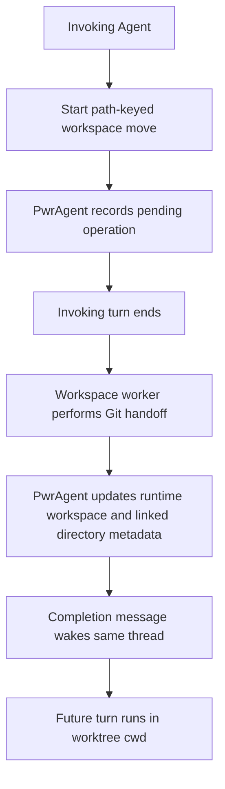

# Path-Keyed Thread Workspace Handoff - Plan

## Goal Capsule

- **Objective:** Let an Agent move its current PwrAgent thread runtime workspace from a local checkout to an isolated worktree through a first-class async tool, without falling back to raw `git worktree` commands that leave PwrAgent metadata behind.
- **Product authority:** The tool should preserve PwrAgent's thread-first navigation model and make workspace movement explicit, observable, and safe across active-turn boundaries.
- **Open blockers:** Planning must decide the exact operation naming, callback/wake mechanism, and whether the worker is modeled as a PwrAgent monitor, a sub-agent, or a backend-managed async job.

---

## Product Contract

### Summary

Add a path-keyed dynamic tool for moving the current thread's runtime workspace into a managed worktree.
The invoking turn starts the move and then stops; an async worker performs the filesystem and metadata transition, posts the result back into the same thread, and future turns continue from the new runtime cwd.

### Problem Frame

Agents can already create a child thread in a new worktree through task handoff, and desktop/messaging flows can perform workspace handoff for an existing thread.
An Agent cannot currently say "move this thread's current path to a worktree" through a dedicated dynamic tool.
When it uses shell commands instead, Git may be correct but PwrAgent still believes the thread is attached to the old project path, so navigation, branch chips, linked directories, and future turns can drift from the work the Agent is doing.

### Key Decisions

- **Dedicated workspace tool, not `mutate_thread`:** Workspace movement is long-running filesystem and runtime choreography, while `mutate_thread` remains guarded metadata mutation for title, model, fast mode, and execution mode.
- **Path-keyed operation:** The caller identifies the source path or linked directory being moved, because a thread can already carry multiple linked directories and future multi-project threads cannot rely on "the" thread workspace being obvious.
- **Runtime workspace vs associated directories:** The tool changes the runtime workspace for future turns, while linked directory associations remain a separate concept used for navigation and project membership.
- **Async handoff boundary:** The invoking turn should not continue as if its process cwd changed underneath it; a worker completes the move and wakes the thread with a result message.
- **Self-move first:** The first slice moves one runtime path to a worktree and records the resulting linked directory; broader agent-managed project association is deferred but must not require an incompatible contract later.

### Actors

- A1. **Invoking Agent:** The current Codex Agent turn that decides a task should continue in an isolated worktree.
- A2. **Workspace worker:** The asynchronous PwrAgent-controlled worker or sub-agent that performs the move after the invoking turn yields.
- A3. **PwrAgent backend:** The authority that validates eligibility, records operation state, updates overlays, and posts the continuation result.
- A4. **Operator:** The human who expects the thread to appear under the right project/worktree and to continue safely after the move.

### Requirements

**Agent Tool Surface**

- R1. The Agent can start a workspace move for an existing thread through a first-class dynamic tool without creating a child task thread.
- R2. The request identifies the path or linked directory being moved rather than relying only on the thread id.
- R3. The request supports local-to-worktree movement as the first required direction.
- R4. The tool returns an operation handle and clear "stop and wait for callback" guidance rather than implying that the current turn can keep working from the new path.
- R5. The tool rejects ambiguous multi-directory requests unless the caller names the source path or directory explicitly.

**Workspace Semantics**

- R6. A successful move updates the runtime workspace used by future turns of the same thread.
- R7. A successful move records the new worktree as a linked directory so thread navigation, project grouping, and status surfaces can show the new association.
- R8. The result distinguishes runtime workspace changes from additional associated directories so later multi-project support can add paths without changing the thread's runtime cwd.
- R9. The move preserves or reports branch strategy outcomes using the existing workspace handoff vocabulary where it applies.

**Async Completion**

- R10. The move runs outside the invoking turn and reports completion, failure, or cancellation back into the original thread.
- R11. The completion message includes the new cwd, source path, target worktree path, branch result, warnings, and any required next instruction for the Agent.
- R12. A failed move leaves the thread's runtime workspace and linked-directory metadata at the last known-good state.
- R13. PwrAgent surfaces pending workspace-move state in thread inspection so a user or Agent can tell that a move is still in progress.

**Safety and Compatibility**

- R14. The tool is unavailable or explicitly blocked when the backend cannot safely update future-turn runtime cwd for that thread.
- R15. The operation does not loosen dependency boundaries or bypass existing Git workspace handoff validation.
- R16. Existing `handoff_task` behavior remains for delegated child-thread work and is not repurposed as self-move.

### Key Flow

- F1. **Self-move to worktree**
  - **Trigger:** The invoking Agent is on a local checkout and determines that the task should continue in isolation.
  - **Actors:** A1, A2, A3
  - **Steps:** The Agent calls the path-keyed workspace tool with the local source path; PwrAgent validates the source and starts a pending operation; the Agent ends its turn; the worker creates or moves the worktree and updates PwrAgent metadata; PwrAgent posts a completion message into the same thread.
  - **Outcome:** The next Agent turn starts with the worktree as its runtime workspace, and the thread appears under the appropriate worktree/project context.
  - **Covered by:** R1, R2, R4, R6, R7, R10, R11

### Acceptance Examples

- AE1. **Covered by R1, R4, R10.** Given an Agent on a local checkout, when it starts a workspace move, then the tool returns a pending operation and tells the Agent not to continue working in the current turn.
- AE2. **Covered by R2, R5.** Given a thread associated with two repositories, when the Agent requests a move without identifying a source path, then PwrAgent rejects the request as ambiguous.
- AE3. **Covered by R6, R7, R11.** Given a successful move, when the same thread resumes, then the completion message names the new cwd and the thread metadata includes the new worktree association.
- AE4. **Covered by R12.** Given a move that fails during worktree creation, when PwrAgent reports failure, then future turns still use the original runtime workspace.
- AE5. **Covered by R16.** Given a request to delegate work to a child thread, when the Agent uses `handoff_task`, then existing child-thread behavior remains unchanged.

### Scope Boundaries

**Deferred for later**

- Agent-managed "associate this other project path with this thread" support that does not change runtime cwd.
- Multiple simultaneous runtime workspaces for one thread.
- Worktree-to-local self-move through the Agent tool, unless planning finds it is nearly free once local-to-worktree exists.
- UI polish for editing associated directories directly from the thread context panel.

**Outside this feature**

- Replacing desktop or messaging workspace handoff flows.
- Making raw shell `git worktree` commands update PwrAgent thread metadata automatically.
- Changing the semantics of `mutate_thread` from metadata mutation into filesystem operations.

### Dependencies / Assumptions

- PwrAgent already has linked-directory overlay storage that navigation can merge into thread summaries.
- PwrAgent already has backend workspace handoff behavior for existing threads; this feature should expose the right Agent-facing orchestration rather than reimplementing Git movement.
- Codex future-turn cwd rebinding is the critical capability gate: if a backend cannot guarantee future turns run in the moved workspace, the tool must fail clearly.
- The async worker can post back to the original thread in a way that wakes or resumes the conversation without requiring the user to manually copy the new path.

### Sources / Research

- `apps/desktop/src/main/agent-tools/pwragent-thread-agent-tools.ts` defines `mutate_thread` as guarded metadata mutation.
- `apps/desktop/src/main/agent-tools/pwragent-thread-orchestration-agent-tools.ts` defines `handoff_task` as child-thread creation, including `workspaceMode: "new_worktree"`.
- `apps/desktop/src/main/app-server/git-workspace-handoff-service.ts` contains the existing Git workspace handoff service.
- `packages/agent-core/src/persistence/overlay-store.ts` already stores `extraLinkedDirectories` and workspace replacement metadata.
- `packages/agent-core/src/domain/navigation-state.ts` merges overlay `extraLinkedDirectories` into navigation summaries.
- `docs/plans/2026-04-29-001-feat-thread-workspace-handoff-plan.md` and `docs/plans/2026-06-18-001-feat-agent-task-handoff-tool-plan.md` provide prior context for existing workspace handoff and task handoff behavior.
