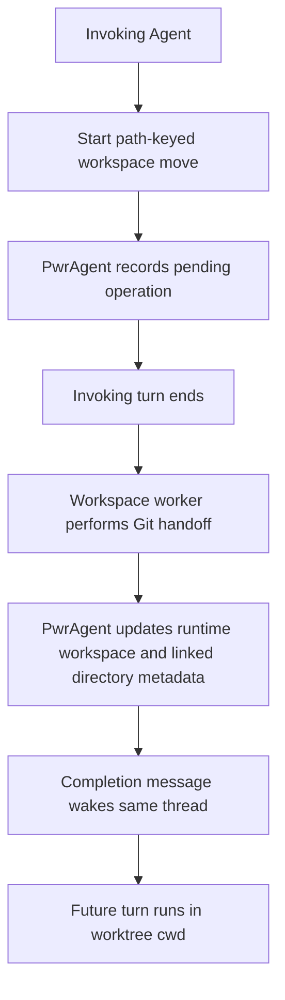
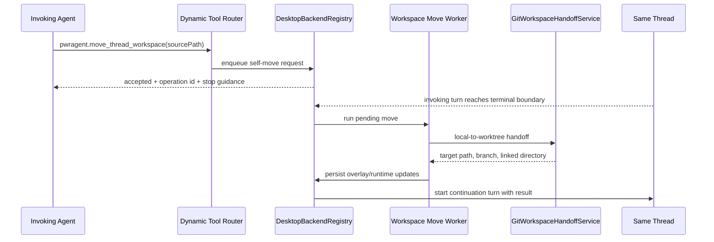

# Path-Keyed Thread Workspace Handoff - Plan

## Goal Capsule

- **Objective:** Let an Agent move its current PwrAgent thread runtime workspace from a local checkout to an isolated worktree through a first-class async tool, without falling back to raw `git worktree` commands that leave PwrAgent metadata behind.
- **Product authority:** The tool should preserve PwrAgent's thread-first navigation model and make workspace movement explicit, observable, and safe across active-turn boundaries.
- **Resolved planning decisions:** Use a dedicated `move_thread_workspace` dynamic tool, execute the move as a backend-managed async job after the invoking turn reaches a terminal boundary, and wake the same thread with a continuation turn that reports the result.

---

## Product Contract

### Summary

Add a path-keyed dynamic tool for moving the current thread's runtime workspace into a managed worktree.
The invoking turn starts the move and then stops; an async worker performs the filesystem and metadata transition, posts the result back into the same thread, and future turns continue from the new runtime cwd.

### Problem Frame

Agents can already create a child thread in a new worktree through task handoff, and desktop/messaging flows can perform workspace handoff for an existing thread.
An Agent cannot currently say "move this thread's current path to a worktree" through a dedicated dynamic tool.
When it uses shell commands instead, Git may be correct but PwrAgent still believes the thread is attached to the old project path, so navigation, branch chips, linked directories, and future turns can drift from the work the Agent is doing.

### Key Decisions

- **Dedicated workspace tool, not `mutate_thread`:** Workspace movement is long-running filesystem and runtime choreography, while `mutate_thread` remains guarded metadata mutation for title, model, fast mode, and execution mode.
- **Path-keyed operation:** The caller identifies the source path or linked directory being moved, because a thread can already carry multiple linked directories and future multi-project threads cannot rely on "the" thread workspace being obvious.
- **Runtime workspace vs associated directories:** The tool changes the runtime workspace for future turns, while linked directory associations remain a separate concept used for navigation and project membership.
- **Async handoff boundary:** The invoking turn should not continue as if its process cwd changed underneath it; a worker completes the move and wakes the thread with a result message.
- **Self-move first:** The first slice moves one runtime path to a worktree and records the resulting linked directory; broader agent-managed project association is deferred but must not require an incompatible contract later.

### Actors

- A1. **Invoking Agent:** The current Codex Agent turn that decides a task should continue in an isolated worktree.
- A2. **Workspace worker:** The asynchronous PwrAgent-controlled worker or sub-agent that performs the move after the invoking turn yields.
- A3. **PwrAgent backend:** The authority that validates eligibility, records operation state, updates overlays, and posts the continuation result.
- A4. **Operator:** The human who expects the thread to appear under the right project/worktree and to continue safely after the move.

### Requirements

**Agent Tool Surface**

- R1. The Agent can start a workspace move for an existing thread through a first-class dynamic tool without creating a child task thread.
- R2. The request identifies the path or linked directory being moved rather than relying only on the thread id.
- R3. The request supports local-to-worktree movement as the first required direction.
- R4. The tool returns an operation handle and clear "stop and wait for callback" guidance rather than implying that the current turn can keep working from the new path.
- R5. The tool rejects ambiguous multi-directory requests unless the caller names the source path or directory explicitly.

**Workspace Semantics**

- R6. A successful move updates the runtime workspace used by future turns of the same thread.
- R7. A successful move records the new worktree as a linked directory so thread navigation, project grouping, and status surfaces can show the new association.
- R8. The result distinguishes runtime workspace changes from additional associated directories so later multi-project support can add paths without changing the thread's runtime cwd.
- R9. The move preserves or reports branch strategy outcomes using the existing workspace handoff vocabulary where it applies.

**Async Completion**

- R10. The move runs outside the invoking turn and reports completion, failure, or cancellation back into the original thread.
- R11. The completion message includes the new cwd, source path, target worktree path, branch result, warnings, and any required next instruction for the Agent.
- R12. A failed move leaves the thread's runtime workspace and linked-directory metadata at the last known-good state.
- R13. PwrAgent surfaces pending workspace-move state in thread inspection so a user or Agent can tell that a move is still in progress.

**Safety and Compatibility**

- R14. The tool is unavailable or explicitly blocked when the backend cannot safely update future-turn runtime cwd for that thread.
- R15. The operation does not loosen dependency boundaries or bypass existing Git workspace handoff validation.
- R16. Existing `handoff_task` behavior remains for delegated child-thread work and is not repurposed as self-move.

### Key Flow

- F1. **Self-move to worktree**
  - **Trigger:** The invoking Agent is on a local checkout and determines that the task should continue in isolation.
  - **Actors:** A1, A2, A3
  - **Steps:** The Agent calls the path-keyed workspace tool with the local source path; PwrAgent validates the source and starts a pending operation; the Agent ends its turn; the worker creates or moves the worktree and updates PwrAgent metadata; PwrAgent posts a completion message into the same thread.
  - **Outcome:** The next Agent turn starts with the worktree as its runtime workspace, and the thread appears under the appropriate worktree/project context.
  - **Covered by:** R1, R2, R4, R6, R7, R10, R11

### Acceptance Examples

- AE1. **Covered by R1, R4, R10.** Given an Agent on a local checkout, when it starts a workspace move, then the tool returns a pending operation and tells the Agent not to continue working in the current turn.
- AE2. **Covered by R2, R5.** Given a thread associated with two repositories, when the Agent requests a move without identifying a source path, then PwrAgent rejects the request as ambiguous.
- AE3. **Covered by R6, R7, R11.** Given a successful move, when the same thread resumes, then the completion message names the new cwd and the thread metadata includes the new worktree association.
- AE4. **Covered by R12.** Given a move that fails during worktree creation, when PwrAgent reports failure, then future turns still use the original runtime workspace.
- AE5. **Covered by R16.** Given a request to delegate work to a child thread, when the Agent uses `handoff_task`, then existing child-thread behavior remains unchanged.

### Scope Boundaries

**Deferred for later**

- Agent-managed "associate this other project path with this thread" support that does not change runtime cwd.
- Multiple simultaneous runtime workspaces for one thread.
- Worktree-to-local self-move through the Agent tool, unless planning finds it is nearly free once local-to-worktree exists.
- UI polish for editing associated directories directly from the thread context panel.

**Outside this feature**

- Replacing desktop or messaging workspace handoff flows.
- Making raw shell `git worktree` commands update PwrAgent thread metadata automatically.
- Changing the semantics of `mutate_thread` from metadata mutation into filesystem operations.

### Dependencies / Assumptions

- PwrAgent already has linked-directory overlay storage that navigation can merge into thread summaries.
- PwrAgent already has backend workspace handoff behavior for existing threads; this feature should expose the right Agent-facing orchestration rather than reimplementing Git movement.
- Codex future-turn cwd rebinding is the critical capability gate: if a backend cannot guarantee future turns run in the moved workspace, the tool must fail clearly.
- The async worker can post back to the original thread in a way that wakes or resumes the conversation without requiring the user to manually copy the new path.

### Sources / Research

- `apps/desktop/src/main/agent-tools/pwragent-thread-agent-tools.ts` defines `mutate_thread` as guarded metadata mutation.
- `apps/desktop/src/main/agent-tools/pwragent-thread-orchestration-agent-tools.ts` defines `handoff_task` as child-thread creation, including `workspaceMode: "new_worktree"`.
- `apps/desktop/src/main/app-server/git-workspace-handoff-service.ts` contains the existing Git workspace handoff service.
- `packages/agent-core/src/persistence/overlay-store.ts` already stores `extraLinkedDirectories` and workspace replacement metadata.
- `packages/agent-core/src/domain/navigation-state.ts` merges overlay `extraLinkedDirectories` into navigation summaries.
- `docs/plans/2026-04-29-001-feat-thread-workspace-handoff-plan.md` and `docs/plans/2026-06-18-001-feat-agent-task-handoff-tool-plan.md` provide prior context for existing workspace handoff and task handoff behavior.

## Planning Contract

### Product Contract Preservation

Product Contract unchanged. This implementation plan preserves the brainstorm decisions above and resolves only the plan-time choices needed to execute them.

### Key Technical Decisions

- KTD1. Add a new dynamic operation named `move_thread_workspace` in the existing `pwragent` namespace. Do not extend `mutate_thread`, because runtime workspace moves are filesystem and turn-lifecycle orchestration, and do not repurpose `handoff_task`, because that contract creates a child thread.
- KTD2. Keep the public operation path-keyed. The tool accepts a source path, with optional repository/source branch fields that mirror existing workspace handoff vocabulary, and it must reject ambiguous multi-directory requests instead of guessing.
- KTD3. Reuse `GitWorkspaceHandoffService` and the existing thread workspace handoff update path for Git movement, overlay replacement, branch metadata, and Codex worktree ownership recording. The new work is orchestration and Agent-facing contract, not a second Git handoff implementation.
- KTD4. Treat the dynamic tool call as an enqueue operation. It may be invoked only from a live turn, returns an accepted/pending result immediately, and schedules the real move for the terminal turn boundary so the existing active-turn handoff guard remains meaningful.
- KTD5. Track self-move operations separately from child-thread pending handoffs at the type level, while exposing them through thread inspection alongside pending handoffs. This keeps current `pendingHandoffs` behavior compatible and gives Agents a way to poll progress.
- KTD6. Completion wakes the original thread by starting a same-thread continuation turn after the workspace move succeeds or fails. The continuation prompt must include the new runtime cwd on success and an explicit "original workspace preserved" statement on failure.
- KTD7. The runtime workspace remains a single handoff-linked directory per thread. Additional associated directories stay as separate linked-directory overlay entries so follow-up multi-project support can add associations without changing the self-move contract.
- KTD8. Codex is the first supported backend for Agent-initiated self-move. ACP backends keep their existing app-server handoff behavior, and the dynamic tool must return `unsupported_backend` until a backend can safely rebind future turns and be woken from the same async path.

### High-Level Design

The new operation extends the existing thread orchestration dynamic-tool family:

1. The router advertises `pwragent.move_thread_workspace` from the shared operation list.
2. The normalizer validates the path-keyed request and forwards it to `DesktopBackendRegistry`.
3. The registry verifies the call is from a live dynamic tool invocation, resolves the requested source workspace, records a pending self-move operation, and returns a pending result.
4. When the invoking turn reaches `turn/completed`, `turn/failed`, or `turn/cancelled`, the registry drains eligible pending self-move operations for that thread.
5. The worker calls the existing workspace handoff path with the resolved request, updates overlay/runtime metadata through the existing service flow, records success/failure state, and starts a same-thread continuation turn with the result.

The operation state machine is:

- `queued`: accepted during a live dynamic tool call and waiting for the invoking turn to end.
- `running`: the workspace handoff worker has started.
- `completed`: overlay/runtime metadata was updated and the continuation turn was requested.
- `failed`: the move failed and the original runtime workspace remains authoritative.

### Error Handling

- Invalid or blank source paths fail before queuing with `invalid_arguments`.
- Multiple eligible workspace candidates with no explicit source path fail with `ambiguous_workspace`.
- Unsupported backends fail with `unsupported_backend`.
- Non-Git or non-worktree-capable paths fail with `unsupported_workspace`.
- Duplicate requests with the same dynamic-tool call id return the existing pending operation instead of starting a second move.
- Worker failures update pending state to `failed`, preserve existing overlay/runtime cwd, and wake the thread with the failure summary when same-thread wake is available.

### Backward Compatibility

- Existing `handoff_task` schema, default workspace behavior, and pending child-thread result shape remain unchanged.
- Existing `send_message_to_thread` and `mutate_thread` behavior remains unchanged.
- Existing app-server `handoffThreadWorkspace` remains the synchronous UI/API path and keeps rejecting direct Codex handoff while a turn is active.
- The new shared types add a new operation and result union member; they do not remove or reinterpret existing fields.

## Implementation Units

### U1. Shared Operation Contract

**Goal:** Define the public self-move contract and result types.

**Files:**

- `packages/shared/src/contracts/thread-orchestration-tools.ts`
- `packages/shared/src/contracts/thread-tools.ts`

**Work:**

- Add `move_thread_workspace` to `PWRAGENT_THREAD_ORCHESTRATION_OPERATION_NAMES`.
- Add `MoveThreadWorkspaceToolArgs`, `MoveThreadWorkspaceResult`, pending self-move status/phase types, and result union wiring.
- Reuse existing `ThreadWorkspaceHandoffDirection` and `ThreadWorkspaceHandoffStrategy` names where they match the operation.
- Model operation state separately from `PendingThreadHandoffSummary` while allowing thread status inspection to expose both pending child handoffs and pending workspace moves.

**Requirements Covered:** R1, R2, R3, R4, R5, R8, R9, R13, R16

**Test Scenarios:**

- Type-level/tool-contract tests cover the new operation name and result union.
- Existing handoff task contract tests still pass unchanged.

### U2. Dynamic Tool Projection and Validation

**Goal:** Advertise and dispatch `pwragent.move_thread_workspace` through the existing dynamic-tool router.

**Files:**

- `apps/desktop/src/main/agent-tools/pwragent-thread-orchestration-agent-tools.ts`
- `apps/desktop/src/main/agent-tools/__tests__/pwragent-thread-orchestration-agent-tools.test.ts`

**Work:**

- Add the tool description, JSON schema, invalid-argument message, and argument normalizer.
- Include clear stop-and-wait language in the tool description and successful result shape.
- Validate that source path is a non-empty string when provided and that direction defaults to `local-to-worktree`.
- Keep `additionalProperties: false` so unsupported future fields do not silently pass through.

**Requirements Covered:** R1, R2, R3, R4, R5, R10, R16

**Test Scenarios:**

- Dynamic specs include `move_thread_workspace` under namespace `pwragent`.
- Invalid blank source paths and invalid enum values fail before handler dispatch.
- Valid args normalize whitespace and dispatch with caller backend/thread/turn/call context.
- Existing `handoff_task` and `send_message_to_thread` tests remain valid.

### U3. Backend Pending Self-Move Orchestration

**Goal:** Enqueue self-move requests during a live turn and execute them after the active turn boundary.

**Files:**

- `apps/desktop/src/main/app-server/backend-registry.ts`
- `apps/desktop/src/main/__tests__/backend-registry.test.ts`

**Work:**

- Route `move_thread_workspace` in `handleThreadOrchestrationRequest`.
- Require a live dynamic tool call, Codex backend, and source thread identity matching the invoking context.
- Resolve the source workspace from the explicit source path plus the thread's current linked directories and overlay.
- Record pending self-move state keyed by backend/thread/turn/call id.
- Add a terminal-turn drain hook next to existing active-turn cleanup so queued moves run only after the current turn is no longer active.
- Dedupe repeated tool calls by operation id.

**Requirements Covered:** R1, R2, R4, R5, R10, R12, R13, R14

**Test Scenarios:**

- Live Codex dynamic tool call returns a pending self-move result and does not call the Git handoff service immediately.
- Non-live calls fail with `forbidden`.
- Unsupported backends fail with `unsupported_backend`.
- Ambiguous source workspaces fail with `ambiguous_workspace`.
- Duplicate call id returns the existing operation instead of queuing twice.

### U4. Workspace Move Worker and Metadata Update

**Goal:** Run the real workspace handoff through existing services and preserve runtime metadata correctness.

**Files:**

- `apps/desktop/src/main/app-server/backend-registry.ts`
- `apps/desktop/src/main/app-server/git-workspace-handoff-service.ts`
- `apps/desktop/src/main/__tests__/backend-registry.test.ts`
- `apps/desktop/src/main/__tests__/git-workspace-handoff-service.test.ts`

**Work:**

- Invoke the existing `handoffThreadWorkspace` flow or a factored helper that performs the same validation, `GitWorkspaceHandoffService.handoff`, overlay replacement, branch metadata update, ACP session update hook, and Codex worktree owner recording.
- Preserve the direct `handoffThreadWorkspace` active-turn rejection for UI/API callers.
- On success, update pending self-move state with target path, branch, linked directory, warnings, and completion timestamp.
- On failure, leave overlay/runtime cwd unchanged and mark pending state failed.

**Requirements Covered:** R6, R7, R8, R9, R11, R12, R14, R15

**Test Scenarios:**

- Terminal-turn drain calls the Git handoff service with the resolved repository path/source path.
- Success updates `replaceWorkspaceLinkedDirectory`, Codex branch metadata, and worktree owner tracking.
- Failure does not call overlay replacement and reports preserved original workspace.
- Direct app-server handoff while a Codex turn is active still rejects.

### U5. Same-Thread Wake and Inspection

**Goal:** Make completion observable to both the Agent and the operator.

**Files:**

- `apps/desktop/src/main/app-server/backend-registry.ts`
- `packages/shared/src/contracts/thread-tools.ts`
- `apps/desktop/src/main/agent-tools/pwragent-thread-agent-tools.ts`
- `apps/desktop/src/main/__tests__/backend-registry.test.ts`
- `apps/desktop/src/main/agent-tools/__tests__/pwragent-thread-agent-tools.test.ts`

**Work:**

- Include pending self-move summaries in `get_thread_status`.
- Add a bounded `pendingWorkspaceMoves` field rather than changing the meaning of `pendingHandoffs`.
- Start a same-thread continuation turn after worker completion with a concise success/failure prompt.
- Ensure the continuation turn inherits the thread's current execution settings and starts after the workspace overlay has been updated.

**Requirements Covered:** R10, R11, R13, R14

**Test Scenarios:**

- `get_thread_status` shows queued/running/completed/failed self-move state.
- Successful completion starts a same-thread turn with the new cwd and branch result.
- Failed completion starts a same-thread turn with the failure and original-workspace-preserved statement.
- If same-thread turn start fails, pending state records the failure and the move result remains inspectable.

### U6. Navigation and Multi-Project Forward Compatibility

**Goal:** Preserve the split between runtime workspace replacement and associated directories.

**Files:**

- `packages/agent-core/src/persistence/overlay-store.ts`
- `apps/desktop/src/main/state/overlay-store-sqlite.ts`
- `packages/agent-core/src/domain/navigation-state.ts`
- `packages/agent-core/src/__tests__/overlay-store.test.ts`
- `packages/agent-core/src/__tests__/navigation-state.test.ts`

**Work:**

- Confirm existing `replaceWorkspaceLinkedDirectory` behavior remains one handoff workspace per thread.
- Add focused regression coverage only if the new pending state or result shape touches overlay/navigation materialization.
- Do not implement general "associate another project path" UI or API in this plan.

**Requirements Covered:** R6, R7, R8

**Test Scenarios:**

- Runtime handoff directory replaces a previous handoff directory for the same thread.
- Non-runtime extra linked directories remain present after workspace replacement.
- Navigation materialization shows the handoff worktree as the runtime workspace while preserving unrelated associated directories.

## Verification Contract

Run focused tests first:

- `pnpm test apps/desktop/src/main/agent-tools/__tests__/pwragent-thread-orchestration-agent-tools.test.ts`
- `pnpm test apps/desktop/src/main/agent-tools/__tests__/pwragent-thread-agent-tools.test.ts`
- `pnpm test apps/desktop/src/main/__tests__/backend-registry.test.ts`
- `pnpm test apps/desktop/src/main/__tests__/git-workspace-handoff-service.test.ts`
- `pnpm test packages/agent-core/src/__tests__/overlay-store.test.ts packages/agent-core/src/__tests__/navigation-state.test.ts`

Run guardrails before landing:

- `pnpm lint:boundaries`
- `pnpm lint:codex-storage`
- `pnpm test`

Manual verification, if the dynamic tool can be exercised locally:

- Start a Codex thread on a local Git checkout.
- Invoke `pwragent.move_thread_workspace` for that checkout path.
- Confirm the current turn receives the pending/stop result.
- Confirm the same thread wakes after terminal turn completion with the worktree cwd.
- Confirm a follow-up command runs from the worktree path and the thread appears under the worktree-linked project context.

## Definition of Done

- The Agent sees a dedicated `pwragent.move_thread_workspace` tool in dynamic tool specs.
- The tool accepts a local-to-worktree self-move from a live Codex turn and returns a pending operation handle with stop-and-wait guidance.
- The actual Git handoff runs only after the invoking turn reaches a terminal boundary.
- Successful moves update future-turn runtime cwd, linked-directory overlay metadata, branch metadata, and Codex worktree owner tracking.
- Failed moves leave the original runtime workspace authoritative and report the failure in the same thread.
- Thread inspection exposes pending/completed/failed self-move status without changing existing `pendingHandoffs` semantics.
- Existing `handoff_task`, `send_message_to_thread`, `mutate_thread`, and synchronous UI/API workspace handoff behavior remain backward-compatible.
- Verification Contract commands pass, including dependency-boundary and Codex-storage guardrails.

## Implementation Defaults

- Start a same-thread continuation turn for completion wake, because it wakes the Agent without requiring UI polling.
- Include `worktree-to-local` in the direction enum only if the normalizer returns a clear unsupported response until that direction is implemented; otherwise omit it from the public schema for this slice.
- Expire completed self-move records on the same bounded retention window used by pending child handoffs unless implementation introduces a durable activity entry.
