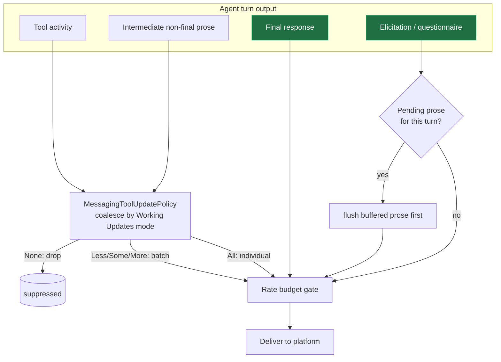

# feat: Messaging Working Updates dial + streaming gate

## Summary

Consolidate the messaging output-verbosity controls: rescope the existing
tool-update dial into a single **"Working Updates"** dial that governs both
tool activity and the agent's in-turn (non-final) prose, coalesced through one
policy; make it settable in the `/new` thread-creation wizard; demote messaging
"streaming" to a default-off advanced control gated by a new global setting
(with a one-time nudge when a provider enables streaming); and flush a
questionnaire's preceding setup message before the elicitation is delivered.

## Problem Frame

Today the messaging bridge exposes a 5-position tool-update dial that governs
*only* tool activity, while the agent's in-turn narration is governed by a
separate, cruder `streamingResponses` toggle that is unbatched, rate-limit
hostile, and mislabeled. To a reader on their phone, tool activity and
narration are the same "the agent is working" stream, and some threads
(agent-personality threads especially) want only final answers and questions.
The dial also can't be set when a thread is born from messaging — only after.
And a questionnaire often lands without the in-turn message that described its
options. See origin: `docs/brainstorms/2026-07-04-messaging-output-verbosity-and-streaming-requirements.md`.

The exponential-backoff coalescing of streaming/slow-mode edits (origin
decision D5) is **out of scope here** — it is already in flight on a separate
branch. This plan delivers origin decisions D1–D4.

---

## Requirements

### Working Updates dial

- R1. A single dial ("Working Updates") governs both tool activity and
  intermediate (non-final) assistant prose. `None` suppresses both;
  `Less` / `Some` / `More` coalesce both at increasing density; `All` sends the
  most, still subject to the rate budget. (origin D1)
- R2. Intermediate prose is coalesced through the same policy as tool activity
  (shared thresholds/windows) and is decoupled from the streaming setting.
  (origin D1)
- R3. Final responses and elicitations are never gated by the dial; `None`
  never stalls or starves a run. (origin D2)
- R4. The persisted preference key (`toolUpdateMode`) and its enum values
  (`show_none`…`show_all`) are unchanged. Changes are behavior + labels only —
  no config-file migration and no stored-data change. (KTD1)
- R5. The dial is settable in the `/new` wizard before the thread is created,
  defaulting to the global messaging default, persisted as a per-binding
  preference, and remembered (sticky) for the next `/new`. (origin "Concern A")
- R6. The dial editor shows explanatory copy describing what None / Some / More
  / All do, including that the budget may still hold some back. (origin D1 copy)

### Streaming control gating

- R7. A new global Messaging setting, "Show streaming option on thread cards,"
  defaults **Off** and gates visibility of the per-thread streaming control in
  both the status card and the `/new` wizard. (origin D3, Option 4)
- R8. As an anti-stranding safety, the streaming control is also shown when the
  current binding already has `streamingResponses` explicitly set to `enabled`,
  so a user who turned it on before this change can still turn it off.
- R9. When a user enables provider-level streaming in Settings, and the global
  show-option is Off **and** no other provider currently has streaming enabled,
  prompt once offering to turn the global show-option on. Suppress the prompt if
  the global option is already on or another provider already streams. (origin D6)
- R10. The streaming control carries advisory copy clarifying it does **not**
  control whether in-turn messages are sent, and warning that each edit is a
  rate-limited send. (origin D3 copy)

### Elicitation context

- R11. Delivering an elicitation/questionnaire first flushes any pending
  buffered in-turn prose for that turn, so the question carries the setup
  context the agent wrote just before it. (origin D4)

---

## Key Technical Decisions

- KTD1. **Keep `toolUpdateMode` key and enum stable; rescope + relabel only.**
  Binding preferences persist as JSON (`messaging-store.ts`), and the global
  default is a single TOML scalar (`[messaging] tool_update_mode`). Renaming the
  key would trigger the full `docs/config-file-evolution.md` legacy-shape dance
  for zero user benefit. Instead the enum and key stay; only behavior (now also
  governs prose) and user-facing labels ("Tool usage notifications" → "Working
  Updates") change. This removes migration risk entirely.
- KTD2. **Route non-final assistant prose through the existing
  `MessagingToolUpdatePolicy`.** Treat intermediate prose as a new activity kind
  fed to `processActivity()` so it shares the mode thresholds and batch windows
  already defined for tools (`show_more` 15s, `show_some` 30s, `show_less` 60s,
  `show_none` suppress). This gives one coalescing buffer and one budget lane for
  the blended stream, and decouples prose visibility from `streamingResponses`.
  The **final** assistant message keeps its existing terminal (`final_turn`,
  never-dropped) delivery path untouched — only non-terminal prose is diverted.
  Note the current `MessagingToolActivity` shape is tool-specific, so this adds a
  prose activity variant that threads through the delivery type and both
  renderers (see U2). It also re-opens the exact code path (the line-1146 drop
  guard) that was deliberately added to stop mid-turn flooding — the coalescing
  is what preserves that anti-flood intent at low dial settings, so it must not
  regress it.
- KTD3. **Streaming visibility = global `showStreamingOption` OR current binding
  `streamingResponses === "enabled"`.** A per-binding check (no cross-binding
  scan) satisfies the anti-stranding safety cheaply. Rejected: full removal
  (strands existing users), and the "hide unless a provider has streaming"
  heuristic (fires backwards — messaging streaming is unrelated to provider/
  desktop streaming). (origin D3)
- KTD4. **Nudge-to-enable, guarded** (origin D6). The prompt to flip the global option on
  fires from the renderer Settings screen when a provider-level streaming toggle
  is switched on, guarded by (global option currently Off) AND (no other provider
  currently has streaming enabled). This surfaces the advanced control to users
  who signal interest without nagging repeat-togglers.
- KTD5. **Elicitation prose-flush at the delivery seam.** Inject the flush in
  `handleBackendPendingRequest()` (`messaging-controller.ts:1291`) immediately
  before `this.deliver(intent, binding)` (~1334), correlating buffered prose to
  the elicitation by `binding.id` + turn id (`request.params.turnId`, ~1313).
  Because `None` drops prose without buffering it (see U7), the flush reads from
  an un-gated per-turn last-prose capture, not the policy's coalescing buffer.
- KTD6. **New global setting is an additive TOML key** (`[messaging]
  show_streaming_option`, default `false`) — no migration, no collision with
  existing keys.

---

## High-Level Technical Design

The core move is reclassifying the agent's output streams and routing the two
"progress" streams through one coalescing policy, while the two "always-on"
streams bypass it (and elicitation triggers a prose flush on the way out).

Final responses and elicitations are `final_turn` / `critical_interactive`
(deferrable, never dropped), so `None` only ever silences the two progress
streams — it can never stall a run.

---

## Implementation Units

### U1. Rescope and relabel the dial to "Working Updates"

- Goal: Rename all user-facing surfaces of the tool-update dial to "Working
  Updates" and refresh the picker copy, without touching the stored key or enum.
- Requirements: R4, R6.
- Dependencies: none.
- Files:
  - `apps/desktop/src/main/messaging/core/messaging-status-card.ts` — status
    action label (~line 495, `"Tools: …"` → `"Working Updates: …"`), picker
    `prompt` and `fallbackText` in `buildStatusToolUpdateModePickerIntent`
    (~lines 1299–1341), and any `formatMessagingToolUpdateModeLabel` helper.
  - `apps/desktop/src/renderer/src/**` — the Settings → Messaging "Tool usage
    notifications" row label + description (locate the renderer settings section
    that renders the `messaging.toolUpdateMode` control).
  - Test file: colocated with whichever helper formats the label (e.g.
    `apps/desktop/src/main/messaging/core/__tests__/messaging-status-card.test.ts`).
- Approach: Copy/label-only. Keep enum values and the `toolUpdateMode` key
  everywhere. Render the R6 explanatory copy (verbatim text in the
  [Copy strings](#copy-strings) section) for the dial editor. Note: the existing
  `MessagingSingleSelectIntent` exposes a short `prompt` + one-line `fallbackText`
  and no multi-paragraph description field — confirm at implementation whether the
  copy goes in `prompt`, as a message sent immediately before the picker, or
  requires a small intent-shape addition; do not silently truncate it away.
  Confirm the renderer reads the setting via the IPC bridge (renderer may only
  import `@pwragent/shared`).
- Patterns to follow: existing `buildStatusReasoningPickerIntent`
  (`messaging-status-card.ts` ~1159–1202) for prompt/description shape.
- Test scenarios:
  - Status-card action renders "Working Updates: <mode>" for each mode value.
  - Picker prompt includes the None/Some/More/All explanatory copy.
  - Persisted/read value still round-trips through the unchanged
    `toolUpdateMode` key (guard against accidental key rename).
- Verification: Settings screen, status card, and picker all read "Working
  Updates"; stored config still uses `tool_update_mode`.

### U2. Route intermediate prose through the coalescing policy

- Goal: Feed non-final assistant prose into `MessagingToolUpdatePolicy` so it is
  coalesced/suppressed by the Working Updates mode, independent of
  `streamingResponses`.
- Requirements: R1, R2, R3.
- Dependencies: none (core plumbing; U1 is cosmetic and can land in parallel).
- Files:
  - `apps/desktop/src/main/messaging/core/messaging-tool-update-policy.ts` —
    extend the activity type (or add a sibling kind) so prose items flow through
    the same threshold/window logic; ensure batch rendering can represent prose.
  - `apps/desktop/src/main/messaging/core/messaging-controller.ts` — the
    interception point is the non-final-prose **drop guard** at ~line 1136–1157
    (`if (!isNonFinalAssistantTextForBackendEvent(event)) { … }`, comment
    "intermediate commentary stays on the desktop transcript"). Today non-final
    `agentMessage` completions are discarded here even though `assistantText` is
    already in hand. Route that text into the policy at this guard. This is
    **not** the delta stream-buffer path (~3274–3404), which handles token
    deltas + the terminal accumulated message and never holds non-final prose —
    do not touch it; the terminal/final delivery path stays intact.
  - `apps/desktop/src/main/messaging/core/messaging-renderer.ts` — the batch
    renderer `buildToolUpdateBatchMessageIntent` (~112–136) hardcodes a
    "Tool updates: ran N tool(s)" header and formats each entry via
    `formatToolActivityLine`. It must **branch on activity kind** so a mixed
    prose+tool batch does not render prose under a "ran N tools" header, and so a
    prose-only batch gets prose-appropriate framing.
  - Test file:
    `apps/desktop/src/main/messaging/core/__tests__/messaging-tool-update-policy.test.ts`
    (extend) and controller-level messaging tests.
- Approach: Non-final vs final is **already classified by the code**, not a
  look-ahead problem: `isNonFinalAssistantTextForBackendEvent`
  (`messaging-controller.ts:13475`) keys off `item/completed` +
  `type === "agentMessage"` + a non-final `phase`, and that discrete event
  carries the full text. Feed that text to `processActivity()` as a prose
  activity so it shares the mode thresholds/windows. The prose variant must
  thread end-to-end through `MessagingToolActivity` (today tool-shaped:
  `kind`/`title`/`status`/`pathBasename`/`durationMs`),
  `MessagingToolUpdatePolicyDelivery`, and both the individual and batch
  renderers. Keep `None` = drop, matching `show_none` for tools. One extra
  responsibility for U2: when prose is intercepted at the line-1146 guard, record
  it in a small **un-gated per-turn last-prose capture** (keyed by `binding.id` +
  `turnId`) *before* the dial decides delivery, so U7 can flush the setup message
  ahead of an elicitation even when the dial is `None`.
- Execution note: Start with a failing policy test that asserts prose activities
  coalesce with tool activities under `show_some`, then wire the controller path.
- Patterns to follow: existing tool-activity flow through `processActivity()`
  and the batch-intent renderer.
- Test scenarios:
  - `show_none`: intermediate prose is suppressed; final response still sends.
  - `show_some`: 4 prose items within the window coalesce into one batched
    message; tool + prose activity in the same turn batch together.
  - `show_all`: prose delivered individually (subject to budget).
  - Streaming off (the default): a turn with narration + a final answer still
    delivers the final answer via the terminal path exactly once.
  - Covers AE: `None` on a personality thread yields only final answer +
    elicitation, no intermediate messages.
- Verification: With streaming off and dial at `Some`, a multi-step turn
  produces coalesced progress plus one final message; at `None`, only the final
  message and any elicitation.

### U3. Add the Working Updates picker to the `/new` wizard

- Goal: Expose the dial in the new-thread prompt gate so it is chosen before the
  thread is born.
- Requirements: R5.
- Dependencies: U1 (shared label/copy), reuses U2's semantics but not its code.
- Files:
  - `apps/desktop/src/main/messaging/core/messaging-controller.ts` — add a
    `browse:new:working-updates` button in `presentNewThreadPromptGate()`
    (~4950–5054, alongside the existing streaming/fast/model/reasoning buttons),
    a handler that presents the picker, a `browse:new:set-working-updates`
    handler that writes `session.preferences.toolUpdateMode` and calls
    `updateNewThreadStickySettings()`, then re-renders the gate. The collected
    value already flows to `updateBindingPreferences(binding, session.preferences)`
    at creation (~4467–4480).
  - Test file: controller new-thread wizard tests (colocated
    `__tests__`).
- Approach: Clone the streaming/reasoning wizard-button pattern
  (`browse:new:streaming` handler ~4304–4321; `browse:new:reasoning` ~4394–4423).
  Reuse `buildStatusToolUpdateModePickerIntent` (or a new-thread variant) for the
  picker surface. Default the displayed value to the resolved global default when
  the session has no override yet.
- Patterns to follow: `browse:new:reasoning` → `presentNewThreadReasoningPicker`
  → `browse:new:set-reasoning` chain.
- Test scenarios:
  - The prompt gate renders a "Working Updates: <mode>" row.
  - Selecting a value updates the session and persists to the binding at thread
    creation.
  - With no explicit choice, the created binding inherits the global default.
  - The chosen value is remembered (sticky) for the next `/new`.
- Verification: `/new` shows a Working Updates row; a thread created with a
  non-default choice starts with that per-binding preference.

### U4. Add the global "Show streaming option on thread cards" setting

- Goal: Introduce the additive global setting (default Off) and its Settings UI,
  with the streaming advisory copy.
- Requirements: R7, R10.
- Dependencies: none.
- Files:
  - `packages/shared/src/contracts/settings.ts` — add
    `messaging.showStreamingOption` to the settings snapshot (near the `messaging`
    block ~550–611) and to the config-patch type (~765–794).
  - `apps/desktop/src/main/settings/desktop-config.ts` — parse/serialize
    `[messaging] show_streaming_option` (mirror the `tool_update_mode`
    read/write at ~872–873); default `false`.
  - `apps/desktop/src/renderer/src/**` — a toggle in Settings → Messaging with
    the R10 advisory copy. The renderer already ships a
    `STREAMING_RESPONSES_WARNING` constant applied via `help={…}` on each
    provider's streaming `ToggleField` (`MessagingSettings.tsx`) — R10 should
    update that single source (or reference it) rather than introduce duplicate
    or conflicting help text. Reconcile its current wording against the
    [Copy strings](#copy-strings) streaming advisory.
  - Test file:
    `apps/desktop/src/main/settings/__tests__/desktop-config.test.ts` (extend).
- Approach: Additive scalar, default false. No migration. Advisory copy verbatim
  in the [Copy strings](#copy-strings) section.
- Test scenarios:
  - Missing key parses to `false`.
  - Round-trip: setting `true` serializes to `[messaging] show_streaming_option
    = true` and reads back.
  - Unrelated messaging keys/comments preserved on write.
- Verification: Toggle appears in Settings, defaults Off, persists across
  restart.

### U5. Gate the streaming control visibility

- Goal: Hide the per-thread streaming control unless the global setting is on or
  the binding already has streaming explicitly enabled.
- Requirements: R7, R8.
- Dependencies: U4.
- Files:
  - `apps/desktop/src/main/messaging/core/messaging-status-card.ts` — guard the
    `status:streaming` action (~502) behind `showStreamingOption ||
    binding.preferences?.streamingResponses === "enabled"`.
  - `apps/desktop/src/main/messaging/core/messaging-controller.ts` — apply the
    same guard to the `browse:new:streaming` wizard button (~5017–5021).
  - Test files: status-card and controller `__tests__`.
- Approach: Single shared predicate (e.g. `shouldShowStreamingControl(binding,
  settings)`) used by both surfaces to avoid drift.
- Test scenarios:
  - Global Off + binding streaming inherit/disabled → control hidden in both card
    and wizard.
  - Global On → control visible in both.
  - Global Off + binding streaming `enabled` → control visible (anti-stranding).
- Verification: Fresh install shows no streaming control; enabling the global
  setting reveals it; a pre-existing streaming-enabled binding still shows it.

### U6. Nudge to enable the global option when a provider enables streaming

- Goal: When provider-level streaming is switched on, offer (once, guarded) to
  turn the global show-option on.
- Requirements: R9.
- Dependencies: U4.
- Files:
  - `apps/desktop/src/renderer/src/**` — in the Settings → Messaging provider
    section, on toggling a provider `streamingResponses` to on, if
    `showStreamingOption` is Off and no other provider currently has streaming
    enabled, show a confirm prompt; on accept, set `showStreamingOption = true`
    via the settings IPC path.
  - Test file: renderer settings component test.
- Approach: Guard = `!showStreamingOption && countProvidersWithStreamingEnabled()
  === 0` (evaluated before applying the new toggle, or excluding the one being
  toggled). Reuse an existing Settings confirm-dialog primitive rather than
  inventing one. Decline is a **one-time dismissal with no re-nag** — the guard
  already ensures the prompt won't re-fire once any provider streams or the global
  option is on. Final offer/accept/decline wording is design-owned (tracked in
  Open Questions); the prompt frames streaming as advanced/optional.
- Test scenarios:
  - Enabling the first provider's streaming with global Off → prompt shown;
    accept sets global On.
  - Enabling a second provider's streaming → no prompt (another already on).
  - Enabling provider streaming when global already On → no prompt.
  - Declining the prompt leaves global Off.
- Verification: Turning on Telegram streaming from a clean state prompts;
  accepting flips the global setting and reveals the per-thread control.

### U7. Flush preceding in-turn prose before elicitation delivery

- Goal: Ensure a questionnaire/approval carries the in-turn message that
  described its options.
- Requirements: R11.
- Dependencies: U2 (defines the prose-capture introduced below).
- Files:
  - `apps/desktop/src/main/messaging/core/messaging-controller.ts` — in
    `handleBackendPendingRequest()` (`messaging-controller.ts:1291`), immediately
    before `await this.deliver(intent, binding)` (~1334), flush the pending
    in-turn prose for the correlated turn.
  - Test file: controller elicitation-delivery `__tests__`.
- Approach: The flush cannot read from the policy's coalescing buffer, because at
  `None` the policy returns `[]` immediately (`messaging-tool-update-policy.ts`
  ~89–91) and buffers nothing — yet R11 requires the setup prose to precede the
  question *even at* `None`. So U2 must retain a small **un-gated per-turn
  last-prose capture** keyed by `binding.id` + `turnId` (written when the
  non-final prose is intercepted at the line-1146 guard, before the dial decides
  delivery). U7 flushes from that capture. Correlate by `binding.id` + turn id
  (`request.params.turnId` ~1313). Flush is idempotent — do not re-send prose the
  dial already delivered this turn.
- Test scenarios:
  - Questionnaire preceded by un-sent buffered prose → prose delivered first,
    then the questionnaire.
  - Prose already delivered (dial `All`) → no duplicate; questionnaire delivered
    once.
  - Elicitation with no preceding prose → questionnaire delivered alone.
  - `None` dial: the setup prose that would otherwise be suppressed is still
    flushed before the elicitation (the question needs its context regardless of
    the dial).
- Verification: An agent turn that narrates options then asks a questionnaire
  delivers the narration immediately before the question on the platform.

---

## Scope Boundaries

### Deferred to Follow-Up Work

- Exponential-backoff coalescing of streaming and slow-mode edits (origin D5) —
  in flight on a separate branch/worktree (spawned task
  `Coalesce messaging streaming with exponential backoff`). This plan must not
  re-implement or conflict with it; U5 touches streaming *visibility* only, not
  the send/edit timing path.
- Retuning the `show_less`/`show_some`/`show_more` thresholds now that prose
  shares the buffer (more content per window) — revisit after U2 lands and real
  volume is observable.

### Out of Scope

- Renaming the persisted `toolUpdateMode` key or its enum values (KTD1).
- Splitting Working Updates into two independent knobs (tools vs prose) — origin
  explicitly chose one dial; a future "unlink" toggle stays a non-breaking
  superset if ever needed.
- Folding streaming into the Working Updates dial — origin D3 keeps it separate.

---

## Risks & Dependencies

- Coordination with the streaming-coalescing branch: both touch streaming-
  adjacent code, but in different seams (this plan: visibility gating in
  status-card/wizard/settings; the other: send/edit timing in the buffer/budget
  path). Land order is independent; watch for merge overlap in
  `messaging-controller.ts` around the stream-buffer region.
- U2 reintroduces delivery of prose at the exact line-1146 drop guard that was
  deliberately added to stop mid-turn flooding ("pinged a dozen times"). The
  coalescing is what preserves that anti-flood intent at low dial settings —
  regression risk lives precisely in the code the flood fix protects, so the
  low-dial suppression paths need explicit test coverage.
- Rate budget still caps everything: even `All` is not literally all. Copy (R6)
  must set that expectation; tests should not assert unconditional delivery of
  progress items.

---

## Open Questions

- Does routing prose through the tool-update policy's single budget lane risk
  one stream starving the other within a turn (prose crowding out tool activity
  or vice versa) now that they share one coalescing buffer? Threshold retuning is
  already deferred; this intra-turn contention question is the sharper edge of it
  and should be watched once U2 lands.
- Should the U6 "other provider has streaming enabled" guard count provider-
  global streaming settings only, or also per-binding `enabled` overrides? Lean
  provider-global for the nudge signal; confirm during U6.
- Exact copy for the U6 confirm prompt (offer text, accept/decline button
  labels) — design-owned; U6 pins the behavior (one-time, no re-nag) but not the
  final wording.

Resolved during review: intermediate prose **is** observable as a discrete
`item/completed` `agentMessage` event with a non-final `phase`
(`isNonFinalAssistantTextForBackendEvent`, `messaging-controller.ts:13475`),
carrying full text — not only as streaming deltas. U2 intercepts at the
line-1146 drop guard accordingly.

---

## Copy strings

Final label: **Working Updates** — this resolves the origin's open label question
("Activity updates" vs "Working updates" vs "Progress"). The origin doc uses
"Activity updates" in its draft prose; wherever implementation copy is written,
"Working Updates" is authoritative.

Working Updates dial editor (R6):

> Controls how much of the agent's in-progress work is bridged here.
> **None** — only final answers and questions. Intermediate "thinking out loud"
> messages and tool activity are suppressed.
> **Some / More** — those get coalesced into occasional batched updates to stay
> under platform rate limits.
> **All** — sends the most, though the rate budget may still hold some back.

Streaming control advisory (R10):

> **Advanced.** This does **not** control whether the bot sends in-turn
> messages — it controls whether a single message is repeatedly edited/replaced
> as tokens come in. Each edit counts as a message send, so it burns through
> platform rate limits fast (≈20/min in groups, ≈60/min in DMs) and usually ends
> up throttled — which then slows or drops your tool and status updates too. You
> may see slightly earlier tokens, but most people should leave this **off**.

---

## Sources / Research

- Origin requirements: `docs/brainstorms/2026-07-04-messaging-output-verbosity-and-streaming-requirements.md`.
- Config-shape rules (why KTD1 avoids a rename): `docs/config-file-evolution.md`.
- Messaging boundaries / where settings vs picker vs wizard logic lives:
  `packages/messaging/AGENTS.md`, `apps/desktop/AGENTS.md`,
  `docs/messaging-architecture.md`, `docs/messaging-adapter-contract.md`.
- Prior tool-update coalescing pattern being extended:
  `apps/desktop/src/main/messaging/core/messaging-tool-update-policy.ts`
  (`MODE_POLICIES` ~30–54, `processActivity` ~83–136).
- Binding preferences shape + JSON persistence:
  `packages/messaging/interface/src/index.ts` (~1225–1245),
  `apps/desktop/src/main/messaging/core/messaging-store.ts` (`upsertBinding`
  ~32–51).
- Elicitation delivery seam: `messaging-controller.ts`
  `handleBackendPendingRequest` (`:1291`, deliver at ~1334).
- Non-final prose drop guard (U2 interception point): `messaging-controller.ts`
  `isNonFinalAssistantTextForBackendEvent` (`:13475`) and the drop guard ~1136–1157.
