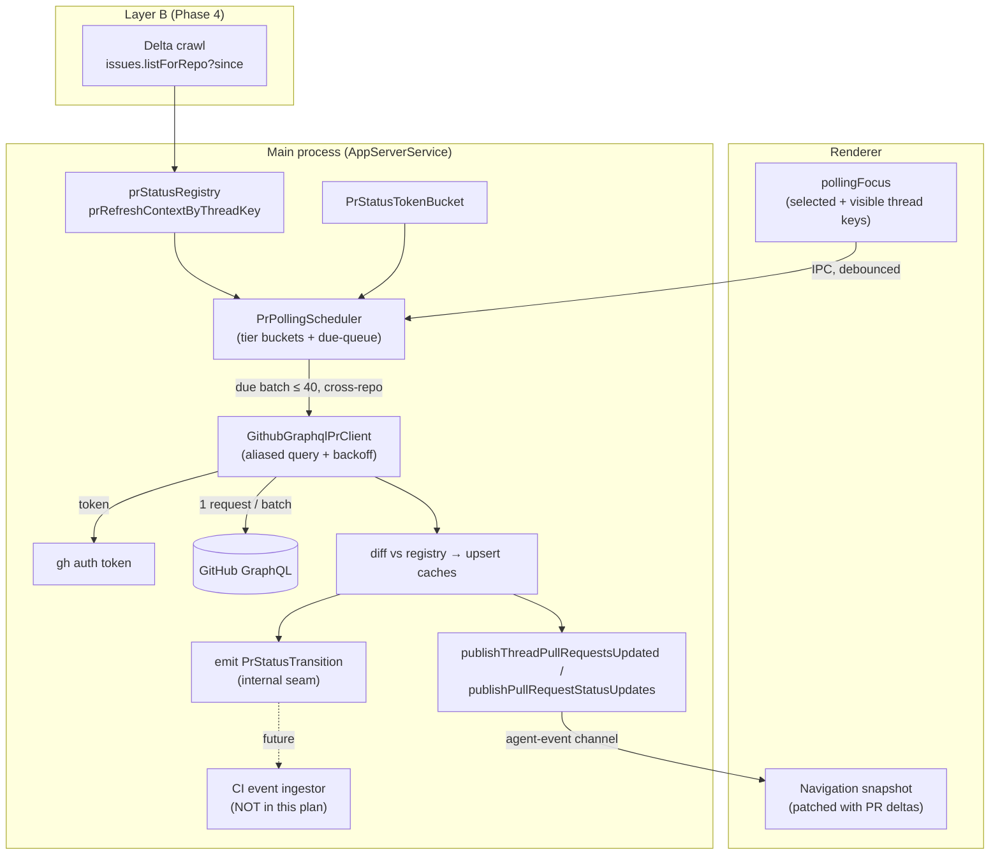

# feat: Background PR status polling with priority tiers

## Summary

Add a main-process background poller that keeps every open project's pull-request
status reasonably fresh, instead of refreshing only the selected/hovered thread.
The poller fetches **many PRs across disparate repos in one aliased GraphQL
request** (in-process `@octokit/graphql`, token minted via `gh auth token`), on a
**priority-tiered, round-robin, budget-bounded** cadence — focused project fast,
the rest slower. It reuses PwrAgent's existing `PrSummary` model, sqlite caches,
`prStatusRegistry`, `PrStatusTokenBucket`, terminal short-circuit, and
push-to-renderer bus rather than forking any of them. It emits a typed
`PrStatusTransition` on meaningful field flips as a seam for a future CI-event
feature (designed in the brainstorm, not built here).

The plan is phased so the high-value piece — Layer A, batched known-PR polling —
ships first and independently. Discovery (Layer B) and the transition seam follow.

---

## Problem Frame

The only recurring PR refresh today is a renderer `setInterval` scoped to the
**currently selected thread** (`usePullRequestRefresh.ts`, 60 s), plus hover
prefetch and a post-turn refresh. The other 20–30 open projects never poll, so
their chips are stale snapshots from the last mouse-over. CI pass/fail, merges,
and new merge conflicts on unfocused projects are invisible until the operator
interacts.

The data model is **not** the gap: `PrSummary` already carries `checkState`,
`mergeState`, `lifecycleState`, `reviewState`, `commitShas`, `title`, `url`, all
derived from GitHub's `statusCheckRollup`/mergeable state. The gaps are
**coverage** (only one thread polls), **cadence** (no attention-weighted
scheduling), and **transport** (per-thread `gh pr list` subprocess can't batch
cross-repo, so background-polling 30 projects that way is too expensive).

The `gh` CLI has no batched cross-repo call. GitHub GraphQL does: aliased
`repository(...) { pullRequest(number:) { … } }` selections put ~40 PRs from
arbitrary repos into one request that costs ~1 rate-limit point. That is the core
transport decision below.

---

## Requirements

Traces the brainstorm's R1–R15; the buildable subset for this plan:

**Coverage & freshness**
- R1. Tracked, non-terminal PRs across all open projects refresh on a recurring
  cadence, not only when their thread is selected/hovered.
- R2. The selected thread's project (Phase 2: + on-screen rows) refreshes on the
  fastest tier (~60 s target).
- R3. Other open/recently-active projects refresh slower (~2–3 min); the long tail
  slowest (~5 min), round-robined so none starves.
- R4. Merged/closed PRs leave active polling after a confirming fetch.

**Efficiency & budget**
- R6. A full sweep batches across disparate repos: request count scales with
  `ceil(trackedPRs / BATCH)`, not with `trackedPRs`.
- R7. Scheduled fetching is bounded by the existing token bucket and bounded
  concurrency; a burst of due PRs cannot exceed budget in one tick.
- R8. When the window is unfocused/hidden, background tiers slow or pause.
- R9. On rate-limit/auth failure the poller backs off (honoring
  `retry-after`/`x-ratelimit-reset`) without hot-looping, and resumes cleanly.
- R10. Polling publishes **deltas only** — unchanged PRs cause no renderer churn.

**Correctness, reuse, layering**
- R11. Reuse existing `PrSummary`, caches, registries, token bucket, push bus; no
  parallel data model or IPC channel.
- R12. Known PRs poll by `(org, repo, number)`; branch/discovery paths only find
  *new* PRs.
- R13. Meaningful field flips emit a typed `PrStatusTransition`; near-term the
  only consumer is the UI publisher.
- R14. Token via `gh auth token`; no raw PAT storage introduced.
- R15. All GitHub I/O + scheduling in the **main process**; renderer contributes
  only the `pollingFocus` signal and renders deltas. `packages/shared` stays
  types-only; no octokit import crosses the renderer/leaf boundary.

---

## Key Technical Decisions

These resolve the brainstorm's five open decisions.

- **Transport = in-process `@octokit/graphql` for Layer A; keep `gh` for token +
  the existing on-selection detail fetch.** (Open Decision 1.) Batched cross-repo
  GraphQL is the whole efficiency argument and `gh` can't do it. Add
  `@octokit/graphql` to `apps/desktop` (main-process only). The current
  `GithubPrFetcher` (`gh pr list`) stays as-is for the selected-thread detail path
  until the GraphQL path proves parity; the poller does not remove it.

- **Backoff = hand-rolled wrapper (PwrGit style), not the octokit
  retry/throttling plugins.** (Open Decision 2.) The plugins pull a `bottleneck`
  transitive dep PwrGit found painful; a ~40-line wrapper honoring `retry-after`,
  `x-ratelimit-remaining`/`-reset`, and exponential backoff with a retry cap is
  sufficient and dependency-free. Verify `bottleneck` install pain still applies
  during Phase 0; if it installs cleanly the plugin route is an acceptable
  substitute, but hand-rolled is the default.

- **Discovery (Layer B) is bounded to repos with ≥1 open thread / linked
  directory.** (Open Decision 3.) Don't crawl repos the operator has no thread in.
  Keeps the per-repo REST crawl cheap and staggered.

- **`pollingFocus` starts as selected-thread + its project; on-screen visible rows
  added within Phase 2.** (Open Decision 4.) Ship the selected-project fast tier
  first (already the operator's main attention), then widen to visible rows if the
  virtualized list can report visibility cheaply.

- **GraphQL fragment is `statusCheckRollup { state }` only (rollup, no per-check
  detail) for now.** (Open Decision 5.) Per-check names/conclusions are only
  needed by the future CI-event ingestor; widen the fragment when that lands.

- **Scheduler is a refresh-tick service, not a `setInterval`-per-PR.** Model it on
  the existing `startWorktreeWorkingStateRefresh` (`app-server.ts:1710`): a single
  driving tick that computes the due set each pass. This matches the codebase's
  established shape for periodic main-process work and plugs into the same
  lifecycle.

- **Enumerate pollable targets from existing main-process state.**
  `prStatusRegistry` (per-PR, keyed `provider/org/repo#number`) is the source of
  tracked PRs; `prRefreshContextByThreadKey` (`app-server.ts:804`) already
  remembers every thread's refresh context and maps PRs↔threads for tiering and
  delta publishing. No new persistence needed for Layer A.

- **Reuse the delta bus untouched.** New PR data publishes via
  `publishThreadPullRequestsUpdated` / `publishPullRequestStatusUpdates`
  (`app-server.ts:2806`/`2838`) → agent-event channel → renderer snapshot patch.

---

## High-Level Technical Design



---

## Phase 0 — In-process GraphQL client, token, backoff, mapping — ✅ DONE

Foundational; no behavior change until Phase 1 wires it in.

- [x] Add `@octokit/graphql` to `apps/desktop/package.json` (main-process dep).
  **Confirmed `bottleneck`-free** — it is the retry/throttling *plugins* that drag
  it in, and we use neither.
- [x] New `apps/desktop/src/main/pr-status/github-graphql-client.ts`:
  - [x] Token via `gh auth token` (gh-discovery command resolution, **lazily
    imported** — see notes), fallback `GITHUB_TOKEN`, in-memory cache 5 min,
    `null` on not-logged-in (poller then idles).
  - [x] Aliased batched query builder, owner/name/number passed as **GraphQL
    variables** (injection-safe; covered by a test using a repo name that would
    rewrite the document if interpolated), `BATCH` default 40.
  - [x] Hand-rolled retry (cap 4) honoring `retry-after` / `x-ratelimit-reset` /
    `>=500` / no-status → exponential backoff, clamped to 60 s.
  - [x] Partial-data salvage: one bad alias (repo renamed, PR deleted, no access)
    must not blank the other 39 — map present aliases, log dropped ones.
- [x] Map GraphQL payload → existing `PrSummary`. Derivations extracted to a new
  shared `pr-status/pr-derivations.ts` so the `gh` and GraphQL transports cannot
  drift; `github-pr-fetcher.ts` re-exports them so existing imports still work.
- [x] Unit tests (`github-graphql-client.test.ts`).

## Phase 1 — Layer A: batched known-PR poll + priority scheduler — ✅ DONE

- [x] New `PrPollingScheduler` (`pr-status/pr-polling-scheduler.ts`), fully
  dependency-injected — it holds **no** reference to `AppServerService`, which
  keeps the module graph acyclic and the scheduler unit-testable without booting
  the app.
- [x] Tier model: `Focused 60 s`, `Warm 150 s`, `Cold 300 s`, `Terminal = drop`.
- [x] Refresh-tick loop; due-set sorted by tier then **oldest-polled** (that
  second key is what makes the sweep round-robin instead of starving the tail).
  Non-overlapping ticks.
- [x] `PrStatusTokenBucket` reused as the ceiling — **one token per GraphQL
  REQUEST, not per PR**. Over-budget batches defer to the next tick.
- [x] Diff → upsert `pr_status_cache`, publish **deltas only** on the existing
  `pullRequest/status/updated` bus.
- [x] Terminal drop + hidden-window cadence stretch (×4).
- [x] Wired into `AppServerService`: `collectPrPollTargets()` walks
  `prRefreshContextByThreadKey` → `prLookupRegistry` (this is what gives coverage
  of EVERY open project, not just the selected thread), `applyPolledPrStatuses()`
  persists + publishes, scheduler boots on the first navigation snapshot.
- [x] Tests (`pr-polling-scheduler.test.ts`).

## Phase 2 — `pollingFocus` signal (renderer → main) — 🟡 PARTIAL

- [x] New IPC `navigation:set-pr-polling-focus` +
  `SetPullRequestPollingFocusRequest { threadKeys }`; renderer sends the selected
  thread key, debounced 400 ms, from `usePullRequestRefresh`.
- [x] Scheduler maps focus → tier (focus wins outright over quiet-demotion).
- [ ] Add on-screen/visible thread rows from the virtualized list (today: selected
  thread only).
- [ ] ~~Fold the existing renderer 60 s selected-thread `setInterval` into the
  scheduler~~ — **deliberately deferred, see notes.**

---

## Implementation Notes (deviations from the plan as written)

Recorded because each one is a decision a reviewer would otherwise have to
reverse-engineer:

1. **The renderer's 60 s selected-thread interval was KEPT, not folded in.**
   The plan assumed it was redundant once the poller existed. It is not: that
   interval re-runs a **branch** lookup via `gh`, which is the only thing that
   *discovers* a PR newly opened on the selected branch. The poller only refreshes
   PRs it already knows **by number**. Removing it before Layer B (discovery)
   exists would regress "I just opened a PR, show me the chip." Fold it in when
   Phase 4 lands.

2. **Query by base repo, identify by head repo.** A PR number belongs to the repo
   it was opened *against* (the base), but `PrSummary.org`/`repo` — and therefore
   `buildPullRequestStatusKey` — track the **head** repo, matching what `gh`
   writes. For a fork PR these differ. The client therefore parses the base ref
   from `pr.url` to query, and reads `headRepositoryOwner`/`headRepository` from
   the response to build identity. Confirmed live: querying
   `sindresorhus/p-map#88` correctly yields identity `hong4rc/p-map#88`. Getting
   this wrong would have silently duplicated every fork PR in the registry.

3. **`commits(last: 1)` + union commit SHAs forward.** The rollup only needs the
   head commit, and widening to the full commit list would multiply the GraphQL
   node cost of every batch. But `commitShas` is load-bearing for merged-PR
   "pushed" detection and the `gh` path fills in the whole list — so
   `applyPolledPrStatuses` **unions** rather than replaces, and can never shrink a
   richer set into a poorer one.

4. **No `@shutterstock/p-map-iterable`.** Concurrency is bounded by construction:
   at most `MAX_BATCHES_PER_TICK` (3) requests per tick, run together. Reaching
   for a mapper to bound a 3-element array would be ceremony, not safety.

5. **`reviewDecision` dropped from the fragment.** `PrSummary` has no field for it
   (`reviewState` is only draft/ready_for_review, derived from `isDraft`), so
   fetching it would be pure waste.

6. **`gh-discovery` / settings-singleton imports made lazy** inside the client's
   token path. They reach Electron-only packages; keeping them out of the
   top-level module graph means the client is importable and exercisable as a
   plain Node module.

### Live verification

Ran the real client against the real GitHub API with the operator's `gh` token,
over 4 PRs spanning **3 unrelated orgs** (`pwrdrvr`, `cli`, `sindresorhus`):

```
HTTP requests to GitHub: 1
PRs returned: 4 (in 1039ms)

pwrdrvr/PwrAgent#994   check=unknown  life=open    merge=conflicting
pwrdrvr/PwrAgent#993   check=passing  life=merged  merge=unknown
cli/cli#13878          check=passing  life=open    merge=mergeable
hong4rc/p-map#88       check=passing  life=merged  merge=unknown
```

One request, four PRs, three orgs — the central premise of the design, confirmed
against the live schema rather than a mock.

## Phase 3 — `PrStatusTransition` internal seam — ✅ DONE

- [x] `PrStatusTransition` defined in `pr-status/pr-transitions.ts` (main-only —
  the renderer does not need it yet; move to `packages/shared` only if a UI
  consumer appears). Shape: `prKey`, `url`, `title`, `commitShas`, `changed`
  field-flip map, `threadKeys`.
- [x] Emitted from the single diff chokepoint `rememberPrStatuses` (covers BOTH
  the background poller and on-demand refreshes) whenever `checkState`,
  `lifecycleState`, `mergeState`, `reviewState`, or `title` flips. A missing
  `previous` (first sight / cache load) yields no transition, so boot is silent.
- [x] Near-term consumers: structured debug log + an `onPrStatusTransition()`
  subscriber seam (the future CI ingestor's hook). No turn-starting, no thread
  events. `findThreadKeysForPrKey` resolves `threadKeys` best-effort, only when a
  transition actually fires.
- [x] Tests (`pr-transitions.test.ts`): each field flip fires once, multi-field
  flips coalesce, sha-only change is a no-op, legacy-`state` alias ignored.

## Phase 4 — Layer B: discovery — ✅ DONE (approach changed — see notes)

- [x] Slow branch-lookup rotation across ALL open threads
  (`pr-status/pr-discovery.ts` + `startPrDiscoveryRefresh` in `AppServerService`),
  reusing `refreshThreadPullRequests({ trigger: "scheduled" })`.
- [x] Least-recently-swept-first rotation, capped at 3 threads / 60 s tick,
  skips focused threads (already fast-refreshed by the renderer), skips while the
  window is hidden.
- [x] Discovered PRs fold in through the existing attachment + cache + publish
  path automatically (that is the whole reason for reusing the branch lookup).
- [x] Self-limits against the fast poller via the shared token bucket + the
  existing per-lookup cooldown + terminal short-circuit.
- [x] Tests (`pr-discovery.test.ts`): cadence gate, least-recently-first ordering,
  per-tick cap, focus skip, rotation across ticks.

### Phase 4 approach change: branch-lookup rotation, NOT a REST/`since` crawl

The plan called for ghcrawl's `issues.listForRepo?since` + `deriveIncrementalSince`
watermark. Implementation surfaced why that is the wrong fit here:

- **PwrAgent attaches PRs to a thread by branch.** A "list PRs updated since T"
  crawl finds PRs but has **nowhere to attach them** — a discovered PR on a branch
  no thread is on would not surface on any thread. The branch lookup, by contrast,
  asks exactly the question that maps to the UI: "does this thread's branch have a
  PR (now)?" — and reuses the entire existing attach/cache/coalesce path.
- **It needs no new dependency, no schema migration, no remote parsing.** The REST
  crawl would have added `@octokit/rest`, a `pr_discovery_watermark` table, and a
  git-remote→owner/repo mapping the codebase deliberately avoids (owner/repo come
  from `gh`'s payload today, not from parsing remotes).
- **It directly restores "the periodic refresh across open repos we lost"** — which
  is what the brainstorm actually asked Layer B for. Title/state freshness on
  tracked PRs is already delivered by Layer A; the only residual gap was *new* PRs
  on unfocused threads, which the rotation covers.

A `since`-based crawl remains the right tool if we later want to discover PRs
*independent of any thread's branch* (e.g. a dashboard of all org PR activity).
That is a different feature; `deriveIncrementalSince` from ghcrawl is noted for it.

## Future (explicitly not in this plan)

CI/merge transitions starting turns in threads (the webhook-mimic ingestor) —
designed in the brainstorm. This plan only guarantees the `PrStatusTransition`
seam is shaped webhook-ready. Real GitHub App webhooks and per-check-run payloads
are separate future work.

---

## Testing Strategy

- **Unit (vitest, root `pnpm test <path>`):** query builder, payload mapping,
  backoff math, scheduler tiering/round-robin/budget, transition matrix,
  since-window derivation. These carry the correctness weight.
- **Fake GraphQL transport:** inject a stub client returning canned aliased
  payloads (including partial-data / missing-repo aliases and rate-limit errors) so
  scheduler + client are tested without network.
- **Desktop E2E (`pnpm test:desktop-e2e`):** a replay-backed check that a
  background poll publishes a chip delta to an unfocused thread row. Reuse the
  existing PR-status fixtures where possible.
- **Boundary/lint gates:** `pnpm lint:boundaries` (octokit must not leak into
  renderer/leaf), `pnpm lint:eslint`, `pnpm typecheck` before push.

## Rollout & Safety — ✅ DONE (shipped opt-in, not default-on)

- [x] Gated behind **Settings → Experimental → "Background Pull Request Status"**
  (`[experimental] background_pr_polling` in `config.toml`), following the
  `lightweightNavigationRefresh` pattern end to end: shared contract + patch
  type, `desktop-config.ts` (stored type, patch→TOML edit, TOML reader),
  `desktop-settings-service.ts` resolver, and the Experimental settings panel.
- [x] **Default OFF**, not on. The plan said "default on, killable"; shipping it
  as a true experiment is the safer posture and matches the repo's convention —
  with the flag off, PR chips behave *exactly* as they did before this work, so
  the flag is a real kill switch rather than a tuning knob. Shared constant
  `DEFAULT_BACKGROUND_PR_POLLING` keeps main and renderer in lockstep.
- [x] **Live toggling, no restart**: `syncPrPollingSchedulerState()` runs on every
  navigation snapshot and starts/stops both the poller and the discovery
  rotation to match the setting.

## Icebox tier — ✅ DONE (added after review)

Beyond the planned three tiers, a PR whose status has not changed **and** whose
threads have not been touched for `ICEBOX_AFTER_MS` (24 h) falls **off the
monitor list entirely** — no cadence, no budget, no request.

- Deliberately **self-latching**: an iceboxed PR is never polled, so its
  `lastChangedAt` can never advance on its own. It stays frozen until the
  operator interacts with one of its threads. A branch abandoned two weeks ago
  costs nothing, forever, until you look at it again.
- **Two independent thaw signals**, so neither alone can freeze out an active PR:
  `lastChangedAt` (the PR itself moved) and `lastInteractionAt` (a thread was
  touched). Interaction comes from focus — sampled *every tick*, not just on
  change, so sitting on a thread for days cannot let it age into the icebox
  underneath you — plus an explicit `noteThreadInteraction()` called from the
  `turn/completed` path so a turn finishing in an **off-screen** thread thaws it.
- Focus always wins outright over the icebox, which is what makes a 24 h
  threshold safe to be aggressive about.
- Discovery (Layer B) is **not** icebox-aware yet — it keeps its own slow
  rotation (3 threads/tick, ≥5 min apart, focused threads skipped). Extending
  the icebox to skip long-quiet threads there is a reasonable follow-up.

## Risks & Mitigations

- **Rate-limit exhaustion** → token bucket ceiling + hidden-window backoff + honor
  reset headers; batching keeps points/hr low by design.
- **GraphQL/`gh pr list` drift** (two code paths deriving `PrSummary`) → share the
  derivation helpers; parity test comparing both mappings on the same PR fixture.
- **`bottleneck` install pain returns** → hand-rolled backoff is the default, so the
  plugin dep is avoided entirely.
- **Focus signal chattiness** → debounce; cap `visibleThreadKeys` length.
- **Partial-data batches masking failures** → salvage present aliases but log
  dropped ones (no silent truncation).

## Out of Scope

- CI events starting turns; GitHub App webhooks; per-check-run payloads.
- New `PrSummary` fields (model already sufficient).
- Non-`gh` PAT storage.
- Removing the existing `gh pr list` on-selection detail fetch (kept until parity).
