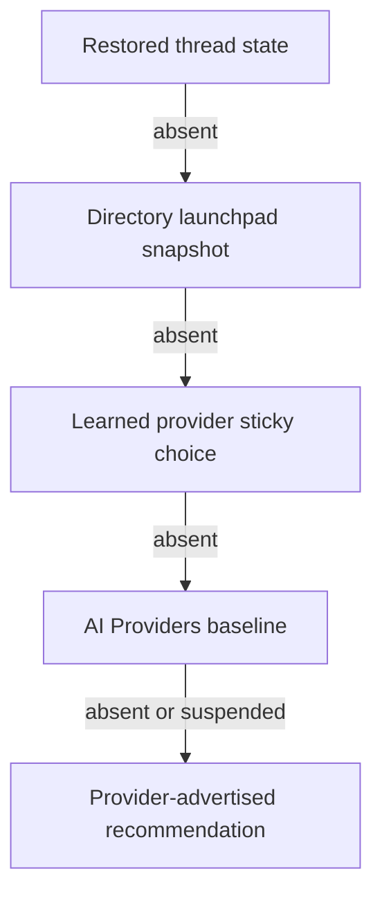

# AI Provider Model Catalog And Defaults - Plan

## Goal Capsule

- **Objective:** Give each PwrAgent profile a trustworthy provider model catalog and explicit model/reasoning baselines without erasing thread, launchpad, or learned provider choices.
- **Product authority:** AI Providers owns discovered provider capabilities and durable baselines; the composer remains authoritative for a thread or launchpad's specific setup.
- **Open blockers:** None.

---

## Product Contract

### Summary

AI Providers will expose current discovered models and effort/thinking options for every enabled provider that advertises them.
Users can choose provider-specific model and per-model reasoning baselines, reset to provider recommendations, deliberately adopt a new baseline across matching unsent launchpads, and create a versioned migration that matching existing threads adopt once when next opened.

Codex also has profile-scoped Fast safety controls: a hard policy can prevent Fast entirely, while a bulk-off action can clean up existing threads and future launchpad defaults without preventing later per-thread opt-in.

### Problem Frame

Learned launchpad choices make repeated work convenient, but they also preserve stale choices indefinitely.
A user who now prefers GPT-5.6-Sol with high reasoning can still find GPT-5.5 snapshotted into every directory launchpad, while switching models or providers can restore an unwanted reasoning level.

Provider catalogs also change independently of PwrAgent.
An installed ACP provider may expose new models and thinking options after it updates, while PwrAgent continues showing a cached catalog until discovery is triggered.
A Settings default is only trustworthy when the catalog behind it is fresh, capability-driven, and honest about failures.

### Key Decisions

- **One provider catalog and defaults outcome.** (session-settled: user-directed — chosen over defaults with discovery as separate prerequisite: users need one trustworthy place to see current choices and configure them.) Governs R1-R8.
- **Layered baseline instead of hard enforcement.** (session-settled: user-directed — chosen over Settings overriding learned choices: specific thread, draft, and provider context must remain authoritative.) Governs R13-R16.
- **Per-profile, per-provider, per-model scope.** (session-settled: user-directed — chosen over installation-wide, Codex-auth-profile, and provider-wide reasoning defaults: the scope must work consistently across built-in and ACP providers.) Governs R9-R12.
- **Lazy catalog refresh with manual control.** (session-settled: user-directed — chosen over probing every enabled provider at startup: unused third-party executables should not launch merely because PwrAgent started.) Governs R3-R6.
- **Suspend invalid preferences instead of deleting them.** (session-settled: user-directed — chosen over clearing preferences on capability drift: temporary provider changes should not destroy intent.) Governs R17-R19.
- **Confirmed bulk adoption.** (session-settled: user-directed — chosen over silent automatic rewrites and one-directory-at-a-time reset: users need a deliberate way to replace stale launchpad baselines at scale.) Governs R20-R23.
- **Catalog required for a first launch.** (session-settled: user-directed — chosen over launching with an unknown provider default: a provider with no previously valid catalog must discover successfully before creating a thread.) Governs R7-R8.
- **Versioned lazy existing-thread migration.** (session-settled: user-directed — chosen over eagerly rewriting every stored thread or permanently exempting manually edited threads: each migration applies once when a matching thread is next opened, and only edits made after the current migration remain authoritative.) Governs R24-R28.
- **Codex Fast policy plus cleanup.** (session-settled: user-directed — chosen over treating Fast as only another model baseline: one profile may prohibit Fast entirely, while another may allow isolated use after deliberately turning it off across existing threads and future launchpads.) Governs R29-R33.

<!-- ce-section: work-relationships -->
### How This Work Fits Together

This plan owns the AI Providers catalog, explicit model/reasoning baselines, and deliberate launchpad migration as one product outcome.
The surrounding relationships are current context, not a committed roadmap:

- **Can proceed independently of:** the sibling provider-stickiness bug fix, which preserves learned launchpad settings across provider switches.
- **Shares behavior with:** composer model/reasoning controls and provider-specific sticky state, whose precedence this plan defines but whose unrelated behavior is not redesigned here.
- **Does not own:** provider executable upgrades or self-update behavior; PwrAgent responds by rediscovering capabilities.

### Requirements

**Provider catalog**

- R1. AI Providers must show a model catalog for every enabled provider that advertises discoverable model choices.
- R2. Each catalog must expose the provider-advertised model label, valid effort/thinking options, current effective recommendation, and availability needed to choose a valid baseline.
- R3. AI Providers must show cached catalog data immediately while communicating whether it is current, refreshing, stale, unavailable, or failed.
- R4. PwrAgent must refresh an enabled provider's catalog when AI Providers opens and the first time that provider is selected during each app session.
- R5. Users must be able to force a provider catalog refresh and retry a failed refresh.
- R6. Catalog refresh must update newly added, removed, and changed model and effort/thinking choices without requiring an app restart.
- R7. A failed refresh with a previously valid catalog must preserve that catalog as visibly stale and keep it usable for new launchpads.
- R8. A provider with no previously valid catalog must not create a new thread until discovery succeeds; discovery failure must not invalidate existing threads.

**Explicit baselines**

- R9. Model and reasoning baselines must be scoped to the active PwrAgent profile.
- R10. Every provider covered by R1 must allow the user to choose one default model from its valid catalog.
- R11. Every reasoning-capable model must allow its own effort/thinking baseline from the options valid for that model.
- R12. Execution/access mode, Codex Environment, and other launch settings must remain outside this Settings baseline and retain their existing composer-owned behavior. Fast/service tier is not a model baseline; its Settings behavior is limited to the Codex policy and cleanup actions in R29-R33.
- R13. Effective model and reasoning values must resolve in this order: restored thread state, current directory launchpad snapshot, learned per-provider sticky choice, Settings baseline, then provider-advertised recommendation.
- R14. A Settings baseline must seed provider contexts with no higher-precedence choice and serve as the target of an explicit composer reset.
- R15. Changing a Settings baseline alone must not rewrite learned provider choices, unsent launchpads, or existing threads.
- R16. Resetting a launchpad to its configured baseline must update that launchpad and the provider's future sticky model/reasoning choice without changing other launchpads or existing threads.

**Capability drift and reset**

- R17. If a saved default model becomes unavailable, PwrAgent must retain it as a suspended preference while using the current provider-advertised recommendation.
- R18. If a saved effort/thinking value becomes invalid or its model stops advertising reasoning, PwrAgent must retain it as a suspended preference while using the model's current advertised recommendation.
- R19. A suspended preference must resume when it becomes valid again, while Reset in AI Providers must discard explicit model and reasoning preferences and follow the provider recommendation.

**Adopt a new baseline**

- R20. AI Providers must offer an explicit action to apply the configured baseline to all unsent launchpads currently using that provider.
- R21. The bulk action must show the number of affected launchpads and require confirmation before applying.
- R22. A confirmed bulk action must update model and reasoning on every matching launchpad and replace the provider's learned sticky model/reasoning choice for future launchpads.
- R23. A confirmed bulk action must preserve prompt text, attachments, workspace mode, branch, access mode, Fast/service tier, Codex Environment, and every existing thread.

**Adopt a new baseline across existing threads**

- R24. AI Providers must offer an explicit action that previews existing provider threads grouped by their current model and count, supports click/Command-click toggles plus Shift-click range selection, and creates a confirmed model/reasoning migration revision for only the selected source-model groups.
- R24a. Creating a migration schedules the selected threads to change when next opened; the UI must show pending and acknowledged state for an identical saved migration and must not create duplicate revisions unless the destination, reasoning, or selected source-model set changes.
- R25. A matching thread uses a selected source model, was created before the current migration, and has not yet acknowledged its revision. It must adopt the migration's model and reasoning once when next opened, before its next turn can start. Threads using unselected source models or created after the migration acknowledge it without being changed.
- R26. A manual model or reasoning change made after a thread acknowledges the current migration must remain authoritative for that migration revision.
- R27. Creating a later migration revision must make every matching existing thread eligible again, including threads manually customized before the later migration; each thread applies each revision at most once.
- R28. If the migration target is unavailable or invalid when a thread opens, PwrAgent must not stamp the revision as applied and must not silently substitute a different model or reasoning value.

**Codex Fast policy and cleanup**

- R29. AI Providers must expose a profile-scoped Codex policy that allows or prohibits Fast mode.
- R30. When Fast is prohibited, PwrAgent must prevent Fast from being enabled in launchpads or threads and must force non-Fast settings before any Codex turn can start.
- R31. Prohibiting Fast must also turn Fast off across existing Codex thread overlays and the sticky/default state used by future Codex launchpads so stale Fast choices do not reappear if the policy is later relaxed.
- R32. When Fast remains allowed, AI Providers must offer a confirmed bulk action that turns Fast off across existing Codex threads and future Codex launchpads while preserving the ability to re-enable Fast on an individual thread afterward.
- R33. Fast policy and cleanup actions must not change provider, model, reasoning, access mode, workspace, branch, prompt, attachments, Codex Environment, or historical turns.

The precedence defined by R13 is the normal resolution path:

### Key Flows

- F1. Inspect and configure a provider
  - **Trigger:** The operator opens AI Providers.
  - **Steps:** PwrAgent shows cached catalogs, refreshes enabled providers, surfaces freshness or errors, and allows valid model and per-model reasoning selections.
  - **Outcome:** The PwrAgent profile has an explicit baseline backed by a visible provider catalog.
  - **Covered by:** R1-R12.
- F2. Open or switch a launchpad
  - **Trigger:** The operator opens a directory launchpad or switches its provider.
  - **Steps:** PwrAgent refreshes the provider on its first selection for the session and resolves model/reasoning through R13.
  - **Outcome:** The most specific valid choice is restored without losing another provider's learned settings.
  - **Covered by:** R4, R7-R8, R13-R19.
- F3. Adopt a new baseline across projects
  - **Trigger:** The operator chooses the bulk action for a configured provider baseline.
  - **Steps:** PwrAgent shows the affected count, obtains confirmation, updates every matching unsent launchpad, and adopts the baseline for future provider stickiness.
  - **Outcome:** Stale project launchpads move together while their prompts and unrelated setup remain intact.
  - **Covered by:** R20-R23.
- F4. Handle catalog drift
  - **Trigger:** Refresh adds, removes, or changes a provider model or effort option.
  - **Steps:** PwrAgent updates the catalog, suspends invalid explicit preferences, and resolves an effective valid recommendation.
  - **Outcome:** New launches remain valid without silently destroying the user's saved intent.
  - **Covered by:** R3-R8, R17-R19.
- F5. Adopt a baseline across existing threads
  - **Trigger:** The operator confirms applying a provider baseline to existing threads.
  - **Steps:** PwrAgent creates a new provider migration revision. Each matching thread adopts the target once when next opened; a later manual edit remains specific until another migration is created.
  - **Outcome:** Old threads move forward as they are used without a synchronous rewrite of every provider session.
  - **Covered by:** R24-R28.
- F6. Control Codex Fast usage
  - **Trigger:** The operator prohibits Fast for the profile or invokes Turn Fast off everywhere.
  - **Steps:** PwrAgent enforces non-Fast turns, clears Fast from existing Codex overlays, and replaces future launchpad stickiness with Fast off. If Fast remains allowed, an individual thread may opt back in.
  - **Outcome:** One profile can prohibit Fast entirely, while another can periodically clean up Fast usage without losing local opt-in.
  - **Covered by:** R29-R33.

### Acceptance Examples

- AE1. New PwrAgent profile
  - **Covers R3-R14.**
  - **Given:** A new profile has no learned provider choice or explicit baseline.
  - **When:** The operator selects a provider with a valid discovered catalog.
  - **Then:** The launchpad uses the provider-advertised model and effort recommendation.
- AE2. Explicit Codex baseline survives restart
  - **Covers R9-R15.**
  - **Given:** The operator selects GPT-5.6-Sol with high reasoning in AI Providers and no higher-precedence Codex choice exists.
  - **When:** PwrAgent restarts and the operator opens a fresh Codex launchpad.
  - **Then:** GPT-5.6-Sol with high reasoning is selected.
- AE3. Existing sticky history remains specific
  - **Covers R13-R16.**
  - **Given:** Codex sticky history contains GPT-5.5 while Settings now names GPT-5.6-Sol with high reasoning.
  - **When:** The operator opens a fresh Codex launchpad without resetting or bulk-adopting the new baseline.
  - **Then:** The sticky GPT-5.5 choice remains authoritative.
- AE4. Provider and model switching restores reasoning
  - **Covers R11, R13-R16.**
  - **Given:** Codex remembers GPT-5.6-Sol with high reasoning and GPT-5.6-Terra with a different effort, while another provider has its own choices.
  - **When:** The operator switches providers and then switches between the two Codex models.
  - **Then:** Each provider and model restores its own learned reasoning choice.
- AE5. Bulk adoption replaces stale launchpads
  - **Covers R20-R23.**
  - **Given:** Multiple unsent Codex directory launchpads contain GPT-5.5 and may contain prompts or unrelated setup choices.
  - **When:** The operator confirms applying GPT-5.6-Sol with high reasoning to all Codex launchpads.
  - **Then:** Every unsent Codex launchpad and future Codex sticky choice uses GPT-5.6-Sol with high reasoning, while prompts, unrelated setup, and existing threads are unchanged.
- AE6. Configured model disappears and returns
  - **Covers R6-R8, R17, R19.**
  - **Given:** A refreshed valid catalog no longer advertises the configured default model.
  - **When:** The operator creates a new launchpad and the model later reappears in a successful refresh.
  - **Then:** PwrAgent first uses the provider recommendation while showing the saved model as suspended, then resumes the saved model after it becomes valid again.
- AE7. Reasoning option changes
  - **Covers R11, R18-R19.**
  - **Given:** A model's saved reasoning effort is no longer advertised.
  - **When:** The operator uses that model.
  - **Then:** PwrAgent uses the model's advertised reasoning recommendation while retaining the saved effort as suspended until it returns or the operator resets it.
- AE8. Discovery failure with and without cache
  - **Covers R3-R8.**
  - **Given:** One provider has a previously valid cached catalog and another has never discovered successfully.
  - **When:** Both providers fail their first-selection refresh.
  - **Then:** The cached provider remains available with a stale warning, while the never-discovered provider blocks new thread creation and offers retry.
- AE9. Existing thread restoration
  - **Covers R8, R13, R15, R23.**
  - **Given:** A thread was created with a model/reasoning combination that differs from current Settings and sticky choices.
  - **When:** The thread is restored after navigation, restart, a Settings change, or bulk adoption.
  - **Then:** Its saved thread settings remain authoritative and unchanged.
- AE10. Existing thread adopts a migration once
  - **Covers R24-R28.**
  - **Given:** A Codex migration targets GPT-5.6-Sol with high reasoning, includes GPT-5.5 as a selected source model, and an unopened thread still uses GPT-5.5.
  - **When:** The operator opens that thread.
  - **Then:** The thread changes to GPT-5.6-Sol with high reasoning and records the current migration revision.
- AE10a. Current-generation model remains untouched
  - **Covers R24-R28.**
  - **Given:** The migration dialog lists GPT-5.4, GPT-5.5, GPT-5.6-Sol, and GPT-5.6-Terra with their thread counts.
  - **When:** The operator selects GPT-5.4 and GPT-5.5 but leaves both GPT-5.6 models unselected before creating a GPT-5.6-Sol/high migration.
  - **Then:** Only threads currently using GPT-5.4 or GPT-5.5 adopt the migration; GPT-5.6-Sol and GPT-5.6-Terra threads acknowledge the revision without changing.
- AE10b. Identical migration is not rescheduled
  - **Covers R24-R28.**
  - **Given:** A GPT-5.5 to GPT-5.6-Sol/high migration is already saved and some selected threads have not yet opened.
  - **When:** The operator reopens the migration dialog without changing the destination, reasoning, or source-model selection.
  - **Then:** The dialog reports how many threads are pending and how many acknowledged the revision, labels the action as already scheduled, and does not create another revision.
- AE11. Post-migration manual choice sticks
  - **Covers R26-R27.**
  - **Given:** A thread acknowledged the current GPT-5.6-Sol/high migration and the operator then changes it to GPT-5.6-Terra/xhigh.
  - **When:** The operator closes and reopens it before creating another migration.
  - **Then:** GPT-5.6-Terra/xhigh remains selected.
  - **And when:** The operator later creates a new provider migration.
  - **Then:** The thread becomes eligible to adopt that newer revision once.
- AE11a. New thread is not retroactively migrated
  - **Covers R24-R27.**
  - **Given:** A provider migration already exists and the operator creates a new thread with a different explicit model.
  - **When:** The new thread is opened or starts its next turn.
  - **Then:** It acknowledges the existing migration without changing its model or reasoning.
- AE12. Fast prohibited for one profile
  - **Covers R29-R31 and R33.**
  - **Given:** A PwrAgent profile prohibits Codex Fast mode and previously contained Fast launchpads or threads.
  - **When:** The policy is saved and Codex work continues.
  - **Then:** Existing and future settings are non-Fast, Fast cannot be re-enabled, and unrelated thread settings remain unchanged.
- AE13. Fast cleanup while opt-in remains allowed
  - **Covers R29 and R32-R33.**
  - **Given:** Codex Fast remains allowed and multiple existing threads or launchpads use Fast.
  - **When:** The operator confirms Turn Fast off everywhere.
  - **Then:** Existing threads and future launchpads use non-Fast settings, while the operator may later enable Fast on one individual thread.

### Scope Boundaries

- This work does not upgrade, install, or control self-update behavior for provider executables.
- This work does not eagerly rewrite provider-native sessions or historical turns; it may update PwrAgent's current settings for existing threads through the explicit migration and Fast actions in R24-R33.
- This work does not make Settings authoritative over restored threads, directory launchpad snapshots, or learned provider choices outside explicit reset and bulk actions.
- This work does not add Settings defaults for execution/access mode, Codex Environment, workspace mode, or branch. It adds only the Codex Fast policy and cleanup behavior in R29-R33, not a general service-tier baseline.
- This work does not hard-code provider model compatibility or promise a model list for providers that expose no discoverable catalog.
- This work does not move defaults into Codex auth-profile or installation-global scope.
- This work does not expand the sibling provider-stickiness fix.

### Dependencies / Assumptions

- Providers expose enough capability metadata to identify valid models, effort/thinking options, and a current recommendation.
- PwrAgent can distinguish a previously valid catalog from an absent or unusable discovery result.
- Unsent launchpads can be enumerated by provider without treating existing threads as migration targets.
- Provider discovery may launch third-party executables, so refresh must remain visible, bounded, and user-retryable.

### Outstanding Questions

#### Deferred to Planning

- Which existing discovery lifecycle should own first-selection refresh so desktop, messaging, and Settings consume one catalog result?
- How should planning distinguish provider-advertised current/default choices from fallback ordering when providers expose incomplete metadata?
- How should refresh work be coalesced and bounded so opening AI Providers or selecting a provider cannot launch duplicate probes?
- What verification strategy proves that bulk adoption changes only model/reasoning and never prompt or unrelated launchpad state?

### Sources / Research

- `apps/desktop/src/renderer/src/features/settings/ModelsSettings.tsx`
- `apps/desktop/src/renderer/src/features/settings/AcpAgentsSettings.tsx`
- `packages/shared/src/contracts/settings.ts`
- `packages/shared/src/contracts/navigation.ts`
- `packages/shared/src/contracts/backend.ts`
- `apps/desktop/src/main/state/overlay-store-sqlite.ts`
- `apps/desktop/src/main/app-server/backend-registry.ts`
- `docs/brainstorms/2026-04-30-desktop-settings-config-requirements.md`
- `docs/brainstorms/2026-04-20-desktop-provider-thread-model-selectors-requirements.md`
- `docs/brainstorms/2026-04-18-directories-launchpad-requirements.md`
- `docs/plans/2026-05-21-001-feat-acp-runtime-capability-discovery-plan.md`
- `docs/plans/2026-06-05-001-feat-acp-durable-capability-cache-plan.md`
