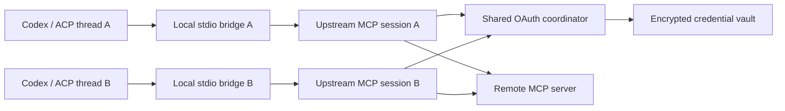

# PwrAgent-managed MCP connection gateway

## Operator requirement

OAuth-protected remote MCP servers such as Atlassian Rovo and Datadog
currently rely on each Codex app-server process to hold and refresh its own
credentials. Their access tokens last only a few hours, and real refresh
attempts are failing with `invalid_grant` or `unauthorized_client`, forcing the
operator through a new browser login nearly every day.

Move connection ownership up to PwrAgent's profile runtime. PwrAgent should
authorize each remote MCP once, keep the rotating credential authoritative in
one place, and expose a local authenticated MCP bridge to every selected Codex
or ACP thread. Threads should not know or care how the upstream MCP authenticates.

## Decision

Build a provider-neutral **MCP connection gateway** in the Electron main
process by extracting and hardening the existing PwrSnap connection service.
PwrAgent becomes the OAuth client of the remote HTTP MCP server. Codex and ACP
remain downstream MCP clients of a PwrAgent-owned local stdio bridge.

The core shape is:



## Implementation progress — 2026-08-12

The first usable gateway delivery is implemented on this branch:

- [x] Provider-neutral profile registry with a stable built-in `pwrsnap`
  record and comment-preserving TOML writes.
- [x] Encrypted multi-connection credential envelope with serialized,
  read-after-write-verified rotation and lazy PwrSnap migration.
- [x] Connection-scoped OAuth coordinator with PKCE, discovery, DCR,
  `refresh_token` client metadata, conditional `offline_access`, generation
  tracking, single-flight refresh, persistence-before-publish, one retry, and
  explicit transient/reauthorization states.
- [x] Profile-scoped `mcp_connections` runtime lease and authenticated
  owner/non-owner broker using the existing private Unix socket / random
  Windows named-pipe transport. Discovery records are owner-only on Unix and
  fail closed when their owner does not match the active lease.
- [x] Separate upstream MCP clients per bridge grant/thread with shared OAuth,
  generic Codex and ACP registration, grant revocation, and downstream tool
  cancellation propagation.
- [x] Settings management for create/authorize/reauthorize/disconnect/remove,
  kept visibly separate from direct Codex-managed MCP servers.
- [x] Generic new-thread selection that preserves multiple connection IDs and
  keeps configured-but-unhealthy connections visible.
- [x] HTTPS/loopback URL policy, private/link-local address rejection,
  redirect revalidation, cross-origin credential redirect protection, and
  sensitive OAuth error redaction.
- [x] Checked-in SQLite budgets: zero commits per request and idle hour, one
  commit per encrypted rotated credential generation, and acquire/release-only
  lease writes.
- [ ] Manually qualify real Datadog and Atlassian Rovo accounts. This requires
  operator browser consent and must not check live identifiers, callback URLs,
  scopes, or tokens into fixtures.
- [ ] Expand beyond the deliberately bounded tools/resources/prompts contract
  after each additional MCP capability receives an end-to-end forwarding test.

The concrete broker decision deferred below was resolved in favor of one
profile-local discovery record pointing at the owner process's existing
private bridge socket. The record contains a separate random broker token, not
an OAuth token; non-owner processes can request bridge grants and lifecycle
operations but never load the encrypted credential vault.

The measured write arithmetic is bounded: `N requests/second × 0 commits per
request × 86,400 seconds = 0 MB/day` while idle or serving MCP traffic. Adding
the MCP lease increases one full three-runtime acquire/release lifecycle from
94,760 to 115,360 observed WAL bytes (`+20,600`), and one encrypted token
rotation costs one commit / 8,240 observed WAL bytes. At one app lifecycle and
one token rotation per day, the incremental calibration is therefore 28,840
bytes/day, about 0.028 MB/day—not a timer- or traffic-multiplied write path.

**One OAuth authority does not mean one MCP session.** Credential discovery,
client registration, token refresh, token rotation, and reauthorization are
connection-scoped. MCP transports are thread-scoped because MCP sessions can
carry roots, subscriptions, logging level, progress, cancellation, elicitation,
sampling, and other client-specific state. Sharing PwrSnap's single upstream
`Client` across arbitrary servers and threads would collapse those session
boundaries.

This plan intentionally changes the boundary recorded in
`2026-04-28-001-feat-desktop-mcp-request-support-plan.md`. That completed plan
kept third-party OAuth and MCP runtime ownership in Codex. It remains correct
as a historical record; this new plan supersedes only that ownership decision
for connections explicitly enrolled in the PwrAgent gateway. Direct
Codex-owned MCP servers continue to work.

## Desired outcomes

- An operator connects Datadog, Rovo, PwrSnap, or another HTTP MCP once per
  PwrAgent profile and can select it for multiple Codex or ACP threads.
- Concurrent threads cause at most one refresh-token grant for the same
  credential generation.
- Rotated refresh tokens survive turns, thread shutdown, and PwrAgent restart.
- An expired access token refreshes without user interaction when the
  authorization server permits it.
- Revoked or expired refresh credentials become a visible
  `reauthorization_required` state instead of a generic tool failure or browser
  popup from a background turn.
- OAuth tokens never enter thread config, Codex storage, ACP storage, logs,
  renderer state, federation envelopes, or the local bridge protocol.
- The local bridge grant never leaves the machine and is never forwarded as an
  upstream bearer token.
- Direct Codex MCP management remains available for servers the operator has
  not migrated to PwrAgent.

## Scope

### In scope

- Provider-neutral HTTP MCP connection records owned by a PwrAgent profile.
- OAuth 2.1 authorization-code + PKCE, protected-resource and authorization-
  server discovery, dynamic client registration where supported, refresh-token
  rotation, and explicit reauthorization.
- A connection-level refresh coordinator shared by all thread sessions.
- Per-thread upstream MCP sessions reached through the existing local stdio to
  private-socket / named-pipe bridge pattern.
- Codex and ACP thread injection through the existing `mcpConnectionIds`
  selection path.
- Settings UI for connection creation, authorization, health, reconnection,
  and removal.
- Migration of PwrSnap onto the generic gateway without regressing its local
  application/open/download behavior.
- Datadog and Atlassian Rovo as qualification targets for the generic OAuth
  path, not hard-coded providers.
- Deterministic OAuth and MCP fixtures, multi-thread concurrency tests,
  multi-process ownership tests, and write-volume budgets.

### Out of scope for the first delivery

- Importing or reading OAuth credentials from Codex-owned files or databases.
- Deleting or rewriting the operator's global Codex MCP configuration.
- Federating credentials between machines or profiles.
- A cloud-hosted PwrAgent token broker.
- Combining every remote server into one synthetic MCP namespace.
- Storing arbitrary provider passwords or collecting credentials inside
  PwrAgent; authentication remains an out-of-band browser flow.
- Declaring the proxy fully transparent before notifications, server-initiated
  requests, cancellation, progress, and subscriptions have explicit coverage.
- Non-OAuth secret modes such as arbitrary API keys in the first OAuth-focused
  milestone. The connection/auth interfaces should leave room for a later
  `static_bearer` mode without implementing it now.

## Existing substrate

The repository already contains most of the downstream wiring:

- `PwrSnapConnectionService` owns OAuth state, an upstream Streamable HTTP MCP
  client, the private socket / Windows named pipe, random bridge grants, and
  cleanup.
- `mcp-connection-bridge-entry.ts` presents that bridge as a stdio MCP server
  and forwards tools, resources, and prompts.
- `buildCodexConnectionMcpConfig` gives every selected connection a unique
  hashed server name and disables only matching inherited aliases, preventing
  the same remote MCP from running both directly and through PwrAgent in one
  thread.
- `registerAcpMcpConnections` projects the same bridge registrations into ACP
  sessions.
- Thread and launchpad overlays already persist `mcpConnectionIds`.
- `RuntimeLeaseManager` already provides PID-owned, profile-scoped messaging
  and federation leases without timer heartbeats.
- PwrSnap OAuth material already uses PwrAgent's encrypted `safeStorage`-backed
  secret store.

The main generalization points are currently explicit in code:

- `McpConnectionId` is only `"pwrsnap"`.
- `registerMcpConnections` ignores every ID except PwrSnap.
- PwrSnap has a single credential blob and single upstream MCP client.
- Its OAuth client metadata advertises only `authorization_code`, not
  `refresh_token`.
- Its non-interactive reconnect path cannot complete a fresh authorization
  flow.
- The bridge implements a bounded request/response subset of MCP.
- Settings → Plugins currently manages Codex-owned MCP inventory and OAuth,
  while the PwrAgent-owned PwrSnap connection is exposed only from the thread
  composer.

## Architecture

### 1. Connection registry

Introduce provider-neutral connection contracts in
`packages/shared/src/contracts/mcp-connections.ts`:

```ts
type McpConnectionRecord = {
  id: string;
  displayName: string;
  serverUrl: string;
  authMode: "oauth";
  enabled: boolean;
  createdAt: number;
  updatedAt: number;
};

type McpConnectionRuntimeState =
  | "disconnected"
  | "connecting"
  | "ready"
  | "refreshing"
  | "reauthorization_required"
  | "temporarily_unavailable";
```

The exact wire contracts may differ, but persisted configuration and runtime
state must stay separate:

- Non-secret identity, display name, canonical server URL, auth mode, and
  enabled state live in the profile's user-editable config.
- Tokens, PKCE verifier, discovery state, issuer-bound client registration,
  and other OAuth credential material live only in the encrypted secret store.
- Capability inventories and runtime health remain in memory unless a later
  requirement demonstrates a need to persist them.

Connection IDs are opaque, stable, validated identifiers. PwrSnap retains the
existing `pwrsnap` ID. User-added connections receive generated IDs and are not
renamed when their display labels change.

Before introducing the new config table, follow `docs/config-file-evolution.md`:
read the absence of the section as an empty registry, make writes path-based,
preserve unrelated comments and keys, and cover downgrade-safe behavior. Do
not eagerly rewrite the whole config file on startup.

### 2. Encrypted credential vault

Replace the fixed `pwrsnapMcpCredential` secret name with a gateway-owned
encrypted credential envelope that supports multiple connections. Because the
current `DesktopSecretStore` has a closed union of secret names and stores
encrypted ciphertext in the profile database, the implementation must choose
and test one of these bounded shapes:

1. One encrypted map under a new `mcpConnectionCredentials` secret name, with
   updates serialized by the single profile owner; or
2. A narrowly scoped dynamic secret-key API dedicated to MCP connection IDs.

Prefer the smallest safe change after testing failure and migration behavior.
Whichever shape is selected, credentials are keyed by connection, canonical
resource URI, and validated authorization-server issuer. Client registrations
must not be reused across issuers. A successful refresh that rotates a token
must persist the entire new credential generation as one encrypted write.

Migrate the existing PwrSnap credential lazily: when `pwrsnap` is first read by
the new owner and no generic credential exists, copy it into the generic vault,
verify it can connect, then retire the old encrypted entry. Never delete the
old entry before the replacement has been successfully persisted and read
back. Do not import any Codex-owned credential.

If secret storage is unavailable, connecting or refreshing must fail visibly.
The dev-only secret-storage escape hatch must never silently report an OAuth
connection as durable.

### 3. OAuth session coordinator

Create one `McpOAuthSessionCoordinator` per configured OAuth connection. It is
the only code allowed to mutate that connection's OAuth credential.

Required invariants:

- Every credential snapshot has an in-memory generation number.
- `token()` returns the current access token and generation to the requesting
  upstream session.
- Refresh is single-flight. Concurrent 401s join the same promise.
- A session receiving 401 first compares the generation it used with the
  current generation. If another request already advanced it, the session
  retries with the current token without issuing another refresh grant.
- Refresh requests carry the canonical MCP resource parameter and use the
  validated issuer/client registration associated with that resource.
- When the authorization server returns a new refresh token, it replaces the
  old one. When it validly omits one, the prior refresh token is retained.
- A refreshed generation is encrypted and persisted before it becomes current
  for new upstream requests. Persistence failure leaves the previous durable
  generation authoritative and fails the operation rather than creating a
  memory-only rotation.
- A request retries authentication at most once. There is no automatic loop.
- `invalid_grant` or `unauthorized_client` triggers one owner-side vault reload
  and generation comparison. If no newer durable generation exists, the
  connection enters `reauthorization_required`.
- Network errors, timeouts, 429s, and 5xx responses enter
  `temporarily_unavailable`, retain credentials, and use bounded retry/backoff
  only at explicit operation boundaries.
- Background turns never open a browser. The renderer starts full
  reauthorization only after an operator action.

OAuth client metadata must advertise `refresh_token` when refresh tokens are
desired. Request `offline_access` only when discovery metadata advertises it;
do not assume a refresh token will be issued. Continue to use PKCE, exact state
validation, protected-resource discovery, issuer validation, and OAuth
resource indicators.

The SDK remains the standards substrate, but the coordinator owns lifecycle
policy. Do not depend on the SDK to complete interactive reauthorization
started from a mid-session 401: the current SDK can return a redirect while
the in-flight transport still fails. PwrAgent should transition to
`reauthorization_required`, let Settings own the complete callback/code
exchange, rebuild affected upstream sessions, and then permit a retry.

Dynamic client registration is bound to the redirect URI. The implementation
must not reuse a stored client registration with a different callback URI
unless the authorization server permits it. Use a stable callback listener for
the lifetime of the gateway owner where practical; after restart, either reuse
a still-valid exact redirect or perform a new client registration before full
reauthorization. This behavior receives a dedicated test because stale client
registration is a plausible source of `unauthorized_client`.

### 4. Profile owner and local broker

Extend runtime ownership with an `mcp_connections` lease. It follows the
existing PID-owned lease design: acquire/release/takeover writes only, no timer
heartbeat and no per-request database write.

The process holding the lease is the only process that may:

- Read or mutate gateway credentials.
- Perform OAuth discovery, authorization, refresh, or client registration.
- Own upstream MCP sessions.
- Serve the authenticated local MCP bridge.

Multiple PwrAgent processes can share one profile, so losing the lease cannot
simply make MCP disappear in every non-owner window. The owner publishes a
profile-local broker endpoint and an authenticated discovery record containing
no upstream credentials. Non-owner processes request bridge registrations from
that owner. Reuse the runtime identity and dead-owner grace rules; after a
takeover, the new owner reloads the encrypted credential vault before serving
traffic.

The concrete broker discovery transport is deferred until implementation
research compares the existing federation/runtime-local primitives. Its
acceptance criteria are not deferred: owner identity must be authenticated,
the endpoint must be profile-scoped, permissions must be owner-only on Unix,
Windows must use a private named pipe, stale discovery must fail closed, and a
non-owner must never fall back to refreshing independently.

Adding a lease kind changes SQLite writes. Wrap the full feature boundary in
`measureSqliteWrites`, update
`apps/desktop/src/main/__tests__/fixtures/sqlite-write-budgets.json`, and show
the arithmetic in the implementation PR. Expected steady-state cost is zero
SQLite commits per MCP request and zero while idle. Token rotation may update
the encrypted secret row; it must never create a per-call or timer-driven write.

### 5. Per-thread MCP sessions and bridge grants

Generalize `PwrSnapConnectionService.registerBridge` into a connection gateway
registration API. Preserve the existing local transport shape:

- Codex and ACP launch a local stdio MCP bridge.
- The bridge connects to PwrAgent over a private Unix socket or Windows named
  pipe.
- Each registration gets an unguessable grant bound to connection ID, backend,
  thread ID, and process owner.
- Grants are revoked when a connection is deselected, a provisional thread
  fails, a backend session closes, or the gateway owner exits.
- The grant authorizes only the selected connection and never contains an
  upstream access token.

The owner maintains a separate upstream `Client`/transport for every active
`{connectionId, backend, threadId}` session. Those transports share the OAuth
coordinator but not MCP session state. Close and recreate only the affected
session after ordinary transport failure. Refreshing a token must not tear down
every healthy session unless the provider requires a reconnect.

Keep one downstream server name per remote connection. Do not aggregate tools
from several connections into a single MCP server: separate names preserve
provider identity, avoid tool/resource collisions, support per-thread
selection, and make failures attributable.

### 6. MCP fidelity contract

The current bridge forwards:

- `tools/list`, `tools/call`
- `resources/list`, `resources/templates/list`, `resources/read`
- `prompts/list`, `prompts/get`

That is the first delivery's explicit compatibility level, not “transparent
MCP proxy” parity. Preserve request parameters, pagination cursors, result
shapes, tool errors, timeouts, and the existing bounded large-resource path.
Add cancellation propagation for in-flight tool calls before qualifying the
gateway for general use.

Before advertising broader capabilities, add explicit forwarding and tests
for the relevant MCP facilities:

- progress and cancellation;
- server notifications and list-changed events;
- resource subscriptions;
- logging level and log messages;
- server-initiated elicitation and sampling;
- roots/list and roots-changed;
- completion requests;
- session resumption and transport-specific state.

Unsupported upstream capabilities must be omitted from the downstream
handshake, not advertised and then dropped. Datadog and Rovo may qualify on the
initial tools-focused contract, but qualification must record the capabilities
they actually negotiate.

### 7. Thread and backend integration

Generalize the existing selection path rather than adding backend-specific
configuration:

- `mcpConnectionIds` remains the thread/launchpad selection contract.
- `registerMcpConnections` resolves any enabled registry ID rather than an
  allowlist containing only PwrSnap.
- Codex continues receiving unique hashed stdio server names.
- ACP continues receiving the same local bridge projection through
  `resolveMcpConnectionServers`.
- Exact matching inherited Codex aliases are disabled only inside the selected
  thread config. Global Codex config is untouched.
- Tool timeout and startup errors name the connection and distinguish
  authentication, upstream availability, local broker, and unsupported-
  capability failures.

PwrAgent-owned connections are backend-neutral. The connection registry and
OAuth coordinator must not import Codex app-server types or live under the
Codex adapter.

For federation, connection configuration and credentials belong to the machine
and profile that own the executing thread. A viewer of a remote thread can see
bounded connection status supplied by that owner, but cannot authorize,
disconnect, or retrieve credential material across federation. New-thread and
turn APIs must resolve selected connection IDs at the execution owner; they
must not borrow the viewing machine's similarly named connection.

### 8. Settings and thread UX

Settings → Plugins currently means Codex-profile MCP configuration. Evolve the
pane without conflating the ownership models:

- **PwrAgent connections**: provider-neutral rows with display name, host,
  status, capability summary, Connect/Reauthorize, Disconnect, and Remove.
- **Codex profile MCP servers**: retain the existing inventory/relogin/remove
  controls for direct Codex-owned servers, with copy explaining that their
  credentials remain Codex-owned.

Creating a PwrAgent connection accepts a display name and HTTPS MCP URL, then
runs discovery and shows the authorization server and requested scopes before
opening the browser. PwrSnap remains a first-party row with its install/open
affordances.

Connection status is a small state machine, not a boolean:

| State | Operator meaning | Allowed action |
|---|---|---|
| `disconnected` | No durable credential | Connect |
| `connecting` | Discovery/authorization in progress | Cancel |
| `ready` | Usable; refresh is automatic | Disconnect |
| `refreshing` | Existing authorization is being renewed | Wait / Disconnect |
| `reauthorization_required` | Refresh cannot continue | Reauthorize / Disconnect |
| `temporarily_unavailable` | Provider or network failed transiently | Retry / Disconnect |

The per-thread selector becomes a list of enabled PwrAgent connections rather
than a PwrSnap-only toggle. A selected but unhealthy connection remains visible
with its remediation state; silently dropping it from a turn would make the
model believe the tool never existed. Composer submission should fail with an
actionable connection-specific error when a required bridge cannot register.

Do not automatically open a login browser from an agent tool call, background
automation, startup, refresh failure, or remote viewer. Surface the connection
in Attention/notification UI only if existing product patterns support a
bounded actionable notice; otherwise Settings remains the remediation surface
for the first delivery.

## Security model

### Token separation

The gateway has two unrelated credentials:

1. A short-lived local bridge grant authorizing a thread to call one PwrAgent
   connection.
2. An OAuth access/refresh credential authorizing PwrAgent to call the remote
   MCP resource.

They must never be substituted or forwarded for one another. The local bridge
grant is checked before any operation and is removed before upstream request
construction. Upstream `Authorization` headers are created only inside the
owner's transport. Logs record connection ID and credential generation, never
token bodies, authorization codes, PKCE verifiers, callback query strings, or
client secrets.

### Remote URL policy

User-entered MCP URLs create an SSRF surface. The first delivery requires:

- HTTPS for arbitrary remote hosts.
- Plain HTTP only for explicit loopback first-party/local connections such as
  PwrSnap.
- URL parsing that rejects embedded credentials, fragments, non-HTTP schemes,
  and malformed hosts.
- Redirect revalidation at every hop.
- A deliberate private-network policy: loopback can be allowed explicitly,
  while link-local/cloud metadata destinations and unexpected private-address
  resolution are rejected. DNS rebinding must not bypass the decision.
- Bounded discovery, callback, refresh, and MCP request timeouts and response
  sizes.

### Authorization and tool policy

- Use least-privilege scopes from the protected-resource challenge/metadata
  and show them before consent.
- A connection grant permits only that connection. Future per-tool allowlists
  can refine it, but are not silently invented in this plan.
- Existing MCP elicitation/approval behavior remains the enforcement surface
  for server-requested user interaction. The proxy must not auto-approve
  elicitations.
- Removing a connection revokes bridge grants, closes sessions, deletes its
  encrypted credential, and then removes non-secret configuration. If secret
  deletion fails, retain a visible failed-removal state instead of claiming
  success.

## Failure behavior

| Failure | Gateway behavior | Thread behavior |
|---|---|---|
| Access token rejected; refresh succeeds | Persist rotated generation and retry once | Original operation continues |
| Concurrent 401s | One refresh; other sessions use the new generation | At most one bounded retry each |
| Refresh `invalid_grant` / `unauthorized_client` | Reload vault once, then `reauthorization_required` | Actionable auth error; no browser popup |
| Token persistence fails | Keep prior durable generation authoritative | Fail safely; do not use memory-only token |
| Remote timeout / 5xx / 429 | `temporarily_unavailable`; retain credential | Bounded provider error |
| Local bridge grant invalid | Reject before upstream I/O | Unauthorized local bridge error |
| Owner exits | Close sessions and revoke process grants | Re-register through new owner after lease takeover |
| Non-owner cannot reach owner | Never refresh locally | Explicit broker-unavailable error |
| Secret storage unavailable | Do not connect or claim durability | Settings remediation |
| Unsupported MCP capability | Do not advertise it downstream | Backend cannot invoke the unsupported path |

## Delivery units

### Unit 1 — Extract provider-neutral registry and contracts

**Goal:** Represent arbitrary PwrAgent-owned MCP connections without changing
runtime behavior for PwrSnap.

**Primary files:**

- Modify: `packages/shared/src/contracts/mcp-connections.ts`
- Create: `apps/desktop/src/main/mcp-connections/mcp-connection-registry.ts`
- Modify: `apps/desktop/src/main/settings/desktop-config.ts`
- Modify: `apps/desktop/src/main/settings/desktop-settings-service.ts`
- Test: main settings/config and shared contract suites

**Work:**

- Add connection record, runtime status, create/update/remove, authorize, and
  list contracts.
- Add a backwards-compatible profile config section and path-based writes.
- Keep `pwrsnap` stable and project its first-party metadata through the same
  registry.
- Replace the PwrSnap-only ID union without weakening validation at IPC and
  thread boundaries.

**Acceptance:** Existing PwrSnap tests pass unchanged or through a compatibility
adapter, arbitrary validated connection records round-trip, and config tests
prove comments/unrelated keys survive.

### Unit 2 — Build the encrypted vault and OAuth coordinator

**Goal:** Make token refresh and rotation correct under concurrency and restart.

**Primary files:**

- Create: `apps/desktop/src/main/mcp-connections/mcp-credential-vault.ts`
- Create: `apps/desktop/src/main/mcp-connections/mcp-oauth-session-coordinator.ts`
- Refactor: `apps/desktop/src/main/mcp-connections/pwrsnap-connection-service.ts`
- Modify: secret-name/store contracts only as required by the selected vault
  shape
- Test: deterministic OAuth fixture and coordinator unit tests

**Work:**

- Extract `StoredOAuthProvider` behind a provider-neutral, issuer-aware vault.
- Implement generation tracking, single-flight refresh, persistence-before-
  publish, retained refresh tokens, bounded retries, and typed failure states.
- Implement complete interactive authorization/reauthorization with callback
  lifecycle and client-registration/redirect binding.
- Lazily migrate the existing encrypted PwrSnap credential.

**Acceptance:** N simultaneous expired-token calls issue one refresh request;
the rotated token survives coordinator recreation; no request sees a new
generation before persistence; `invalid_grant` never loops or opens a browser.

### Unit 3 — Add profile ownership and the authenticated broker

**Goal:** Enforce one credential writer and upstream runtime per profile even
when several PwrAgent processes share it.

**Primary files:**

- Modify: `apps/desktop/src/main/runtime-lease-manager.ts`
- Modify: `apps/desktop/src/main/state/app-runtime-instance-store.ts`
- Create: `apps/desktop/src/main/runtime-mcp-connections-lease.ts`
- Create/refactor: broker server/client files under
  `apps/desktop/src/main/mcp-connections/`
- Test: runtime lease, broker authentication, takeover, and SQLite write budget
  suites

**Work:**

- Add the `mcp_connections` lease and owner lifecycle.
- Publish and authenticate a profile-local broker endpoint without exposing
  upstream credentials.
- Make non-owner bridge registration route to the owner.
- Reload the credential vault on takeover before accepting requests.

**Acceptance:** Two simulated processes cannot both refresh; a live owner is
not displaced; a dead owner is replaced only after existing grace rules; idle
gateway ownership produces zero recurring SQLite writes.

### Unit 4 — Generalize per-thread bridge sessions

**Goal:** Route arbitrary selected connections through isolated upstream MCP
sessions with shared OAuth.

**Primary files:**

- Refactor: `apps/desktop/src/main/mcp-connections/pwrsnap-connection-service.ts`
  into provider-neutral gateway/session modules
- Modify: `apps/desktop/src/main/mcp-connections/mcp-connection-bridge-entry.ts`
- Modify: `apps/desktop/src/main/app-server/backend-registry.ts`
- Test: connection gateway, backend registry, Codex, and ACP tests

**Work:**

- Resolve all selected registry IDs instead of accepting only `pwrsnap`.
- Bind every grant to connection/backend/thread and create a distinct upstream
  MCP session.
- Preserve unique Codex aliases and exact inherited-alias suppression.
- Preserve tools/resources/prompts parameter and pagination semantics.
- Add cancellation propagation and capability filtering.
- Split PwrSnap-specific application discovery/open/download from the generic
  connection runtime.

**Acceptance:** Two threads share refreshed credentials but not MCP client
state; closing one does not close the other; Codex and ACP both receive the
same selected connection; upstream credentials never appear in downstream
config or bridge frames.

### Unit 5 — Add PwrAgent connection management UI

**Goal:** Let operators create, authorize, inspect, repair, and remove gateway
connections, then select them per thread.

**Primary files:**

- Modify: `apps/desktop/src/renderer/src/features/settings/PluginsSettings.tsx`
- Modify: `apps/desktop/src/renderer/src/features/settings/SettingsScreen.tsx`
  only if navigation/section naming changes
- Refactor: `apps/desktop/src/renderer/src/features/thread-detail/PwrSnapConnectionPrompt.tsx`
- Modify: IPC, preload, and `DesktopApi` contracts
- Test: settings, thread selector, IPC, and accessibility suites

**Work:**

- Separate PwrAgent-owned connections from direct Codex MCP inventory.
- Add URL/display-name creation, scope/authorization confirmation, status
  states, reauthorization, disconnect, and removal.
- Generalize the launchpad/thread control from one PwrSnap toggle to a
  connection selector.
- Keep remote-viewer actions read-only and direct remediation to the execution
  owner.

**Acceptance:** The UI never claims “connected” without durable encrypted
credentials; reauthorization is explicit; unhealthy selected connections stay
visible; keyboard and screen-reader behavior matches existing Settings and
composer patterns.

### Unit 6 — Qualify Datadog, Rovo, and PwrSnap

**Goal:** Prove the generic design against the motivating providers and the
first-party regression case.

**Primary files:**

- Add deterministic local OAuth/MCP fixture servers under the desktop test
  support tree
- Add replay-backed or isolated desktop E2E fixtures for connection status and
  thread selection
- Extend `apps/desktop/src/main/__tests__/fixtures/sqlite-write-budgets.json`

**Work:**

- Exercise short access-token expiry, rotating refresh tokens, omitted refresh
  tokens, restart, concurrent threads, revoked grants, client-registration
  rejection, callback mismatch, 429/5xx, and network timeouts locally.
- Manually qualify Datadog and Rovo without checking real endpoints, client
  identifiers, scopes, tokens, or captured callback URLs into fixtures.
- Record the negotiated MCP capabilities and keep unsupported ones out of the
  bridge advertisement.
- Re-run PwrSnap connect, launch, tool/resource/prompt, and remote-viewer flows.

**Acceptance:** A short-lived access token refreshes across several threads
without user action; restart uses the durable rotated token; forced revocation
produces one clear reauthorization request; the manual providers work through
PwrAgent without a direct Codex OAuth credential.

### Unit 7 — Expand protocol fidelity deliberately

**Goal:** Move from the initial tools/resources/prompts contract toward a
general MCP gateway without overclaiming support.

**Work:**

- Inventory the negotiated capabilities of qualified servers.
- Implement and test notifications, list-changed, subscriptions, progress,
  logging, roots, elicitation, sampling, completions, and session resumption in
  small reviewed slices.
- Update capability advertisement only as each slice becomes end-to-end.

**Acceptance:** Every advertised capability has an end-to-end forwarding test,
including error, cancellation, and cleanup behavior.

## Verification matrix

### OAuth lifecycle

- Initial protected-resource and authorization-server discovery.
- Authorization code + PKCE with exact state and callback validation.
- DCR supported, DCR rejected, and preconfigured/client-metadata alternatives.
- `resource` included consistently in authorization and token requests.
- Access token expires and refresh succeeds.
- Refresh response rotates both tokens.
- Refresh response rotates access token but omits refresh token.
- N concurrent 401s produce one refresh grant.
- One session already used generation N while another publishes N+1.
- Encrypted persistence fails before publish.
- PwrAgent restarts after a successful rotation.
- Refresh returns `invalid_grant` or `unauthorized_client`.
- Reauthorization uses a new callback URI and refuses stale incompatible client
  registration.
- Authorization callback carries wrong state, error response, duplicate code,
  or arrives after timeout.

### Bridge and isolation

- Grants are random, thread/connection bound, and revoked on cleanup.
- Invalid, stale, wrong-thread, and wrong-connection grants make no upstream
  request.
- Local grants never appear in upstream headers or logs.
- OAuth tokens never appear in bridge frames, thread config, renderer events,
  federation messages, or logs.
- Separate threads maintain separate MCP sessions and cancellation scopes.
- A failed session reconnect does not close unrelated sessions.
- Pagination cursors and structured tool errors survive the bridge.
- Large resource results stay bounded and do not truncate valid supported
  payloads silently.

### Ownership and persistence

- One process acquires the connection lease.
- A second live process becomes a broker client, not a credential writer.
- Owner crash and grace-period takeover reload the vault before requests.
- Stale broker discovery fails closed.
- Multiple profiles can independently own similarly named connections.
- A federation viewer does not use or mutate the viewer machine's credential.
- Idle owner: zero SQLite commits after startup.
- MCP request: zero SQLite commits.
- Lease acquisition/release and token-rotation writes stay within checked-in
  budgets.

### UI and compatibility

- Existing direct Codex MCP inventory/relogin/removal still works.
- PwrAgent-managed and Codex-managed ownership is visually explicit.
- Create rejects unsafe URLs before network I/O.
- Requested scopes are visible before authorization.
- Browser authorization starts only from an operator action.
- Refreshing, reauthorization-required, and transient-offline states render
  distinctly.
- Selected unhealthy connections are not silently removed from a thread.
- PwrSnap first-party install/open/download and remote-viewer wording remain
  correct.
- Codex and ACP both receive selected gateway connections.

## Rollout and migration

1. Land the provider-neutral registry and OAuth coordinator behind the current
   PwrSnap entry point.
2. Migrate PwrSnap to the coordinator and prove no behavior regression.
3. Land profile ownership and multi-process broker before allowing arbitrary
   OAuth connections; otherwise the central-refresh guarantee would be false
   for shared profiles.
4. Add PwrAgent connection management and expose generic connection creation.
5. Qualify Datadog and Rovo with manual operator authorization.
6. Keep direct Codex servers visible and supported. Operators migrate by
   creating a PwrAgent connection and selecting it for a thread; PwrAgent does
   not scrape Codex credentials.
7. When a selected PwrAgent connection has the same configured Codex alias,
   disable that alias only in the thread-scoped config using the existing exact
   match behavior.
8. Expand MCP fidelity only with capability-specific tests.

No destructive credential migration runs at startup. PwrSnap's lazy migration
is backup-first. Removing or disconnecting a PwrAgent connection affects only
PwrAgent-owned configuration and encrypted secrets, never global Codex config.

## Observability

Use structured, redacted events with:

- connection ID and display name;
- profile/owner instance ID;
- thread/backend IDs where relevant;
- credential generation number, never token content;
- transition (`ready` → `refreshing` → `ready`, for example);
- classified failure (`invalid_grant`, `unauthorized_client`, transient HTTP,
  timeout, persistence, broker, unsupported capability);
- refresh coalescing count and operation latency;
- upstream session create/close reason.

Do not log raw authorization URLs, callback URLs, `WWW-Authenticate` headers
without redaction, request headers, discovery documents containing secrets,
token endpoint bodies, or tool arguments by default. Diagnostics should be
good enough to answer “did refresh run, did it rotate, and why was
reauthorization required?” without exposing credentials.

## Alternatives considered

### Keep OAuth in every Codex app-server process

Rejected for PwrAgent-managed connections. It duplicates refresh-token state,
inherits upstream client bugs, ties connection reliability to one backend, and
cannot coordinate rotating tokens across threads. It remains supported for
direct Codex-owned servers outside the gateway.

### Share one upstream MCP client across all threads

Rejected for the generic gateway. It works for the currently narrow PwrSnap
use case but merges stateful MCP client sessions. Share authentication state,
not protocol sessions.

### Pass the upstream token to each thread's HTTP MCP transport

Rejected. It exposes credentials to child processes and backend configuration,
makes refresh coordination racy again, and violates the gateway's token-
separation boundary.

### One aggregate PwrAgent MCP server for every connection

Rejected. It creates name collisions, obscures provider identity and errors,
complicates resources/prompts, and makes per-thread selection less precise.

### Import Codex OAuth credentials

Rejected. Codex storage is an implementation detail PwrAgent must not read,
and copying an already-rotating refresh token would create two writers. The
operator authorizes once in PwrAgent when migrating a server.

### Run one credential owner per Electron process and accept duplicates

Rejected. PwrAgent explicitly supports multiple processes sharing one profile;
the proposal's main reliability guarantee requires one owner per profile.

## External standards and implementation references

- [MCP Authorization 2025-11-25](https://modelcontextprotocol.io/specification/2025-11-25/basic/authorization)
  defines protected-resource discovery, issuer discovery, scope behavior,
  OAuth resource indicators, and the prohibition on token passthrough.
- [Current MCP draft refresh-token guidance](https://modelcontextprotocol.io/specification/draft/basic/authorization)
  requires confidential refresh-token storage, recommends advertising the
  refresh-token grant, and permits `offline_access` only when supported.
- [MCP TypeScript SDK client authentication](https://github.com/modelcontextprotocol/typescript-sdk/blob/main/docs/client.md)
  documents `token()` plus `onUnauthorized()` with one retry, which is the seam
  the coordinator should own.
- [MCP TypeScript SDK issue #2510](https://github.com/modelcontextprotocol/typescript-sdk/issues/2510)
  demonstrates why mid-session interactive reauthorization needs an explicit
  PwrAgent lifecycle rather than an automatic browser redirect inside a failed
  transport call.

## Open implementation questions

These are bounded investigations, not missing product decisions:

- Whether the multi-connection encrypted vault should be one serialized map or
  a dedicated dynamic-key secret API. Decide from atomicity, migration, and
  secret-store failure tests before modifying the closed secret-name contract.
- Which existing profile-local runtime primitive should publish and
  authenticate the MCP owner broker endpoint. The security and single-owner
  acceptance criteria above are fixed.
- Whether the supported SDK v1 release can expose a clean custom `AuthProvider`
  seam for the coordinator or whether a narrowly scoped adapter around
  `OAuthClientProvider` is required. Do not upgrade to SDK v2 as incidental
  scope; make that a separately reviewed dependency migration if necessary.
- Which protocol capabilities Datadog and Rovo actually negotiate. Record this
  during qualification and advertise only the implemented intersection.
- Whether a selected connection is optional or required for a particular
  thread. The first delivery treats every explicitly selected connection as
  required at bridge-registration time; changing that needs a visible product
  control rather than silent fallback.

## Completion criteria

- PwrAgent is the sole OAuth credential authority for every connection enrolled
  in its gateway.
- Multiple threads and backends can use one connection without duplicating
  refresh requests or sharing stateful MCP sessions.
- Multiple PwrAgent processes sharing a profile cannot refresh concurrently.
- Rotating refresh tokens are durably and atomically advanced before use.
- Revocation and unrecoverable refresh failures produce explicit operator
  reauthorization state without automatic browser prompts.
- Datadog, Rovo, and PwrSnap pass the qualification matrix.
- Direct Codex-owned MCP servers continue to work and remain clearly separate
  in Settings.
- No upstream token is observable in thread config, bridge traffic, renderer
  state, federation traffic, or logs.
- Every downstream-advertised MCP capability has end-to-end proxy coverage.
- SQLite write-volume tests prove zero request-path and zero idle recurring
  commits, with all new persistence boundaries represented in checked-in
  budgets.
