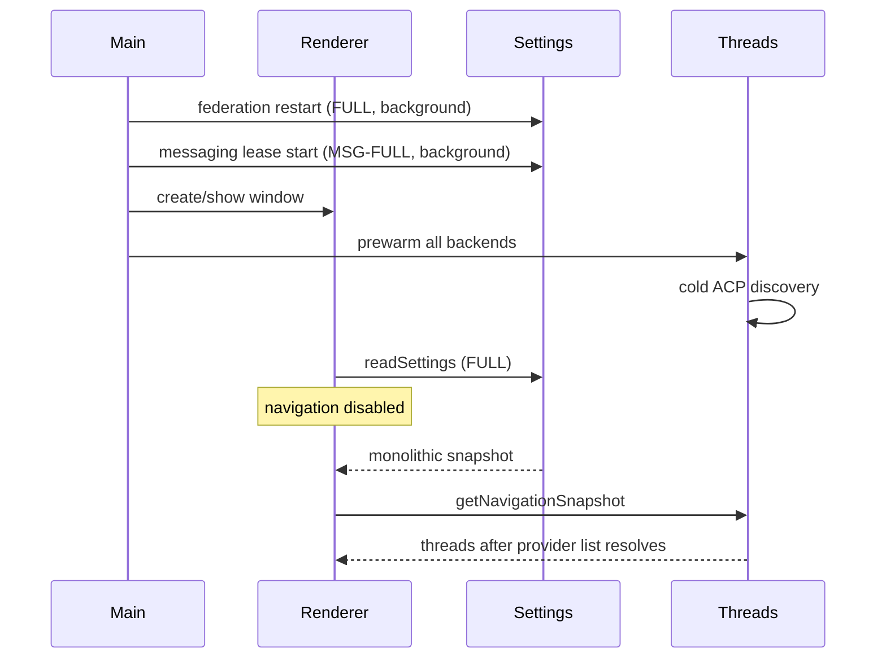

# Targeted Desktop Configuration Store

Status: Implemented through Phase 5; Phase 6 compatibility removal pending

Date: 2026-09-01

Audit base: `d001f84999f7dc20108a84c82eb3e6096c233b20` from
`origin/fix/desktop-thread-info-store`

Implementation base: `e46890070621` from `origin/main`, including squash
merges #1920, #1921, #1922, and the follow-up test correction #1924.

## Implementation checkpoint

The incremental implementation now covers Phases 0–5 on
`docs/targeted-config-store-design`:

| Phase | State | Implemented result |
|---|---|---|
| 0 | Complete | Audit/design record, startup timing contracts, and the broad-load callsite catalog. |
| 1 | Complete | Immutable versioned domains, durable secret-free last-known-good config/provider projections, file watching, targeted provider refresh, diagnostics, and store publication. |
| 2 | Complete | Thread navigation and durable provider/thread summaries no longer wait for Settings enrichment or live provider discovery; startup refresh is background work. |
| 3 | Complete | Targeted config/secret IPC results, keyed subscriptions, normalized local renderer updates, and provider-scoped mutation invalidation. |
| 4 | Complete | Messaging, pairing/RBAC, federation, ACP listing, focused diff, thread migration, terminal, Git/PR, quit, worktree, notification, and related runtime reads use narrow store domains. |
| 5 | Complete | Response mode, PDF, streaming visibility, tool-update defaults, and Full Access admission use synchronous runtime policy snapshots fed by keyed store publication. No admission path awaits a config refresh. |
| 6 | Pending | Remove the Settings-screen compatibility projection and legacy injected-test fallbacks, enforce the raw-config import boundary, and delete obsolete public raw resolvers. |

The remaining production `readSettings()` references are the Settings-screen
projection, explicit Codex rediscovery/profile workflow, and compatibility
fallbacks for injected legacy test sources. Raw active-profile reads remain
only behind compatibility fallbacks; explicit-path appearance and multi-profile
bootstrap/profile-registry reads remain separate because they do not address
the active profile store. Phase 6 should remove or formally isolate those
escape hatches after this behavior change is reviewed independently.

## Decision summary

Replace public whole-settings loads with one main-process, profile-scoped
configuration store. The store owns raw TOML parsing and localized TOML edits,
publishes one immutable versioned snapshot, exposes only domain reads and
targeted subscriptions, and refreshes provider discovery through deduplicated
background jobs. It persists a secret-free last-known-good normalized config
and provider-discovery projection in the profile state database.

Thread display must not await settings enrichment or provider discovery. On
startup, the renderer and thread services consume the durable snapshot and
durable thread/provider metadata immediately. Config revalidation and provider
rediscovery start after the window exists and publish incremental updates. The
current `ThreadInfoStore` is explicitly process-lifetime, so the thread layer
also needs a small durable Codex navigation-summary projection; the config
store must not pretend provider discovery metadata is itself a thread list.

This is an incremental replacement, not a rewrite. Existing config keys and
the path-based TOML writer remain in place. The current `DesktopSettingsService`
becomes a temporary compatibility projection over the store, then is removed
after callers migrate.

## Why this decision is needed

`DesktopSettingsService.readSettings()` is named like a read but is a composite
discovery workflow. One call currently does all of the following:

1. synchronously reads and parses the complete `config.toml`;
2. performs 19 sequential secret-presence reads;
3. checks the managed Codex runtime when enabled;
4. discovers Codex commands and scans Codex auth profiles;
5. discovers `gh`, Git, and desktop applications;
6. reads Token Miser usage and activation files; and
7. constructs a monolithic renderer snapshot containing every settings domain.

The implementation is visible in
[`DesktopSettingsService.readSettings`](../../apps/desktop/src/main/settings/desktop-settings-service.ts#L472).
There is no single-flight or immutable cache for the whole operation. Some
sub-operations cache independently: Codex discovery is keyed and single-flight,
Git and application discovery are process-lifetime promises, and `gh` discovery
is cached by configured command. All config parsing, secret-presence reads, and
Token Miser reads repeat.

The production search on this base found:

- 21 syntactic `readSettings()` calls in desktop production code, 17 outside
  the settings service and four mutation/refresh amplifiers inside it;
- nine production callers of
  `loadDesktopMessagingConfigFromSettings()` plus its definition; and
- 43 production calls outside the service to public resolver methods that
  synchronously reparse the complete TOML for one value.

The existing synchronous appearance bootstrap already documents the mismatch:
the normal settings snapshot is “much too heavy” before window creation because
it pulls in application and Codex discovery. See
[`appearance-bootstrap.ts`](../../apps/desktop/src/main/settings/appearance-bootstrap.ts#L1).

Three separately owned messaging investigations measured the same broad loader
on ordinary Discord admission paths:

| Owned case study | Broad-load span before | After removing the load from the span |
|---|---:|---:|
| handled → routed, PR #1922 | 3,887 ms / 3,333 ms | 6 ms / 2 ms |
| input preparation, PR #1920 | 3,226 ms / 2,376 ms | 0 ms |
| Full Access policy, PR #1921 | 1,937 ms | 0 ms |

Those fixes correctly remove narrow admission-path waits. They are case studies,
not the target architecture, and this plan does not duplicate their patches.
Their temporary runtime-owned policy snapshots should eventually subscribe to
the store.

## Current semantics legend

The callsite catalog uses these abbreviations.

| Code | Current work and semantics |
|---|---|
| `FULL` | Complete `readSettings()`: full TOML filesystem read/parse; 19 sequential secret-presence queries; managed Codex check; Codex command and auth-profile discovery; cached `gh`/Git/application discovery; Token Miser filesystem reads; unrelated full-snapshot normalization. Raw TOML is current at call time. There is no whole-operation single-flight. A TOML error becomes `{ config: {}, configError }`, but Codex or other uncaught discovery failures reject the entire call. |
| `WRITE+FULL` | Parse current TOML, apply a localized edit through a temp file and atomic rename, notify every unkeyed listener, then run `FULL` for the return value. The file may be committed even if the post-write discovery rejects and the caller sees a failed save. There is no cross-process compare-and-set. |
| `SECRET+FULL` | Commit or delete one encrypted secret in SQLite, then run `FULL`. A later discovery failure can make a committed secret change look failed. Secret-change methods do not publish the generic config-written event. |
| `MSG-FULL` | Run `FULL`, then call all 13 messaging secret getters (Telegram 1, Discord 1, Mattermost 2, Slack 3, Feishu 4, LINE 2) to assemble runtime config, even when the initiating workflow needs only one platform or policy field. The config load itself does not import provider modules. Runtime start/apply may subsequently import configured messaging-provider modules and construct/restart adapters. Lifecycle work is serialized, but per-message config callbacks are not. |
| `RAW` | Synchronously read and parse the complete TOML for one field. Parse errors are either thrown or swallowed to defaults, depending on the wrapper. No discovery or secret reads. There is no file watcher or shared snapshot. |
| `ACP` | Read the complete TOML once, scan local agent installs, and optionally fetch/install managed Grok or probe capabilities. `AcpBackendAdapter` memoizes one process-lifetime promise until explicit invalidation. Settings refresh has its own single-flight/recent-result logic. |
| `MP` | Dynamically import a configured messaging provider and construct an adapter. Module import promises are process-lifetime cached by provider. |

The current Codex discovery cache is only in memory: success is fresh for five
minutes, not-installed for 15 seconds, failure for five seconds, and a successful
result may be served stale for 30 minutes while a refresh is active. See
[`codex-discovery-coordinator.ts`](../../apps/desktop/src/main/codex-discovery-coordinator.ts#L9).
These short TTLs do not provide a durable startup snapshot.

## Complete enriched-load callsite catalog

Repeated invocations made by one symbol for the same workflow are grouped into
one row. Every production `readSettings()` reference and every production
`loadDesktopMessagingConfigFromSettings()` initiation on the audit base is
represented below, including wrapper-triggered calls.

| File / symbol and initiating workflow | Datum actually needed | Blocking surface | Work | Current freshness, concurrency, and failure behavior | Migration and priority |
|---|---|---|---|---|---|
| [`App` → `useDesktopSettings`](../../apps/desktop/src/renderer/src/App.tsx#L185), renderer boot | onboarding completion plus ordinary UI preferences; the Settings screen later needs the full display projection | **Startup and thread display**. `normalAppEnabled` stays false until this resolves. | `FULL` through the settings IPC | Renderer coalesces consumers for five seconds, but the main operation is still broad. Any uncaught discovery failure produces the fatal Settings path. | **P0:** hydrate the store before React, enable navigation from bootstrap/config status, and let the full Settings projection arrive incrementally. |
| [`AutomationEditor`](../../apps/desktop/src/renderer/src/features/automations/AutomationEditor.tsx#L389) | enabled messaging platform IDs and Telegram/Slack authorized groups | Automation editor | `FULL` | Shares the renderer five-second coalescer when warm; otherwise rejects to default providers. | **P1:** `read("messaging.automationInputs")`. |
| [`MessagingStatusBar`](../../apps/desktop/src/renderer/src/features/messaging-status/MessagingStatusBar.tsx#L163) | messaging enabled/runtime state and configured-platform summaries | Messaging status UI | `FULL` | Reads on status-count change and panel open; coalesced for five seconds; errors hidden. | **P1:** subscribe to messaging status/config domains. |
| [`useExecutionModeSelection.loadDismissed`](../../apps/desktop/src/renderer/src/lib/useExecutionModeSelection.tsx#L57) | one boolean: local Full Access warning dismissed | Turn admission UI gate | `FULL` | Module cache is fail-closed, but first use may await all discovery. | **P0 after the owned hot-path fix:** `read("experimental.fullAccessRiskWarningDismissed")`. |
| [`SETTINGS_READ_CHANNEL`](../../apps/desktop/src/main/ipc/settings.ts#L1182) | renderer Settings projection | Startup and Settings UI | `FULL` | Timed as one startup-profile operation; broad errors reject IPC. | **P0:** compose from the current immutable store snapshot; never discover here. |
| [`resolveCodexCommandForProfileWorkflow`](../../apps/desktop/src/main/ipc/settings.ts#L776) | selected Codex command for login/auth status | Onboarding and profile Settings | `FULL`, then a Codex child process | Discovery failure aborts the workflow. | **P1:** provider-scoped validated command read; explicit provider refresh when requested. |
| Settings write handler → [`writeConfigPatch`](../../apps/desktop/src/main/ipc/settings.ts#L1199) | normalized values for the keys just written | Settings UI; can also restart federation/messaging/backends | `WRITE+FULL`, plus generic listener fan-out | Atomic rename makes one file version durable. A post-write discovery failure can report failure after commit. Concurrent broad listener reads can overlap. | **P0:** return the store publication caused by the write; schedule only affected refreshes. |
| Secret replace/clear handlers | presence state for the one secret just changed | Settings UI and messaging runtime | `SECRET+FULL`; messaging secrets add `MSG-FULL` | Secret mutation may land before unrelated discovery rejects. Messaging runtime then performs another broad load. | **P0:** update one presence key and one affected runtime credential projection. |
| `refreshCodexDiscovery` handler | refreshed Codex discovery only | Onboarding / AI Providers Settings | forced `FULL` | Invalidates Codex discovery but also repeats every unrelated enrichment. Concurrent force requests reuse an active/recent Codex probe, not the whole read. | **P1:** explicit `refreshProvider("codex")`; return that provider projection. |
| [`loadDesktopMessagingConfigFromSettings`](../../apps/desktop/src/main/messaging/messaging-config.ts#L721) | messaging policy/config and messaging credentials | Messaging startup, hot apply, and many message paths | `MSG-FULL` | Every call reparses current TOML and repeats unrelated work. Synchronous secret resolution follows. Errors propagate. | **P0:** assemble from `messaging` domain plus a private runtime credential capability. |
| [`RuntimeMessagingLeaseCoordinator.start/applyLatestConfig`](../../apps/desktop/src/main/runtime-messaging-lease.ts#L76) from startup, session enable, and settings hot apply | runnable messaging adapter config | Messaging/background startup or Settings action | `MSG-FULL`, then `MP` on runtime start/restart | Lease lifecycle is serialized after config resolves. Startup is fire-and-forget from `index.ts`, but consumes the same discovery resources as the renderer. Failure releases the lease and reports startup error. | **P0:** use current messaging snapshot; no discovery; import/restart only affected adapters. |
| [`DesktopMessagingRuntime.shouldDropAmbientSharedMessage`](../../apps/desktop/src/main/messaging/messaging-runtime.ts#L1267) | response mode for one channel/conversation | Messaging admission (`handled → routed`) | `MSG-FULL` | Per-message, not whole-load single-flight. Owned PR #1922 replaces this with runtime policy state. | **Owned/P0 integration later:** source the runtime policy state from a store subscription. |
| [`DesktopMessagingRuntime.startRunningAdapter`](../../apps/desktop/src/main/messaging/messaging-runtime.ts#L1354) callback bundle | PDF enabled; streaming-option visibility; response mode; tool-update default; manager-tool-update default; Full Access controls | Messaging input preparation, routing, rendering, tool commands, and Full Access admission | up to five separate `MSG-FULL` callbacks per relevant message/action | Each callback asks for the full runtime config. Owned PRs #1920/#1921 remove two critical waits; other callbacks remain architectural debt. | **P0:** publish immutable, credential-free messaging policy projections to controllers. |
| Discord permission IPC handlers in [`settings.ts`](../../apps/desktop/src/main/ipc/settings.ts#L1423) | Discord bot token and, for one action, application ID | Messaging Settings diagnostics | `MSG-FULL`, then provider API/import | Broad load precedes the explicit Discord action; errors abort. | **P1:** read only Discord runtime credentials and Discord public config. |
| [`MESSAGING_APPROVE_PAIRING_CHANNEL`](../../apps/desktop/src/main/ipc/messaging-status.ts#L721) | one platform's authorized-contact lists | Messaging Settings/action | `FULL` + `WRITE+FULL` + `MSG-FULL`, then possible `MP` | Three broad loads can occur in one approval. Slack name lookup is separately bounded to two seconds. | **P0:** one messaging-domain read, one localized write/publication, one affected-adapter hot update. |
| Full Access warning dismissal helpers in [`messaging-config.ts`](../../apps/desktop/src/main/messaging/messaging-config.ts#L1343) | one platform's authorized users and dismissal flag | Messaging Full Access path | `FULL`, then `WRITE+FULL`; preflight also performs `FULL` | Security-sensitive; current broad failures reject. Owned PR #1921 adds a runtime policy snapshot and fail-closed handling. | **Owned/P0 integration later:** store transaction returns the updated contact policy; keep fail-closed runtime semantics. |
| [`ThreadMigrationService.listSources`](../../apps/desktop/src/main/app-server/thread-migration-service.ts#L106) | active Codex profile plus Codex auth-profile discovery | Thread-migration Settings | `FULL` | Repeats command/application/secret enrichment. Errors abort listing. | **P1:** `read("models.codex.profile")` plus provider-auth-profile projection. |
| [`FederationRuntime.health`](../../apps/desktop/src/main/federation/federation-runtime.ts#L1102) and diagnostics | federation mode, label, notes, endpoints | Federation status UI/tool | `FULL` | Every health request can discover Codex and read unrelated state. Errors reject health. | **P0:** synchronous federation-domain snapshot plus live runtime health. |
| [`localInstanceDescriptor`](../../apps/desktop/src/main/federation/federation-agent-tools-service.ts#L639) | federation instance label and notes | Federation `list_instances` agent tool | `FULL` | Broad load delays an otherwise local descriptor; failures reject the tool. | **P0:** `read("federation.identity")`. |
| [`FederationRuntime.resetEnrollment`](../../apps/desktop/src/main/federation/federation-runtime.ts#L1207) | mode, then two specific secrets and gateway fields | Federation Settings mutation | one `FULL`; up to two `SECRET+FULL`; one `WRITE+FULL`; restart causes another `FULL` | A client reset can perform five broad loads. State/meta deletion begins before later failures. | **P0:** one domain snapshot, targeted secret deletes, one config publication, restart from the published federation projection. |
| [`FederationRuntime.generateInvite`](../../apps/desktop/src/main/federation/federation-runtime.ts#L1464) | federation mode and advertised/public endpoints | Federation invite action | `FULL` plus targeted key reads/creation | Broad failure aborts invite creation. | **P1:** federation domain plus private identity-key capability. |
| [`FederationRuntime.importInvite`](../../apps/desktop/src/main/federation/federation-runtime.ts#L1574) | current mode before writing gateway fields | Federation invite action | `FULL` + `WRITE+FULL` + restart `FULL` | SQLite enrollment metadata is written before config/restart failures. | **P0:** one atomic domain update result; restart from its normalized state; retain explicit partial-failure recovery. |
| [`FederationRuntime.restartNow`](../../apps/desktop/src/main/federation/federation-runtime.ts#L2289), called at app startup and federation writes | complete federation config and presence states | Background startup / federation runtime | `FULL` | Startup call is fire-and-forget, but competes with renderer and messaging loads. Errors stop federation and are logged. | **P0:** start from the current federation projection; validate/connect in background. |
| [`FederationRuntime.connectClient`](../../apps/desktop/src/main/federation/federation-runtime.ts#L2578) | Cloudflare endpoint flags plus four Cloudflare secrets | Federation reconnect | `FULL` plus targeted secret decrypts | Every connection attempt repeats unrelated discovery; failure aborts connection. | **P0:** federation transport config + private Cloudflare credential capability. |
| [`DesktopAppServerService.syncPrPollingSchedulerState`](../../apps/desktop/src/main/ipc/app-server.ts#L5312) and budget read | four Git/PR automation values | Background path triggered by every navigation snapshot and every config write | `FULL` | Fire-and-forget and generation-guarded, but every write starts a broad read after pessimistically pausing dispatch. No whole single-flight. | **P0:** subscribe to `git.prAutomation`; ordinary navigation should perform no settings work. |
| [`DesktopAppServerService.analyzeFocusedDiff`](../../apps/desktop/src/main/ipc/app-server.ts#L7358) | one diff-condensation boolean | Thread diff display | `FULL` before analysis | Failure rejects the diff request instead of safely showing the full diff. | **P1:** in-memory boolean; fail open to full diff. |

## Raw-parse and indirect reload catalog

These paths do not run the full enrichment workflow, but they still bypass a
shared snapshot and synchronously parse the whole file for narrow data. The
table also covers direct parser/writer imports that a store boundary must close.

| File / symbol and workflow | Datum actually needed | Surface | Work and current semantics | Migration and priority |
|---|---|---|---|---|
| [`DesktopSettingsService` constructor](../../apps/desktop/src/main/settings/desktop-settings-service.ts#L453) | configured Codex auth profile to pin `startupCodexHome` | Main-process startup | `RAW`; error silently becomes empty config | **P0:** hydrate store once, derive process-pinned Codex home from snapshot. |
| [`prewarmInitialThreadList`](../../apps/desktop/src/main/index.ts#L396) | onboarding-completed gate | Startup/thread listing | `RAW`; called after window creation before thread prewarm | **P0:** bootstrap domain read. |
| [`installApplicationMenu`](../../apps/desktop/src/main/index.ts#L936) | developer mode | Startup/menu refresh | `RAW` | **P2:** general-domain read/subscription. |
| [`syncHotCpuProfilersFromSettings`](../../apps/desktop/src/main/window.ts#L595) | six hot-CPU values | Startup and selected settings writes | six independent `RAW` parses in one synchronization | **P1:** one `general.hotCpu` domain object. |
| `readBootstrapAppearance` callers in the main and eleven auxiliary-window modules | theme, density, and two text sizes | Window first paint | `RAW`; parse errors default. Necessary synchronously today, but each window reparses. | **P1:** synchronous store bootstrap projection; preserve pre-React behavior. |
| [`listDesktopPwrAgentProfiles`](../../apps/desktop/src/main/ipc/profiles.ts#L65) / `readPwrAgentProfileCodexProfile` | one Codex profile selection per PwrAgent profile | Startup menus and Profiles Settings | one `RAW` per profile plus auth-profile scan; errors default | **P1:** profile registry reads each profile's durable bootstrap projection; do not use the active-profile store for another profile. |
| Profile creation, default-Codex-profile selection, and bootstrap graduation in [`ipc/profiles.ts`](../../apps/desktop/src/main/ipc/profiles.ts#L194) | localized onboarding/Codex-profile edits or bootstrap transfer | Onboarding/Profile Settings | direct path-based writer; graduation also directly reads complete bootstrap TOML | **P1:** profile-targeted store/writer instance; retain lazy localized edits. |
| [`createLocalAcpAgentDiscovery`](../../apps/desktop/src/main/app-server/acp-backend-adapter.ts#L171) | ACP enabled flags, CLI overrides, managed-Grok preference | **Startup thread listing and provider launch** | `RAW` + `ACP`; process-lifetime promise after cold discovery | **P0:** serve durable installed-provider projection for listing; background-refresh only invalid/stale providers. |
| [`AcpBackendAdapter.describeInstalledBackends`](../../apps/desktop/src/main/app-server/acp-backend-adapter.ts#L1143) | enabled flags for already discovered agents | Backend list UI/background | `RAW`, then joins or starts `ACP` | **P0:** provider-domain projection. |
| Settings ACP refresh in [`listInstalledAndLocalAcpAgents`](../../apps/desktop/src/main/ipc/settings.ts#L455) | ACP provider configuration | AI Providers Settings explicit refresh | `RAW` + explicit `ACP`; settings layer single-flights overlapping provider scopes and reuses a result for five seconds | **P1:** retain explicit provider-scoped single-flight behind store refresh API. |
| [`readKnownSubjects`](../../apps/desktop/src/main/ipc/messaging-rbac.ts#L145) | authorized messaging subjects and two Slack access modes | Messaging RBAC UI | `RAW`; parse errors silently return no config/subjects | **P1:** messaging-authorization domain read; surface config error separately. |
| Auto-updater `currentUpdateChannel/currentUpdateTrain` | update channel and train | Startup, update status reads, every config write listener | two `RAW` parses per selection read; errors default and log | **P1:** one updates-domain object and keyed subscription. |
| Backend-registry resolver closures in [`backend-registry.ts`](../../apps/desktop/src/main/app-server/backend-registry.ts#L8122) | individual Codex/Token Miser/model/policy/worktree/notification fields | Registry construction, turn creation/admission, launch, worktree actions, notifications | each resolver is `RAW`; constructor itself reads spend/tool policies and Codex preference separately. Generic config-write listener rereads spend and tool policies on **every** write. | **P0/P1:** inject narrow store readers and keyed subscriptions; no singleton lookup from hot paths. |
| Integrated terminal launch | Windows shell selection | Terminal | `RAW`; errors propagate through launch | **P2:** integrated-terminal domain. |
| GitHub PR fetcher and app-server PR client | configured `gh` path | PR display/background | `RAW`, then command resolution | **P1:** applications.gh domain. |
| Quit manager | confirm-quit boolean | Quit | `RAW`; errors fall back through caller behavior | **P1:** already-published general value; quit must not read disk. |
| Credential tester Mattermost/Feishu endpoint getters | one server/tenant URL | Settings explicit credential test | `RAW`; secret reads are separate and scoped | **P1:** per-platform public config plus private secret capability. |
| Public helpers `resolveGrokCliPathOverride`, `resolveQwenCliPathOverride`, `resolveAcpCliPathOverride`, `resolveAcpAgentEnabled` | one ACP path/flag | Architectural escape hatch; some helpers have no external production caller on this base | `RAW`, parse errors default | **P2/removal:** make raw helpers private to store normalizers; expose provider-domain methods only. |

## Startup audit

### Current critical path

The main process creates the first window, then schedules an all-backend thread
prewarm. In parallel it starts messaging and federation in the background. The
renderer immediately requests Settings. However, renderer navigation is
explicitly disabled until that Settings request completes:

```text
normalAppEnabled = settings snapshot exists AND onboarding is complete
useThreadNavigation({ enabled: normalAppEnabled })
```

The deterministic renderer contract test confirms the behavior: while a
deferred settings promise is unresolved, `getNavigationSnapshot` is not called;
only after settings resolves does navigation start. See
[`app-shell.test.tsx`](../../apps/desktop/src/renderer/src/__tests__/app-shell.test.tsx#L1774).

The prewarm is intentionally fire-and-forget and begins after window creation,
as covered by
[`index.test.ts`](../../apps/desktop/src/main/__tests__/index.test.ts#L1213).
That protects first paint, but not first thread display. The all-backend list
still calls:

```text
BackendRegistry.listThreads(all)
  -> listAllInstalledAcpThreads()
  -> AcpBackendAdapter.listAvailableAgents()
  -> readLocalAgentsOnce()
  -> createLocalAcpAgentDiscovery()
  -> full TOML parse + machine/provider discovery
```

The prewarm and the renderer's later navigation request share the thread-list
promise when their cache keys are compatible, so the renderer can join the cold
provider-discovery wait rather than avoid it.

At ordinary startup, at least these independent operations can overlap:



Provider rediscovery and config revalidation therefore block thread display in
two ways: before the renderer asks for navigation, and inside the cold
all-backend thread list.

### Target startup behavior

1. Open the profile state database and create one `DesktopConfigStore`.
2. Synchronously hydrate its immutable snapshot from the durable normalized
   last-known-good record. Parse current TOML once and publish it if valid;
   otherwise keep the last-known-good domains and attach an error state.
3. Create/show the window with bootstrap appearance from that snapshot.
4. Enable navigation immediately. Read ACP session rows and a PwrAgent-owned
   durable last-known Codex navigation-summary projection without live provider
   discovery. This projection contains desktop thread metadata only, never
   transcripts or Codex-owned storage data.
5. Publish the first thread snapshot.
6. After the window is ready, schedule config revalidation and provider-scoped
   refreshes. Publish provider/thread deltas as they finish.

The durable snapshot is not proof that an executable is still launchable. It
is sufficient for display and provider ownership metadata. Starting a new
provider process performs a cheap selected-executable identity check and, if
needed, awaits a targeted validation for that provider only.

### Cold start with no durable snapshot

- A missing `config.toml` yields current defaults and a valid config revision.
- A first-ever valid file is parsed once into the initial in-memory snapshot.
- Provider projection begins as `unknown/checking`; no provider is declared
  absent merely because discovery has not run.
- Durable Codex thread summaries and ACP sessions are displayed immediately.
  If there are no durable threads, the UI shows a provider-checking state, not
  a final “no threads” state, until the initial background refresh completes.
- Codex/ACP live listings merge into navigation when their targeted refreshes
  finish.

### Stale or invalid providers

A durable provider entry carries its last validation time, configured-path
fingerprint, executable identity, app/discovery schema version, and validation
state. It may be used for display regardless of age. It may not be launched
without validating that the selected executable identity still matches.

When an entry is stale, the UI keeps the last-known command/version and marks
it “checking” or “last checked …”. A successful refresh replaces only that
provider. A failed refresh records the failure and attempt time but does not
erase the last-known-good entry or its threads. A launch attempt against the
failed entry reports that provider unavailable; other providers and navigation
continue.

### Invalid config at startup

If current TOML is malformed, the store publishes the durable normalized config
for display with `configFile.kind = "invalid"` and the parse error. It does
not replace the snapshot with global defaults.

Security-sensitive runtimes require an additional rule:

- an already running messaging/federation runtime keeps its last successfully
  applied policy when an external edit becomes invalid;
- a new process does not start messaging/federation authorization from a stale
  snapshot when the current file has a different invalid fingerprint; and
- Settings remains available to repair the file while navigation continues.

Provider last-known-good display is never erased by a config/provider refresh
failure.

## Target architecture

### Ownership and module boundary

Create the implementation under:

```text
apps/desktop/src/main/settings/config-store/
  desktop-config-store.ts       # immutable snapshot, reads, writes, events
  config-domains.ts             # normalized domain types/normalizers
  raw-config-file.ts            # only raw parser/writer import
  config-file-watcher.ts        # parent-directory watcher and coalescing
  provider-refresh.ts           # provider-scoped single-flight coordinator
  durable-config-snapshot.ts    # secret-free SQLite persistence
  secret-access.ts              # private runtime capability, never serialized
```

Only `raw-config-file.ts` may import raw parsing/editing functions from
`desktop-config.ts`. Renderer code continues to import only shared IPC
contracts. No dependency-cruiser exception or ignored severity is needed.

During migration, `DesktopSettingsService` is a compatibility adapter that
composes the legacy `DesktopSettingsSnapshot` from the store. Its
`readSettings()` must become an in-memory projection and must not trigger
discovery. Once all callers migrate, remove that method and the adapter.

Enforce ownership in two layers:

1. add a restrictive dependency-cruiser or restricted-import rule that forbids
   production imports of the raw config module outside `config-store/`; and
2. add a source-boundary test that enumerates imports and fails if a caller can
   invoke `readDesktopSettingsConfig`, `readDesktopSettingsConfigSafe`, or
   `applyDesktopSettingsPatch` directly.

This tightens existing boundaries; it does not weaken `.dependency-cruiser.cjs`.

### Snapshot and narrow interface

The store owns one immutable object. Consumers receive domain objects, not the
whole snapshot.

```ts
type ConfigDomainMap = {
  general: NormalizedGeneralConfig;
  onboarding: NormalizedOnboardingConfig;
  experimental: NormalizedExperimentalConfig;
  messaging: NormalizedMessagingConfig;       // no plaintext secrets
  federation: NormalizedFederationConfig;     // no plaintext secrets
  models: NormalizedModelsConfig;
  providers: Readonly<Record<ProviderId, ProviderProjection>>;
  applications: NormalizedApplicationsConfig;
  git: NormalizedGitConfig;
  updates: NormalizedUpdateConfig;
  worktrees: NormalizedWorktreeConfig;
  ui: NormalizedUiConfig;
  integratedTerminal: NormalizedTerminalConfig;
};

type ConfigFileStatus =
  | { kind: "valid"; contentHash: string; observedAt: number }
  | { kind: "missing"; observedAt: number }
  | {
      kind: "invalid";
      contentHash: string;
      error: string;
      observedAt: number;
      serving: "last-known-good" | "defaults";
    };

type ProviderId = "codex" | "gemini" | "grok" | "kimi" | "qwen";

type ProviderCandidateSummary = Readonly<{
  command: string;
  version?: string;
  source: string;
  failureReason?: string;
}>;

type ProviderProjection = Readonly<{
  provider: ProviderId;
  dependencyFingerprint: string;
  configured: Readonly<{
    enabled: boolean;
    commandOverride?: string;
  }>;
  lastKnownGood?: Readonly<{
    selectedCommand?: string;
    selectedVersion?: string;
    candidates: readonly ProviderCandidateSummary[];
    executableIdentity?: Readonly<{
      realpath: string;
      size: number;
      mtimeMs: number;
    }>;
    validatedAt: number;
  }>;
  validation: Readonly<{
    state: "unknown" | "checking" | "valid" | "failed" | "stale";
    lastAttemptAt?: number;
    error?: string;
  }>;
}>;

type SecretPresence = Readonly<{
  configured: boolean;
  source: "env" | "keychain" | "unset";
  writable: boolean;
  unavailableReason?: string;
}>;

type ConfigStoreSnapshot = Readonly<{
  version: number;                 // monotonic within this process
  durableSchemaVersion: number;
  configFile: ConfigFileStatus;
  configRevision: string;          // hash of the valid source publication
  domains: Readonly<ConfigDomainMap>;
  secretPresence: Readonly<Record<DesktopSettingsSecretName, SecretPresence>>;
}>;

interface DesktopConfigReader<K extends keyof ConfigDomainMap> {
  read(domain: K): ConfigDomainMap[K];
  version(): number;
  subscribe(
    domains: readonly K[],
    listener: (event: ConfigDomainChange<K>) => void,
  ): () => void;
}

interface DesktopConfigWriter {
  write<K extends keyof ConfigDomainMap>(
    patch: DesktopSettingsConfigPatch,
    returnDomains: readonly K[],
  ): Promise<ConfigUpdateResult<K>>;
}

type ConfigUpdateResult<K extends keyof ConfigDomainMap> = Readonly<{
  version: number;
  configRevision: string;
  changedDomains: readonly (keyof ConfigDomainMap)[];
  values: Readonly<Pick<ConfigDomainMap, K>>;
  scheduledProviderRefreshes: readonly ProviderId[];
}>;

interface ProviderRefreshControl {
  refreshProvider(
    provider: ProviderId,
    reason: "startup" | "config-change" | "explicit" | "runtime-missing",
  ): Promise<ProviderProjection>;
}
```

There is deliberately no public `readAll({ force: true })` and no global
refresh method. The compatibility adapter may read the store's internal
snapshot only to construct the legacy IPC response.

### Atomic publication and single-flight refresh

- Every valid parse or targeted derived update creates a new frozen snapshot
  and publishes it with one object assignment.
- Version numbers never tie and never use clocks.
- Subscribers are keyed by domain. An unrelated update does not invoke them.
- Provider refresh is single-flight by `(providerId, dependencyFingerprint)`.
  A broader UI request awaits existing provider jobs and starts only missing
  provider jobs; it never starts a second global discovery pass.
- Older async results carry their starting snapshot version/fingerprint and
  cannot overwrite a newer provider/config publication.
- Failures update validation metadata while retaining the last successful
  provider payload.

### Durable last-known-good state

Persist two secret-free config/provider records in the active profile's
existing state DB:

1. the last valid normalized config domains and config content hash; and
2. one last successful discovery projection per AI provider.

ACP installed-agent/session records already provide part of this projection;
the migration should reuse them rather than add a competing provider catalog.
Codex needs a durable discovery projection because its coordinator is currently
memory-only.

The thread layer separately persists the last successful protocol-derived
Codex navigation summaries needed for first display. The current
[`ThreadInfoStore`](../../apps/desktop/src/main/app-server/thread-info-store.ts#L168)
cannot serve this role because it is process-lifetime memory. The durable
projection is PwrAgent-owned metadata (thread identity, display/order fields,
status, and linked-directory summaries), not transcript, prompt, response,
rollout, or streamed event storage. It is updated at the successful provider
list boundary and is not owned by `DesktopConfigStore`.

Age is metadata, not an eviction trigger. Refresh is event-driven:

- provider path/enabled/managed-build config changes invalidate that provider;
- explicit “Discover” refreshes only requested providers;
- managed runtime install/update invalidates the affected provider;
- app/discovery schema or platform/architecture changes mark incompatible
  durable rows stale;
- watched executable identity changes, disappearance at launch, or login-shell
  environment fingerprint change invalidates the selected provider; and
- startup schedules a low-priority background revalidation, but display does
  not wait for it.

A once-per-start background check is preferable to a seconds-long blanket TTL.
The selected executable receives a cheap filesystem identity check before
launch. Full machine scans happen only for an invalidation, explicit discovery,
or a stale schema/environment fingerprint.

### Writes and config-file evolution

The store continues to use path-based TOML edits. The raw writer should return
the resulting text/hash/parsed config so the store can publish without reading
the just-written file again.

All existing evolution requirements remain mandatory:

- readers try canonical shape first and recognized fallbacks afterward;
- conversion is lazy and localized to the setting being saved;
- recognized legacy fields remain with exactly one
  `pwragent-legacy-settings` comment;
- the representable legacy projection is dual-written; and
- unrelated keys, comments, sections, and supported interim `_list` choices
  remain unchanged.

The architecture adds no config key and performs no eager whole-file migration.
Derived durable rows use their own schema version and can be discarded by an
older build without touching `config.toml`.

An ordinary setting write follows this sequence:

```text
localized patch -> temp file + atomic rename -> parse/normalize once
  -> publish affected domain(s) -> persist LKG if content changed
  -> notify keyed subscribers -> return normalized requested domain(s)
  -> schedule only affected provider/runtime refreshes
```

A caller that just wrote appearance, a PR flag, or one authorized-contact list
receives the normalized post-write value from that publication. It never waits
for Codex, ACP, Git, application, Token Miser, or unrelated secret work.

### External edits, multiple processes, and profiles

Watch the parent directory, not the `config.toml` inode, because the writer
publishes by atomic rename. Coalesce bursty rename/change events, read the file,
hash the bytes, and no-op if the content hash is already published. A self-write
publishes synchronously; its later watcher event therefore becomes a no-op.

Each process has one store for its active profile and disposes it at shutdown.
Each profile has a separate config path and state DB. A profile-switch process
must construct a new store; snapshots are never global across profiles.

Two processes using the same profile each observe the config directory. They
share durable LKG state through WAL SQLite and may briefly duplicate a provider
refresh on simultaneous startup. Phase 1 guarantees correctness and process-
local single-flight. Do not add a heartbeat or timer write to coordinate these
rare probes. A cross-process refresh claim can be added later if measurements
show duplicate probing is material.

The current atomic rename prevents torn files but permits a theoretical
cross-process lost update: two processes can read the same source and last
rename wins. No evidence in this audit establishes that this happens often
enough to justify public compare-and-set semantics now. Keep optimistic CAS
optional. Instrument revision conflicts first; if observed, add a bounded
read-hash/reapply/retry inside the writer without exposing a whole-config write
API.

### Secrets

- Plaintext secrets never enter `ConfigStoreSnapshot`, provider durable rows,
  logs, IPC projections, or config TOML.
- The snapshot stores only presence/source/writability metadata.
- A private `SecretAccess` capability resolves only the names required by one
  runtime operation and returns ephemeral values directly to that runtime.
- Messaging runtime assembly requests credentials only for the affected
  configured platform.
- Federation connection requests only the four Cloudflare values and identity
  keys it needs.
- Secret replace/delete publishes one presence-key change and invalidates only
  the affected runtime/provider domain.

### Failure and error model

| Failure | Served state | User/runtime behavior |
|---|---|---|
| malformed external TOML | last-known-good normalized config, or defaults only when no valid snapshot exists | navigation continues; Settings shows the parse error; security runtimes do not newly start from stale state with a changed invalid fingerprint |
| config file missing | defaults for a never-configured profile; otherwise explicit missing status pending operator intent | no global crash; Settings can recreate through a localized write |
| provider refresh failure | last successful provider payload plus failure metadata | threads and provider display remain; affected new launch reports unavailable; retry is targeted |
| secret storage unavailable | presence/writability state reports unavailable | non-secret domains remain readable; affected runtime fails closed |
| one subscriber throws | snapshot remains published | error is logged against subscriber/domain; other subscribers still run |
| durable snapshot unreadable/incompatible | current valid TOML plus unknown provider state | background rebuild; never rewrite TOML as recovery |

### Observability

Add bounded structured stages with no config values, paths containing secrets,
secret names/values, message bodies, or actor identifiers:

- `config_store_hydrate`: source (`durable`, `toml`, `defaults`), duration,
  schema version, result;
- `config_parse`: byte count, duration, result;
- `config_publish`: old/new version and changed domain names;
- `provider_refresh`: provider ID, reason, queue time, discovery time, result,
  candidate count, retained-LKG boolean;
- `startup_first_navigation_published`: duration and whether durable provider
  state was used; and
- aggregate counters for reads, file parses, secret queries, discovery jobs,
  dedupe hits, watcher events, and revision conflicts.

Do not log every in-memory read. Expose counters through diagnostics and log a
bounded startup/explicit-refresh summary.

### Memory lifecycle

- Fixed-size maps are keyed only by known domains/providers.
- In-flight refreshes are removed in `finally` and hold an abort signal.
- Store disposal aborts refreshes, closes the file watcher, and clears
  subscribers.
- Old immutable snapshots become collectible after subscribers release them;
  the store retains only current and last durable-write candidate.
- Runtime credential values are not cached by the general store.

## Budgets and regression tests

### Read and latency budgets

| Operation | Required budget |
|---|---|
| `read(domain)` | zero filesystem reads, zero SQLite reads, zero secret decrypt/presence reads, zero child processes, zero promises/awaits |
| first navigation request | issued without waiting for `FULL`, Codex discovery, ACP discovery, Git/GH/application discovery, Token Miser reads, or secret reads |
| first durable thread snapshot | zero provider discovery/harness construction; provider refresh may run after publication |
| legacy full Settings IPC projection | in-memory composition only; zero discovery and zero raw config reads |
| ordinary one-domain update | one source read, one localized parse/edit, one temp write + rename, one publication; zero provider discovery and zero unrelated secret reads |
| one AI-provider config update | ordinary update budget plus at most one affected-provider refresh, scheduled and not awaited by the write acknowledgement |
| one messaging-platform update | ordinary update budget plus only that platform's credential reads and adapter hot-update/restart |
| idle store | zero SQLite commits, zero filesystem polling writes, zero provider processes |

Use exact operation-count assertions, not sleep-based timing unit tests.
Production startup telemetry should separately track p50/p95 time to first
thread snapshot and background provider-validation duration.

### Durable-write budget

Persist at most one SQLite transaction when a valid config content revision
changes and one transaction when a provider refresh produces a new successful
projection. Failed refresh attempts may update existing failure metadata in the
same provider-boundary transaction, never on a timer. Reads and unchanged
refreshes write nothing.

The implementing change must use `measureSqliteWrites` around the publication,
add checked-in budgets, and report the measured page/WAL cost. As a planning
model, 25 boundary events/day at four dirty 4 KiB pages each is about 0.4 MB/day;
actual pages and indexes must replace that estimate before merge. More than two
commits per operator event or any idle commits is a design failure.

### Required tests

1. Update the existing renderer deferred-settings contract: navigation must be
   requested while full Settings/provider refresh is still unresolved.
2. A deferred Codex or ACP discovery promise must not delay the first durable
   navigation snapshot.
3. Cold start with no durable snapshot shows checking state and later merges
   provider results.
4. A malformed external edit keeps the last-known-good snapshot and publishes
   an error without clearing threads/settings.
5. A provider refresh failure retains the previous provider payload.
6. Concurrent refreshes for one provider execute one probe; stale completions
   cannot overwrite a newer config fingerprint.
7. An ordinary domain read/update has exact zero-discovery, zero-secret, and
   bounded filesystem-operation counts.
8. Updating provider A does not discover provider B. Updating messaging
   platform A does not read platform B's secrets or restart B's adapter.
9. The returned write result contains normalized post-write values before any
   background discovery completes.
10. File-watcher tests cover atomic rename, duplicate/burst events, self-write
    no-op, invalid-to-valid repair, and two store instances observing one file.
11. Serialization tests prove durable config/provider payloads contain no
    secret fields or plaintext secret values.
12. Existing config-evolution tests continue to cover read fallback, lazy
    conversion, legacy comment, dual write, `_list` collision behavior, and
    unrelated comment/key preservation.
13. A boundary test fails on any new production import of raw full-config
    parser/writer APIs outside the store.
14. Disposal tests prove watchers, subscribers, and in-flight refreshes are
    released.

## Incremental migration

### Phase 0: measurement and contracts

- Add operation counters/injected probes around current config parsing, secret
  presence, and provider discovery.
- Pin the startup renderer dependency with a deferred-promise test.
- Add read budgets without changing behavior.

This can land independently.

### Phase 1: store core and shadow publication

- Add immutable domain normalization, durable secret-free snapshots, targeted
  event types, and file watching.
- Run the store in shadow mode next to `DesktopSettingsService` and compare
  normalized domain values in tests/diagnostics.
- Reuse the existing path-based writer and all config-evolution behavior.

No caller switches yet; rollback is deleting/ignoring additive durable rows.

### Phase 2: remove startup gates

- Serve bootstrap appearance/onboarding from the store.
- Enable `useThreadNavigation` without waiting for the legacy Settings
  projection.
- Make all-backend initial thread listing use durable ACP/provider metadata and
  sessions, then refresh providers in the background.
- Keep the existing startup prewarm, but redefine it as durable thread
  hydration rather than provider discovery.

This is the highest-value independently reviewable behavior change.

### Phase 3: make mutations targeted

- Change config/secret IPC writes to return store publication results.
- Replace unkeyed `onConfigWritten` with domain subscriptions.
- Migrate PR polling, updater selection, hot-CPU config, appearance, and
  backend policy caches.
- Ensure ordinary writes schedule no discovery.

Keep the legacy `DesktopSettingsSnapshot` adapter for the Settings screen.

### Phase 4: runtime domains

- Migrate messaging runtime assembly, Discord diagnostics, pairing, federation
  health/connect/restart/invites, automation inputs, focused diff, thread
  migration, terminal, PR/`gh`, quit, worktrees, and notifications.
- Update only affected messaging adapters/providers.
- Preserve fail-closed security semantics.

Each domain can land separately with its budget test.

### Phase 5: converge the three latency fixes

After PRs #1920, #1921, and #1922 are based on the store-capable branch:

- feed response mode, PDF analysis, tool-update defaults, streaming visibility,
  and Full Access controls from one credential-free messaging policy domain;
- keep controller reads synchronous;
- preserve PR #1921's fail-closed invalidation and post-persistence update
  ordering; and
- remove duplicate runtime cache ownership once store subscriptions cover the
  same lifecycle.

The admission paths must never regain a store refresh await.

### Phase 6: close escape hatches

- Remove `DesktopSettingsService.readSettings`, its force option, and public
  raw resolver methods.
- Remove renderer five-second whole-settings coalescing once IPC projections
  are targeted/subscribed.
- Enforce the raw-config import boundary.
- Delete compatibility adapters and obsolete broad-load tests.

## Rollout and rollback

- Durable tables/rows are additive, schema-versioned, and contain no config
  source-of-truth data; old builds safely ignore them.
- Do not change `config.toml` shape during this migration, preserving downgrade
  compatibility.
- Shadow comparisons precede behavior switches.
- Each domain switch retains the legacy adapter for one phase so it can be
  reverted independently.
- Startup can temporarily fall back to current live discovery behind an
  internal diagnostic switch, but that fallback must not become the permanent
  default or bypass budgets.
- A rollback never deletes the operator's config, secret rows, threads, or
  provider/session records. At most it ignores/rebuilds derived snapshot rows.

## Acceptance criteria

- The first navigation request and first durable thread snapshot do not await
  config enrichment or any provider discovery.
- A normal Settings read is an in-memory projection.
- No production caller outside the store can parse/write raw full config or
  request global refresh.
- Every callsite in both catalogs has either migrated to a domain interface or
  has an explicitly tracked compatibility removal.
- Ordinary reads and one-domain updates meet the exact operation budgets.
- Provider refresh is provider-scoped, single-flight, failure-retaining, and
  secret-free when persisted.
- External edits and atomic renames publish coherent snapshots across multiple
  processes without clearing last-known-good state on failure.
- Existing config-file-evolution contracts remain green.
- Messaging/federation security paths fail closed without making ordinary UI
  and thread display unavailable.
- The three messaging latency fixes consume synchronous store projections and
  retain their measured zero-await admission behavior.
- Required lint, typecheck, dependency-boundary, Codex-storage, SQL, license,
  and SQLite-write-budget checks pass.

## Explicit non-goals

- Moving `config.toml` source-of-truth settings into SQLite.
- Changing config key names/shapes or eagerly migrating the file.
- Persisting or federating plaintext secrets.
- Replacing messaging or AI-provider SDKs.
- Eliminating explicit/background provider discovery.
- Reimplementing the three owned messaging latency fixes in this plan.
- Adding broad cache TTLs, retries, longer timeouts, or serial lanes as a
  substitute for lifecycle ownership.
- Adding public optimistic compare-and-set semantics before conflict evidence.
- Weakening dependency-cruiser boundaries.

## Open questions for implementation review

1. Which existing ACP durable record is the canonical startup provider
   projection, and what minimal Codex row should parallel it?
2. What is the smallest `NavigationThreadSummary` subset the companion durable
   Codex projection needs to preserve first-display fidelity without
   duplicating overlay state?
3. Should a missing config after a previously valid snapshot mean “operator
   intentionally reset to defaults” or “temporarily unavailable”? A file-delete
   grace/event distinction may be needed, but must not become a blanket TTL.
4. Which security domains may start from a durable snapshot when the current
   file is unreadable but unchanged by fingerprint?
5. Is process-local provider single-flight sufficient after measurement, or do
   simultaneous same-profile app starts justify a short-lived cross-process
   refresh claim with an explicit SQLite write budget?
6. After instrumentation, do real cross-process config revision conflicts
   justify bounded internal CAS/reapply?
7. Should full Settings IPC remain one projection for renderer simplicity, or
   split into lazy sections once the main store makes each section cheap?
